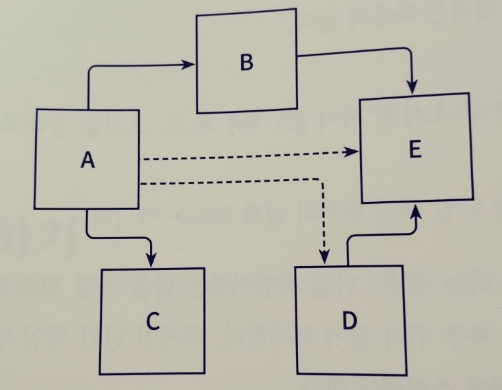
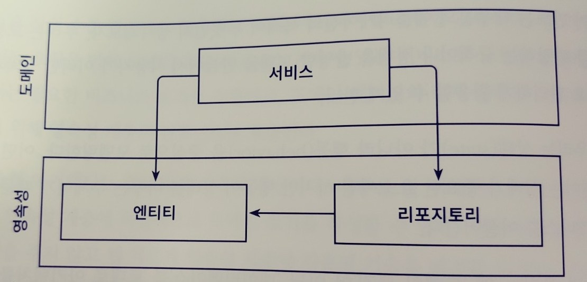
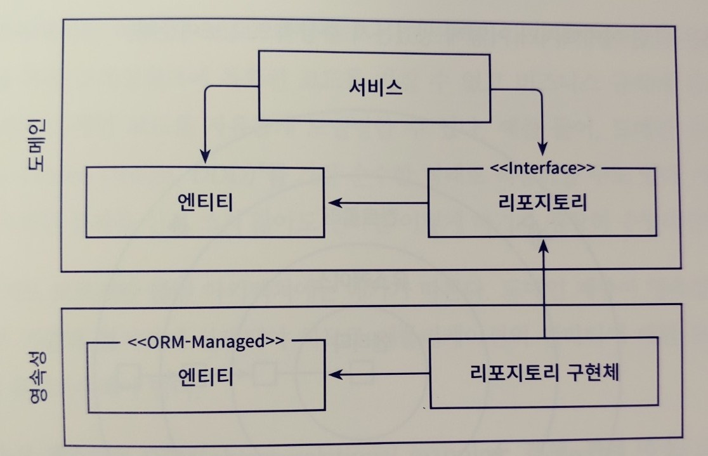
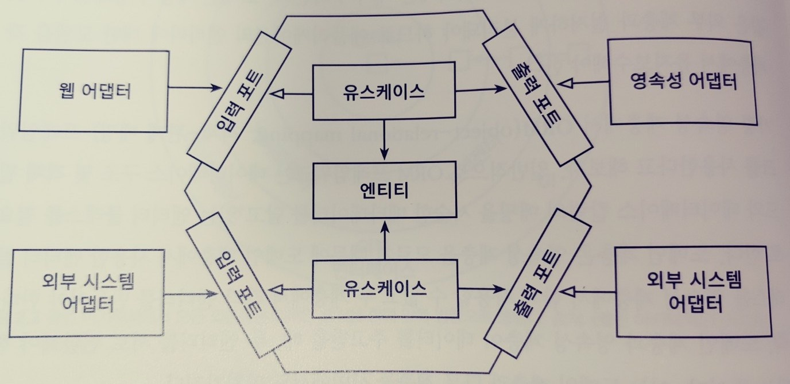
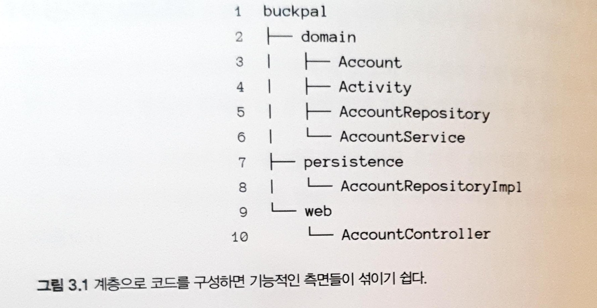
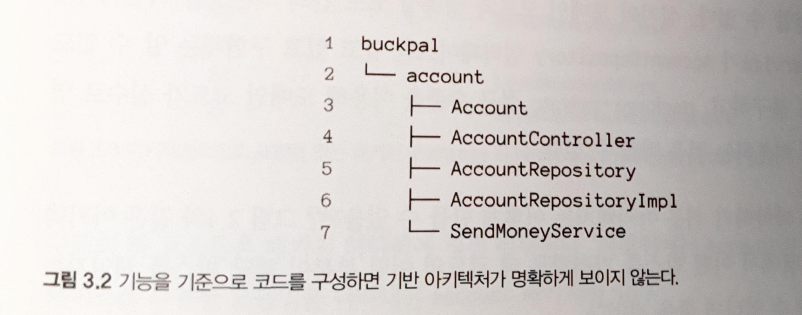
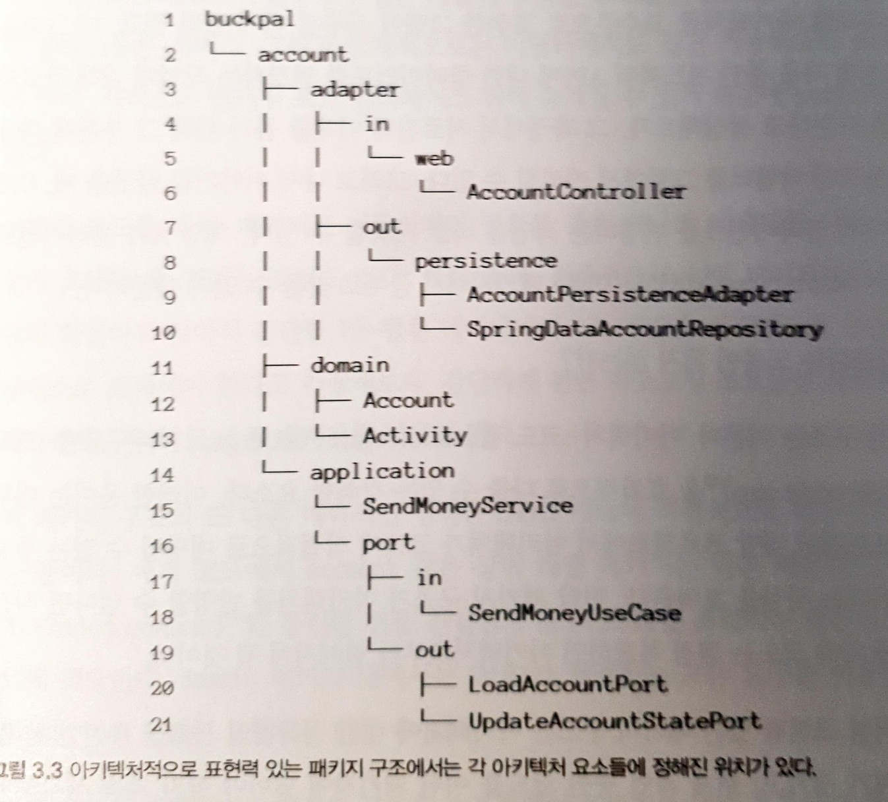
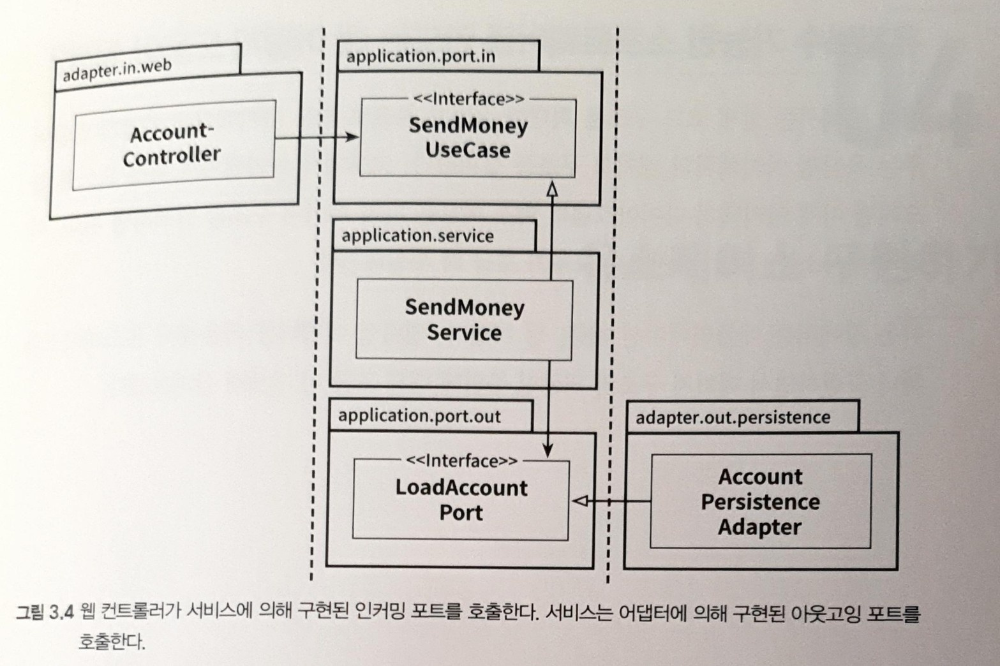

# Clean Architecture

[TOC]

## Chapter 01. 계층형 아키텍처의 문제는 무엇일까?

우선 계층 (layer) 아키택처란 무엇인가. <u>웹 계층, 도메인 계층, 영속성 계층으로 구성된 전통적인 웹 애플리케이션 구조이다.</u>

- 웹 계층에서 요층을 받아 도메인 또는 비즈니스 계층의 서비스로 요청을 보낸다.
- 서비스에서는 비즈니스 로직을 수행하고, 영속성 계층의 컴포넌트를 호출한다.
- <u>특정한 계층에서는 **같은 계층에** 있는 컴포넌트나 **하위에 있는 계층에만 접근이** 가능하다.</u>
  - 요청은 외부에서 request가 web layer [controller]로 들어오면, 서비스로 business logic 처리를 위임한다. 서비스 레이어에서는 데이터 처리를 위한 영속성 레이어를 호출한다.
- 하지만 이러한 계층형 아키텍처에는 유지보수에 실패하는 함정들이 다수 있다.

### 계층형 아키텍처의 함정

> 계층형 아키텍처는 데이터베이스 주도 설계를 유도한다.

- 애플리케이션의 use case 작성시에, 도메인 로직보다 영속성 계층을 먼저 구현하고 이를 토대로 도메린 로직을 구현한다.
  - 이는, 의존성의 방향에 맞게 구현한 것이다.
- ORM (객체 관계 매핑) 프레임워크를 사용하는 경우, 비즈니스 규칙을 영속성 관점과 섞고 싶은 유혹을 쉽게 받는다.
- 비즈니스 관점에서는 도메인 로직이 애플리케이션의 핵심이지만, 개발자 입장으로서 도메인 로직이 아닌, 데이터베이스를 우선적으로 신경쓰게된다.

- 도메인 계층과, 데이터베이스간의 강결합이 발생할 가능성이 농후하다.

> 지름길을 택하기 쉬워진다.

## Chapter 02. 의존성 역전하기

### SOLID 원칙

- S [Single Responsibility Principal]: 단일 책임 원칙
  - 모든 클래스는 각각 하나의 책임만 가져야 한다. 즉 클래스는 그 책임을 캡슐화 해야함.
- O [Open closed principle]: 개방 폐쇄 원칙
  - 확장에는 Open, 수정에는 Closed. 기존의 코드는 변경하지 않으면서 기능을 추가할 수 있도록 설계한다
- L [Liskov Substitution Principle]: 리스코프 치환 원칙
  - 자식 클래스는 언제나 자신의 부모 클래스를 대체할 수 있어야 한다. 
- I [Interface Segregation Principle]: 인터페이스 분리 원칙
  - 한 클래스에는 자신이 사용하지않는 인터페이스는 구현하지 말아야 한다.
- D [Dependency Inversion Principle]: 의존성 역전 원칙
  - 클라이언트는 추상화 (인터페이스)에 의존해야 하며, 구체화에 의존해서는 안된다.

### 단일 책임 원칙 [Single Responsibility Principle]

- 하나의 컴포넌트는 오로지 한 가지 일만 해야 하고, 그것을 올바르게 수행해야 한다
- **컴포넌트를 변경하는 이유는 오직 하나뿐이어야 한다**

 

- 각 컴포넌트의 의존성은 이 컴포넌트를 변경하는 이유 하나씩에 해당한다.
- 전이 의존성인 경우도 해당 (점선 부분)

### 의존성 역전 원칙 [Dependency Inversion Principle]

- **코드상의 어떤 의존성이든 그 방향을 바꿀 수(역전시킬 수) 있다**
- 계층형 아키텍처에서 항상 아래 계층으로 향하는 의존성을 반대로 역전
  - 고수준에서 변경할 일이 더 많으므로 도메인 계층 변경 → 영속성 계층 변경 → 영속성 계층에 의존하는 잠재적인 도메인 계층 변경이 발생
  - 영속성 코드가 바뀐다고 도메인 계층을 바꾸고 싶지 않음
  - 의존성을 반대로 역전시켜 도메인 계층의 영속성 계층 의존성을 제거

Before:

 

After:

 

- 영속성, 도메인 계층에 각각 엔티티가 존재
- 도메인 계층에 리포지토리 인터페이스를 만들고, 영속성 계층에서 구현체를 만듬
- 도메인 로직을 영속성 코드의 의존성으로부터 해방

### 클린 아키텍처

- 특징
  - 클린 아키텍처에서는 도메인 코드에서 바깥으로 향하는 의존성이 없음
  - 의존성 역전 원칙으로 계층간 모든 의존성이 안쪽으로 향함
  - 핵심에 도메인 엔티티, 유스케이스는 계층형 아키텍처에서 서비스에 해당하는 부분
  - 유스케이스는 더 세분화되어 계층형 아키텍처의 넓은 서비스 문제 회피
  - 코어 주변에 비즈니스 로직을 지원하는 다른 컴포넌트 (웹, UI)가 존재

- 장점
  - 도메인 코드에서 어떤 영속성, UI 프레임워크에 의존성이 없기 때문에 프레임워크 특화된 코드가 존재하지 않고 비즈니스 로직에 집중 가능
  - 도메인 코드를 자유롭게 모델링 하며 DDD를 가장 순수한 형태로 적용해 볼수도 있음
- 단점
  - 도메인 계층과 외부 계층을 철저하게 분리해야 하므로 각 계층에서 엔티티 모델을 유지보수 해야함
  - ORM 계층 엔티티, 도메인 계층 엔티티를 각각 만들고 계층 엔티티간의 변환이 필요 (하지만 바람직한 일)

### 핵사고날 아키텍처 (육각형 아키텍처)

- 클린 아키텍처의 구체적 형태
  - 육각형
    - 어플리케이션 코어
    - 도메인 엔티티와 이와 상호작용하는 유즈케이스
  - 어댑터
    - 어플리케이션과 다른 시스템(웹, 데이터베이스..) 간의 번역을 담당
    - 포트를 통해 어플리케이션과 상호작용
  - 포트
    - 육각형의 경계에 존재
    - 외부와 상호작용하는 인터페이스
  - 유즈케이스
    - 도메인 로직
    - 엔티티와 상호작용
  - 도메인 엔티티

- 어댑터와 포트를 통해 통해 외부 시스템과 상호작용
  - 어플리케이션을 호출하는 어댑터 (웹)
    - 입력 포트를 사용
      - 유스 케이스에 의해 구현
  - 어플리케이션에 의해 주도되는 어댑터 (데이터베이스)
    - 출력 포트를 사용
      - 어댑터에 의해 구현
- 포트와 어댑터 아키텍처라고도 함

## Chapter 03. 코드 구성하기

### 계층으로 구성하기

- 웹, 도메인, 영속성 계층 각가 web, domain, persistence package로 구성
- DIP 원칙을 적용하여 domain 패키지에는 도메인 코드만 존재
  - AccountRepository는 interface로 구성
  - persistence package에서 AccountRepositoryImpl class 배치(domain inteface 구현체)

#### 이게 최적화가 아닌 이유

- 기능 조각(functional slice) 또는 특성(feature)을 구분할 수 있는 패키지 경계가 없음
  - 사용자 관리 기능 추가하는 경우, 각 layer마다 다음과 같이 추가될 수 있음
    - web : UserController
    - domain : UserService, UserRepository, User
    - persistence : UserRepositoryImpl
  - Account, User와 같이 서로 연관되어 있지 않은 클래스들이 묶이는 상황 발생
- 어떤 유즈케이스가 있는지 파악이 불가능
  - Layer에 있는 클래스를 직접적으로 확인해야 어떤 유즈케이스가 구현되어 있는지 파악 가능
- 패키지 구조만으로 우리가 목표로 하는 아키텍처(육각형 아키텍처) 파악이 불가능
  - Incoming port / outgoing port를 직접적으로 확인할 수 없음 (코드를 뒤져야함)

### 기능으로 구성하기

 

- 계좌와 관련된 모든 코들를 account package에 넣고, 계층 패키지를 모두 없앰
- account package와 마찬가지로 기능을 묶을 때는 그와 같은 레벨의 package를 생성하여 추가
- 외부에서 접근이 안되는 클래스들은 package-private(default) 접근 수준을 이용하여 패키지간의 경계를 강화

- SendMoneyService : 송금하기 유즈케이스를 구현한 코드. 클래스명에서 어떤 일을 하는 알 수 있기 때문에, Uncle Bob은 이런 것을 소리치는 아키텍처(Screaming architecture)라고 명명.

### 표현력 있는 패키지 구조 (목표)

- 육각형 아키텍쳐에서 핵심 요소 : 엔티티, 유스케이스, 인커밍/아웃고잉 포트, 인커밍/아웃고잉 어댑터
- account : Account와 관련한 유스케이스를 구현한 모듈 패키지
- domain : 도메인 모델이 속해있는 패키지
- application : 도메인 모델을 둘러싼 서비스 계층
  - port : 외부와 통신하기 위한 인터페이스 패키지 (의존성)
    - in : 외부(웹등)에서 서비스 요청을 하기 위한 인터페이스. 서비스 계층에서 해당 인터페이스를 구현함
    - out : 서비스에서 외부(영속성)에 요청을 하기 위한 인터페이스. adapter에서 해당 인터페이스를 구현함
- adapter
  - in : 애플리케이션 계층의 인커밍 포트를 호출하는 패키지
  - out : 애플리케이션 계층의 아웃고잉 포트에 대한 구현을 제공하는 패키지

#### 장점

- 패키지 구조 자체가 육각형 아키텍쳐를 그대로 반영하는 구조
  - 아키텍쳐-코드 갭(architecture-code gap), 모델-코드 갭(model-code gap)이 거의 없는 구조
  - 기능 작업시, 패키지 선택 장애가 육각형 아키텍쳐에서는 거의 없음
- package간에 불필요한 접근을 막을 수 있는 구조
  - adapter : application/port를 통해서만 호출되는 구조 -> package-private 접근 수준으로 막을 수 있음 (IDE단에서 잘못된 접근을 통제 가능)
  - application, domain
    - port : adapter에서 접근 가능해야함 -> public
    - domain : adapter에서 접근 가능해야함 -> public
    - service : adapter에서 직접 접근할 필요가 없음 -> package-private
- adapter 내부 변경은 adapater 내부에서 처리가능
  - SQL -> Key-Value DB로 변경하는 경우, adapter내에서 아웃고잉 port 인터페이스를 구현하면 끝
- DDD에 직접적으로 대응 가능
  - account : 다른 바운디드 컨텍스트와 통신할 전용 진입점과 출구(포트)를 포함하는 바운디드 컨텍스트임
  - \* bounded context : 어떤 하나의 도메인 모델이 적용되는 범위를 나타냄

### 의존성 주입의 역할

 

- 클린 아키텍쳐의 가장 본질적인 요소 : 애플리케이션 계층이 인커밍/아웃고잉 어댑터에 의존성을 갖지 않는 점 (2장 설명)
- 인커밍 어댑터 : adapter와 도메인 코드 간의 의존성 방향이 동일함. adapter -> application을 호출
- 아웃고잉 어댑터 : 도메인 코드 -> adapter 의존성이 있기 때문에 의존성 역전 원칙을 이용해야함
- 의존성 역전 방법 : application 계층에서 port 인터페이스를 만들고, adapter가 해당 인터페이스를 구현
- 포트 인터페이스를 구현한 실제 객체를 누가 어플리케이션 계층에 제공해야하나?? -> 의존성 주입
- 의존성 주입 : 모든 계층에 의존성을 가진 중립적인 컴포넌트 도입 (스프링) 
  - 역할 : 대부분의 클래스를 초기화하는 역할을 맡음

## Chapter 05. 웹 어댑터 구현하기
