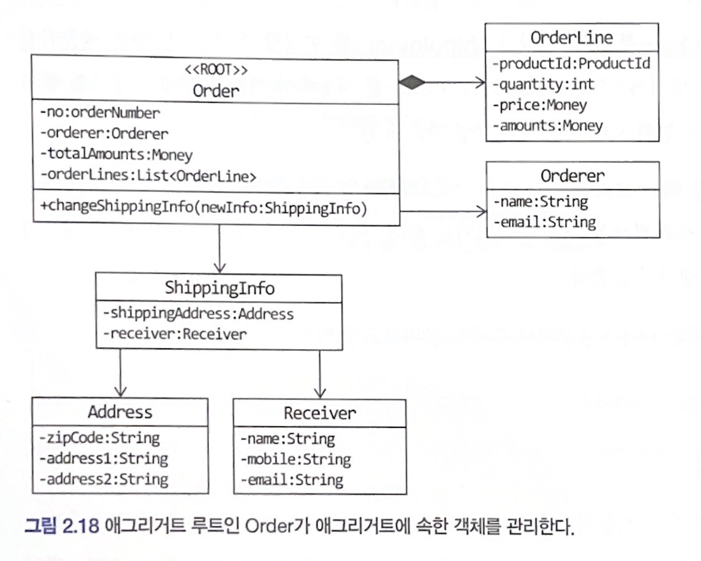
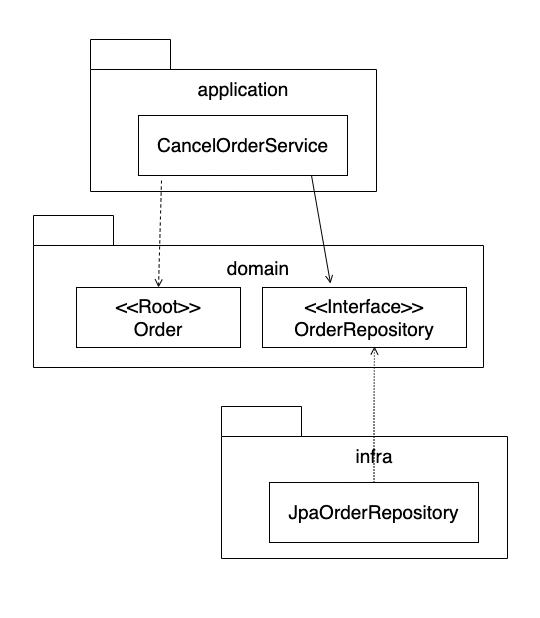
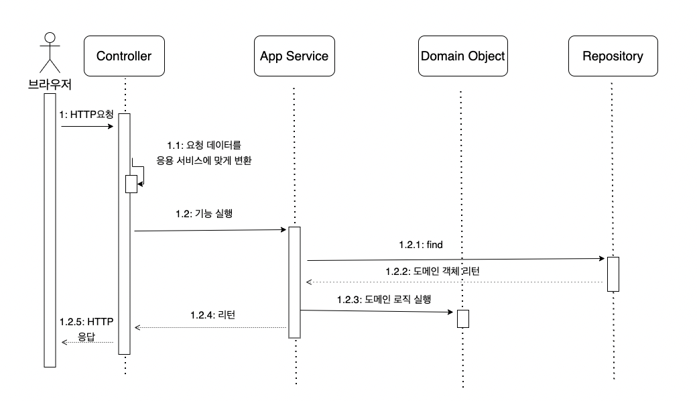
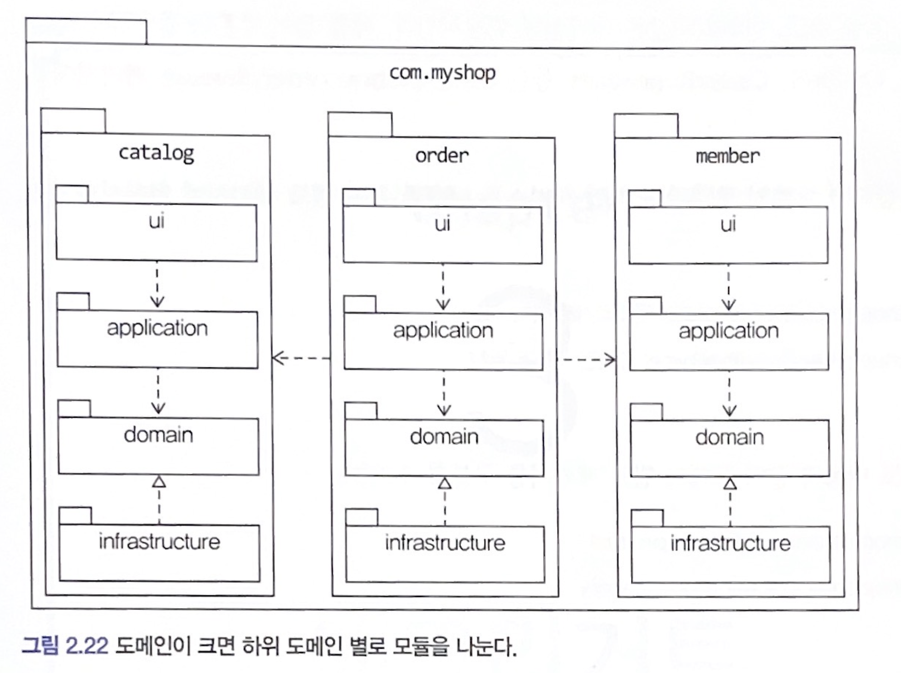
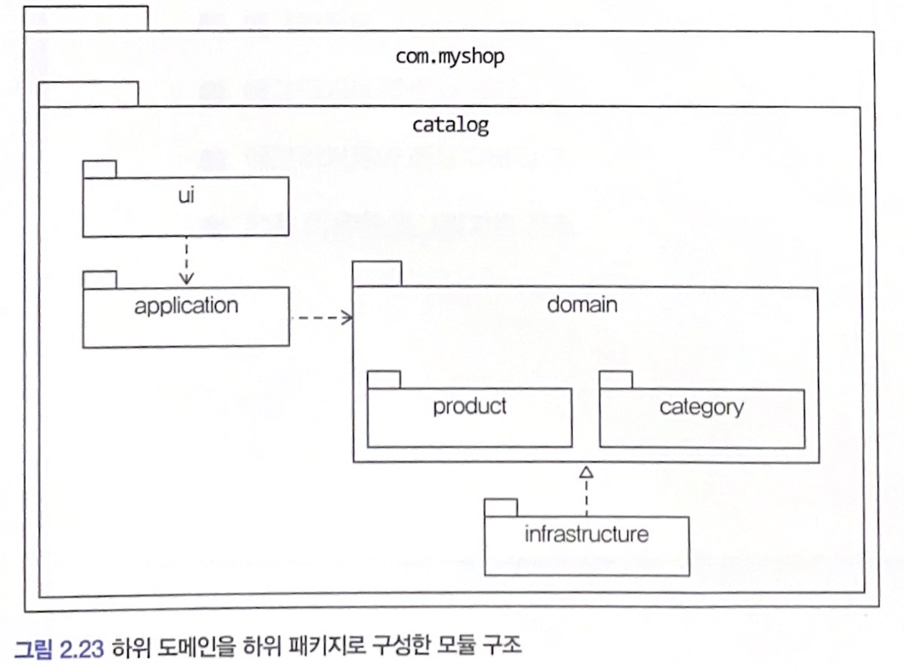

# Chapter 2: 아키텍처 개요

## 2.4 도메인 영역의 주요 구성요소

도메인 영역

- 도메인 모델의 주요 개념을 표현하여 핵심 모델을 구현
  
  - ex) Order 라는 Domain이 있다면 이 도메인 영역에 "주문 취소" [cancelOrder()], "배송지 변경" [changeShippingInfo()] 등의 로직이 들어간다.

[도메인 영역의 주요 구성요소]


- 엔티티 (Entity)
  
  - 고유의 식별자를 갖는 객체
  
  - 도메인의 고유한 개념을 표현 (ex. User)
  
  - **도메인 모델의 데이터와 함께 관련된 기능을 제공**

- 벨류 (Value)
  
  - 고유의 식별자가 없는 객체
  
  - 개념적인 하나의 값 (ex. userName)

- 애그리거트 (Aggregate) 
  
  - 엔티티 + 벨류 개념을 하나로 묶은 것 (ex. User, userName, userEmail 등을 통틀어 '회원' 애그리거트)

- 리포지터리 (Repository)
  
  - 도메인 모델의 영속성 (Persistence) 처리하는 곳 (ex. DB Table에 엔티티 객체를 findBy/save 등을 처리)

- 도메인 서비스 (Domain Service)
  
  - 특정 엔티티에 속하지 않는 로직을 처리 
    
    - 여러 엔티티를 이용하여 구현하게된다.

### Entity & Value

도메인 모델의 Entity <-> DB에서의 Entity는

**서로 다르다 !**

도메인 모델의 Entity와 DB Entity의 차이점

1. 도메인 모델 엔티티는 Data와 기능을 함께 제공한다.
   
   - 즉, 도메인 모델의 엔티티는 데이터 구조가 아닌, <u>데이터와 기능을 함께 제공하는 **객체**</u> 이다.
   
   - User 도메인 엔티티 안에는 userName, userEmail 등의 value (데이터)가 있고, DB User table과는 다르게, changeUserName() 등의 도메인 기능이 포함된다.

2. 도메인 모델 엔티티는 두 개 이상의 데이터가 개념적으로 하나일 경우 Value 타입으로 표현할 수 있다.
- Order entity에 Orderer (주문자) 정보가 있고, 해당 객체가 name, email 등을 갖고있다면, DB 엔티티에서는 하나의 벨류타입으로 지정할 수 없다.

벨류 (Value)는 불변 객체로 만들자!

- 기존 객체의 값을 변경하는 것이 아닌, 새로운 객체로 교체하자.
  
  ```java
  public class Order {
      private ShippingInfo shippingInfo;
  
      public void changeShippingInfo(ShippingInfo newShippingInfo) {
          checkShippingInfoChangeable(); // 배송지 변경 가능여부 확인
          setShippingInfo(newShippingInfo);
      }
  
      private void setShippingInfo(ShippingInfo newShippingInfo) {
          if(newShippingInfo == null) throw new IllegalArgumentException();
          this.shippingInfo = newShippingInfo; // 새로운 객체로 교체
      }
  }
  ```

### Aggregate

서비스 (애플리케이션이) 가 커지면서, 엔티티와 밸류가 많아지면, 도메인 모델은 점점 더 복잡해진다.

이때, 도메인 모델을 제대로 이해하려면 개별 요소에 초점을 맞추지 않고, 상위 수준에서 모델을 볼 수 있어야 한다. 이때 도움이 되는 것이 바로 **애그리거트 (aggregate)** 이다.

> 즉, 애그리거트 == 관련 객체를 모은 군집
> 
> - ex. "주문" 애그리거트에는 '주문', '배송지 정보', '주문자', '주문 목록' 



### Repository

결국 도메인 모델을 사용및 관리하려면 물리적인 장소 (DB)에 도메인 객체를 보관한다.

이를 위한 **도메인 모델이 바로 리포지터리 (Repository).**

> 엔티티 & 벨류는 요구사항에 도출되는 도메인 모델, 리포지터리는 **구현을 위한 도메인 모델**

```java
public interface OrderRepository{
    Order findByNumber(OrderNumber number);
    void save(Order order);
    void delete(Order order);
}
```

OrderRepository는 애그리거트 단위에서 Root Entity인 Order를 찾고 저장한다!

- 즉, Repository는 애그리거트 단위로 도메인 객체를 저장하고 조회하는 기능을 정의



- OrderRepository는 고수준 모듈 (도메인 영역)

- JpaOrderRepository는 이러한 고수준 모듈을 구현한 클래스이므로 저수준 영역 (의존성 역전 원칙 적용)

## 2.5 요청 처리 흐름



- 표현영역
  
  - 요청 값 Validation
  
  - 응용 서비스 영역에 맞게 Converting 후 전달

- 응용 서비스 영역
  
  - 도메인 모델을 이용해 기능을 구현
    
    - Domain Object & 추상화된 Repository

응용 서비스 영역에서는 **도메인의 상태를 변경한다.**

- 예를들어, Order -> Order.cancel()

- 이러한 결과물을 DB에 적용할 수 있도록 Transaction 관리를 담당한다.

```java
public class CancelOrderService{
    private OrderRepository orderRepository;

    @Transactional
    public void cancel(OrderNumber number){
        Order order = orderRepository.findByNumber(number);
        if(order == null) throw new NoOrderException(number);
        order.cancel();
    }
    ...
}
```

## 2.6 인프라스트럭처 개요

인프라스트럭처는 

- 표현 영역

- 응용 영역

- 도메인 영역

을 지원한다.


<u>DIP를 활용해</u> 도메인 영역 / 응용 영역에서 추상화된 인터페이스를 활용하여 인프라스트럭처 영역에 대한 의존성을 제거 

- 테스트 수행이 간결

- 구현 교체에 용이

**하지만 ! 이는 필수가 아니다 !**

- **구현의 편리함도** DIP의 장정만큼 중요하다.
  
  - Spring의 @Transactional 
  
  - JPA의 @Entity & @Table vs. XML Mapping

## 2.7 모듈 구성



각 도메인 별로 모듈을 나눌 수 있다.

- Catalog, Order, Member (도메인)
  
  - 표현, 응용, 도메인, 인프라 스트럭처 영역



이를 다시 애그리거트 기준으로 패키지를 구성한다.

- 복잡해진다면, 도메인 모델과 서비스를 패키지 분리할 수 있다.
  
  - ex) Order 도메인에 Order, OderLine, Orderer, OrderRepository 등이 있다면

```java
com.myshop.order.domain.order: 애그리거트 위치
com.myshop.order.domain.service: 도메인 서비스 위치
```

- 응용 서비스도 도메인 별로 패키지를 구분할 수 있다.

```
com.myshop.catalog.application.product: 애그리거트 위치
com.myshop.catalog.application.category: 도메인 서비스 위치
```

모듈 구조에는 정답이 없다.

- 하지만 하나의 패키지로 무분별 하게 관리하면 불편함이 생긴다.

- 저자 (최범균 님)은 최대 10~15개 정도의 타입 개수가 한 모듈에 위치하도록 한다.


### 느낀점

1. 코더와 개발자의 차이란..
   - 무분별한 코드 작성이 아닌, 서비스 전체 구조와 도메인 영역에 대한 이해가 필요
2. 패키지 구성의 장단점
   - DDD 및 Clean Architecture (Hexagonal Architecture )
     
     - MSA
   
   - controller, domain, service
     
     - 장점이 뭐지 ?
