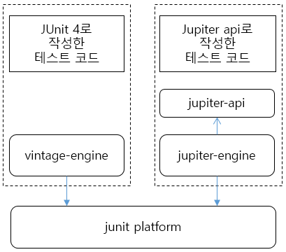

# Test Driven Development & Test Code


> TDD란 Test Driven Development 의 약자로, 테스트 주도 개발을 의미한다.
>
> 이는 개발을 할 때 테스트 케이스를 함께 개발하면서 개발 하는 것이다.
>
> 일반적으로, [설계 -> 구현 -> 테스트] 순환구조로 개발을 진행 하였는데, 이는 구현이 완료 되었을 때 해당 모듈이 제대로 설계되었는지를 테스트 하였었다.
>
> TDD 는 위 사진과 같은 과정으로 개발을 진행하는데,
>
> 1. 최소한의 기능을 먼저 구현한다.
>    - 함수의 Prototype 형태 등을 먼저 개발한다.
> 2. 테스트 케이스가 실행되도록 구현 후 실행한다.
>    - 이 경우, 당연히 테스트 케이스는 실패할 것이다. 기능이 구현되어있지 않으니까 !
> 3. 실제 기능을 구현한다
>    - 해당 기능이 테스트 케이스를 통과하는지를 확인한다.
>
> 결국 TDD 개발 방법론은 가장 중요한 기능 구현이 마지막이다.
>
> 기능 구현을 제일 마지막에 하여 테스트 케이스가 통과 되는 것을 확인하면 개발에 흥미를 유지 시킬 수 있기 때문입니다. 그 뒤에 필요하면 개발된 코드를 기반으로 리펙토링(Refactoring) 과정을 진행한다.


그렇다면 TDD 방법론의 장점이 무엇일까 ?

### TDD advantages

1. 코드를 기존보다 안정적으로 개발할 수 있다.
   - 각각의 기능에 맞는 테스트 케이스가 미리 존재하므로, 수정 및 리팩토릴 할 때 버그 또는 오류의 가능성을 낮춰준다.
2. 간편한 리팩토링
3. 코드의 전체적인 복잡도가 낮아진다.
4. 디버깅 시간이 줄어든다.


이러한 장점이 있지만, TDD 역시 단점이 존재하는데, 우선 개발 시간이 전반적으로 늘어난다.


### Spring TDD - JUnit

Spring Framework 기반의 프로젝트 역시 TDD가 적용될 수 있으며, 이 때 모듈 개발에서 필요한 Test code를 기본적으로 구현하도록 설정되어있다 [root -> test].

이러한 TDD 개발 방법론을 위한 open source testing framework 가 존재하는데 spring boot starter web 의 가장 유명한 test tool인 **JUnit5** 에 대해 공부해보자.


### JUnit5

- 자바 개발자가 가장 많이 사용하는 Testing Framework 이다.
- JUnit Platform에 의해서 Test를 실행해주고, TestEngine API의 구현체인 Jupiter를 활용하여 Test 소스를 작성할 수 있다.


##### Junit5 =  JUnit Platform + JUnit Jupiter + JUnit Vintage

- Junit Platform
  - JVM에서 동작하는 테스트 프레임워크입니다. 테스트를 발견하고 계획을 생성하고 결과를 보고하는 TestEngine 인터페이스를 정의합니다.

- Junit Jupiter
  - Junit5 TestEngine의 실제 구현체입니다. Junit5 기반의 테스트를 실행시키기 위한 TestEngine을 Platform에 제공합니다.

- Junit Vintage
  - TestEngine에서 Junit3 및 Junit4 기반 테스트를 실행하기 위한 기능을 제공합니다.





#### Dependency

- junit-jupiter-api 
  - 테스트 코드 작성에 필요
- junit-jupiter-engine
  - 테스트 실행에 필요
- Junit-vintage-engine
  - 새로운 JUnit platform 에서 빈티지 테스트, 즉 JUnit 3 or JUnit 4 스타일로 작성된 테스트를 위한 엔진

JUnit5 테스트를 작성하고 실행하려면 junit-jupiter-api와 junit-jupiter-engine가 모두 필요합니다
(a) JUnit5로 실행 중이고 (b) 테스트 케이스가 JUnit4 구문 / 주석 / 규칙 등을 사용하는 경우 junit-vintage-engine 만 있으면됩니다.

5.4 버전부터는 단순화 되어서, aggregator artifact를 지원


```java
// Maven
<dependency>
  <groupId>org.junit.jupiter</groupId>
  <artifactId>junit-jupiter</artifactId>
  <version>5.8.2</version>
</dependency>

// Gradle
implementation 'org.junit.jupiter:junit-jupiter:5.8.2'
```


- **@ExtendWith(MockitoExtension.class)**: 테스트 클래스가 Mockito를 사용함을 의미합니다.
- **@Mock**: 실제 구현된 객체 대신에 Mock 객체를 사용하게 될 클래스를 의미합니다. 테스트 런타임 시 해당 객체 대신 Mock 객체가 주입되어 Unit Test가 처리됩니다.
- **@InjectMocks**: Mock 객체가 주입된 클래스를 사용하게 될 클래스를 의미합니다. 테스트 런타임 시 클래스 내부에 선언된 멤버 변수들 중에서 @Mock으로 등록된 클래스의 변수에 실제 객체 대신 Mock 객체가 주입되어 Unit Test가 처리됩니다.

- **Given**: 테스트를 위한 준비 과정입니다. 변수를 선언하고, Mock 객체에 대한 정의도 함께 작성합니다.
- **When**: 테스트를 실행하는 과정입니다. 테스트하고자 하는 내용을 작성합니다.
- **Then**: 테스트를 검증하는 과정입니다. 예상한 값과 결괏값이 일치하는 지 확인합니다.

### General Annotations

- @BeforeAll & @BeforeEach

  - BeforeAll
    - 해당 annotation이 달린 method는 현재 클래스의 모든 테스트 메서드보다 먼저 실행됨
    - static method 이어야 한다.
    - JUnit Vintage의 @BeforeClass와 동일
  - BeforeEach
    - 해당 annotation이 달린 method는 각 테스트 method 전에 수행된다.
    - 이전 버전의 @Before와 동일

  ```java
  @BeforeAll
  static void setup() {
      log.info("@BeforeAll - executes once before all test methods in this class");
  }
  
  @BeforeEach
  void init() {
      log.info("@BeforeEach - executes before each test method in this class");
  }
  ```


- @DisplayName & @Disabled

  - DisplayName
    - 테스트 클래스 or 테스트 method 의 이름을 정한다
  - Disabled
    - 테스트 클래스 or 테스트 method 를 비활성화한다.
    - @Ignore 과 동일

  ```java
  @DisplayName("Single test successful")
  @Test
  void testSingleSuccessTest() {
      log.info("Success");
  }
  
  @Test
  @Disabled("Not implemented yet")
  void testShowSomething() {
  }
  ```

- @AfterEach and @AfterAll

  - AfterAll
    - 해당 annotation 이 달린 메서드가 현재 클래스의 모든 테스트 메소드보다 이후에 실행된다.
    - 해당 메서드는 static 이어야 한다.
    - 이전의 @AfterClass 와 동일
  - AfterEach
    - 해당 annotation 이 달린 메서드가 각 테스트 메서드 이후에 실행된다.
    - 이전의 @After 와 동일

  ```java
  @AfterAll
  static void done() {
      log.info("@AfterAll - executed after all test methods.");
  }
  
  @AfterEach
  void tearDown() {
      log.info("@AfterEach - executed after each test method.");
  }
  ```


### Assertions and Assumtions

##### Assertions

- assertTrue & assertThat


#### reference

- [JUnit 5 Study](https://gmlwjd9405.github.io/2019/11/26/junit5-guide-basic.html)

