## Compound Commands

- Test command
- Compound Commands
- Conditional Construct
  - If statement
  - Case statement


### Test

우리가 스크립트를 작성할 때 자주 등장하는 표현식이 테스트 표현식이다

- 어떠한 command가 **True 냐 False 냐** 를 결정하는 **<u>명령어</u>**
- if문, branch 구문, for 문 등의 조건식에 필수적으로 사용된다! 

```bash
$ test expression
$ [ expression ]
# 둘 중 하나로 표현된다.

$ type -a [
[ is a shell builtin # built-in
[ is /bin/[
$ type -a test
test is a shell builtin
test is /bin/test
```

- test  또는 [ 로 표현된다.

**프로그래밍 언어에서는 0이 false, 1이 true이지만, shell에서는 0만 True !!!!!**

- 0만 true
- Exit code에서 0만 정상종료고 나머지는 에러이기 때문에 0만 True라고 생각하자.


또한 어떤 command의 결과 [$?]를 확인할 수 있다.

```bash
$ var=5
$ test $var -gt 0 
$ echo $?
0

```

- -gt: greater than option. 즉 $var가 0보다 크냐 ? 는 test
- $? 로 해당 값을 실행해보니 0이 나왔다. 즉 정상 종료 == True !!

```bash
$ [ $var -lt 0 ]
$ echo $?
1

$ test $var -eq 5
$ echo $?
0
```

- -lt: less than 옵션 
- 즉 var은 5인데 0 보다 작냐는 조건문을 테스트 해보니 해당 결과값이 1 즉 False !!

- -eq: equal 옵션
- 즉 5와 5가 같냐로 정상이니까 0, True !


비교 옵션을 잘 외워보자

### Test Operators - Integer Test

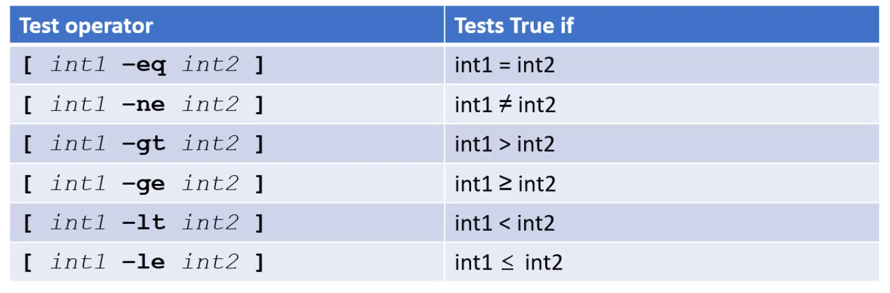 

- Integer 비교 연산

  - -gt: greater than >
  - -lt: less than <
  - -eq: == equal
  - -ge: >= greater equal
  - -le: less equal
  - -ne: not equal

  

### Test Operators - File Test

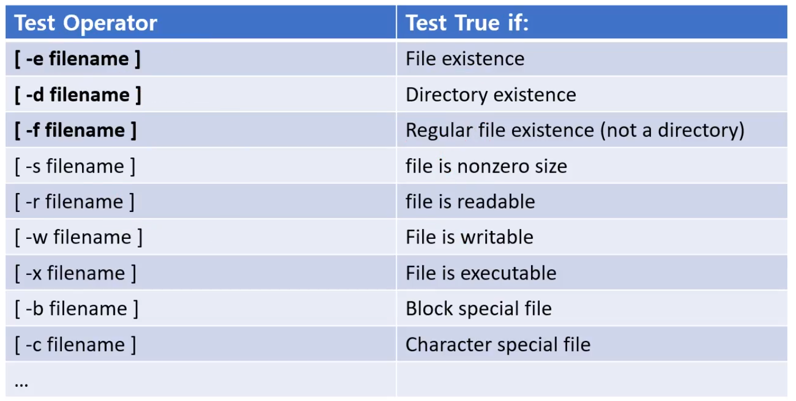 

- 파일을 위한 다양한 오퍼래이터도 사용된다
- 연산자는 한 글자, 인자로 filename이 들어간다
- 연산자들
  - -e: 파일이 존재하면 True
  - -d: 파일이 존재하는데 디렉토리면 트루
  - -f: regular 파일이면 true (not a directory)
  - -s: file size가 0이 아니면 트루
  - -r: readable하면 트루
  - -w: writeable하면 트루
  - -x: executable하면 트루
  - -b: block special file이면 트루
    - 여러가지 파일이 존재할 수있다 
      - block device
      - character device
  - -c: character special file인지


```bash
$ touch a
$ mkdir b
$ ls
a	b

$ test -f a # does file exist?
$ echo $?
0

$ test -d a # is it a directory exist?
$ echo $?
1

$ test -e c # does the file c exists?
$ echo $?
1

$ [ -e a ] # does the file a exists?
$ echo $?
0 # True

$ [ -d b ] # does the directory b exists?
$ echo $?
0
```


### Test Operators - String test

문자열 비교는 어떻게 할까?

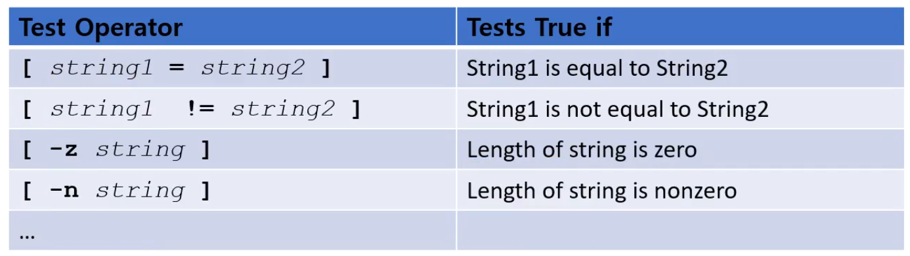 

- = : 문자열이 같은지
- != : 문자열이 다른지 
- -z : string 길이가 0인지, 0이면 True
- -n : 길이가 0이 아니면 True

```bash
$ var="kor"
$ [ $var = "kor" ] # 같으면 트루
$ echo $?
0 # True

$ [ $var = "Kor" ]
$ echo $?
1 # False

$ [ -z $var ] # 길이가 0 이냐
$ echo $?
1  # False

$ [ -n $var ] # 길이가 0이 아니냐
$ echo $?
0 # True

$ unset var # unset 했다
$ test -n $var # 길이가 존재하지않기때문에 False
$ echo $?
0

$ test -z $var 
$ echo $?
0
```


### Compount Commands

```bash
$ compgen -k | column
if		case		until		time		]]
then		esac		do		{
else		for		done		}
elif		select		in		!
fi		while		function	[[
```

- compgen -k 옵션으로 shell에서 제공하는 keyword들을 확인할 수 있다.
- 이 keyword들은 compound commands 를 구성하는데 사용되고, 하나의 compound command는 여러개의 keyword들로 구성되어있다.

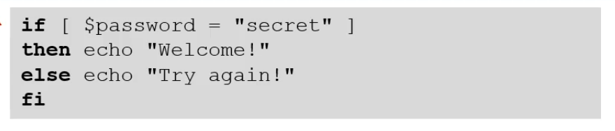 

- 하나의 compound command 는 여러개의 키워드들로 구성되어있다.
- keyword 다음 명령어가 오는데, 명령어 위치에따라서 역할이 다르게 해서 복합적으로 하나의 명령어를 구성할 수 있다.
- Bash는 이 keyword로 for, case, select 등을 사용하여 compound command를 만든다


if keyword 다음 명령어, then 다음 명령어, else 다음 명령어, fi [닫기]

```bash
$ var='JaeMin'
$ if [ $var = 'JaeMin' ]
> then echo "hello Jaemin"
> else echo "Hello Anonymous"
> fi
hello Jaemin
```


### General if Statements

- 기본적인 형식

  - Single-Line

    - **if** command; **then** command **fi**
    - **if** command; **then **command ; **else** command ; **fi**

  - Multi-line 

    - ```bash
      $ if command
      > then commands
      > fi
      ```

    - ```bash
      $ if command
      > then commands
      > else commands
      > fi
      ```

    - ```bash
      if commands # test
      > then commands # if 가 true
      > elif commands # test
      > then commands # elif 가 true
      > else commands 
      > fi
      ```

  - Keyword로 시작해서 Keyword로 끝나는 compound command이다

  - **중요한 것은, semicolon (;) 가 붙냐 안붙냐 **- 한 줄 or multi 줄 

    - shell에서 명령어를 처리하기 위해 보통 우린 enter (\n)를 넣는다
    - Command List에서 command를 sequence로 연결하기 위해 **; 나 &를 사용한다 했는데, 마찬가지이다.**
    - 그래서 compound commands 도 **한 줄로** 실행하고 싶으면 ; 으로 single line을 만들 수 있다.
      - 마지막 fi는 enter 칠꺼니 안 붙혀도 된다.

  - if문은 보통 exit status 값을 기준으로 분기하기 때문에 if 뒤에는 **다양한게 올 수 있다.**

    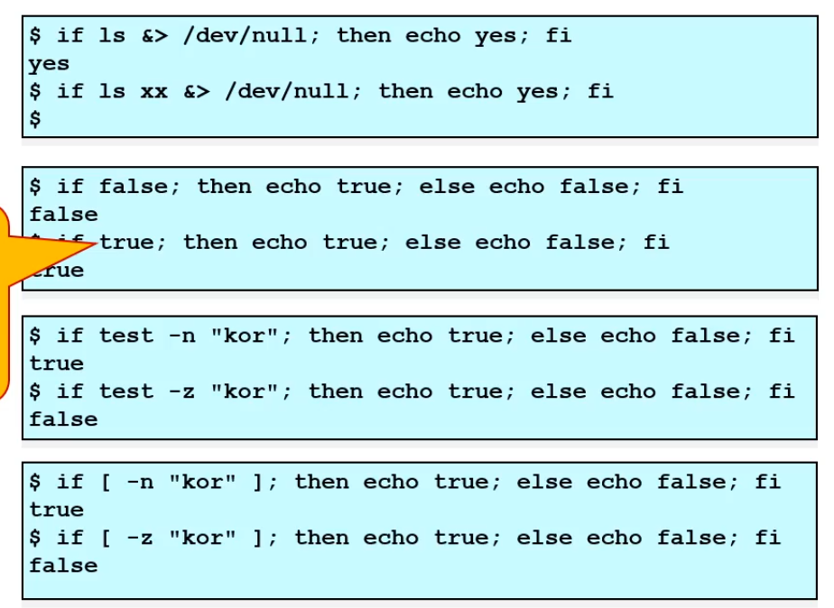 

    

### if Statements - Integer Testing

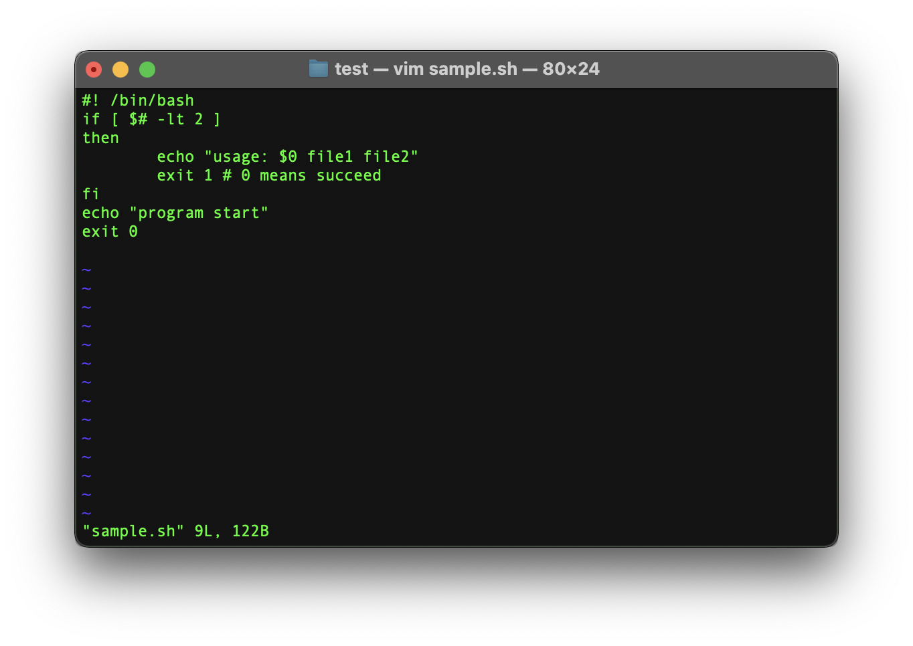 

- $# : special parameter, 인자의 수
  - ./sample.sh a
    - sample.sh가 $0
    - a 는 $1
- 첫 번째 If statement 에서 인자의 개수가 2보다 작으면 True 아니면 False

```bash
$ ./sample.sh a # 인자 한 개 
usage: ./sample.sh file1 file2
$ ./sample.sh a b # 인자 두 개
program start
```


#### Integer Testing trial

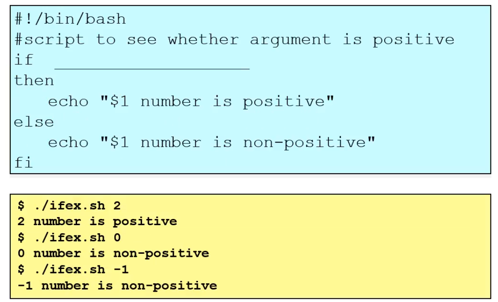 

- shell script와 결과를 보고 추론해보자

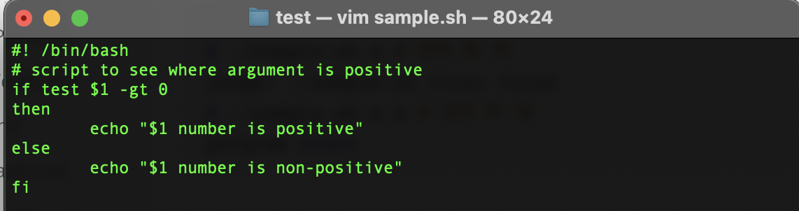

이렇게 했을 때의 결과물

```bash
$ ./sample.sh 2
2 number is positive
$ ./sample.sh 0
0 number is non-positive
$ ./sample.sh -1
-1 number is non-positive
```

참잘했어요~

- 정답
  - if test $1 -gt 0
  - if [ $1 -gt 0 ]


#### String Testing Trial

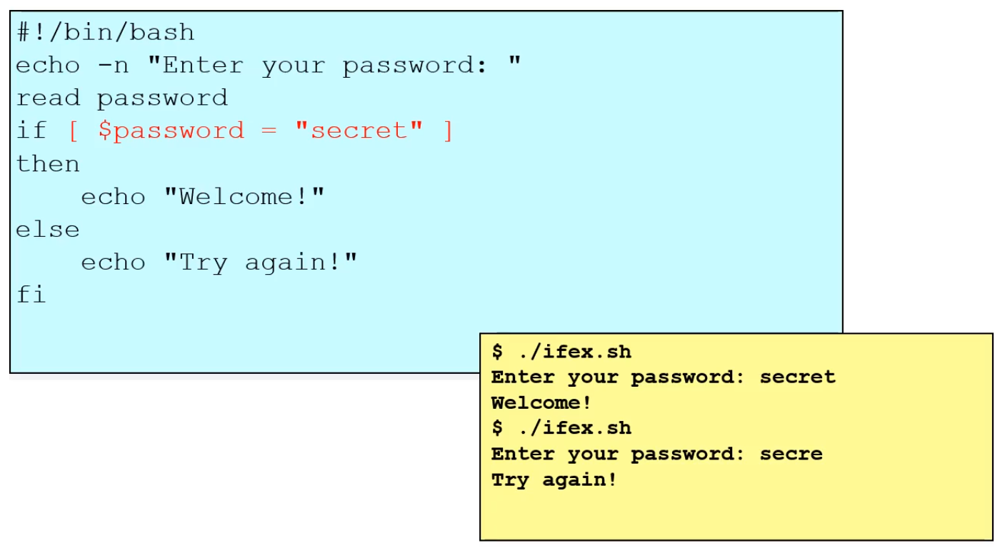 

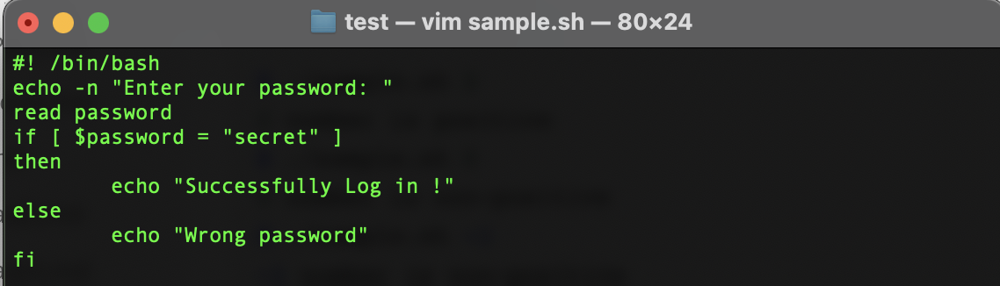 

```bash
$ ./sample.sh 
Enter your password: secret
Successfully Log in !

$ ./sample.sh 
Enter your password: secre
Wrong password
```

- -n 옵션은 뉴 라인을 방지, 콜론 하고 멈춰있다.

### 

#### String Testing Trial 2

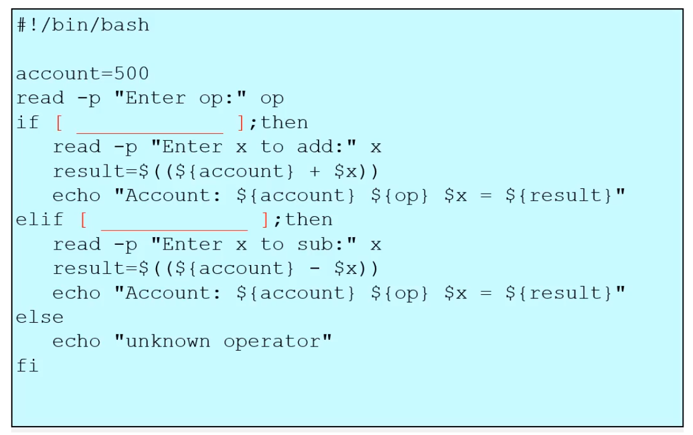  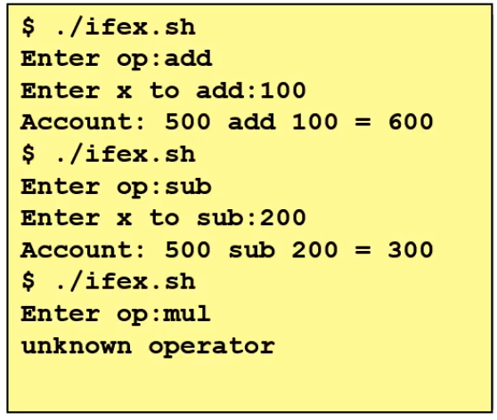

- 결과를 보고 빈칸을 채워보자

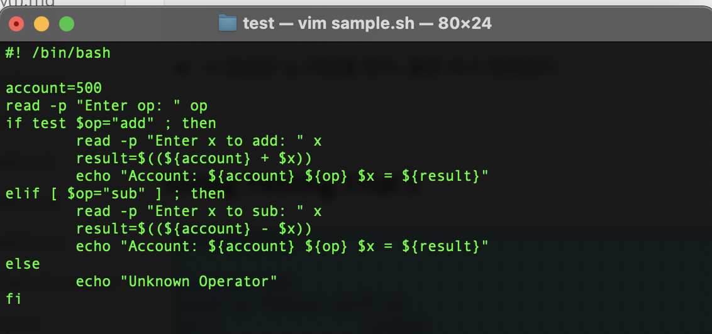


###  if statements - file testing

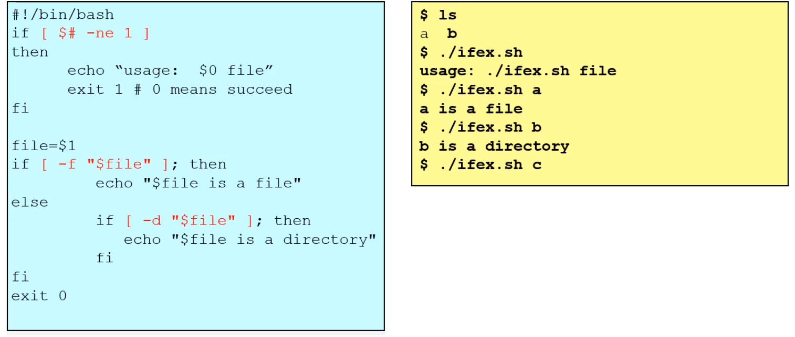 

- $#: argument 수, -ne : not equal
- file = $1 
- -f "$file":  regular file인지 출력
- -d "$file" : directory인지


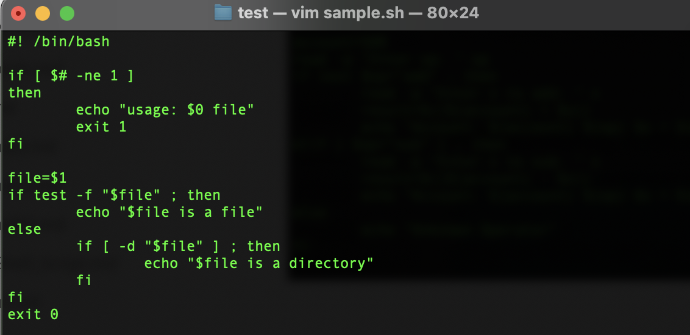 

```bash
$ ./sample.sh 
usage: ./sample.sh file

$ ./sample.sh a
a is a file

$ ./sample.sh b
b is a directory

```


### Case Statements

- Case - in - esac 순으로 이루어져있다

  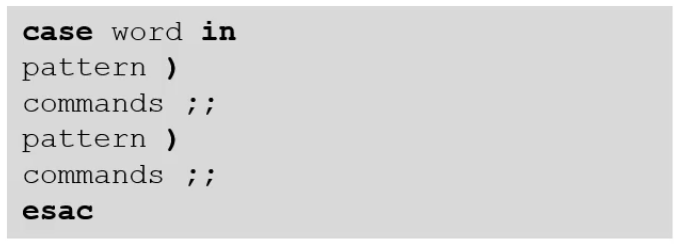 

  - 각 패턴은 **괄호로** 마치고, 패턴이 매칭되면 command는 **;;** 로 구분한다.

   

  ```bash
  $ read -p "Enter the name of an animal: " ANIMAL
  Enter the name of an animal: pig
  
  $ echo -n "The $ANIMAL has "
  $ case $ANIMAN in
  > horse )
  > echo -n 4 ;;
  > pig )
  > echo -n 2 ;;
  > *) # optional indicates default
  > echo -n "an unknown number of" ;;
  > esac
  ```


#### Case patterns

- 각 패턴은 wildcard를 갖고있으며 **)** 로 끝난다

  - *, ? , [a-z]를 갖고있을 수 있다. - wildcard

  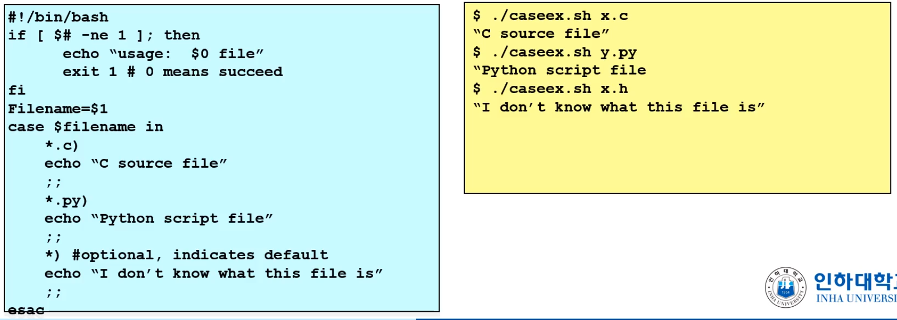 

  - case in
    - *.c ) 와일드카드가 사용됐다.


P\attern 매칭에서 wildcard를 사용할 수 있는데, 뿐만 아니라 여러개의 패턴들을 조합적으로 사용하기 위해 

- | 을 이용해 확장할 수 있다.

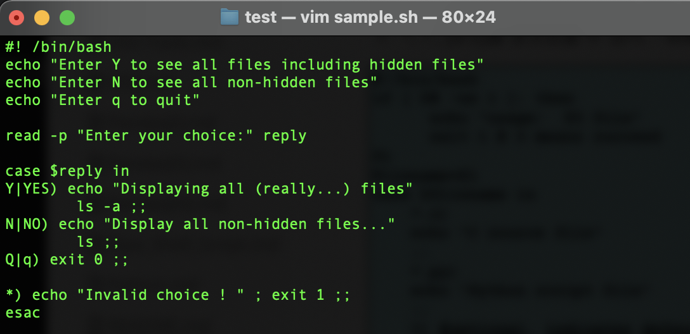 

```bash
$ ./sample.sh 
Enter Y to see all files including hidden files
Enter N to see all non-hidden files
Enter q to quit
Enter your choice: Y
Displaying all (really...) files
.		.DS_Store	b
..		a		sample.sh

$ ./sample.sh 
Enter Y to see all files including hidden files
Enter N to see all non-hidden files
Enter q to quit
Enter your choice:N
Display all non-hidden files...
a		b		sample.sh

$ ./sample.sh 
Enter Y to see all files including hidden files
Enter N to see all non-hidden files
Enter q to quit
Enter your choice:q

$ ./sample.sh 
Enter Y to see all files including hidden files
Enter N to see all non-hidden files
Enter q to quit
Enter your choice:hello
Invalid choice ! 
```

