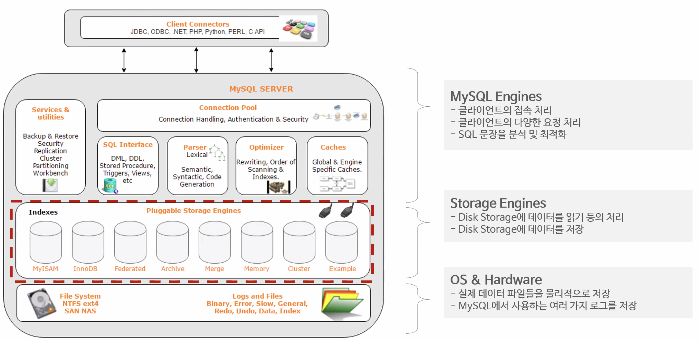
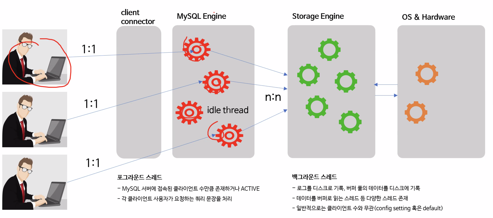
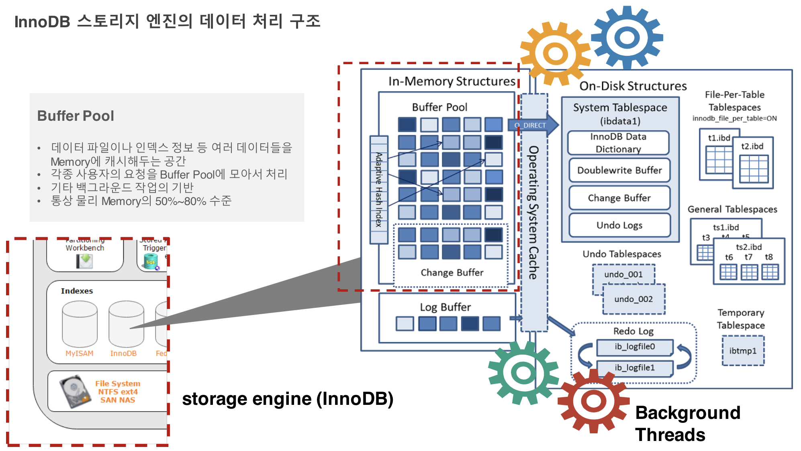
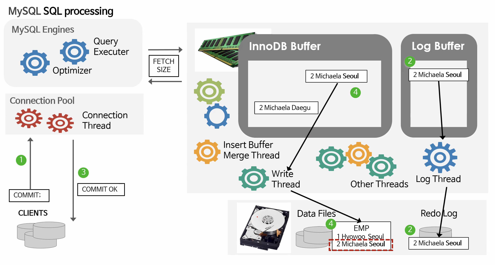
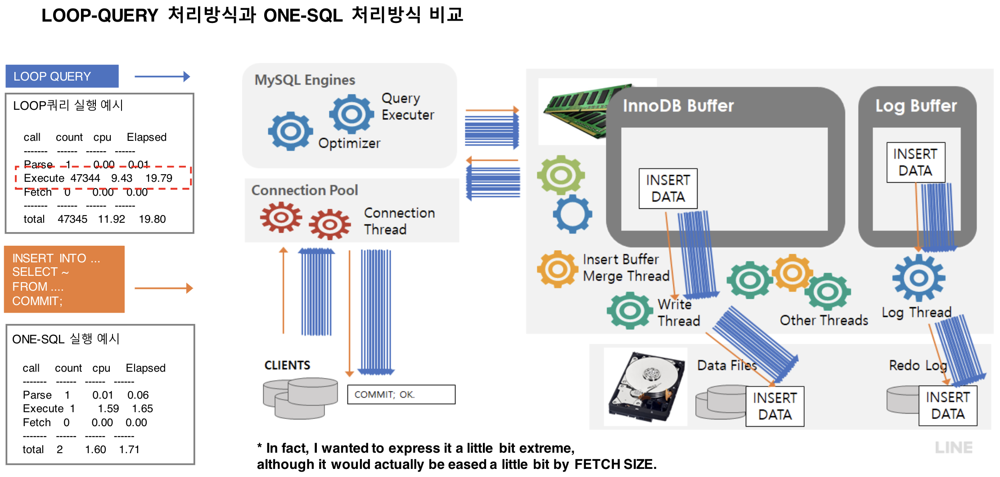

## Database Architecture 

> 데이터베이스 아키텍쳐와 성능 관리에 대해서 알아보자.

#### Contents

- Basic RDBMS
- MySQL Architecture
- SQL Processing
- ONE SQL & Array Processing
- Basic Lock & Transaction
- Practice

### Basic RDBMS

관계형 데이터베이스, Oracle, SQL Server, MySQL 등이 있으며, 이와 다른 NoSQL [redis, HBase, MongoDB] 가 있다.

관계형 데이터베이스는, 관계형 모델을 기반으로 동시성과 정확성을 보장해주는 모델이다.

NoSQL은 대부분 프로젝트마다 특성, 특징이 다르다. 참고로 MongoDB는 Document style, Redis 는 Key-value 스타일의 구성이다.

둘 중 뭐가 좋다, 나쁘다 보다는 서로 사용되는 영역이 다르다.

회사, 금융권 등 Core data (가장 중요한 데이터)는 보통 Oracle / MsSQL 등 과금이 필요하지만 성능이 더 좋은 플랫폼을 쓴다. 카카오 뱅크가 유일하게 MySQL 을 사용했는데, 이는 큰 도전이었다.

DB를 알아보기 전에 실 생활과 비교해 보자.

> 우리가 편의점에 들어가서 바나나 우유를 찾는다. 진열대에서 바나나 우유를 찾아보았는데 없다. 알바가 창고에 가서 바나나 우유 박스를 들고와 진열대에 다시 채워놓고 우리가 바나나 우유를 얻을 수 있게된다.
>
> 우리는 DB에 접속한 Thread 라고 볼 수 있으며, 편의점 진열대는 Memory, 창고는 Disk라고 볼 수 있다.
>
> 컴퓨터에서 우리가 작업을 할 때 Memory 를 통해 데이터를 주고 받는데, 이때 memory에 data가 없다면 Disk를 통해서 필요한 data를 가져온다.
>
> 이러한 중간 데이터를 가져오는 처리를 RDBMS  platform을 통해 할 수 있다.

만약 편의점에 온 고객의 제품이 계속해서 없다면? --> 알바는 매번 창고에 방문을 해야한다.

> 불필요한 작업을 해결하기 위해 메타 데이터를 갖고있는게 낫다. 컴퓨터나, 핸드폰에..
>
> 또는 
>
> 1. 자주 사용되는걸 왕창 가져다 놓기
> 2. 분점을 하나 더 낸다.
> 3. 알바생을 더 고용해서 빠르게 처리한다.
>
> 이러한 해결 방안등을 해결하지 않고 현 상황을 유지한다면? 알바가 뻗어 버린다 [데이터 베이스가 Down 된다]

Real-life 에서, 대부분의 좋은 환경에서는 Memory 를 통해 data를 가져온다 - [99% buffer cache hit]

> 보통 하나의 서비스에서 connection 마다, 비슷한 내용의 데이터를 원하는 경우가 많다. 그렇기 때문에 memory buffer cache hit 가 높다. 
>
> **LRU - Last recently Used** 알고리즘 방식으로 메모리가 관리된다. 
>
> 예를들어, 이커머스 시장에서 계속해서 아이템Id 정보를 필요로 한다. 많은 커넥션이 아이템 정보를 필요로 할 테니, buffer cache hit는 높다.
>
> LRU 에 따라 1번 itemId가 최초에 올라가 있다가, 계속해서 사용되지 않았는데, itemId 5를 필요로 할 때 1번 item 정보를 대체하여 5번 아이템 정보를 올린다. 이런 방식으로 계속해서 buffer hit 률을 올릴 수 있다.
>
> [LRU Algorithm은 좋은 알고리즘일까 ?](https://gazelle-and-cs.tistory.com/43)

### MySQL Architecture

 

- MySQL Engines
  - SQL 문장 분석 등 성능에 대한 계선
  - 요청 처리
- Storage Engines
  - 처리에 대한 영역
  - 실제 데이터를 옮긴다
  - Disk Storage에 데이터를 읽기, 저장 등의 처리를 한다
- OS & Hardware
  - 영속적으로 데이터를 저장한다.
  - 여러가지 log도 저장한다.

MySQL Engines & Storage Engines는 **memory를 사용한다.** 이와 반대로 OS & Hardware 영역은 **Disk 영역이다.**

##### MySQL Engines

> 우선 실생활을 예시로 알아보자.
>
> 우리가 PS5를 구매한다고 생각해보자. 근데 이게 배송이 계속 안온다. 우린 기분이 안좋아진다 ㅠㅠ.. 상담사를 통해 질문을 한다. 그러면 이 <u>상담사는 질문을 분석을 한다.</u> 질문에 대해서 처리를 전달해야한다.
>
> 상담사가, Storage engine [물품 처리] 에게 A 고객님이 물품을 못받고 있다고 알려주고, storage engine 으로부터 현황을 알려줄 수 있다.
>
> 이러한 상담사를 MySQL Engine 이라고 할 수 있다. client의 요청을 분석하고 처리를 진행한다.

- MySQL Engine 구조

<u>Client와 연결이 되어있는 동안 **1 : 1 관계를 유지한다.**</u> (이때문에 장애가 생기기도 한다.)

다른 Client가 연결을 요청하면 다른 상담사 (thread)를 할당한다. 

즉, 나의 연결 요청에 의해 **하나의 thread를 할당하여 ** **1:1 관계**로 매핑된다.

- connection pool 에 있는 thread와 1:1 connection을 맺는다.

이때 앞에 Thread를 Foreground Thread (포그라운드 스레드) 라고 한다.

이러한 1:1 관계로 인해 동시성의 떨어 질 수 있어도 단일성 (atomic) 은 보장이 된다.

MySQL Engine과 Storage Engine은 둘 다 Memory에 떠 있는데, 이는 N:N 관계이다.

- connection에 따라 MySql engine의 thread는 과도하게 생성될 수 있다.

#### MySQL Memory 할당 및 구조

- Global Memory

  > 모두가 share 할 수 있는 memory
  >
  > MySQL 서버 내에 존재하는 많은 스레드가 공유해서 사용하는 공간
  >
  > 이마트의 진열대 라고 보자

  - Key Chace
  - **Buffer Pool**
  - Query Cache
  - Binary Log Buffer
  - Log Buffer
  - Table Cache

- Session Memory

  > 나만 쓰는 메모리 영역. 다른데서 참조할 수 없는 메모리 영역
  >
  > - 세션 Memory 영역, 스레드 별로 독립적으로 할당
  > - 클라이언트 커넥션으로부터의 요청을 처리
  > - 적정 수준 이하의 세션 수 유지 필요
  >
  > 이마트에서 내가 쇼핑을 할 때 쓰는 장바구니, 카트 라고 할 수 있다.
  >
  > 내가 다른 지나가는 고객의 장바구니 제품을 가져갈 수 없으니까.

  - **Connection Buffer**
  - Result Buffer
  - Read Buffer
  - Join buffer
  - Random Read
  - Join Buffer
  - Random Read Buffer
  - Sort Buffer

##### Storage Engines

- 데이터 캐싱하는 영역을 갖고 있다.
- 여러가지 엔진이 있지만 **InnoDB** 가 가장 중요하다.

### Buffer Pool

> 데이터 파일이나 인덱스 정보 등 여러 데이터를 Memory 에 **cache 처리 해두는 공간**
>
> 각종 사용자의 요청을 Buffer Pool에 모아서 처리한다.
>
> 통상 physical memory의 50% ~ 80% 수준이다.

### SQL Processing

순서대로 알아보자. 

하나의 connection이 연결을 요청하고 SQL을 날리면

1. SQL Parsing
   - Syntax check: 문법 check. 
   - Semantic Check: 의미 검사. 의미적으로 이 SQL 이 접근 권한이 있는지, 실제로 이 데이터가 존재하는지, 이 Table에 접근 권한이 있는지.
2. Optimization : 최적화, 어떻게 하면 가장 최적의 방법으로 수행 할 수 있는지.
   - Query Transformer
     - Optimizer 가 최적화 하기 쉬운 형태로 변형을 한다. 결과는 똑같은 형태.
   - Estimator
     - 이 SQL의 Cost를 계산
   - Plan Generator
     - 이 SQL은 이 순서로 수행하는 실행 계획을 만든다.
     - Estimator & Plan Generator 를 통해 SQL문의 cost 판단을 해서, 어느 실행 계획이 가장 낮은 cost인지를 알 수 있다. 그리고 해당 sql을 선택한다.
3. Row-Source Generation
   - Formatting in executable Procedure & Core
     - SQL을 컴퓨터가 이해할 수 있는 Binary, or C language로 변형시킨다.
4. Execution

Oracle, MSSql 같은 경우, Optimization, Row-Source Generation 등의 과정에 결과를 저장하는 **Shared Pool Check** 을 SQL Parsing 부분에 포함해서 더 빠른 성능을 보장해 준다.

- SQL 문을 Hash 함수를 통해 unique 한 key 값으로 변형해서, 이 값과 실행 계획을 저장한 Table을 만든다.
  - 즉 Key - value 형태로, [SQL - 실행계획] 을 저장한다.
  - 같은 SQL을 connection에서 요청하면 Optimization 등의 과정이 생략된다 <u>**soft parsing**</u>
  - 반대로 MySQL 등 이러한게 없이 Optimization, Row-Source Generation 의 과정을 다 하면 **<u>hard parsing</u>**

- 하지만 이 부분에도 단점이 있다.
  - SQL의 변수가 다 다르면 서로 다른 SQL이 된다.
    - Bind Variable [sql 문에서 where a = ?  등 물음표를 쓰는거.]
    - 즉 bind 변수를 쓴 SQL 문을 쓰면 변수가 달라도 하나의 sql 문으로 처리한다.
    - 결론적으로 데이터 처리 량이 다른데 [어떤 변수는 소량, 어떤건 대량] 같은 SQL 실행 계획으로 인식되어 사용자입장에서 **성능이 들쑥날쑥 할 수 있다.**

- commit 같은 경우, Redo Log에 저장이 되면 영속성이 보증되었다 보고 Commit OK가 된 뒤 후에 table sync를 맞춘다.

Why ? **느리니까 !**

- Disk에서 update 저장 등 의 속도는 너무 느리다.
- Redo Log은 **Heap** 형태로 저장을 해놓고 한 번에 모아서 commit을 해서 I/O 도 줄인다.
- 영속성을 지키기 위해 4번 step 이 없어도 Redo Log에서 찾아오도록 할 수 있다.

**어떻게 영속성을 보장할까 ?**

- Connection 에서 요청을 되면 1번 sql commit ok, 2번 sql commit ok ... 등 테이블로 저장하고
- Write 할 때 Disk 내에도 이러한 내용을 테이블로 저장한다.
- 이러한 두 테이블을 비교해서 sync를 맞추며 영속성을 보장한다.

### ONE SQL & Array Processing

> 벽돌을 옮기는데 100번 왔다 갔다 하면, 무릎이 아프고, 한 번에 100개를 옮기면 팔이 너무 아프다.
>
> 즉 여러번 I/O 를 하느냐, 큰 데이터를 한 번에 옮기느냐.

**Loop Query 방식 & One SQL 처리방식**

- Loop Query 방식
  - 여러번의 쿼리를 처리하는 것.
- One SQL
  - 한 방에 처리

### References

- LINE Plus Corp: Database Architecture Tuning Day 1

