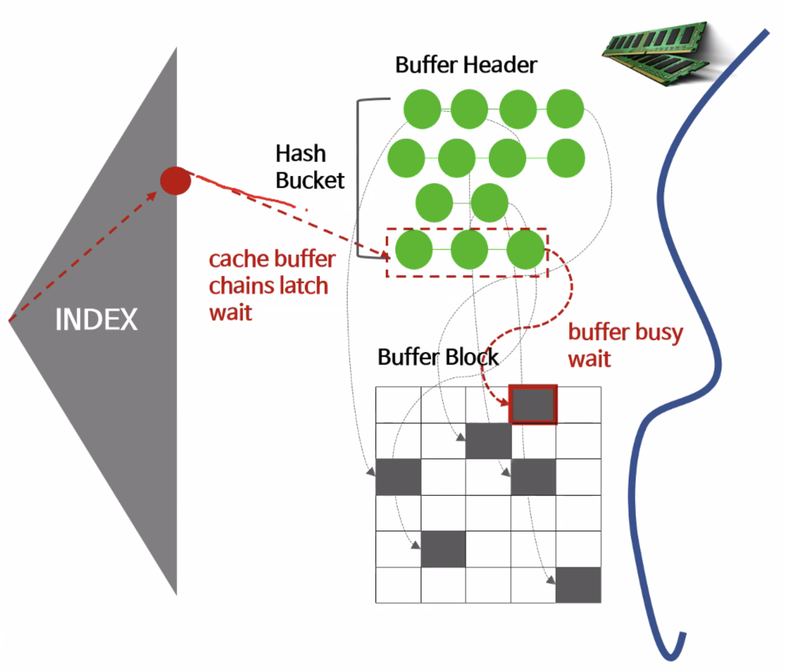
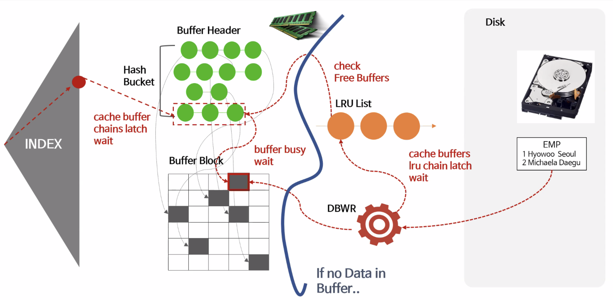
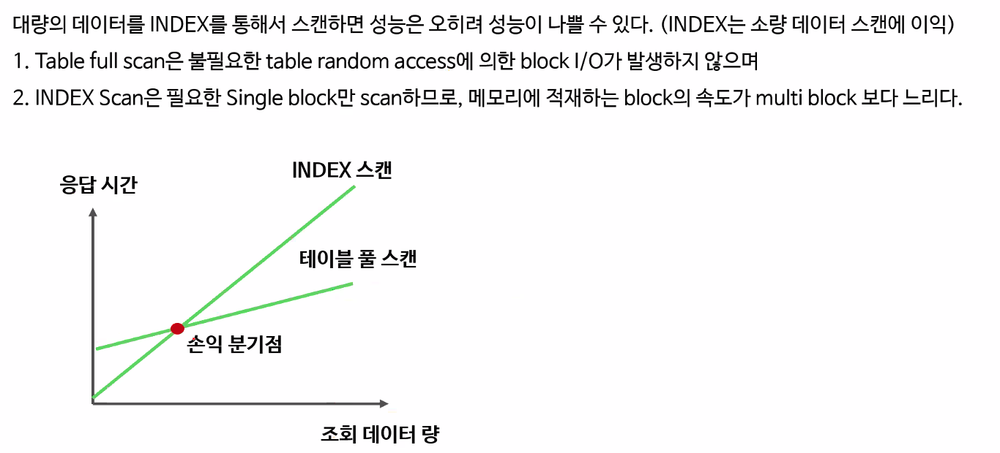
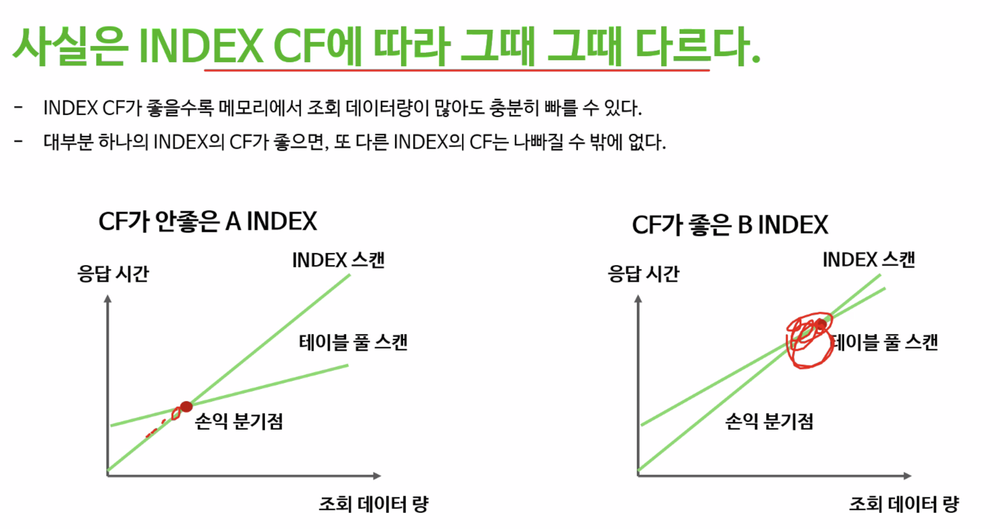
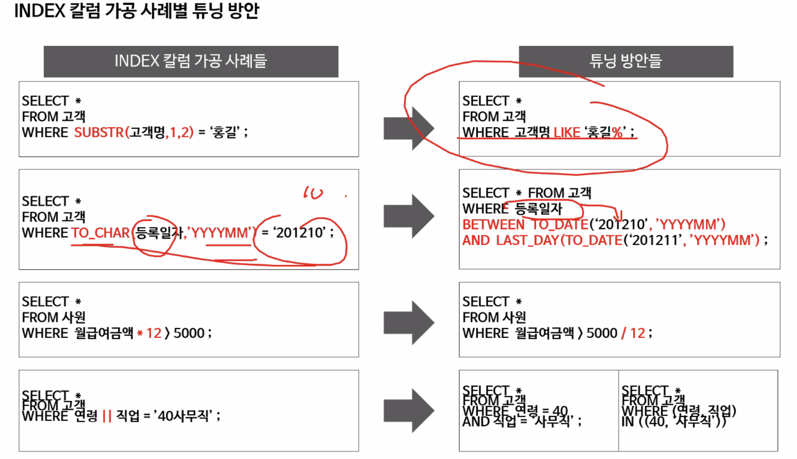
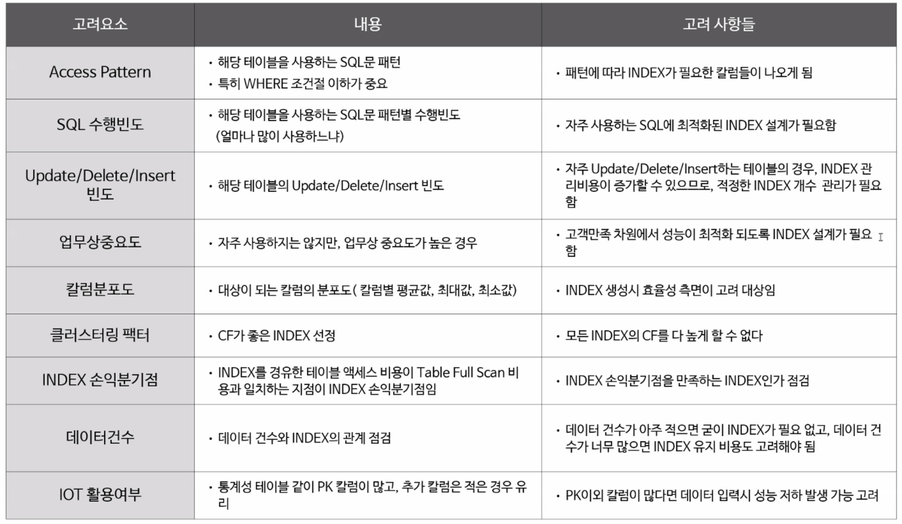

# Index Access Tuning

#### 인덱스의 액세스 최적화와 설계

- Index scan과 Table Full scan의 차이를 이해하자
- Index의 기본적인 비용에 대해서 이해하자
- 기본적인 인덱스 사용 조건에 대해서 이해하자
- 인덱스 액세스 최적화를 이해하자
- 성능을 고려한 인덱스 설계를 이해하자


### Index Scan 과 Table Full Scan

 

Index root 부터 시작해서, branch를 지나 leaf로 오면, **Hash Bucket** 형식으로 데이터가 들어있는 Buffer header에 도달할 수 있다. 물론 Hash 값이 충돌해서 seperate chaining 방식으로 이어져 있을 수 있다. 이때 Hash Bucket에는 실제 Buffer Block에 원하는 데이터가 위치한 주소를 갖고있다.

값이 변경되었을 때 주소값이 변경될 수 있는데, Atomic 함을 지키려면 어떡할까?

- 내가 참조하는동안, **latch [빗장]** 이라는 장치로 Lock 을 건다
  - 누군가가 참조하거나 변경하는동안 Latch로 lock을 걸고 다른 사람이 참조하지 못하도록 한다.
  - 최대 2000번의 시도를 막아줄 수 있다.
- wait event로 <u>cache buffer chains latch</u> 라는걸로 Database에 어디 병목이 있는지를 알 수 있다.
  - 2000번의 시도 동안에도 access를 못하고 block 된다면, 잠시동안 os에 반환을 하고, 다시 latch를 획득하기 위해 시도를 한다.
  - 그러고 내가 bucket을 탐색하면서 latch를 걸게된다.

- Hash Bucket에서 Buffer Block의 연결은 포인터로 연결되어 있는데, 이 buffer block에 바로 접근하는게 아니라 **buffer busy wait** 이 걸릴 수 있다.
  - buffer block에는 내가 원하는 데이터 뿐 아니라 다른 데이터도 같이 들어있을 수 있기 때문에, 누군가 **lock을 건다**
  - lock은 latch와 좀 다른데, lock에는 줄 서 있는 list를 포함하는데 이때 buffer busy wait event를 발생시킨다.


즉 내가 원하는 데이터를 Index를 통해 찾는 과정에서의 Overhead

1. Index root 부터 leaf 까지 탐색
2. leaf에 나온 Hash 값을 통해 hash bucket 을 탐색한다. 이때 Latch에 의해 lock이 걸려 있으면 <u>cache buffer chain</u> 에 의해 기다린다.
3. Buffer Block으로 가는데 이 때 lock이 걸려 있으면 buffer busy wait 상태로 대기한다.


#### 하지만 Memory에 데이터가 없고, 실제 Disk 에서 가져와야 한다면?



LRU [Least Recently Used] 형식의 알고리즘에 의해서, LRU List 등록되기 위해, 이 것도 shared object 이기에 atomic 을 보장하기 위해 Latch를 사용한다. 이때의 event를 cache buffers LRU Chain latch 라고 한다.


<u>가장 중요한 내용은 Index를 통한 scan은 생각보다 고비용이다.</u>

- 여러가지 경합이 발생된다 - atomic 보장을 위해


대부분의 경우, **Table Full Scan이 더 빠를수도 있다.**

예를들어보자.

> 교수님이 시험 범위로, 책에서 배운거 빼고 다 라고 했는데 그 부분이 별로 없고 다 배웠다.
>
> 우리가 첫 장부터 끝까지 읽으면서 안 배운 부분을 건너 띄는게, 책 맨 뒤로 가서 시험에 포함된 인덱스를 하나하나 찾는거보다 빠를 수 있다.


### Index 비용의 원리

인덱스 비용의 계산을 어떻게 할까?


결론적으로 Index 비용은 **시간에 따른 비용으로 계산되지 않는다.**

- 물론 Latency에 따른 계산 비용은 주관적으로 말할 수 있지만, 네트워크 상황이나 다른 여러 상황에 따른 비용이 포함되기에 객관적인 지표가 될 수 없다.

##### Block을 얼마나 읽었는지에 대한 Cost를 - <u>인덱스 탐색 cost라고 한다.</u>


결합 index - [지역 + 이름] 의 index가 있다고 해보자.

지역으로 sort 하고 지역 내에서 이름으로 정렬 되어 있다.

**서울에 사는 홍길동**을 찾다고 해보자.

> 서울에서 스캔을 시작해서 홍길동부터 홍길동이 아니거나 경기도 내용이 나오기 전까지 읽는다.
>
> **즉 얼만큼의 block을 읽었는지가 비용이 될 수 있다.**

<u>서울에 사는 홍길동 중에서 키가 190cm 이상인사람</u>을 찾아보자.

> 인덱스 자체로는 탐색 비용이 거의 동일하다는걸 알 수 있다.


#### Index Scan은 Single Block I/O 이다.

대량의 데이터를 읽는다고 생각해보자.

- 인덱스로 읽을 때 Buffer Pool에 있을 확률이 점점 줄어든다. 거의 내가 필요한 데이터가 Disk에 존재할 확률이 높다. 즉 Cache Hit률이 낮을꺼다.
- 그러면 일일이 Single Block I/O로 필요한 데이터를 퍼올려야한다.

하지만 Table Full Scan은, 필요한 데이터를 한 번의 I/O로 대량으로 가져올 수 있다.

즉,

**대량의 데이터를 읽을수록 Buffer Pool에서 데이터를 찾을 확률 [cache hit]이 낮아지기 때문에 Single Block I/O의 인덱스 스캔 방식보다 Table Full Scan 방식이 더 유리하다.**




#### **추가**

- 손익분기점은 늘 똑같지는 않다
- Clustering Factor에 따라 다르다.



예를들어, User Table이 있는데 이름에 대한 Index, 생년월일 Index, 연봉 Index가 있다 하자.

데이터를 나이에 대한 정보로 대량의 데이터를 가져온다면 CF가 각각 다르고, 이런 경우 생년월일 Index가 가장 좋은 성능을 보일것이다.


### Index 사용 조건

- 컬럼의 가공

  ```sql
  SELECT *
  FROM 고객
  WHERE SUBSTR(고객명, 1, 2) = '홍길';
  ```

  

- 부정형 비교

  ```sql
  SELECT * 
  FROM 고객
  WHERE 고객구분코드 <> '외국인'
  ```

  

- 컬럼의 묵시적 Data Type 변환

  ```
  TO_NUMBER 등을 사용
  ```

  

- NULL 또는 NOT NULL 비교

  ```sql
  SELECT *
  FROM 고객
  WHERE 고객영문명 is NULL;
  ```



- 여러가지 튜닝 방향이 있다.


### Index 설계 최적화



- 하나의 Index로 얼마나 많은 SQL문들을 처리할수 있는지도 고려해야한다. 물론 각 SQL이 해당 Index에 최적의 성능을 못 낼수 있다.

- DML 빈도도 중요하다. Index는 Update/수정 변화에 굉장히 취약하다. 변경에 대한 이슈가 적을수록 index의 성능을 더 잘 뽑아낼 수 있다.

