## Index의 기본 

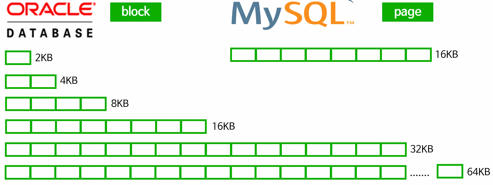

### Database 처리 단위

Data Block & Page

- ORACLE 에서는 block 이라 부르며
  - 2kb, 4kb, 8kb, 16kb ... 64kb 크기로 처리할 수 있다.
  - 이는 dynamic 하다는게 아닌, 고정적이다. 중간에 바꾸지 못 한다.
- MySQL 에서는 page 단위로 부른다.
  - 16Kb 고정 Page 크기 [처리 단위].

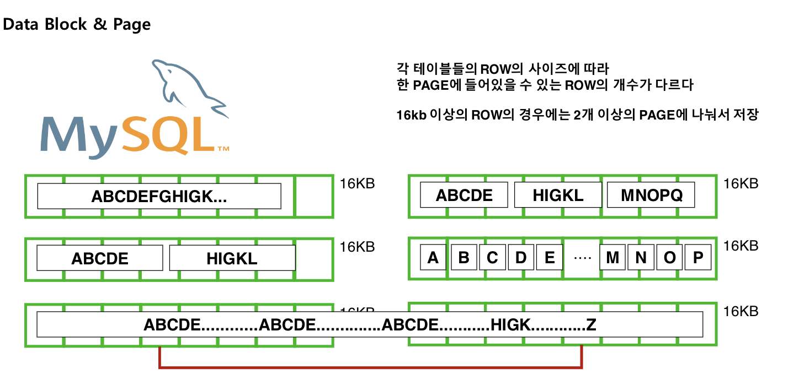

각 테이블의  row의 사이즈에 따라 한 Page에 들어있을 수 있는 Row의 개수가 다르다.

16kb 이상의 row의 경우에는 2개 이상의 Page에 나눠서 저장한다.

Page 가 하나의 Row를 두 개의 Page에 나눠서 저장을 했을 때, 이게 물리적으로 이어져있는걸 보장하지 않는다.

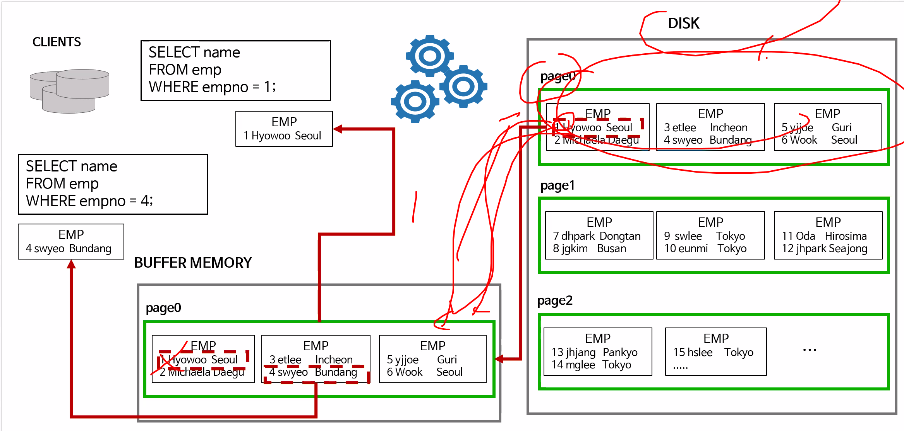 

- 만약 client 가 4번 itemId를 요구했는데, 이게 Buffer Memory [진열대]에 없다면?
  - Disk [창고] 에 가서 가져오는데, 이걸 해당 데이터 [empno=4] 만 가져오는게 아닌, db 처리 단위인 Page 단위로 해당 데이터를 가져온다.
- 즉, Page의 크기가 무작정 커질수록 buffer memory 에 실제 사용 할 가능성이 낮은 데이터를 놓게된다.

### Index 구조와 원리

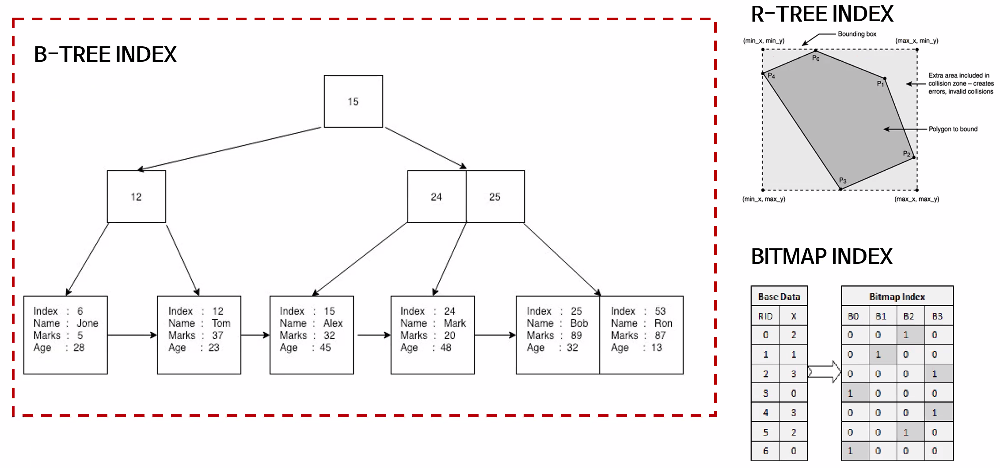 

#### B tree index에 대해 알아보자.

인덱스란 무엇인가 ?

> 방대한 데이터에서 원하는 데이터를 빨리 찾을 수 있도록 도움을 주는 역할을 한다.
>
> 책에서 맨 뒤에 index를 생각해 보자!

인덱스는 기본적으로 **Sorted** 상태이다.

- 정렬이 되어 있어야, 불필요한 공간을 읽지 않아도 된다.
  - 즉 Scan의 시작점, 종료점을 안다는 것 !

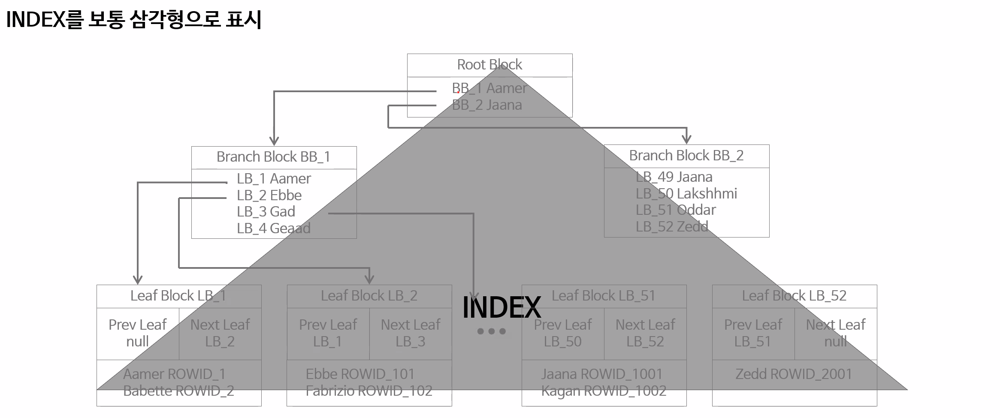 

##### Index는 보통 삼각형으로 표시한다.

그리고, **Table은 보통 사각형으로 표현한다.**

Index는 보통 **<u>Keyword + 실제 데이터 주소</u>** 로 구성되어 있다.

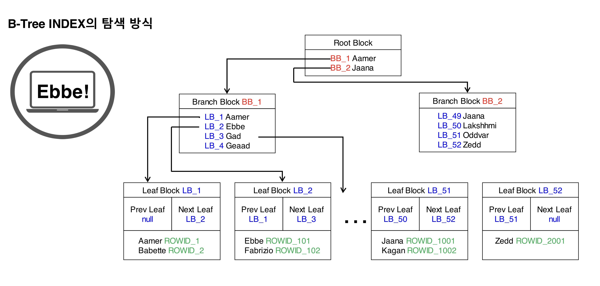

**B-Tree에서 탐색: Root Block로 시작해서 Brach Block을 지나 Leaf Block 까지 내려간다**.

Ebbe를 찾는다고 생각 해 보자 !

> Root Block에서 비교해 본다. 왼쪽: [A-J], 오른쪽: [J-Z]
>
> 왼. 쪽으로 내려간다.
>
> Leaf Block에 도착했으면 수평적 탐색을 이어간다.
>
> why? 중복이 있는지 보는거다.
>
> Leaf node에서 Ebbe의 실제 위치를 알게 되기 때문에, 해당 값으로 실제 Table에 가서 찾아본다.
>
> 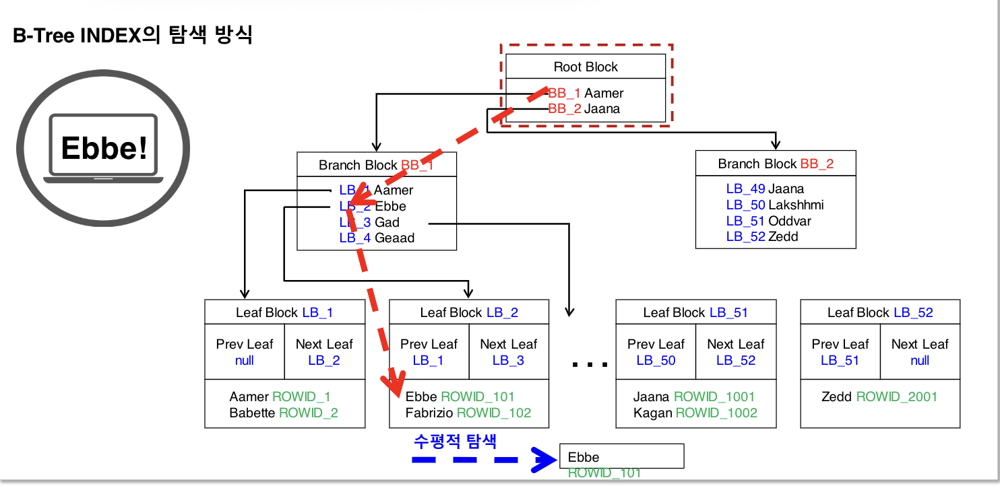

#### Index의 비효율성

- 데이터가 너무 과도하게 많은 경우
  - Depth 는 index 스캔 효율이 악화되지만
  - 이 경우 Tree 의 Depth 를 늘리면 성능적으로 크게 걱정하지 않아도 된다.
    - 즉 Branch Block을 더 다음 레벨로 이어서 만든다는 것
  - <u>BLevel</u>: B*-Tree level, Root Block 에서 Leaf Block 까지의 깊이를 의미. 만약 0 이라면 Root Block 과 Leaf Block 이 같다는 의미.
- 데이터의 길이가 길어지는 경우
  - 더 많은 블록 / Page 가 필요해진다.
  - 이는 Depth 도 깊어지고, 용량도 커지고, 메모리에 적재해야할 Page도 더 많아진다. !!!
  - 실제로 MySQL에서는 767 Kb 사이즈가 넘어가는 컬럼에 대해서는 인덱스를 만들 수 없다.
    - Index column size too long 에러
    - 물론 데이터의 앞 767Kb 까지만을 사용한다면 가능하다. 하지만 이 경우 Key 중복 확률이 높아져버린다.
- 둘 다인경우

#### Index에 데이터가 추가된다면 어떻게 다시 정렬될까?

> 우선 Index의 데이터는 물리적으로 근접하게 있지는 않다.
>
> Block Split을 해서 데이터를 넣어준다. 그리고 Sort 까지 진행한다.
>
> - PCTFree
>   - 남아있는 공간이 30%가 안된다면 Block Split을 해야한다.
>
> - PCTUsed
>   - Block에 대한 사용률이 60%가 넘어가기 시작하면, 여유로울 때 미리 분할을 한다.

지금까지는 single index

#### 결합 Index

- 두 개 이상의 컬럼으로 Index를 구성하는것
- 순서에 따라 선두 컬럼 후행 컬럼으로 구분한다.

#### 결합 Index 장점:

- 단일 Index에서 중복값이 많다면, 스캔량이 많을 때 효과적이다.

#### 문제점

첫 번째 column으로 인덱스가 정렬되어 있기 때문에, 만약 first column의 조건절이 없는 탐색을 해야 한다면, Root 에서 어느쪽으로 가야할 지 모른다. 결국 모든 Data를 다 scan 해야한다.

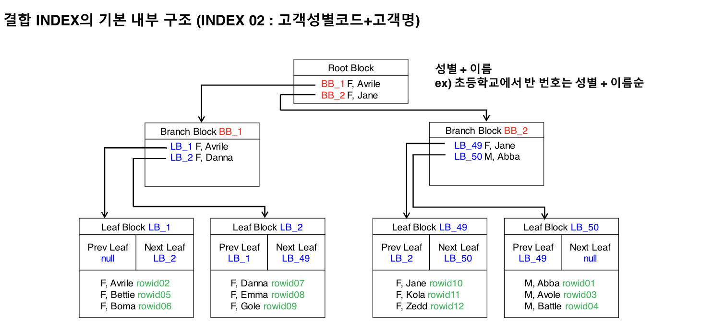

- 예를들어, 성별 + 이름 의 index이지만, select * from user where user.name = ? 와 같이, 성별이 아닌 이름으로 검색을 해야 한다면, Abcd라는 이름은 왼쪽에도 있을 수 있고, 오른쪽에도 있을 수 있다.

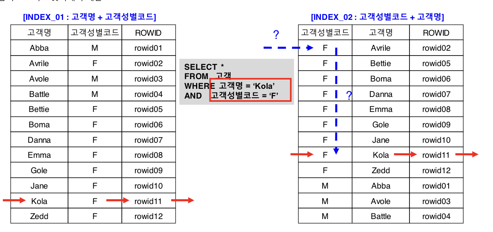

- Optimizer는 최적화를 하기 전에, Transform을 한다. 그래서 사실 index의 컬럼 순서 자체는 성능에 영향이 없다.
  - 조건문에 사용된 컬럼이 모두 = 조건이라면, 결합 Index 컬럼 순서에 상관없이 처리량이 동일하다.

또한, 어쨋던 인덱스를 통해 얻게 된 정보로, 실제 Table에서 성명을 찾아와야한다 [I/O 가 생긴다.]

- 이걸 위해, 결합 index를 통해 필요한 정보를 미리 index에 담아두면, table에 방문하지 않아도 된다.

### Index Scan 방식

- Index Range Scan

  - 일반적인 Range Scan이라 볼 수 있다.
  - 즉, root에서 시작해 branch를 통해 leaf로 가서, 수평탐색을 한다.

  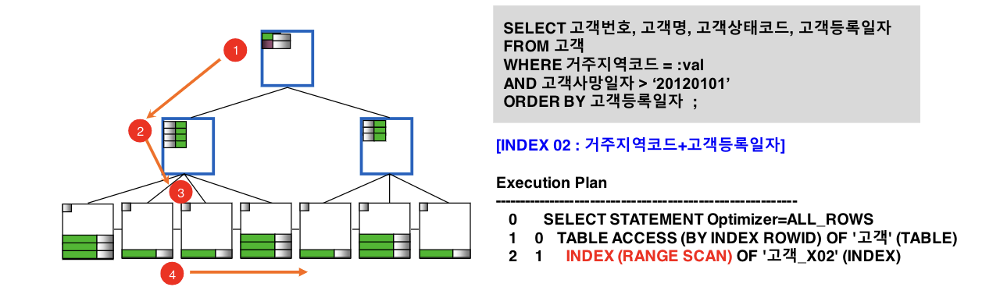 

- Index Range Scan Descending

  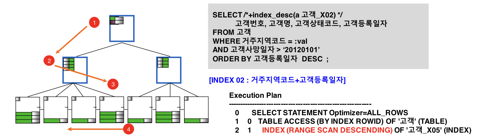 

  - 뒤에서 부터 수평스캔을 하는거
  - 실제 descending 값을 원할 때 효율적이다.
  - 그렇다면, Index를 descending 으로 만들어서 일반 range scan을 만드는게 나을까? 아니면 일반적인 index로 만들어서 descending scan을 하는게 나을까?
    - 체감할정도의 차이는 없다.
    - 왜 descending이 조금 더 느리냐면, 블록 자체를 내부적으로 descending 정렬을 해야하기 때문에.

- Index Unique Scan

  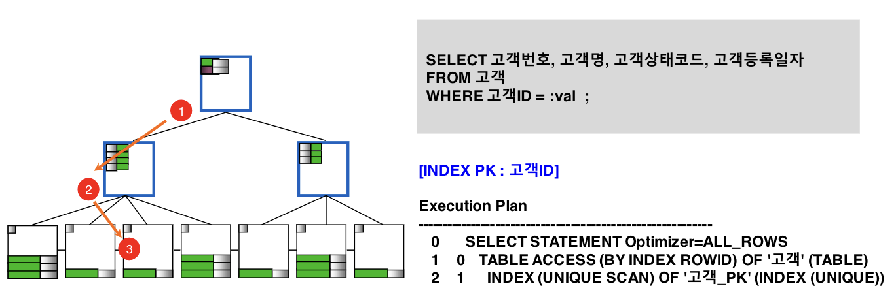 

  - Unique 한 object로 인덱스를 만들었을 때 사용된다
  - 수평탐색이 없다. 중복이없다는 보장이 되어있기 때문에.
  - 좀더 빠르다고 할 수 있지만, 큰 차이는 없다.

- Index Skip Scan

  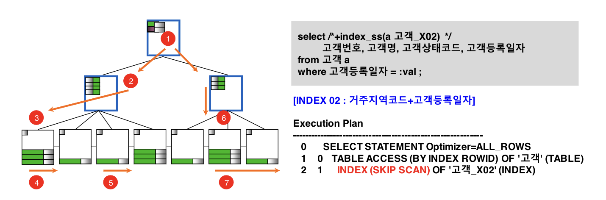 

  - MySql에서는 Loose Scan이라는걸로 비슷한게 있지만, 없다고 생각해도 될 만큼 성능이 후지다.
  - Skip Scan은 오라클에서 활용할 수 있는거.

- Index Full Scan

  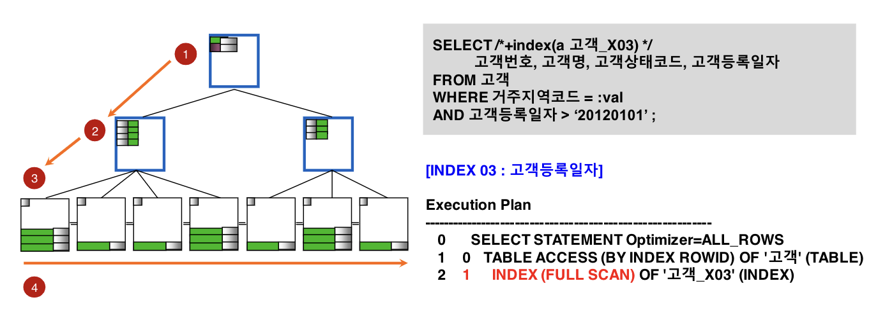 

  - 다 탐색하는거

- Index Fast Full Scan

  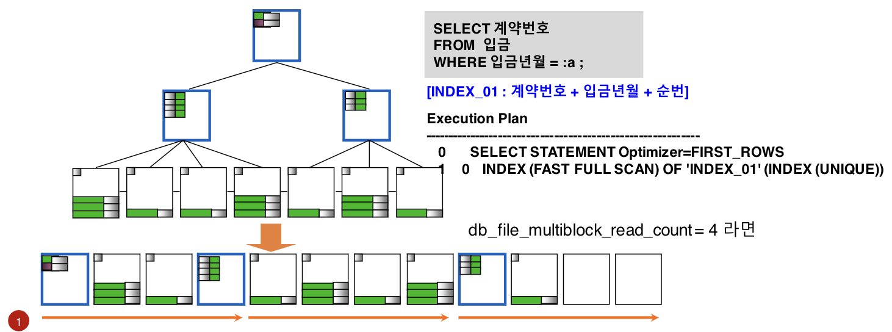 

  - mysql에서는 지원하지 않음.
  - Multi thread로 데이터를 읽는 것
  - 완성된 데이터 모음이 정렬되어있지 않을 수 있다.

  

  ##### Full scan vs. fast Full scan

  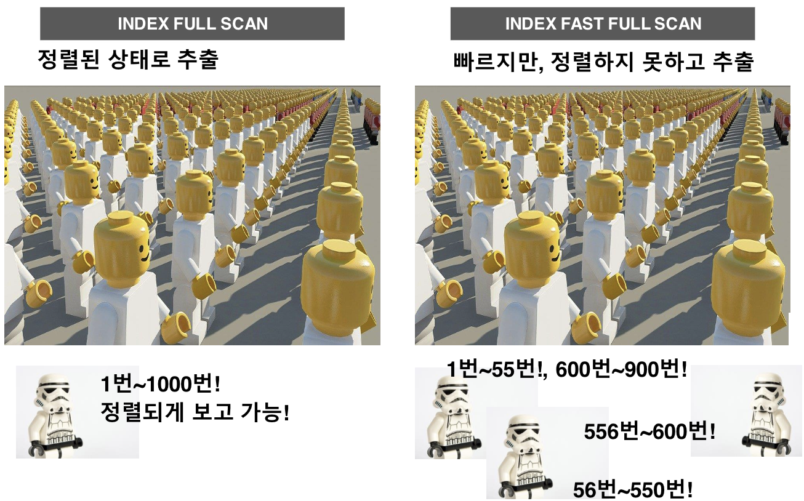 

### IOT (Index Organized Table)

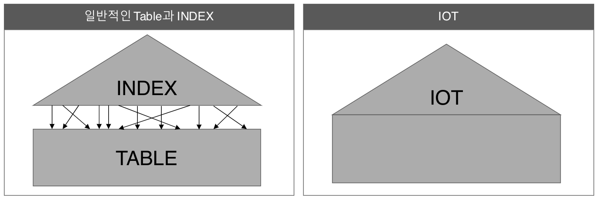

- IOT는 Index와 table이 합쳐진거: Oracle 등에서의 default
- MySQL의 innodb는 Default로 PK 기준 Cluster Table로 구성한다.
- IOT에서는 index leaf block이 곧 data block.
- 통계성 테이블 같이 PK 칼럼이 많고, 추가 칼럼은 적은 경우 적합하다.
- PK 이외 칼럼이 많으면, 데이터 입력시 성능 저하를 가져올 수 있다.
- INDEX 와 Table 이 합쳐졌기 때문에 INDEX 를 통한 테이블 Random 액세스 부하가 해소된다.

