# Join Tuning

1. Join 이란?
2. NL (Nested Loop) 조인
3. NL (Nested Loop) 조인 최적화
4. SM (Sort Merge) 조인
5. Hash 조인


Join을 잘 이해하기 위해서는 Index 과정에 대해서 잘 이해해야한다.

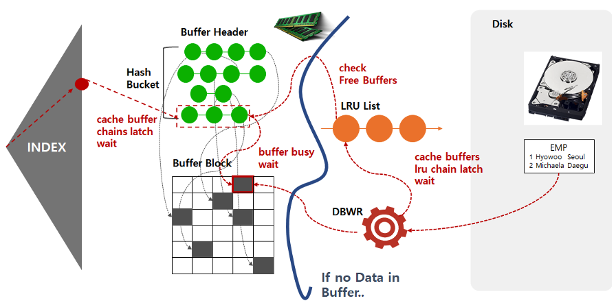

- Index 구조를 잘 이해하고, 실제 데이터 값을 찾기위한 과정을 이해하자
- Latch 를 통한 Atomic 보장 [cache buffer chain latch wait 이벤트]
- Buffer Block 에 대해서 잘 이해하자. 
  - Atomic 보장을 위한 Lock [Buffer Busy wait]
- LRU algorithm을 이해하자
  - LRU cacheing [자주 사용하는 데이터가 Buffer Block에 올라간다]

- 각 step 에서 병목현상이 어디서 일어나는지를 알아야한다.

- Disk에서 **Buffer Pool**에 데이터를 가져오는 **Index Scan의 Single Block I/O**와 **Table Full Scan의 Multiblock I/O 에 **대해서 이해하자.

  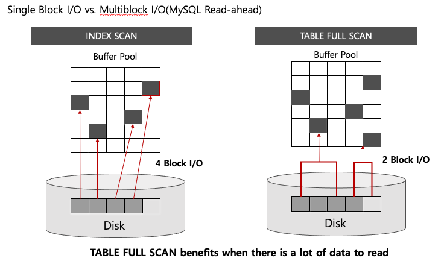


### Join 이란?

- 특정 조건에 맞는 데이터를 연결하는 것
- Good Join과 Bad Join 간에 따라 부하의 차이가 크다

- 관계형 데이터베이스 (RDBMS)의 핵심 기능
- 새로운 데이터 활용
- 데이터 관리의 효율성이 올라갈 수 있다.

##### Oracle & MsSQL

- NL Join
- Sort Merge Join
- Hash Join

##### MySQL

- NL Join
- Hash Join (MySQL 8.0 이상)


보통 우리가 99% NL join 을 사용할 것. Hash Join이 약 1%.. sort merge join은 거의 사용하지 않을 것이다.


### NL (Nested Loop) 조인

- NL 조인은 프로그램에서 사용되는 중첩된 반복문과 유사한 방식으로 조인을 수행한다.
- 반복문의 **외부에** 있는 테이블을 <u>Driving Table, Leading Table, Outer Table</u> 이라고 하고, 반복문 **내부에** 있는 테이블을 <u>Driven Table, Inner Table</u> 이라고 한다.


실제 데이터베이스에서 Nested loop Join은, 프로그래밍의 반복문과 비슷하다

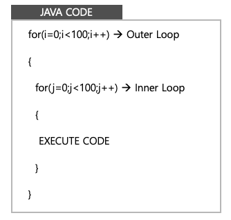 

- 두 테이블을 합친다 생각해보자, outer loop와 inner loop를 돌리며 일치하는걸 추가하는 방법이 있을 수 있다.


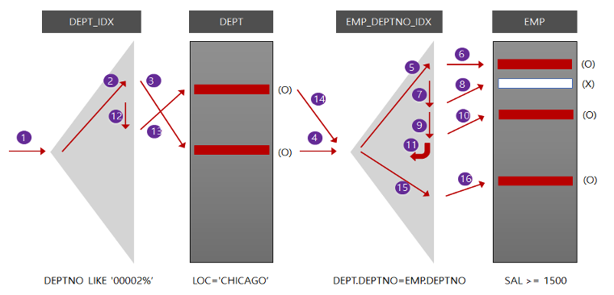

NL 조인은 실제로 **Index**를 통한 결합을 한다.

- 하나의 record씩 순차적으로 진행한다
- 그렇기에 Index 구성 전략이 중요하다.
- 소량의 데이터 혹은 부분범위 처리에서 온라인 트랜잭션 환경에 적합하다.


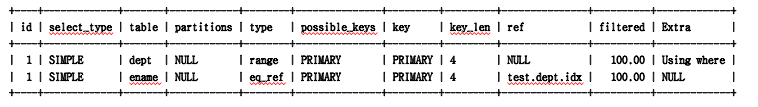

MySQL에서 위와같은 실행계획 [execution plan]이 있다 하자.

Dept table을 range scan으로 index를 통해 읽고 그 다음 ename table을 eq_ref scan로 index를 읽어서 수행한다.

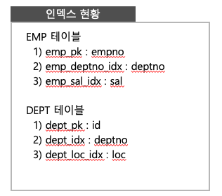 

```mysql
SELECT e.empno, e.ename, d.dname, e.job, e.sal
FROM emp e, dept, d
WHERE e.deptno = d.deptno
AND d.loc = 'CHICAGO'
AND d.deptno like '000002%'
AND e.sal >= 1500
ORDER BY sal desc
```


#### NL 조인 수행 과정

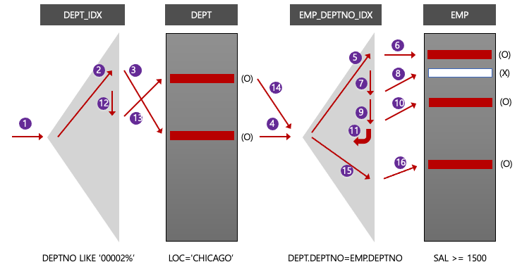 

- 조건에 맞는 데이터를 찾기 위해 index 의 root 에 들어간다 (1)
- 조건을 찾으면 테이블에 바로 방문해서 LOC = 'CHICAGO' 를 찾는다. (2~3)
  - 조건을 찾았으면 Join을 진행합니다 [Outer Loop에서 조건을 찾았으니 Inner Join을 들어간다 생각하자] (4)
- EMP_DEPTNO_IDX에 Index의 root에 접근하여 원하는 데이터를 찾는다. (5)
  - 원하는 데이터를 찾으면 테이블을 방문하러 간다. 여기서 SAL >= 1500인지 확인한다 (6)
  - 원하는 데이터를 찾았으면 Inner loop를 완료하기 위해 Index에서 수평탐색을 진행한다 (7)
  - (6) ~ (7)의 반복을 일치하지 않는 값이 나올 때 까지 반복한다 (11)
- 다음 DEPT_IDX로 돌아와 수평담색으로 일치하는 값을 찾는다 (12 ~ 13)
- 테이블에 방문한 뒤 해당 값을 이용해 EMP_DEPT_NO_IDX에 방문한다 (14)

#### 한 RECORD 씩 순차적으로 진행된다.

- 단 ORDER BY 와 같은 전체 집합 대상의 정렬 작업은, 모두 완료가 된 다음 Operation이 진행된다.


### NL (Nested Loop) 조인 최적화

두 테이블을 NL join을 진행하는데, 테이블 방문 **순서에** 따라 성능이 달라질까 ?

- 처리 순서가 다르다고 결과가 달라지지는 않는다. 다만 **성능에는 차이가 생긴다.**

왜 순서에 따라 성능에 차이가 날까 ? [빨라지거나, 느려지거나]

- 중첩 반복문 이기 때문에 생기는 issue.

  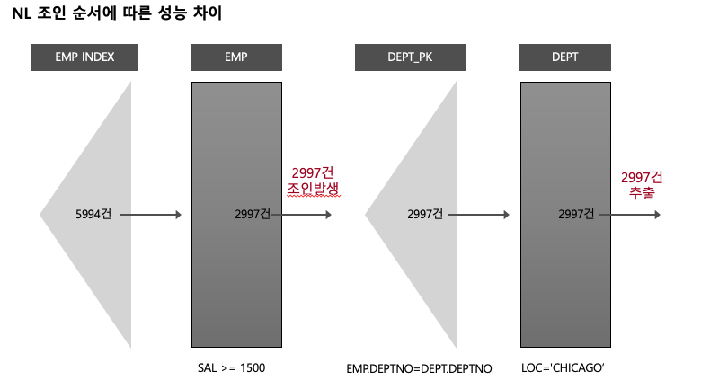 

  예를들어, EMP table을 먼저 방문해서 연봉이 1500 이상인 사람을 찾아보니, 2997건이 발견되었다.

  각 Record를 한 번씩 Dept에 방문해야한다. 총 2997건의 결과가 나왔지만, join 방문 횟수가 2997번이 나온다.

  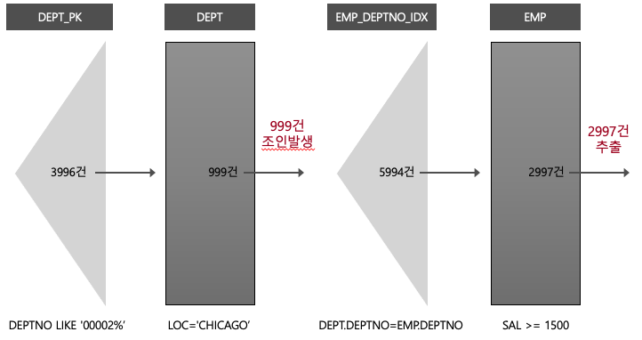 

  이번에는 DEPT 테이블을 먼저 방문해서 LOC = 'CHICAGO' 조건에 맞는 값이 999건이다.

  즉 999번의 JOIN이 발생하였고, 최종적으로 같은결과인 2997건이 추출되었다.

  **즉 순서에 따라 조인 발생 횟수에 차이가 있어 성능에도 차이가 생길 수 있다.**


그렇다면 두 테이블의 경우 조인 순서 방식을 어떻게 정할까?

- **대부분의 경우, 필터링되는 데이터가 적은 테이블에 먼저 방문하는게 성능에 좋다**

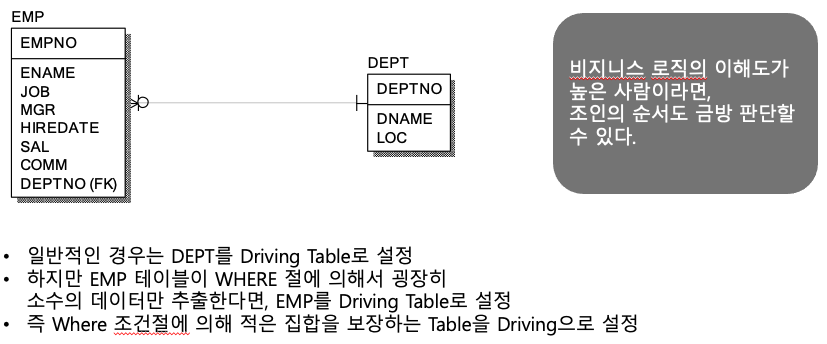

- Where 조건에 따라 적은 결과 [집합]을 보장하는 Table을 Driving Table [Outer Table]로 설정한다.


### 정리

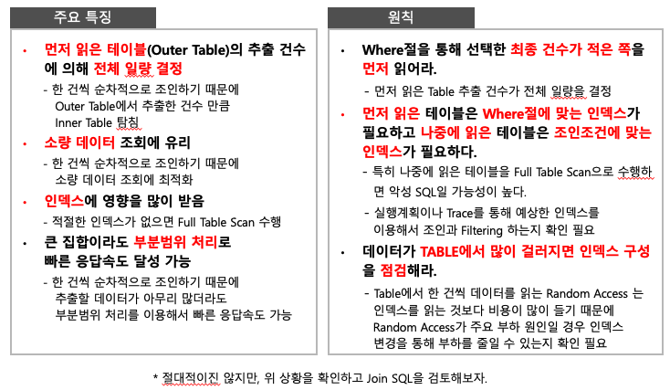


## SM (Sort Merge) 조인

NL 조인은 <u>한 건</u> 씩 처리한다. **그렇기에 대량 집합 조인 시 부적절하다.**

- Loop 이며, Index를 이용하기에 그렇다.

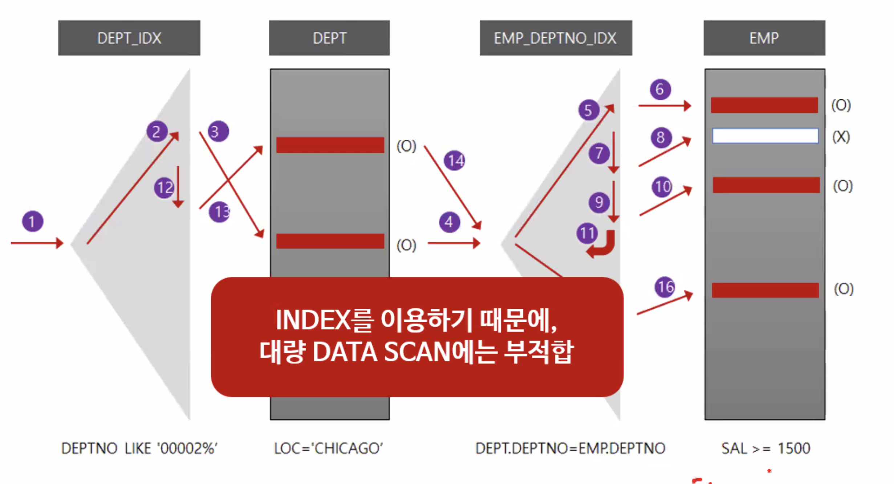

#### Merge 조인 특징

- 조인하는 양쪽 집합에 인덱스가 없을 경우 NL join 보다 조인 성능이 좋다.
- 대량 데이터 집합 조인 시 주로 사용한다.
- '=' 조건이 아니어도 조인이 가능 !
- 다만 Sort를 하는 오버헤드가 존재한다.

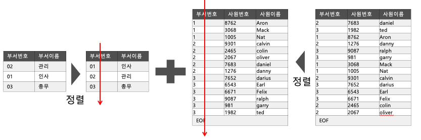

Sort Merge Join은 Table Full scan을 기반하기 때문에 Multi Block I/O 로 동작한다.

조인하고자 하는 테이블들을 정렬을 한 뒤 합친다. **정렬에 대한 오버헤드는 존재.**

#### 수행

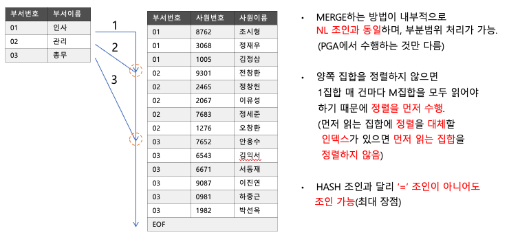

1. 양쪽 집합을 Join Key로 정렬한다 (정렬한 집합은 로컬 메모리 영역을 사용한다.)
2. 양쪽 집합을 Merge 한다
   - Merge 방식은 내부적으로 NL Join과 동일하다. **인덱스와 정렬의 차이**


인덱스를 사용하지 않기 때문에, 대용량 데이터에는 적합하다.

- 만약 SM join 으로도 터지면 ? --> Hash Join
  - Hash Join 으로도 터지면..??
    - 울며 겨자먹기로 DB Partitioning 진행한다.. MySQL 도 5.7 부터 지원함


## Hash Join

Sort Merge Join은 정렬이 불가피하기에, 대용량 데이터에서 정렬이 오래 걸리는 경우 부적절하다.

즉, Hash join은 **정렬에 대한 오버해드가 없는 조인이다 !**


Hash Join 의 Background

- 대량 집합 조인을 위해 Sort Merge Join이 개발됐다
  - Sort Merge Join은 양쪽 집합을 정렬하는 부하가 있기에, 조인 하는 집합이 크면 **정렬 자체가 부하이다.**
- 그렇기에 **정렬 부하를 업앤 Hash Join이 탄생**
- <u>**단, '=' 조건만으로 조인이 가능하다.**</u>


#### Hash Join 동작 원리

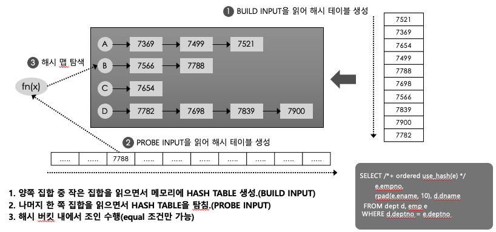

1. Build input을 읽어서 **Hash Table을 만든다.** [Table Full Scan 방식, Multiblock I/O]

   - 즉, 대량 데이터를 가장 빠른 방법으로 읽는다. Hash 적용하는 오버해드는 크지 않다.

2. 나머지 Join 하고자 하는 집합을 읽으면서 Hash Function에 넣어 해시 맵을 탐색한다.

   - 이 역시 Table Full scan

   - 즉, 정렬이 필요 없다 !!

3. Hash Map [Hash bucket]내에서 일치하는 값을 찾으면 결합한다 (즉 조인을 수행한다).

<u>**Hash Join은 Distinct value가 많은 경우 성능이 좋지 않다.**</u>

- Why ? **Hash 충돌이 많이 일어나면, 한 번에 찾아가지 못 하기 때문에 !!**


Hash Join에서 Build Input [hash map 생성 테이블]은 **<u>작은 집합을 써야한다</u>**

- 양이 많아지면 hash 충돌 가능성이 많아진다.
- 큰 쪽의 순차 탐색을 줄이는게 이득이다.
- **Hash Table의 크기가 중요하다.**
  - Hash Area는 Memory 에 올리고 Disk 경유가 적은게 효율적이다 !
  - 그렇기에 작은 테이블을 활용하는게 이득이다.

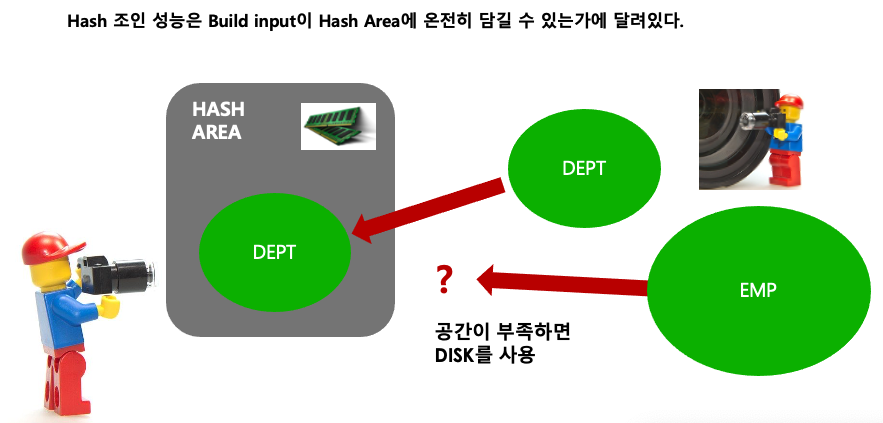 


#### 여러 테이블 [대형 시스템에서] Hash Join 활용법

1. 첫 번째 방법

   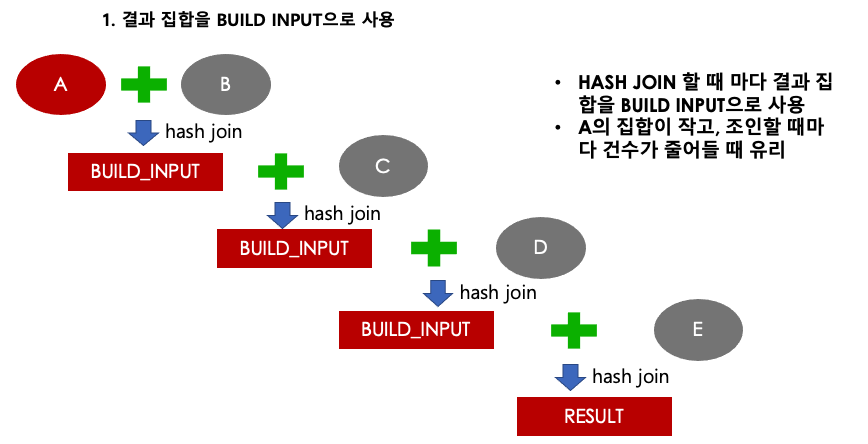

   - 결과 집합을 순차적으로 Build Input으로 넣어 완성시킨다


2. 두 번째 방법

   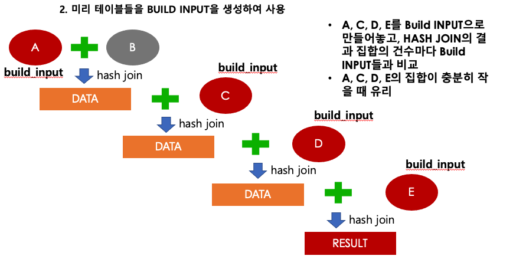

   - 미리 테이블들을 Build Input으로 생성하여 사용한다
     - 이 방법은 집합이 충분히 작을 때 유리하다 !


### Hash Join Points!

- **대량 집합**을 Sort Merge Join 방식으로 조인할 때 생기는 **정렬 부하를 줄이기 위해 등장**
- **"="** 조건으로만 조인이 가능하다
- Where 조건으로 걸러낸 후 **크기가 작은 집합**을 **Build Input**으로 쓰는게 성능이 좋다.
- CPU 와 Memory 사용량이 높다. [**Local Memory를 사용한다**]
  - 과도한 Hash Join은 시스템의 전반적인 성능을 악화시킨다 !
    - 해당 SQL을 HASH JOIN으로 빨리 처리를 하고 시스템을 안정화를 시킬지 vs. 아니면 CPU와 메모리 리소스를 아끼기 위해서 HASH JOIN을 피할지


