# Sort Tuning

이전 내용을 정리해보자.

> User가 원하는 데이터를 찾기 위해 **memory** 에서 찾아본다. 원하는 데이터가 memory에 없다면 **disk**에 접근해서 가져온다.
>
> 데이터가 이동되는 단위는 Patch area를 조정할 수 있다 [물론 많은경우 default 를 사용할 것]. 
>
> 데이터베이스 성능이 훌룡할수록 Disk 에 접근하는 횟수를 줄이는게 중요하다.
>
> 물리적으로 Page 혹은 Block이라는 단위로 데이터를 저장하고 처리된다 (즉, 처리 단위가 Page/Block 이고 MySQL은 16Kb).
>
> 데이터를 Disk 에서 가져올때는 row 단위로 가져오는게 아닌, page 단위로 덩어리 째 가져온다.
>
> Buffer Memory 에 적합한 Page 단위를 쓰는것도 중요하다 (mysql default = 16kb).
>
> Index 를 이용하여 탐색
>
> - Root를 통해 keyword를 탐색한다.
> - 인덱스를 통해 찾고자 하는건 **데이터의 시작 위치**이다.
> - 그 다음 DB에 접근을 하고, 수평탐색을 진행한다.
> - 인덱스를 찾아가는 과정은 복잡하고, 생각보다 overhead가 크다 (즉, 고비용이다).
>   - 대부분의 데이터를 찾는 경우, 테이블 전체를 스캔하는게 index를 통한것 보다 빠르다.
> - Table Random Access 수를 줄이는게 중요하다 !
>   - Table Random access 회수와, 실제 데이터 결과 수가 다르다.
>
> 결합 인덱스
>
> - 선두 컬럼이 중요하다. 
> - 똑같은 컬럼 여러개로 만들어져도 결과는 같지만, 성능이 다르다.
>   - ex) (지역, 나이) 와 (나이, 지역) 은 같은 결과를 얻어낼 수 있지만, 성능상으로 지역을 먼저 탐색하는게 filtering에 있어서 더 빠를 수 있다.
>
> 
>
> 질문) 매우 큰 (ex. 1000GB) 짜리 데이터 테이블에서 필요한 데이터를 가져와야할 때 라인에서는 어떻게 처리할까? 인덱스를 사용할까?
>
> - 샤딩을 사용한다. 물론 더 비싼 서버를 사용할 수도 있지만, scale-out 을 한다.
> - 데이터베이스를 분할하여 처리한다.
> - MySQL에서는 샤딩을 데이터베이스 레벨에서 지원해주지 않는다.
>
> 질문) Sort Merge Join 과 Hash Join, NL 조인은 언제 쓰는게 좋을까?
>
> 1. NL join은 대부분의 사용자가 호출하는 sql은 NL join을 이용해서 처리한다.
> 2. Sort Merge Join과 Hash Join **대량의 데이터**를 NL join으로 처리할 수 없을때 사용한다.
>    - Hash join이 좀더 선호되는데, 정렬에 대한 부담이 없다.
>    - 단 hash bucket에서 충돌이 너무 많이 일어나면 성능적으로 좋지 않다.
>    - 또한 hash join은 '=' 외에는 사용할 수 없다. 즉 다른 비교를 통한 join은 결국 sort merge join을 해야한다.
> 3. Application level에서 잘 처리를 해서, 한 번에 너무 많은 데이터를 요청하지 않도록 해야한다. 
>    - 즉, 사용자의 요청에는 NL join을 사용하도록 유도해야 한다. (paging 처리 등이 이러한 방법)


### 정렬 (Sort) 원리

정렬을 왜 해야할까?

- 수행 과정에서 CPU와 메모리를 많이 사용하고, 데이터량이 많을 때는 Disk I/O까지 일으킨다.
- 우리가 정렬된 데이터를 원한다면 당연하게 정렬 과정이 필요하지만, 데이터베이스 내부적으로도 **어느 위치에 있는가**를 찾기위한 정렬 프로세스가 존재한다.

정렬이 왜 힘들까?

- Memory와 CPU를 사용한다.

- 정렬 공간은 모두가 공유하는 Global Memory area가 아닌, **Session Memory [local memory]** 에 존재한다 !

  - 공유해서 쓰면 이득일지, 나 혼자 쓰면 이득일지를 생각했을 때, 정렬된 데이터를 다른 곳 에서 사용될 가능성이 낮다 !
  - 측 데이터 추출 후 바로 폐기된다.
  - MySQL의 경우, Buffer Pool을 줄이고 Sort Buffer의 크기를 키우기도 한다.
    - connection이 많지 않고, 통계적인거를 많이 쓰는경우
    - 소수의 connection이 대량의 데이터를 쓰는 경우

  - Session memory 는 많은 부분이 동적으로 메모리 할당이 가능하다.

    - ```mysql
      set SESSION sort_buffer_size = 40960;
      set GLOBAL sort_buffer_size = 40960;
      ```

    - 필요한경우 메모리를 더 키워서 할당할 수 있다. 위는 접속한 session의 sort buffer size만 키운경우. 모든 session에 원한다면 GLOBAL로 명령해주면된다. 

    - 부족한경우 Disk를 통한 sort를 진행하는데, 매우 드라마틱하게 **느려진 속도를 경험할 수 있다.**
      - Disk의 **<u>Temp Segment</u>** 에서 진행된다.


#### 부분 범위 처리

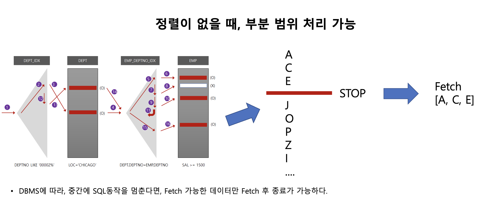

**원하는 데이터 개수가 정해져 있고, 정렬이 필요없을 때**, NL join을 통해 데이터를 가져온다고 예를 들어보자. 그렇다면 끝까지 sql문 처리를 완료하지 않고, 부분범위 처리로 결과를 리턴해줄 수 있다. 


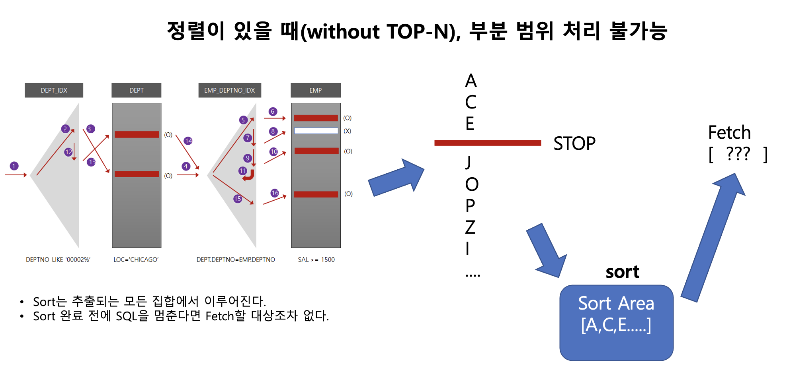


- **만약 ORDER BY 등 정렬에 대한 조건이 있다면**, 원하는 데이터 개수가 정해져 있어도 결국 모든 데이터를 다 검사해야한다.

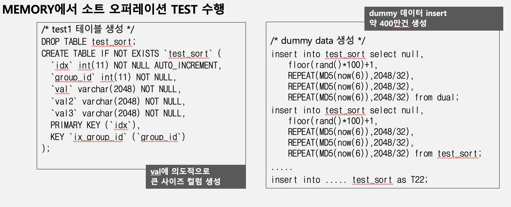

- dummy data 400만건 넣기

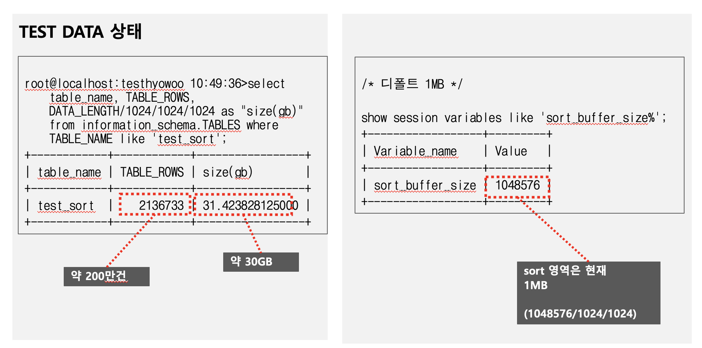

- 실제로 400만개의 데이터를 넣었지만, 200만건이라고 나온다 왜 그럴까?
  - 통계자료는 실제로 table full scan으로 데이터 개수를 탐색하지 않는다.
  - 실제로는, **샘플링**으로 통계치를 낸다. Page마다 약 몇 개의 row data가 있는지를 확인하고 통계치를 낸다.
    - 만약 완벽하게 일치하는 값을 보고 싶다면 이 역시 큰 overhead를 DB에서 부담할 것..
  - 다만 size같은 경우는 물리적인 수치이기 때문에 비교적 정확하다.
  - 이러한 샘플링 기법을 사용하기 때문에**, Optimization이 완벽하다 할 수 없다.**

Sort_merge_passes: disk 상에서 정렬 작업이 일어난 횟수.


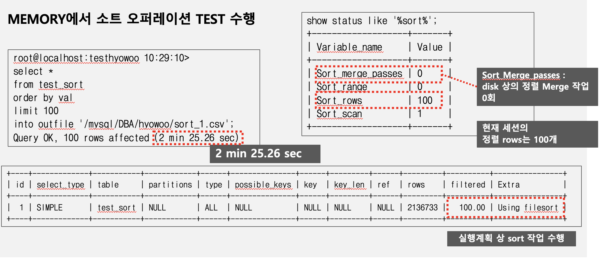

- 100개의 데이터만을 필요로 하지만, 무료 2분 25초의 시간이 소요되었다.
- sort_scan 1회에 100개의 row가 정렬되었고, disk에서 수행한적은 없다.
  - 400만개의 데이터를 정렬해서 가져오는데 매우 오랜 시간이 걸린걸 알 수 있다.

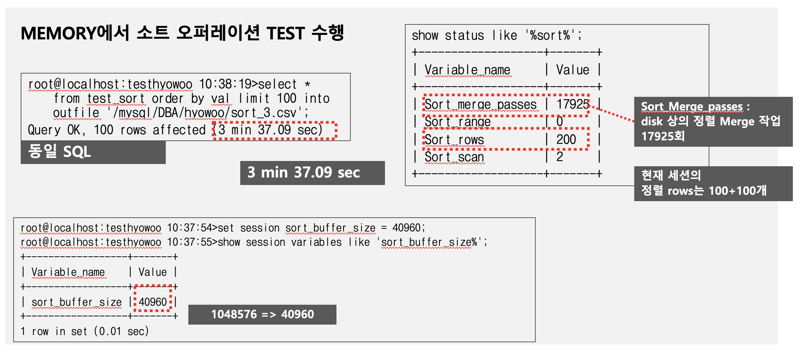


#### Sort_buffer_size에 따른 Sort 수행 속도

- sort_buffer_size를 무작정 늘려도 특정 임계치 이상으로 커도 정렬 속도가 크게 개선되지는 않는다 
  - MySQL에서 정렬을 위한 sort buffer로 보내는 chunk \단위와 정렬에 대한 chunk 단위에는 한계가 있기 때문
- Memory는 유한 resource. 대량 정렬을 위한 서비스가 아닌 이상 정렬에 필요한 **buffer는 우선순위가 높지 않다**.
  - 즉 , 16MB까지 키울 필요 없다. 대부분 default로 두는게 좋으며 경우에 따라 2MB 까지 높히는 경우가 있긴하다.
  - 예를들어, 100건만 정렬을 해야하는데 buffer size가 커진다고 속도가 빨라지지는 않는다.
- sort_buffer_size는 local memory 영역이므로 세션의 개수에 따라 과도한 메모리 할당이 생겨서 시스템 전반적으로 문제를 야기할 수 있음.

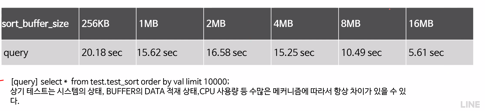 

- 예시.. 물론 완벽하게 맞지는 않지만.. 10000개의 대량 데이터를 조작하기에 buffer size가 영향을 주었다고 볼 수 있다.

  


### Index를 통한 데이터 정렬

- 같은 양의 데이터를 훨씬 빠르게 끝낸다 왜 그럴까?

  - 정렬된 데이터를 select 해서 그대로 가져왔기 때문이다.
  - order by idx인데 index가 있는 컬럼으로 정렬되었다.

  - index를 읽기만 했는데 2초가 걸리기도 한다.
    - index가 생각보다 고비용이라는것
  - 만약 10만건이 있는 테이블이라면, 오히려 table full scan이 예상 2~4배 정도 빠를 수 있다.


### Sort 튜닝

Sort를 발생시키는 오퍼레이션들

- Sort Order By 수행시
- Group By 
  - 데이터를 어디에 위치해 있는지를 알기 위해서는 정렬 (sort)가 제일 낫다. 즉 sort operation으로 그룹핑을 한다
  - **Oracle의 경우 hash group by 는 정렬작업을 하지 않는다.**
- Union 과 같은 연산자 사용시
  - 1번 sql, 2번 sql을 합칠 때 양쪽 집합을 sort해서 비교한다.
- Distinct 연산 사용시
  - 중복제거를 위해, sort 사용

- in 서브쿼리 사용시
- Sort merge join 수행시


#### Hash Group by vs. Sort Group By

- Hash group by는 group by를 위해 hash 함수를 이용해서 같은 hash에 대한 group by로 **정렬을 보장하지 않는다.**
  - 정렬된 값을 원한다면 결국 order by가 필요하다.
- sort Group by는 group by를 위해 해당 값을 정렬하면서 같은 값을 group by한다.
  - 정렬을 보장하는게 아닌, group by위한 record를 정렬한다.
  - order by가 없다면 실제 정렬이 없다. 다만 sort 로직을 빌려쓸 뿐이다.


Oracle에서 그럼 order by된 값을 갖고싶다면? 

- Hash group by를 한 다음 sort ?
- 또는 애초에 sort group by ?
- 뭐가 더 빠른지는 모른다 ! 어떠한 프로세스가 더 overhead가 많냐를 비교해야한다.


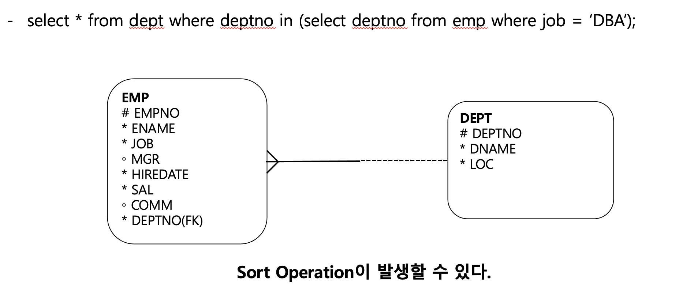

1. in sub query를 풀어서 변수를 담아놓고 outer query에 대응시키기.
   - 왜 sort가 발생될까?
     - **중복 제거를 위해서**
     - 변수를 똑같은 값이 있으면 중복 제거가 필요하다.


#### 가장 현실적인 Tuning - Sort를 피하기 위한 SQL 작성

- Index 튜닝 !

Sort Order By가 생기면 해당 Keyword에 대한 인덱스를 생성한다. - 즉, **sort process**가 없어진다. 그냥 인덱스를 읽으면 되니까

<u>특히 order by + limit n 처리의 경우</u> Index를 활용하여 sort process를 없애는게 매우 빠르다.

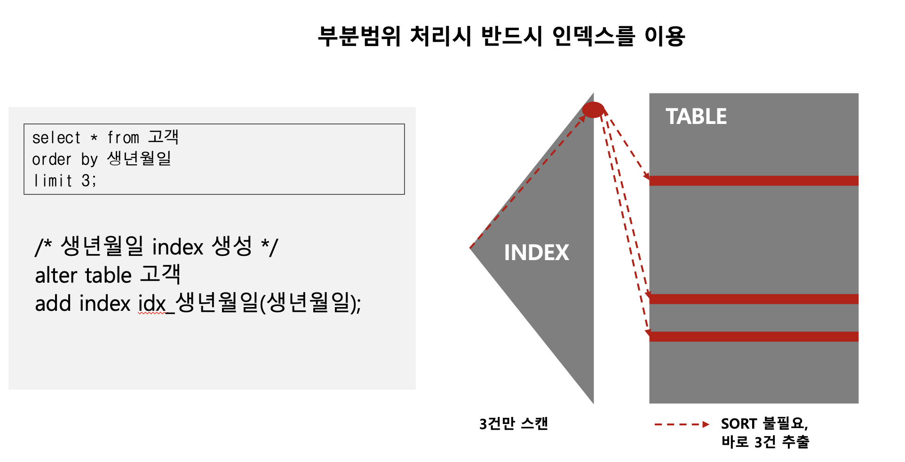

애초에 인덱스 존재 자체가, 부분범위 처리에 유리하기에, 위 사진과 같이 order by [즉 sort], limit 이 있다면, index를 활용하는게 매우 빠르다.

- 이 경우 index 생년월일에 들어가 3 개만 읽으면 된다.


### 정렬이 불가피한 경우

- 많은 방법이 있겠지만, **메모리를 적게 쓰는 방법을 모색하자.**

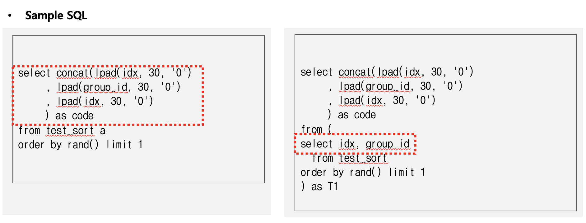

- rand()으로 정렬을 한다는건 <u>인덱스로 해소할 수 없다.</u>
- 오른쪽이 결론적으로 tuning 된 방법 (해소 방법).
- 앞은 일련의 데이터 집합에서 추출된걸 결합했는데, 오른쪽은 필요한 소스를 한 건을 가져온다음 결합을 했다.
  - 즉 결합된 상태에서 정렬한것과, 분리된 상태에서의 정렬
  - 왼쪽이 3 배의 sort 영역을 더 차지한다.
  - 정렬 공간을 훨씬 조금 사용한다.
- 정렬이 불가피하다면 **sort area에 대한 효율성을 생각해보자.**


#### 문제들


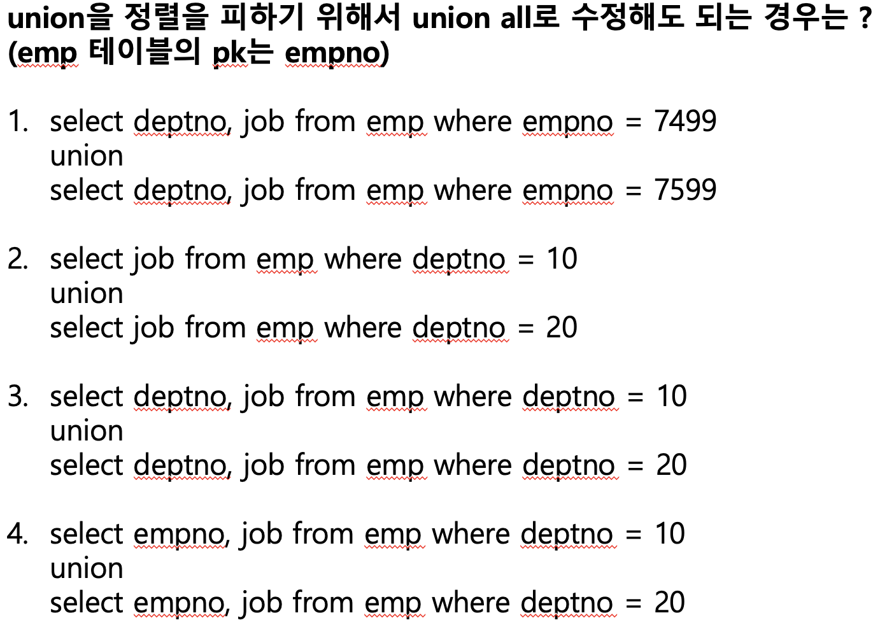 

- 해설

  > 1번의 경우 부서가 있고 부서번호가 pk이지만, 부서번호와 직업이 같다면 중복이 발생한다. 그렇기에 union all로 하기에는 risk 가 있다.
  >
  > 2번의 경우 부서가 다르더라고 직업이 같으면 중복발생 가능성이 있다. union all로 바꾸면 위험하다.
  >
  > 3번의 경우 두 sql의 값이 다르다. 분기하는 deptno 자체가 =로 매핑되어서 중복 데이터가 생길 수 없다. 그러나, deptno = 10 이면서 직업이 같은 데이터들이 중복이 발생할 수 있다. **union 명령은 모든 중복을 제거하기에**, 즉 각 sql에 대한 중복도 제거한다. 즉 본인 스스로의 데이터도 배타적인지 확인이 필요하다.
  >
  > 4번의 경우 중복 발생 가능성이 제일 낮다. pk인 empno 를 가져오기에 pk 특성상 가져오는 row에 중복이 발생할 수 없다. 그러나 라인이라 생각해보자. **겸직을 한다면 어떻게 될까?** 내가 deptno=10 이면서 deptno=20이라면 중복이 발생할 수 있다.
  >
  > 즉 모든 부분을 바꿀 수 있지만, 또 바꿀 수 없다.. 디테일하게 잘 봐야한다.


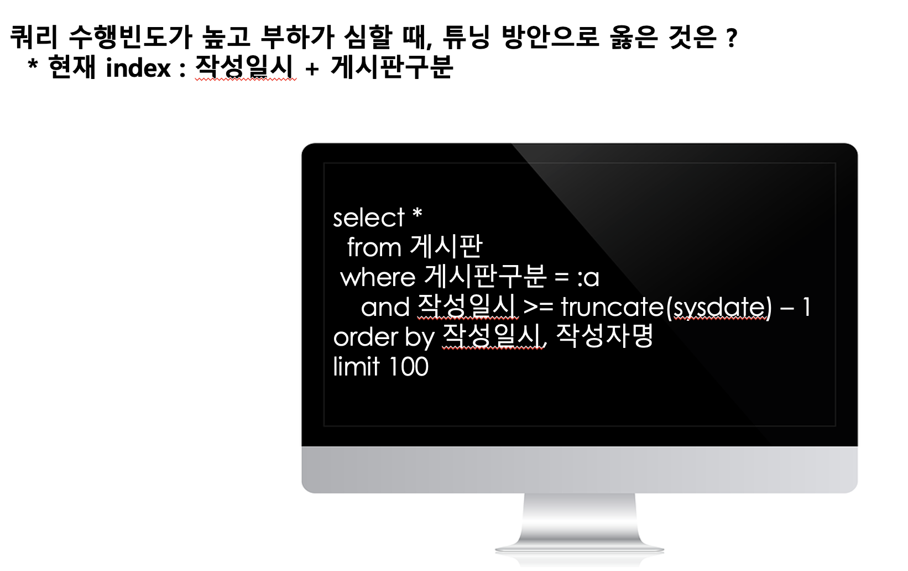 

- **꿀팁: **

1. 인덱스를 [작성일지 + 작성자 명]으로 만든다. 추가로 게시판 구분 (총 3개의 결합 인덱스로) 만들면 성능이 올라간다.

2. Order By에 작성자 명이 빠진다면? 어짜피 결과는 같을 것.. 사람 이름순이 중요합니까 ?? 하면서 따진다.. (강사님이 하신 말씀)
   - 작성 일시 만으로 정렬이 되어있어도 되지않느냐고 물어본다.


