## Git Branch - [8주차]

Git branch 개념을 사용하여 버전 관리를 보다 효율적으로 할 수 있다. 개발자들이 기능별로 작업을 할 수 있고 작업물들을 합칠 수 있다.

- Git Branch는 무엇인가. 왜 필요할까?
  - Branch, Merge
- Creating Branch
- Checking Branch Information
- Merging Branches
- Managing Branches 

### What is Branch in Git?

- Branch는 Git 뿐만아니라, 모든 버전관리 시스템 (version control system)에서 사용된다. 나뭇가지 라는 뜻이다
- 나뭇가지와 같이 개발시에도 여러 갈래로 퍼지는 변경사항의 흐름을 가리킨다.
- Why do we need branch?
  - 제대로 동작하는 main 코드는 놔두고, 다른 기능을 추가하는 코드를 새롭게 작성할 수 있다.
  - Branch를 사용하면 main 개발자는 main을 담당, 다른 개발자가 오류가 발생하는 feature 1에 작업을 할 수 있다.
  - Feature 1에서 오류수정이 끝나면 main code로 Merge 할 수 있다
- Git 으로 버전 관리를 시작하면 기본적으로 **master** 브랜치로 시작한다. 즉, master branch는 최신 커밋이다.
  - branch 를 최신 commit을 가리키는 pointer라고 할 수 있다.
- Git Branch의 두 가지 기능
  - Branch: Master branch에서 새로운 branch를 생성하는 명령어
    - 독립적으로 개발이 가능한 라인을 의미한다.
    - 보라색 feature 1 branch에서 오류수정 작업을 할 수 있다.
    - 서로 독립적이기에 영향을 끼치지 않는다
  - Merge: 독립적인 branch에서 작업을 완료하였다면 master 브랜치로 합처야한다.
    - 독립적은 branch를 다시 master branch로 합치는것을 merge라고 한다.

#### 실습:

- $git log를 통해 **HEAD -> Master** 현재 브랜치가 Master임을 확인할 수 있다. 

- **HEAD** 는 여러 branch 중 현재 작업하는 branch를 가리키는 포인터 역할을 한다.

- **$ git branch** 명령어를 통해 현재 git repository내에 어떤 branch가 존재하는지 확인할 수 있다. 

  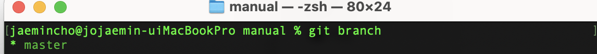 

- **$ git branch \<branch 명>** 을 이용하여 새로운 branch를 생성한다

  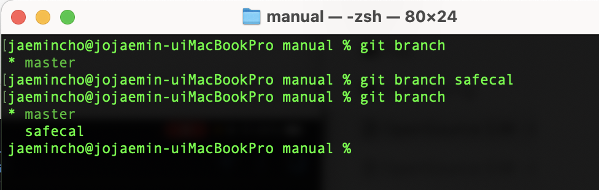 

- $ git checkout <브랜치 명> 을 이용해 branch를 이동할 수 있다.

- 최초 생성된 branch는 master branch의 최신 commit version을 갖고있다.

**Navigating Between Branches**

- **$git log --oneline** 옵션을 사용하여 log 정보를 한 줄씩 확인할 수있다. 한 줄이라 한다면, 각 commit 기록들의 branch와 commit message

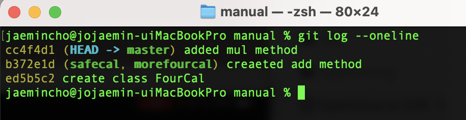 

여기서 보면 알 수 있듯이, [master, safecal, morefourcal] branch가 존재한다. 이때 master branch는 현재 added mul method commit 버전을 갖고있으며, safecal, morefourcal branch들은 created add method 버전을 갖고있다.

또한 **HEAD --> **를 통해 현재 branch는 master임을 알 수 있다. 

- Switching Branch ! **$ git checkout \<branch 명>**

  - $ git checkout safecal: 기존 master branch에서 safecal branch로 이동한다.

  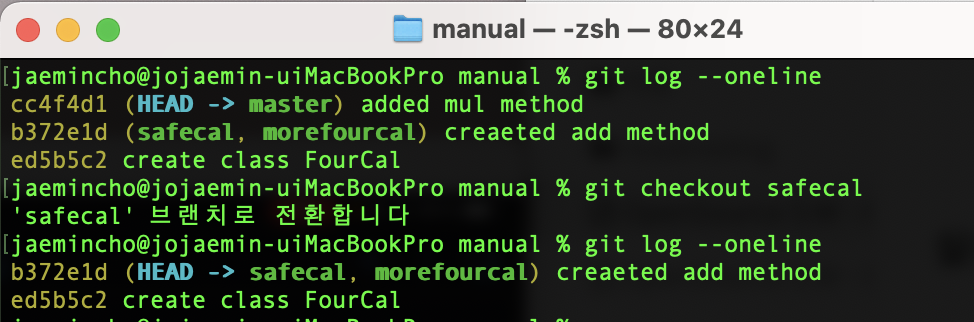 

  -  git checkout safecal로 이동하며, 기존의 HEAD -> 가 safecal을 가리키고 있다.

**새로운 branch에서 commit을 할 경우 어떤 변화가 생길까** - Commit in a new Branch

- 현재 safecal branch에서 작업을 하고있다고 해보자.

- 새로운 파일을 만들고 safecal 브랜치에서 commit을 하였다.

- 아까 보다시피, master 브랜치 내역이 사라지고 이전 버전이라 할 수 있는 safecal, morefourcal 브랜치만 확인하였는데, **모든 브랜치의 내역을 확인하고 싶다면**

  - **$ git log --oneline --branches**
  - 명령어를 사용한다.

  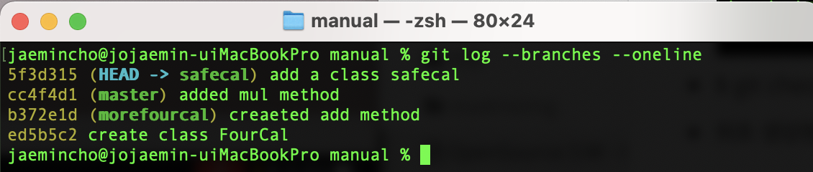 

  - 모든 branch의 commit을 확인 할 수 있다.
  - 현재 HEAD 는 safecal을 가리키고 있으며, master branch의 최신 커밋은 created add method를 가리킨다
  - 또한 safecal branch에서의 수정사항도 master branch에 영향을 미치지 않았다는것을 알 수 있다.

- Branch와 commit 내역을 시각적으로 확인하고 싶다면?

  - **$ git log --oneline --branches --graph** 명령어를 사용한다.

    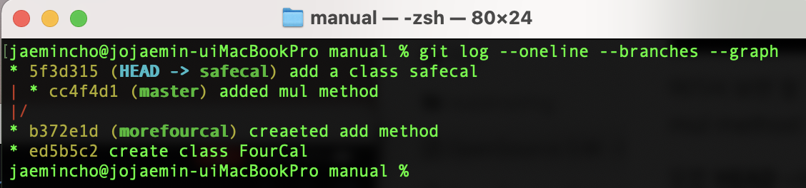 

  - Safecal branch와 master branch간에 **|, |/**  표기사 나오는것을 볼 수 있다.

  - |은 add a class safecal의 **부모 commit이** created add method라는것을 의미한다.

    - 즉 created add method 다음에 add a class safecal이 생성됐다는것을 의미한다.

  - |/ 은 added mul method의 부모 commit이 created add method 라는것을 의미한다.

  - **즉 master branch, safecal branch의 부모 method가 모두 created add method 임을 의미하지만, 그 이후 branch마다 master는 added mul method, safecal은 add a class safecal이 됐다는것을 그래프적으로 의미하는 것이다.**

**Branch 사이의 차이점을 알아보는 방법**

- branch가 점점 많아지면, 각 branch 들 간의 commit의 차이점을 알기가 어렵다.

- **$ git log \<branch 1>..\<branch 2>** 명령어를 사용한다 [ .. 을 중간에 넣는다]

  - ex) $ git log master..safecal

    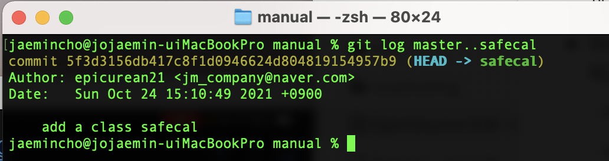 

  - master..safecal 명령어로, **master branch에는 없고 safecal branch에만 있는 내용을 보여준다.**

  - ex) $ git log safecal..master

  - safecal..master 명령어로, safecal branch에는 없고 master branch에만 있는 내용을 보여준다.

## Merging Branches

각각 branch에서의 독립적인 작업물을 **병합 [merge]**하는 방법을 알아보자

어느 시점에서 각 branch의 작업을 마무리하고 **master branch에 합치는 작업을 merge, 병합이라고 한다**

Branch Merge과정에는 여러가지 상황이 발생할 수 있는데, 각 상황에서 어떻게 Merge가 되는지 알아보자.

#### 예시로 함께 보자 - Simple Merge

1. cal.py 파일을 만들고, staging 한다음 commit한다. 현재 branch는 master이다. HEAD -> master

   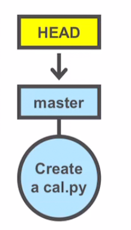 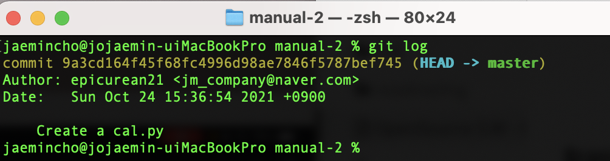 

2. 새로운 branch인 sub를 만들어보자

   - $ git branch sub

     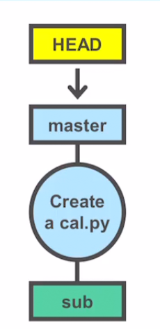 

   - 아직까지는 HEAD->master

   - 현재 상태에서 cal.py를 수정해보자. div method를 추가하고 저장.

3. Staging과 commit을 진행해보자.

   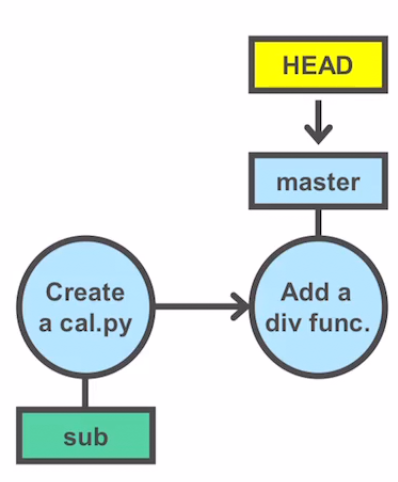   

   - HEAD -> master로 'add a div func.' 버전을 가리키며, sub branch는 create a cal.py commit을 최신 commit으로 갖고있다.

4. checkout 명령어로 sub branch로 이동해보자.

   - $git checkout sub

     - sub branch는 div method가 추가되지 전의 commit 상태를 버전으로 갖고있다.

   - 이 상태에서 print_add.py를 만들고, staging 한 다음 commit 해보자.

     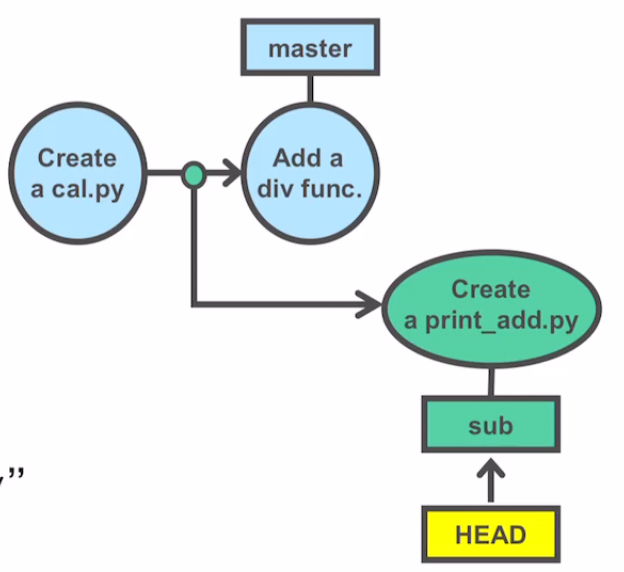 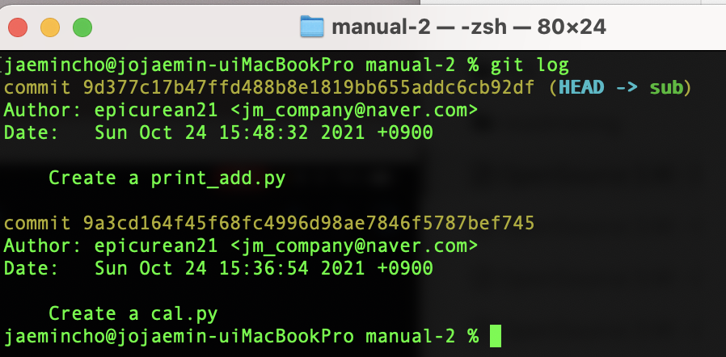 

   - checkout을 통해 **HEAD->sub** 로 변경됐다.
   - master의 수정 내용과 sub의 수정 내용은 서로 독립적이다

5. $git log --oneline --branches --graph 명령어로 상태를 확인해보자

   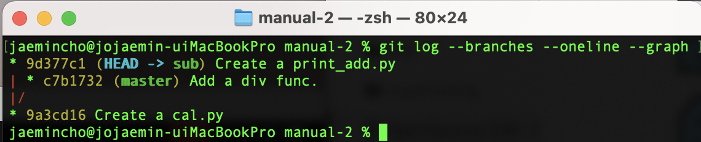 

   - Sub branch의 "create a print_add.py" commit과 master branch의 "Add a div func." commit 모두 create a cal.py를 부모 commit으로 두고 있음을 알 수 있다.
   - 차이점은, Add a div func.는 master branch, create a print_add.py는 sub branch에서 만들어졌다.

6. **sub branch의 작업내용과 master branch의 작업 내용을 병합, Merge해보자** 

   - **주의할 점은 merge 기능은 master branch에서만 할 수 있다.**

   - merge branch로 옮기자. git checkout master

   - **$git merge sub**

     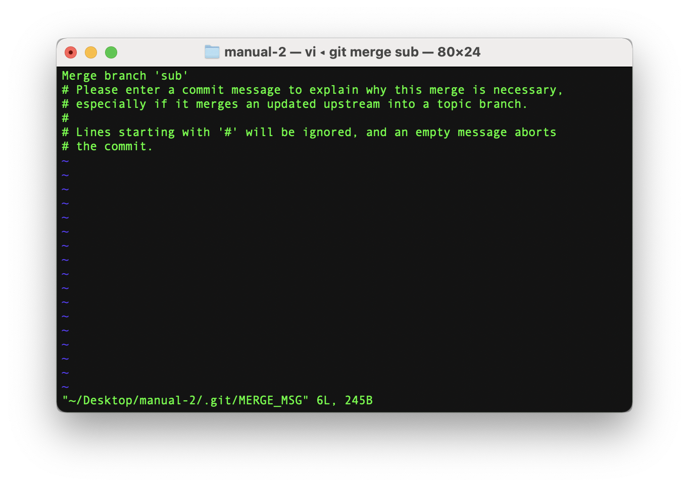 

     vim editor가 나타난다.

     branch merge를 하면서 만들어지는 commit message이다.

     그대로 저장해도 된다.

     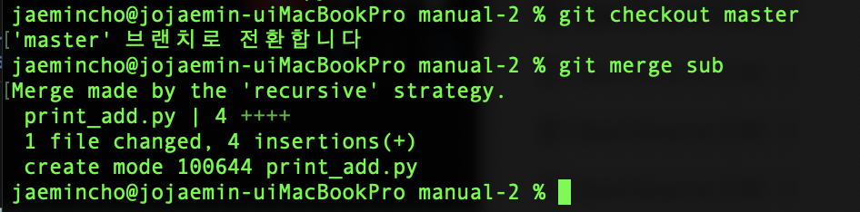 

     wq로 종료하면 다음과 같이 'merge branch sub' commit 내역이 저장된다.

     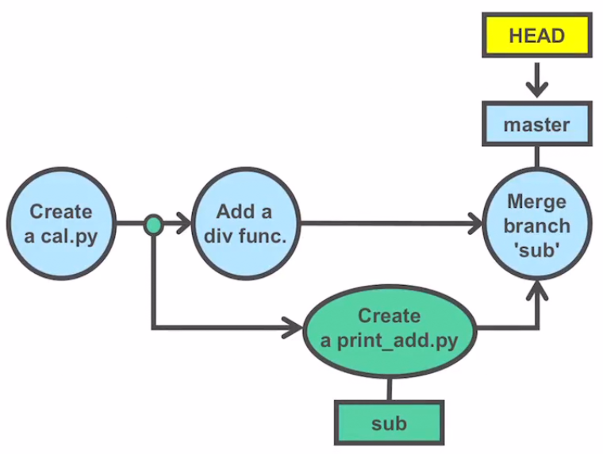 

     

     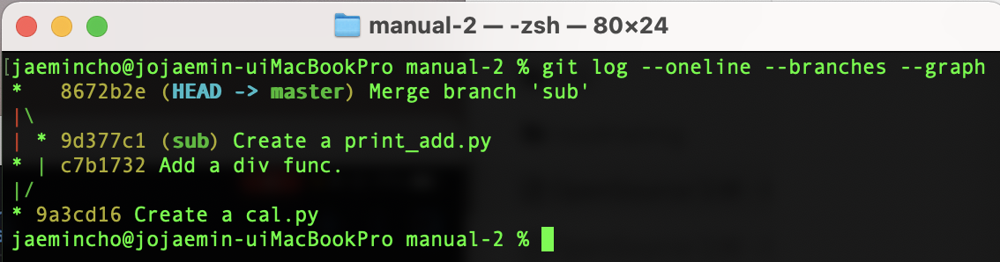 

     "Merge branch 'sub'" 라는 commit이 생성되며, 이는 Add a div func. commit과 create a print_add.py 와 병합된 결과임을 보인다.

### Scenario 2. 같은 code에 다른 위치를 수정할 경우의 Merge

1. Master branch에서 cal.py 파일을 만들고, staging, commit 해보자.

2. sub branch를 생성한다 - $git branch sub

3. add method에 master branch에서 작성을 해보자. 그리고 staging, commit한다

   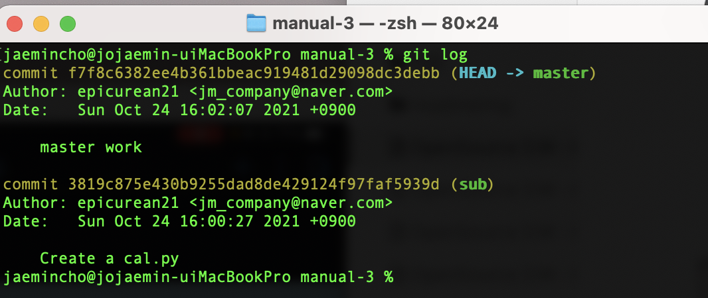 

4. Sub method로 checkout 한다. $git checkout sub

   - 그리고 sub branch에서 sub method를 수정 작업해보자. **즉 현재 cal.py 파일에서 add method는 master branch에서, sub method는 sub branch에서 작업하는것이다.**

     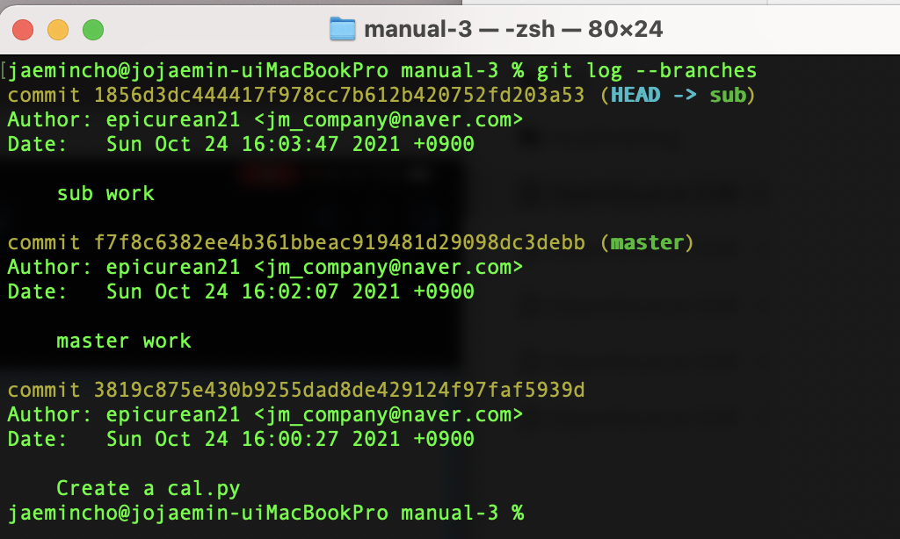 

5. Merge하기 위해 master branch로 이동해서 merge를 해보자

   - $git checkout master

   - $git merge sub

   - vim editor가 나타난다.

     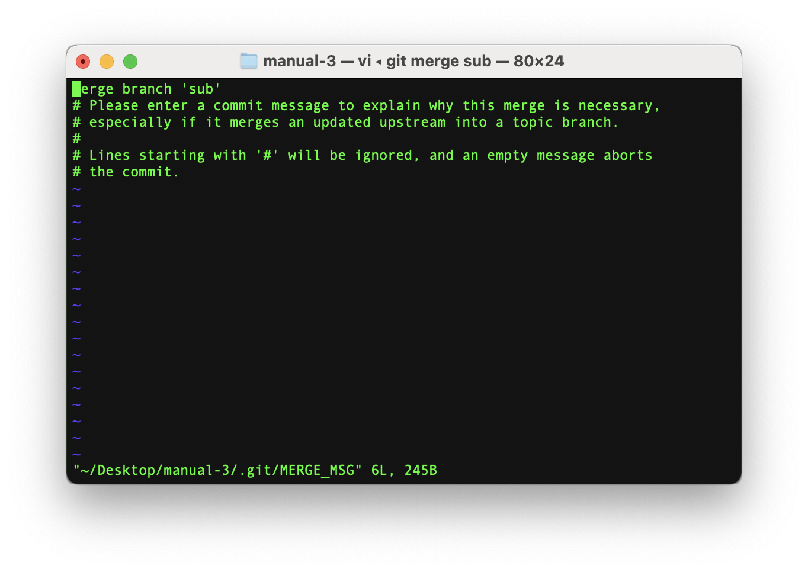 

     Merge commit message를 작성하고 종료 저장해보자.

     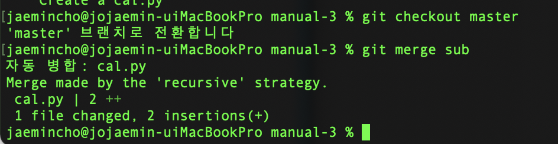 

     **[auto merge] = 자동 병합 cal.py** 라는 문구가 나온다.

     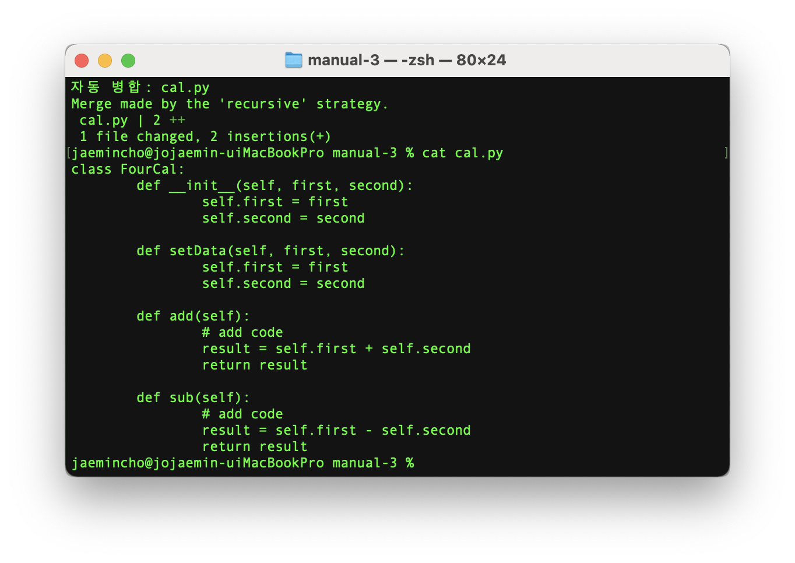 

     Merge 이후 cal.py 파일을 확인해 보면, master 부분에서 작업한 add method와 sub branch에서 작업한 sub method가 모두 합쳐져있다.

**즉, git에서는 동일한 파일/코드에 서로 다른 부분을 수정해서 합치면, 자동으로 코드들을 합쳐준다.**

### Scenario 3. 같은 코드에 같은 부분을 수정하고 Merge하기

- Same location in the same code

1. master branch에서 cal.py 파일을 생성하고 staging commit, sub branch를 생성하자.

2. Master branch에서는 cal.py에 add method를 추가하고 staging, commit을 하자.  "master work"

3. Sub branch로 이동하여 cal.py에 sub method를 추가하고 staging, commit을 하자. "sub work"

   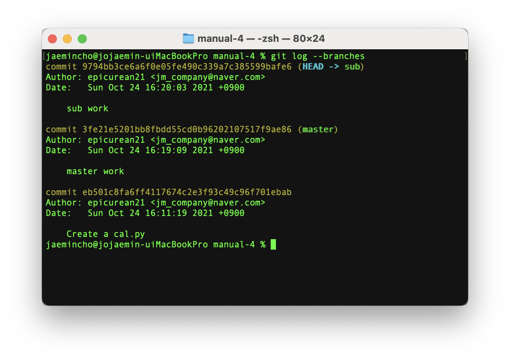 

4. Master branch에서 add method 작성부분과, sub branch에서 sub method 작성 위치가 같다.

   - master 에서는 add
   - sub 에서는 sub

5. Merge위해 master branch로 checkout 하고 merge 해보자.

   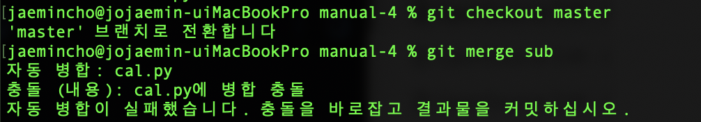 

   - vim editor가 실행되지 않고, conflict가 발생한다.
   - Auto-merging (자동 병합)이 안된다.

6. vim cal.py로 master branch와 sub branch의 충돌이 발생한 파일을 확인해보자

   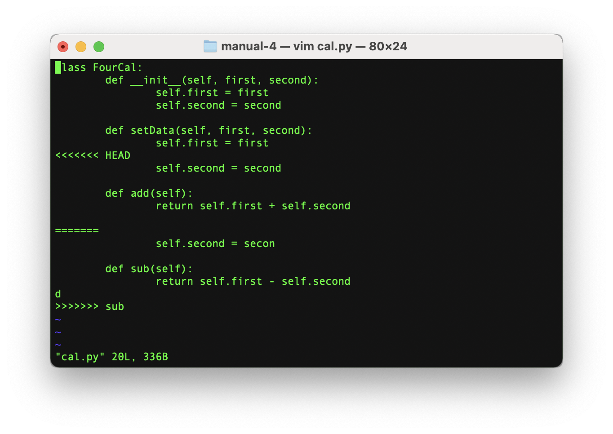 

   - ======를 사이에 두고, HEAD 즉 현재 branch인 master에서 수정한 부분과 sub branch에서 수정한 부분으로 나뉜걸 알 수 있다.

   - 어떤 branch에서 어떤 부분을 수정했는지 알 수 있는것이다.

   - 수정내용을 우리가 원하는대로 바꾸고 저장을 하고 staging 과 commit을 진행한다. 

     - 이때 commit message에 merge했다는것을 해주는것이 좋다.

     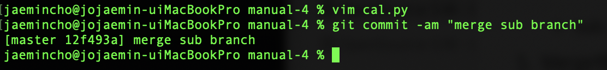 

      

7. 최종적으로 git log --oneline --branches --graph로 확인해보면

   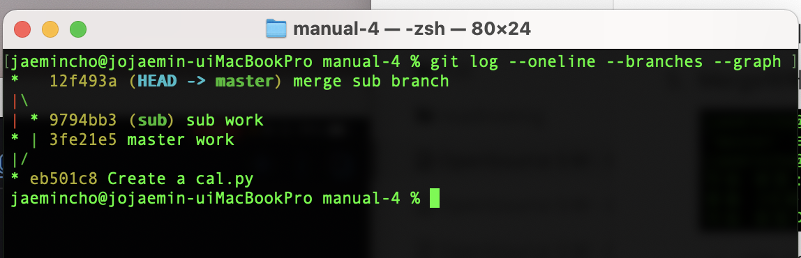 

**Git에서는 서로 다른 branch에서 같은 소스코드에 같은 위치에 수정이 있어도 merge가 가능하다. **

**서로 다른 위치였다면 auto-merge 자동 병합이 가능하지만, 같은 위치라면 한번 더 확인하고 코드를 수정하고 병합을 할 수 있다. 즉 auto-merging 이 되지않고 conflict를 해결하고 merge를 할 수 있다. **

### 사용하지 않는 branch 삭제

병합을 한 뒤 더이상 사용하지않는 branch, 불필요한 branch는 삭제하는게 좋다

1. branch list 확인하기

   - $ git branch

     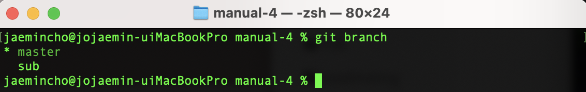 

   - master와 sub branch가 존재한다

2. **branch 삭제는 master branch에서만 가능하다**

   - master branch가 HEAD가 아니라면 우선 checkout 해야한다.

3. **$ git branch -d \<branch name>**  명령어로 삭제할 수 있다.

   - ex) $ git branch -d sub

     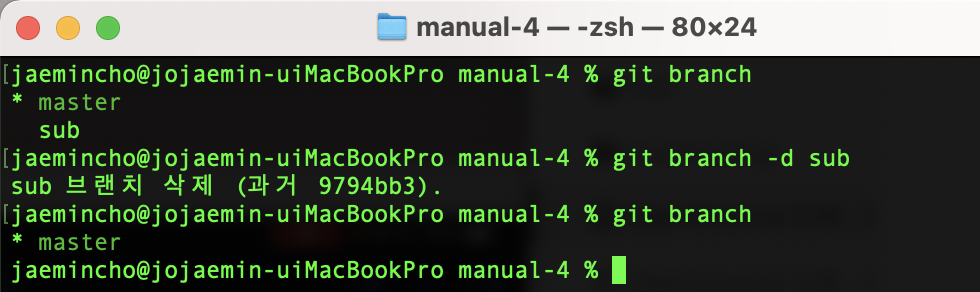 

4. sub branch를 삭제하지만 기록을 갖고있다. 즉 실제로는 완전히 삭제된게 아니다

   - 다시 **sub branch를 생성하면 예전 작업내용이 그대로 나타난다**
   - git branch -d는 branch를 repository에서 완전히 삭제하는게 아닌 **감추는 것**

### Branch 관리

**Checkout & Reset 명령어를 branch 개념과 함께 사용한다.**

1. master branch에서 cal.py 를 생성하고, staging, commit 을 한다 "Create a cal.py"

2. mul branch를 만든다 - $git branch mul

3. master branch에서 print_sub.py를 생성하고 staging, commit한다 "Create a print_sub.py"

   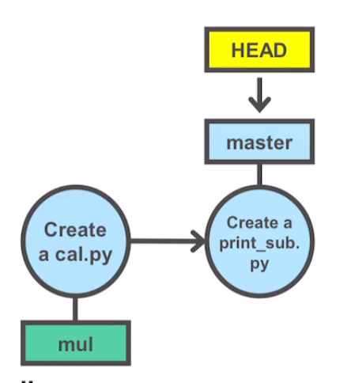 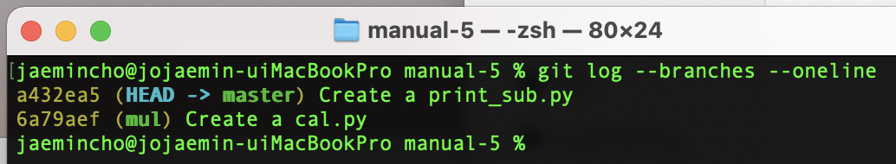 

4. mul branch로 checkout하고, print_mul.py 파일을 생성하고 staging, commit한다

   - print_mul.py에는 아직 cal.py에서 선언되지않은 mul method를 사용하도록 돼있다.

     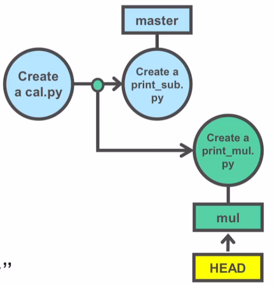 

     - 현재 HEAD는 mul branch를 가리키며, mul branch는 "Create a print_mul.py" commit을 최신커밋으로 갖고있다.

   - $ git log --oneline --branches

     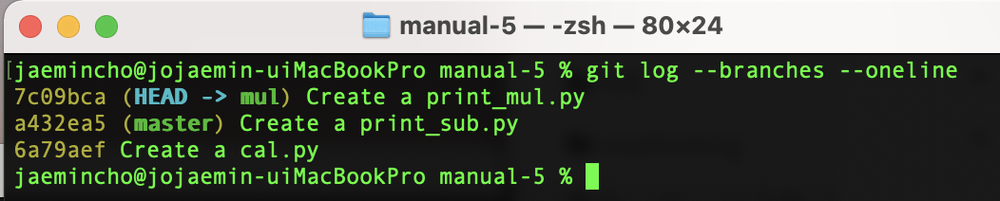 

   - **mul branch의 최신 commit은 제대로 작동하지 않는 코드이다. mul method가 아직 정의돼있지 않다. **
   - <u>이를 되돌려줘 보자</u>
   - **되돌아가는 commit hash**가 필요하다. master branch의 commit hash를 복사하자 [a432ea5]

5. **$ git reset \<commit hash>**  값을 입력하여 원하는 commit version으로 돌아가자

   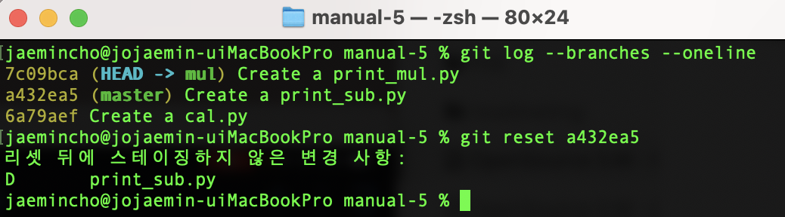 

   해당 commit 에서 생성된 print_mul은 삭제가 되고, print_sub.py 파일로 되돌아간다.

6. Git log로 확읺해보자. 현재는 **commit만 되돌려지고, HEAD는 되돌아가지 않았다.**

   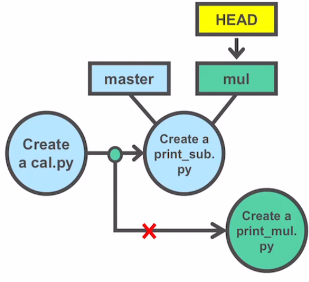 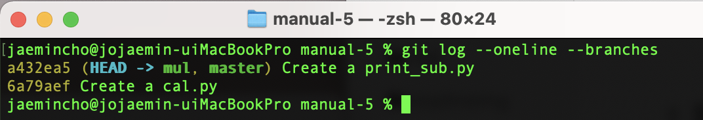 

   - HEAD는 아직 mul이지만, "create a.print_mul.py" commit 내역은 삭제가 되고 reset 명령어로 commit version으로 되돌아갔다.

### 수정중인 작업을 감추는 방법

아직 commit을 원하지 않는 수정된 파일이 있는데, 다른 파일의 수정 사항을 commit 해야하는경우 사용한다.

1. master branch에서 cal.py 를 생성하고, staging, commit 을 한다 "Create a cal.py"

2. cal.py에 mul method를 추가하고 저장해보자.

   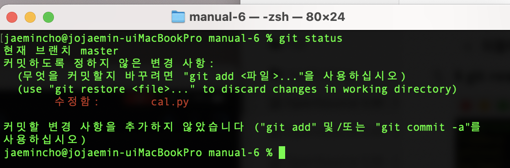 

   - git status를 통해 확인해보면 cal.py 가 modified [수정됨] 상태임을 알 수 있다.

3. 방금 수정된 이런 상태를 감추고 어딘가 보관해두기 위한 명령어로

   **$ git stash** 명령어를 사용한다.

   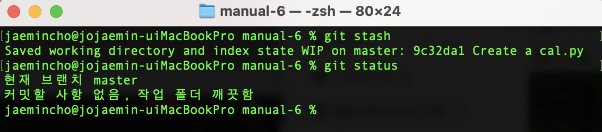 

   > **git stash 란?**
   >
   > 아직 마무리하지 않은 작업을 스택에 잠시 저장할 수 있도록 하는 명령어이다. 이를 통해 아직 완료하지 않은 일을 commit하지 않고 나중에 다시 꺼내와 마무리할 수 있다.

**git stash 명령어는 modified를 삭제한게아닌, 작업을 감추고 따로 보관하도록 하는것이다**

보관된 파일은 

$ git stash list 로 확인할 수 있다.

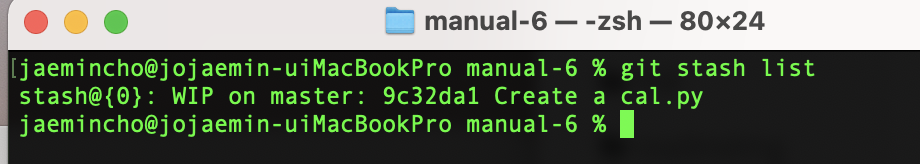 

- 가장 최근에 보관된 파일이 stash@{0} 에 담긴다
- 순서대로 stash@{0}, stash@{1}, ... 이렇게 된다. 0이 가장 최근..
- **stash stack 이라고 표현한다.**

**감춰진 파일을 되돌리기 위해 git stash pop을 사용한다**

$ git stash pop

 

가장 최근에 stash 한 파일들을 pop 한다 = stash@{0}

