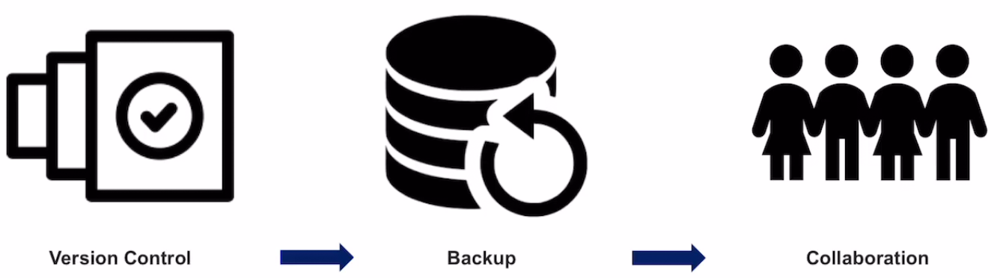
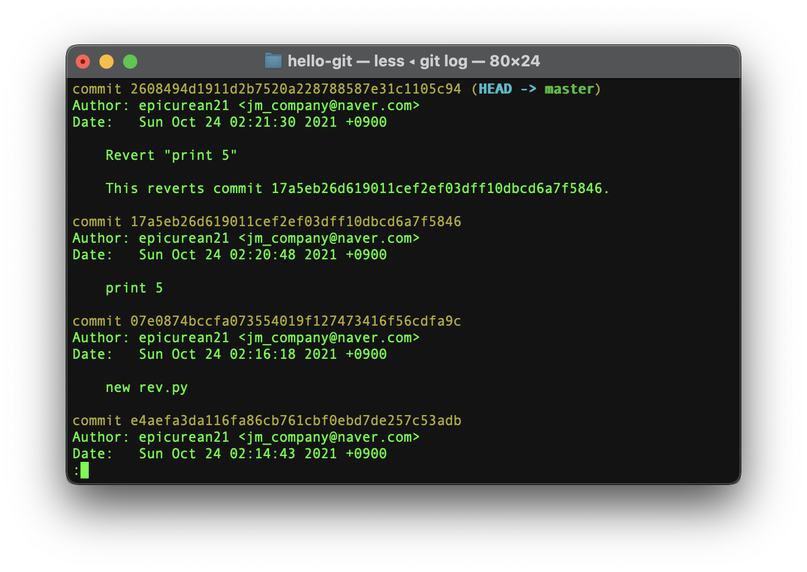

### Introduction to Git - [7 주차]

****

- What is Git ?
- Git vs GitHub
- What can we do with Git ?
- Git Programs
- Installing Git
- Basic Linux Commands

### What is Git ?

- Git 은 Open Source로 제공이되는 **분산형 버전관리 시스템이다**
  - Linux 개발자로 유명한 Linus Torvalds에 의해 2005년 개발됐다.
  - 초창기에는 Linux Source code를 관리하기 위해 개발됐지만, 지금은 많은 프로젝트에서 사용된다
- **문서나 파일 혹은 소스코드를 효과적으로 관리하기 위해 사용된다.**
- Git을 세상에 소개하면서, "지옥에서 온 관리자" - "The Information Manager from Hell" 이라고 했다.
  - 지옥과같은 개발환경을 개선하기 위해 개발됐음

### Git vs Github

**Git**

- 로컬 시스템에 설치하는 <u>소프트웨어 이다</u>
- 명령어 기반의 command-line 인터페이스
- \* Git은 **로컬에서 관리되는 Version 관리 시스템.** 로컬상에서 소스코드 수정에 따른 버전을 관리한다.

**Github**

- 웹 상에 호스팅 된 <u>Web 서비스 이다</u>
- 웹 페이지 상의 GUI가 존재한다.
- \* GitHub은 **Git Repository를 위한 Hosting Service이다**. Respository는 저장소이다. 
  - 개별적으로 Git을 통해 Source code를 수정하면 변경된 코드와 변경이력이 Repository에 저장된다.
- 협업을 위한 Online Repository [Remote Repository - 원격 레포지토리 ]를 지원한다.

> 로컬 Repository에서 소스코드를 수정하여 자신의 작업물을 GitHub에 업로드하면, Github을 통해 다른 사람이 해당 작업 내역과 파일을 자신의 로컬 레포지토리로 가져올 수 있고, 또 자신이 작업한 것을 Github에 올리면서 협업이 가능해진다.

### What Can we do with git ?

- **Git의 3가지 기능** 

    

  1. **Version Control**: 버전 관리

     - 초안 Ver 0.1을 만들고 수정이 생기면서 Ver 0.2 , Ver 0.3 등을 만들어 나간다.

     - 이때 계속해서 파일 수정때마다 파일을 새롭게 만들어서 저장해나가면 **문제가 생긴다.**

       1. 수정 후 파일명만 바꿔서 저장했기에, <u>무엇이 변경되었는지 확인하기 어렵다</u>

       2. 다수의 파일을 관리하게된다면, 한거번에 수정이 된다면 관리가 어렵고 비효율적이다.
          - 10개읠 파일이 있는데 한 번 작업할때 10개 파일이 모두 수정된다면 10개 파일을 모두 새롭게 저장해야한다.

     - Git은 버전 관리가 가능하다

       - 누가, 언제, 어떤 내용을 수정했는지 구체적으로 체크가 가능하다.
       - 개발완료 전 까지 계속해서 변경되는 소스코드를 관리하기 편리하다.

  2. BackUp: 백업

     - Data Back-up의 중요성!
       - 컴퓨터가 언제 고장날지 알 수 없다. 수시로 데이터 백업이 필요하다.
       - 주로 물리적 장치 (HDD, SDD)를 이용하거나 Cloud Service등을 이용한다
       - Git 또한 영구적으로 저장되는것이 아니기에 백업이 필요하기에, 원격 Repository가 존재하며, 이것이 GitHub이다.
       - Github에 저장되면 로컬 Git 파일들이 날라가도 GitHub를 통해 복구가 가능하다.

  3. Collaboration: 협업 

     - GitHub과 함께 사용하며, 여러 개발자가 함께 협업이 가능한 환경을 제공한다.
     - 한 사용자가 코드 작업을 하고 원격 레포지토리 GitHub에 올리면 다른 개발자가 해당 Repository에서 코드를 내려받아 작업이 가능하다.
     - 또한 오류가 발견했을 때 오류 식별이 쉽게 가능하다.
       - 누가 언제 어떤부분을 수정했는지를 표시해준다
     - 또한 Git은 협업시 발생하는 여러 문제점을 해결하는 기능이 존재한다
       - 두 사람이 동시에 같은 파일, 같은 부분을 수정한다면? 누군가 덮어쓰면 문제가 발생한다
       - Git은 경고를 알려준다

### Git Programs

- **Git Client Program** 이라고 부른다
- 대표적으로 GitHub Desktop, TortoiseGit, SourceTree가 있으며
- 리눅스 명령어를 통해 Git을 관리하는 CLI 가 존재한다. [Command Line Interface]

1. **GitHub Desktop**
   - Github에서 제공하는 Git Program.
   - GUI를 제공한다
   - 장점: 쉽게 배울 수 있으며, 사용할 수 있다.
   - 단점: 기본적인 기능위주로 개발되어서 Git의 고급기능을 사용하기 힘들다
2. **TortoiseGit**
   - Windows 전용 Git program
   - 장점: 사용하기 편리함. Context menu를 제공
   - 단점: 다른 OS에서 사용이 불가하며, 기능과 안정성이 떨어진다
3. **SourceTree**
   - 장점: Git의 기본 기능부터 모든 기능을 다 제공한다.
   - 단점: 모든 기능을 다 익혀야 능숙하게 사용할 수 있음
4. **CLI [Command line interface]**
   - 터미널창에 직접 깃 명령어를 입력하여 사용한다
   - 장점: gui를 사용하는것보다 빠르다, 또한 GUI로 사용할수없는 고급 기술도 사용할 수 있다.
   - 단점: GUI 제공하는 다른 프로그램보다 사용이 어렵다.

### Installing Git

- 사용자 이름과 이메일을 설정해야한다 

  - 사용자의 이름과 이메일을 저장하여 어떤 사용자가 소스코드에 작업/수정 을 했는지를 확인할 수 있다.

  $ git config --global user.name "name"

  $ git config --global user.email "email"

  - config 명령의 옵션, --global 명령어를 통해 현 Git Repository에 모두 같은 사용자 정보를 사용하도록 설정한다

### Basic Linux Commands

- Home Directory : $ ~
  - Home directory의 위치를 출력한다.
- print working directory [pwd]: $ pwd
  - 현재 위치의 경로를 출력한다
- ls (list): 현재 directory상의 파일 등을 출력한다
  - Option들이 존재한다
    - ls -l : 파일 리스트에 추가 적인 정보를 나타낸다. 파일의 접근권한 등을 보여준다
    - ls -a : 숨김파일을 보여준다
    - ls -la, 또는 ls -al 두 옵션을 같이 사용한다.
- cd (change director): 다른 디랙토리로 이동한다
  - cd .. : 상위 디렉토리로 이동한다
  - cd [주소]: 주소 디렉토리로 이동한다. 하위 디렉토리로 이동한다. 또는 절대경로
  - cd ~ : Home directory로 이동한다.
- mkdir (Make directory): 현재위치에 새로운 디렉토리를 만든다
  - $ mkdir [name]
- rm (remove): 디렉토리를 삭제한다
  - $ rm [name]
  - $ rm -r [name]: 삭제하고자 하는 디렉토리와 그 디렉토리 하위에있는 파일들을 모두삭제한다.
- **Using vim editor**
  - $ vim test.txt 
    - 새로운 파일 test.txt파일을 만들거나, 존재하면 해당 파일을 vim editor 로 연다.
  - **Input Mode**
    - input & Edit
    - ex mode에서 'I'를 누르면 input mode로 변경된다.
  - **Ex mode**: execution 모드
    - Write & Quit
    - 최초 vim editor 실행시 ex mode로 진입한다.
    - input mode에서 esc를 누르면 Ex mode로 돌아온다.
    - : 을 입력하고 ex mode에서의 명령어를 입력한다.
      - : wq -> write & quit
      - : w -> write
      - : q -> quit
      - : q! -> force quit
  - cat (concatenate): 
    - $ cat test.txt
    - txt의 문서내용을 terminal에 뿌려준다.

## Introduction to Opensource SW

### Git Version Control

- Git Repository
- Version Control
  - stage, commit
- Commit Log
- File Status by Version
  - File의 상태가 가시적으로 보이지는 않지만, 명령어로 파일 상태를 확인할 수 있음
- Reset & Revert
  - 수정 내용 되돌리기
  - 수정 전 으로 또는 특정 버전으로 되돌리는 방법

### Git Repository

- 새로운 git repository를 생성한다
- $ mkdir hello-git 
  - ./ : 현재 디렉토리
  - ../ : 상위 디렉토리
- Git Repository 생성을 위한 명령어
  - $ git init : git을 사용할 수 있도록 git repository를 초기화한다.
    - .git/ 레포지토리가 git repository, 숨김 폴더이고 이곳에 버전 내역이 저장된다.
  - $ git init <폴더명>: 새로운 폴더를 만들면서 git repository를 초기화한다.

### Version Control

- 초안, 수정본1, 수정본2 ,,,, 최종
- 매번 파일을 수정할 때 마다 다른 파일을 저장하면 여러 문제가 발생한다
- **Git은 여러 버전을 따로 저장하는게 아닌, 각 버전에 따른 작업 내용을 저장하여 관리한다** 
  - 즉 파일은 한 개, 수정때 마다 어디가 변경되었는지 변경 내역을 저장한다.

#### \*Version Control - Stage & Commit\*

 

- Working Tree (= working directory)
  - Git repository가 존재하는 directory를 의미한다.
  - 실제로 파일이 저장되는 장소이다.
  - ex. hello-git directory
- Stage (= staging area)
  - Stage는 버전으로 만든 파일들이 대기하는 장소이다 (queue 형식으로 쌓인다.)
  - A, B, C 라는 파일을 수정을 했고, B 파일만 새로운 버전을 만들고 싶다면, working tree에있는 B 파일을 **stage로 올린다**
- Repository
  - Stage에 대기하던 파일들을 Version으로 만들어 저장한다.
  - ''저장소'' 라고 할 수 있다.

**즉, Working Tree에 있는 파일을 수정하면, 그 파일의 버전을 만들고 싶다면 stage에 올리고, stage에서 대기 하다가 commit을 통해 repository로 올린다**

- Working Tree에 현재 파일이 저장된 directory를 의미하고, stage, repository는 **.git** directory에 숨김파일로 존재한다.
- cal.py 파일을 수정하고 저장하면 working tree에 저장한다. 새로운 버전으로 만들면 stage로 보낸다.
- stage에서 commit 명령어를 사용하여 stage에 존재하던 cal.py 파일이 repository에 저장된다.

Working Tree에서 수정한 내용을 stage로 보내기 : **add**  

stage에 있는 내역을 repository에 저장하기: **commit**

#### 실습:

git init 돼있는 working directory

cal.py 파일을 working directory (=working tree)에 만들고 수정을 한다.

현재 git 상황을 알기위해 git status 명령어를 사용한다

수정된/생성된 새로운 git 내역, cal.py 파일을 stage상태로 올리기 위해 git add cal.py 명령어 이용

stage상태인 cal.py를 repository에 저장하기위해 commit 한다

git commit -m "first commit"

**commit의 확인은 git status만으로 확인이 불가능하다.**

- 이때 $ git log 명령어를 사용한다.

   

  commit한 버전에 대한 내역이 나온다. 

  - commit을 한 사용자 [epicurean21, <jm_company@naver.com>]
  - 시간
  - commit 내역

즉, stage 상에서 존재하던 내역이 repository로 옮겨지며 새로운 버전 'create cal.py' 버전으로 저장되었다.

**Staging과 commit을 한번에 처리하기 !**

<u>git commit -am "add sub method"</u>

- -m 옵션: commit 내역 메시지 저장
- -a 옵션: staging

즉 staging과 commit을 한 번에 한다.

### Commit Log

- commit log
  - commit hash: commit을 구분하는 식별자
  - Authors: 누가 만들었는지
  - Data: 언제 생성됬는지
  - commit message
- 즉 <u>commit log란, commit hash + author + date + commit message</u> 이다
  - Head -> master는 최신 버전임을 알려준다.

 

- git status, git log 명령만으로는 코드의 변경사항을 파악하기 어렵다. 코드의 길이, 변경사항이 많다면 commit message만으로 수정사항을 확인하기 어렵다

**변경사항 확인**

- 코드에 수정사항이 있는 상태로 working tree에 저장을 한다. [1. changing the cal.py]
- $ git status  명령어를 통해 변경사항을 확인한다, [2. 수정함: cal.py]
  - 아직 staging 하지 않은 상태이다.
- 이럴때 코드를 어떻게 확인할까?

**$ git diff ** 명령어

- 코드의 수정 사항과 차이점을 보여준다.

 

- 빨간색 부분 (-), 초록색 부분 (+) 으로 변경사항을 알 수 있다. 
- (-) 는 삭제, (+) 는 추가 

### File status by Version

- 깃에서 버전을 만드는 단계마다의 파일의 상태를 알아보자
- **Tracked file & Untracked File**
  - working tree에 있는 파일은 크게 tracked file, untracked file로 나뉜다.

cal.py & cal2.py 두 개가 working tree에 저장되있다 해보자. 

- cal.py 는 기존에 존재하던 파일,
- cal2.py는 새롭게 추가된 파일이다.

git status로 상태를 확인 해보자

 

아직 stage에 올라가지 않은 파일: cal.py

추적하지 않은 파일: cal2.py

**git에서는 한번이라도 commit된 파일의 수정 여부를 추적한다 [track]**

**Tracked File**

- 한 번이라도 commit 되어 git에서 계속해서 수정 내용을 추적하고 있는 파일 - cal.py

**Untracked File**

- 한 번도 git에서 버전관리를 하지 않은 파일, 추적되지 않은 파일 - cal2.py 

**Tracked File과 Untracked File의 차이점**

- 한번 git add 명령어로 두 파일 cal.py와 cal2.py를 추가해보자. - stage로 보내보자.
- 그 상태에서 git status 명령어를 사용하면,

 

- cal.py는 modified (수정함), cal2.py는 new file (새파일)로 **tracked file cal.py와 untracked file cal2.py 모두 stage에 올라간다**
- git commit을 해 보자.

#### git log --stat

- git log 만으로는 , cal.py와 cal2.py의 자세한 변경, 생성 내역을 알 수 없다.

- git log --stat 명령어를 이용하여 가장 최근 commit 내역을 보다 더 자세히 볼 수 있다.

  

- cal.py에 4줄, cal2.py에 4줄이 추가된걸 알 수 있다.
- log가 많으면 한 번에 출력이 안되니, 이때 enter를 눌러 다음줄을 볼 수 있으며, q를 누르면 빠져나간다.

**한 번이라도 commit이 된 파일은, tracked file이 된다. 그렇다면 tracked file은 commit 과정중 어떻게 변화할까**

**Tracked File** 의 3 가지 status

- Unmodified 
  - 최신 버전에서 수정 사항이 없는 경우, 즉 현재가 최신 버전인 경우 **unmodified 상태**라고 한다.
- Modified
  - 파일 상태가 수정이 있으며, staging 상태로 변경되길 기다리는 상태가 **modified 상태**라고 한다
  - commit을 하면 unmodified 상태가 된다.
- Staged
  - 파일이 staging 상태에 가있는경우. commit이 되어 repository로 새로운 버전으로 저장되기 전. git add

-  Untracked: 파일이 처음 생성됐을때, 추적이 안되있음
  - staging하면 staged 상태로 되고
  - commit을 하면 Tracked, unmodified 상태가 된다

### Reset & Revert [잘 외워보자]

> 1. 수정된 파일을 되돌리는 법: **git restore --  \<파일명> 또는 checkout -- \<파일명>**
> 2. Staging 취소: **git reset HEAD \<파일명> 또는 git restore --staged \<파일명>**
> 3. 이전 버전으로 되돌리기: **git reset HEAD^**
> 4. 특정 commit 버전으로 되돌리기: **git reset --hard \<commit hash>**
> 5. commit 내용은 남기면서 이전 버전으로 되돌리기: **git revert \<commit hash>**

1. Working Tree 상에서 수정된 파일을 되돌리는 방법, **즉 modified를 unmodified로** 

   - git restore -- <파일명>, 또는 git checkout -- <파일명> 을 사용할 수 있다.
     - Ex. $ git checkout -- cal.py 또는 $ git restore -- cal.py

   

2. Staged 상태에 올라와있는 파일을 **Unstaging 하는 방법**

   - **$ git reset HEAD <파일명>** 
     - 또는 $ git restore **--staged** <파일명> 으로 할 수 있다.
   - staged 상태의 파일이 unstaged 된다. 

    

3. Staging 하고, Commit 까지 했을 때, 가장 최근의 commit 을 취소하는 방법

   - git log에서 가장 최근의 version (HEAD -> master)
   - **$ git reset HEAD^** 
     - HEAD^ : 가장 최근 커밋을 가리킨다
     - commit이 취소가 되며 staging 상태에서도 내려진다. 즉 unmodified 상태로 되돌린다.

4. 특정 commit을 뙤돌리는 방법

   - **commit hash 값이 필요하다**
   - git log를 통해 commit hash 값을 알아내고 복사한다
   - **$ git reset --hard \<commit hash>**

    

   

**git reset 명령어는 수정한 내용을 모두 삭제한다. 만약 수정 내용을 남겨두고 싶다면 ?**

- **git revert** 명령어를 사용한다
  - commit hash 값이 필요하다 !!
- **git revert \<commit hash>**
- vim editor가 실행된다. 임시적으로 해당 commit 내역을 보여준다.
- revert를 통해 commit 내역을 남긴다

"print 5" commit 내역은 여전히 남겨져 있다. 

**Revert "print 5"** 부분에서 볼 수 있다시피, <u>print 5를 지우는 대신, print 5 내역을 취소한 새로운 commit을 생성한 것</u>

현재 파일은 print 5 commit 내역 전 버전이 되어있다

**즉 commit 은 삭제하지 않고, commit 내용을 삭제한 새로운 Revert 버전을 생성하여 저장한다**

