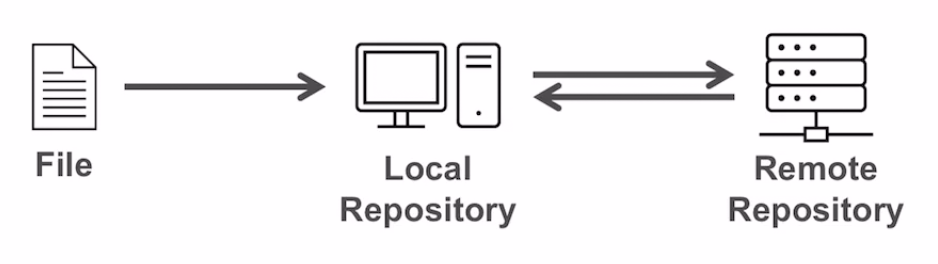
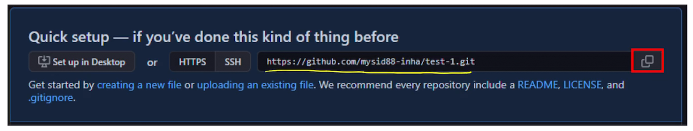

## GitHub

### Backup with GitHub

> 지금까지의 Git은, Local repository. 즉 나의 로컬 컴퓨터에서 Version Control을 진행하였다. 이번에는 인터넷 상에서의 버전 관리를 할 수 있는 'GitHub' 에 대해서 알아보자.
>
> GitHub에 버전 관리된 파일을 올리면, Local Repository의 버전 내역을 백업할 수 있으며, 다른 사람들과 협업이 가능하다.

- Remote Repository & GitHub
- Getting Started with GitHub
- Connecting Local repository to Remote Repository
- Uploading to Remote Repository
- Downloading from the Remote Repository
- Overview of Github repository
- SSH Remote Access to GitHub

### Remote Repository & GitHub

- What is the remote Repository ?
  - 지금까지는, 사용하고 있는 컴퓨터에서 작업을 하고, 작업 내용 [commit]을 컴퓨터 내에 [**Local Repository**]에 저장했다.
  - **Remote Repository** [원격 저장소] 는 Local repository가 아닌, 컴퓨터나 서버를 통해 만들어진 repository 이다. 멀리 떨어져 있는 repository라고 생각할 수 있다.

 

- **Backup & Collaboration** 를 위해 Local Repository와 Remote Repository를 나눈다.
  - GitHub은 Git을 위해 가장 많이 사용되는 Remote Repository이다.
  - Local 상에서 작업을 한 것을 remote로 전송하여 백업이 가능해지고, 다른 사용자가 Remote repository를 통해 다운 받아 협업이 가능하다.

- GitHub을 통해 뭘 할 수 있을까?
  1. GitHub을 사용하면 우리가 Remote Repository 상에서 Git을 사용할 수 있다.
     - 온라인 상에서 git을 통한 버전 관리가 가능하다.
  2. Local Repository 내용을 온라인 상으로 Backup을 할 수 있다.
     - Local Repository에 코드나, 작업 내용이 사라지더라도, Remote Repository [외부 저장공간]에 백업을 해두면 복구가 가능하다.
  3. 협업 [Collaboration]이 가능하다
     - Git 과 함께 사용하면 여러 협업 도구를 제공하기 때문에, default repository로 github를 사용한다.
  4. 개인 개발 이력 [Own development history]를 남길 수 있다.
     - 개발자가 개인 개발 이력을 관리하기 좋은 Platform이다.

### Connecting Local to Remote

> GitHub에 생성한 remote repository를 **HTTPS or SSH** 방식으로 Local repository와 연결할 수 있다. 

- Local Repository를 생성한다.
  - Local 내에서 작업을 한다. 예) f1.txt 파일을 만들고 작업을 했다 하자
  - f1.txt를 staging, commit을 한다
    - git add f1.txt
    - git commit -m "add a"
  - 현재까지 Local Repository 상에 Git 내역이 저장된 것.
- Remote Repository로 연결하기
  -  
  - 주소를 복사한 뒤, **git remote add origin [주소]** 명령어를 입력하여 연결을 한다
    - remote repository에 origin을 추가하라는 것을 명령하는 것 !
  - Remote Repository와 연결이 잘 됐는지 확인하기 위해 **git remote** 명령어를 사용한다
    - git remote
      - 연결된 remote repository의 이름 [예) origin] 을 보여준다.
      -  
    - git remote -v
      -  
      - remote repository 명과, 그 repository의 url 주소까지 포함되어 나타난다.

### Uploadding to Remote Repository

> Git에서 Local repository 내용을 remote repository로 upload하는것을 **push** 라고 하며
>
> Remote Repository에서 local repository로 다운받는것을 **pull** 이라고 한다.

- Git에서 push는 수정내역과 파일을 remote로 내보내는 것을 뜻한다
  - git push -u origin master
    - 이 명령어는 local repository에 branch를 origin으로 push 하라는 것을 뜻한다
    - origin은 remote repository의 master branch를 의미한다
    - -u 는 remote repository master branch에 연결하기 위한 것으로, 최초 push 때만 사용되며 이후에는 명령어에 포함하지 않아도 된다.
- push를 하고자하면, 인증을 하기위한 github login 창이 나온다.
- push 가 끝났다는 것은, local의 commit과 file이 remote repository로 upload 되었다는 것.

### Downloading from the remote repository

> GitHub 상에 remote repository와, 연결된 local repository 상에 차이가 발생할 경우 remote 와 local의 상태를 갖게 만들기 위해 옮겨와야한다.
>
> 즉, **pull** 을 해야한다 [git pull]

- git pull origin master 
  - 명령어를 통해, remote repository와 local repository 상에 존재하는 차이점 - remote 가 ahead라는 전제하에, 다운받아온다
  - origin은 default remote repository
  - master는 default branch

- Push와 pull만 제대로 알아도, Remote repository와 local repository 상에 파일 이동을 쉽게 할 수 있다.

### Overview of GitHub Repository

 

1. GitHub ID / Repository Name
2. GitHub Repository의 알림 내용
3. Star 개수 - 즐겨찾기, 좋아요 등 
4. Clone 개수 - 얼마나 많은 사람들이 복제했는지를 나타낸다.
5. Repository 내에 파일 
6. 최신 커밋 내용

### SSH Remote Access to GitHub

- SSH 란 무엇인가

  - "Secure Shell" - 강화된 보안 방식으로 정보를 교환하는 방법이다
  -  
  - Private Key와 Public Key의 쌍을 통해 컴퓨터를 **인증** 한다.
  - **Public Key는 외부에 공개된 키이며, Private Key는 사용자 자신만 알 수 있는 Key이다.**
  - Public Key & Private Key는 SSH key generator를 통해 생성이 된다.

- SSH Remote Access:

  -  
  - 일반적인 remote access [원격 접속]: GitHub ID와 비밀번호가 필요하다.
    - 해당 Remote repository를 자신이 만들었거나 접근/수정 권한이 있다는것을 인증해야한다.
  - SSH Remote Access는 **private key와 public key를 통해** 현재 사용하고 있는 기기가 무엇인지를 인증해야한다.
    - 어떤 기기인지 상관이 없이 등록만 하면, 언제 어디서든 github에 접근할 수 있다.
    - 인증받은 기기는, 자동 로그인 기능이 있다

  

- SSH key 생성

   

  - $ cd ~ 를 통해 home directory로 들어간다

  - ssh-keygen 명령어를 입력하면, home directory내에 .ssh 가 생성이 되고 그 안에 id_rsa 라는 키가 생성된다.

     

  - id_rsa가 private key

  - id_rsa.pub 이 public key이다

- SSH 방식으로 GitHub에 접근하는 과정

   

  - Local에서 만들어진 public key를 GitHub로 전송해주어야 한다.

  - GitHub은 해당 Public key를 저장을 한다.

  - Local에 남아있는 private Key와 Github에 있는 public key를 비교를 해서 접근하는 사용자가 올바른 사용자인지 인증절차를 진행한다.

##### Private Key와 Public Key가 만들어졌으니, SSH 방식으로 github repository에 접근해보자

 

1. 우선 GitHub에 public key를 전송해야한다. 

   - cat 명령어로 public key 내용을 복사하자.

2. Web Browser에서 GitHub에 settings 에서 <u>SSH and GPG keys</u> 에서 New SSH Key 버튼을 통해 등록할 수 있다.

   

3.  GitHub에 나의 SSH Public Key가 등록되었다.
4. SSH Key를 만들었던 기기는 github repository에 ssh 주소만 알고있으면, 따로 로그인 없이 접근 가능하다.

#### SSH 를 통해 연결을 해보자

 

- 새로운 repository를 만들고, SSH에 있는 주소를 복사해보자

 

- local repository를 새롭게 만들고 

 

- git remote add origin [SSH_address] 를 통해 연결을 해보자
- HTTPS 방식과 동일하지만, SSH 주소를 넣는 차이가 있다.
- 에러 메시지가 없다면 정상적으로 연결이 완료된 것이다.
- push / pull 명령을 동일하게 수행할 수 있다.