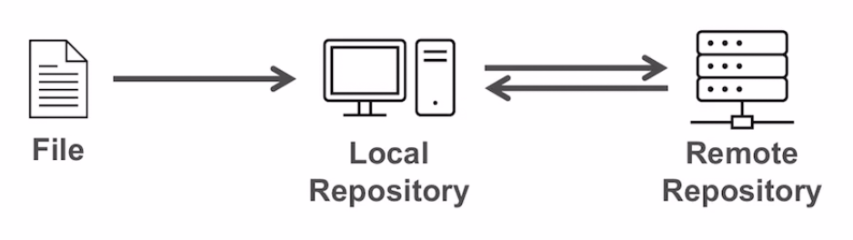
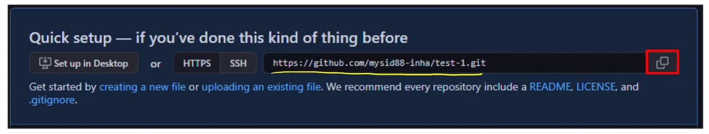

## GitHub_1

### Backup with GitHub

> 지금까지의 Git은, Local repository. 즉 나의 로컬 컴퓨터에서 Version Control을 진행하였다. 이번에는 인터넷 상에서의 버전 관리를 할 수 있는 'GitHub' 에 대해서 알아보자.
>
> GitHub에 버전 관리된 파일을 올리면, Local Repository의 버전 내역을 백업할 수 있으며, 다른 사람들과 협업이 가능하다.

- Remote Repository & GitHub
- Getting Started with GitHub
- Connecting Local repository to Remote Repository
- Uploading to Remote Repository
- Downloading from the Remote Repository
- Overview of Github repository
- SSH Remote Access to GitHub

### Remote Repository & GitHub

- What is the remote Repository ?
  - 지금까지는, 사용하고 있는 컴퓨터에서 작업을 하고, 작업 내용 [commit]을 컴퓨터 내에 [**Local Repository**]에 저장했다.
  - **Remote Repository** [원격 저장소] 는 Local repository가 아닌, 컴퓨터나 서버를 통해 만들어진 repository 이다. 멀리 떨어져 있는 repository라고 생각할 수 있다.

 

- **Backup & Collaboration** 를 위해 Local Repository와 Remote Repository를 나눈다.
  - GitHub은 Git을 위해 가장 많이 사용되는 Remote Repository이다.
  - Local 상에서 작업을 한 것을 remote로 전송하여 백업이 가능해지고, 다른 사용자가 Remote repository를 통해 다운 받아 협업이 가능하다.

- GitHub을 통해 뭘 할 수 있을까?
  1. GitHub을 사용하면 우리가 Remote Repository 상에서 Git을 사용할 수 있다.
     - 온라인 상에서 git을 통한 버전 관리가 가능하다.
  2. Local Repository 내용을 온라인 상으로 Backup을 할 수 있다.
     - Local Repository에 코드나, 작업 내용이 사라지더라도, Remote Repository [외부 저장공간]에 백업을 해두면 복구가 가능하다.
  3. 협업 [Collaboration]이 가능하다
     - Git 과 함께 사용하면 여러 협업 도구를 제공하기 때문에, default repository로 github를 사용한다.
  4. 개인 개발 이력 [Own development history]를 남길 수 있다.
     - 개발자가 개인 개발 이력을 관리하기 좋은 Platform이다.

### Connecting Local to Remote

> GitHub에 생성한 remote repository를 **HTTPS or SSH** 방식으로 Local repository와 연결할 수 있다. 

- Local Repository를 생성한다.
  - Local 내에서 작업을 한다. 예) f1.txt 파일을 만들고 작업을 했다 하자
  - f1.txt를 staging, commit을 한다
    - git add f1.txt
    - git commit -m "add a"
  - 현재까지 Local Repository 상에 Git 내역이 저장된 것.
- Remote Repository로 연결하기
  -  
  - 주소를 복사한 뒤, **git remote add origin [주소]** 명령어를 입력하여 연결을 한다
    - remote repository에 origin을 추가하라는 것을 명령하는 것 !
  - Remote Repository와 연결이 잘 됐는지 확인하기 위해 **git remote** 명령어를 사용한다
    - git remote
      - 연결된 remote repository의 이름 [예) origin] 을 보여준다.
      -  
    - git remote -v
      -  
      - remote repository 명과, 그 repository의 url 주소까지 포함되어 나타난다.

### Uploadding to Remote Repository

> Git에서 Local repository 내용을 remote repository로 upload하는것을 **push** 라고 하며
>
> Remote Repository에서 local repository로 다운받는것을 **pull** 이라고 한다.

- Git에서 push는 수정내역과 파일을 remote로 내보내는 것을 뜻한다
  - git push -u origin master
    - 이 명령어는 local repository에 branch를 origin으로 push 하라는 것을 뜻한다
    - origin은 remote repository의 master branch를 의미한다
    - -u 는 remote repository master branch에 연결하기 위한 것으로, 최초 push 때만 사용되며 이후에는 명령어에 포함하지 않아도 된다.
- push를 하고자하면, 인증을 하기위한 github login 창이 나온다.
- push 가 끝났다는 것은, local의 commit과 file이 remote repository로 upload 되었다는 것.