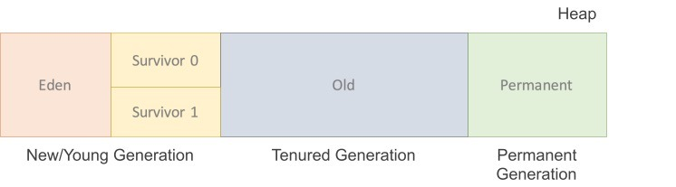

## Garbage Collection

> Java 에서 핵심이라 할 수 있는 GC, Garbage Collection에 대해 알아보자.
>
> GC는 JVM과 함께 매우 중요한 요소이며, 실제로 GC에 대해 잘 알고 있을수록 실력이 뛰어난 Java 개발자라고 할 수 있을정도로 중요하다.

우선 GC에 대해 알아보기 전에, JVM의 메모리 구조 중 <u>heap [힙]</u> 영역에 대해 알아보자.

> **Heap Area** (힙 영역): 객체를 저장하는 가상 메모리 공간이다. new 를 통해 생성된 객체와 배열의 인스턴스를 저장하는 곳. <u>가비지 컬렉터는 힙 영역을 청소하며 메모리를 확보한다</u>.

 

1. Permanent Generation
   - 생성된 객체들의 정보의 **주소값이** 저장되는 공간. Class loader에 의해 load되는 Class, Method 등에 대한 Meta 정보가 저장되는 영역이고 JVM에 의해 사용된다.
2. New / Young 영역 [New/Young Generation]
   - Eden: 객체들이 최초로 생성되는 공간
   - Survivor 0 / 1 : Eden에서 참조되는 객체들이 저장되는 공간.
3. Old 영역 [Tenured Generation]
   - New Area

### Stop-the-world

Stop-the-world 란, Garbage Collection 을 실행하기 위해, JVM이 **애플리케이션 실행을 멈추는 것이다.** Stop-the-world 가 발생한다면, GC는 실행하는 Thread를 제외한, 나머지 모든 쓰레드는 작업을 중지하고 멈춘다. 그 이후, GC 실행이 완료 [작업이 완료] 된 뒤에야, 중단된 Thread 들이 다시 작업을 시작한다. 

JVM을 실행시키는 애플리케이션의 모든 Thread가 작업을 중지하기 때문에, stop-the-world 의 시간을 줄이는 것이 중요하며, 이러한 것을 GC 튜닝이라 부른다.

GC 종류와 함께 여러 알고리즘이 존재하는데, 어떤 알고리즘을 사용하더라도 이 stop-the-world 는 피할 수 없다.

### Java 와 GC

Java는 할당된 메모리를 (힙 영역에) <u>명시적으로 지정하여 해지하지 않는다.</u>

물론, null로 또는 System.gc() 메서드를 이용해 할당된 메모리를 명시적으로 해지할 수 있지만, System.gc() 는 시스템의 성능에 큰 영향을 끼치므로 사용하면 안된다.

그렇기 때문에, Java / JVM에서는 **GC [garbage collector]** 가 더 이상 사용하지 않는, 필요 없는 쓰레기 객체를 찾아 지우는 작업을 한다. 이러한 역할의 gc가 개발된 데는 가설을 전재로 하는데, 이 가설을 <u>weak generation hypothesis 라고 한다.</u>

##### weak generation hypothesis

- 대부분의 객체는 금방 접근 불가능 상태 [unreachable status]가 된다.
- 오래된 객체에서 젊은 객체로의 참조는 아주 적게만 존재한다.

이러한 가설의 장점을 살리기 위해 HotSpot VM에서는 물리적 공간을 두 공간으로 나누었고, 이 두 공간을 **Young Generation 영역, Old generation 영역** 이라 한다.

##### Young Generation / Old Generation

- Young 영역(Yong Generation 영역): 새롭게 생성한 객체의 대부분이 여기에 위치한다. 대부분의 객체가 금방 접근 불가능 상태가 되기 때문에 매우 많은 객체가 **Young 영역에 생성되었다가 사라진다**. <u>이 영역에서 객체가 사라질때 Minor GC가 발생한다고 말한다.</u> 
- Old 영역(Old Generation 영역): 접근 불가능 상태로 되지 않아 **Young 영역에서 살아남은 객체가 여기로 복사된다**. 대부분 Young 영역보다 크게 할당하며, 크기가 큰 만큼 Young 영역보다 GC는 적게 발생한다. <u>이 영역에서 객체가 사라질 때 Major GC(혹은 Full GC)</u>가 발생한다고 말한다.

> GC영역 및 데이터 흐름도 이다.

Permanent Generation은 Method Area 라도고 불리운다. 객체나, 억류된 문자열 정보를 저장하는 곳이며, Old 영역에서 살아남은 객체가 영원히 남아 있는 곳은 절대 아니다. 이 영역에서 GC가 발생할 수도 있는데, 여기서 GC가 발생해도 Major GC의 횟수에 포함된다.

### Card Table

weak generation hypothesis에 따르면, old 영역에 존재하는 객체가 young 영역에 존재하는 객체를 참조하는 경우는 매우 드믈다. 하지만 만약 참조하는 경우에는 gc가 어떻게 처리할까?

이러한 경우를 해결하기 위해, Old 영역에 **512 byte 의 chunk [덩어리] 크기의 카드 테이블 [card table]이 존재한다.**

card table에는 old 영역의 객체가 young 영역의 객체를 참조할 때 마다 정보가 표시된다.

 Young 영역에서 gc가 실행되면, old 영역에 있는 모든 객체의 참조를 확인하는 것이 아닌, 이러한 card table만을 확인하여 GC 대상인지를 식별하게 된다.

 

### Young 영역의 구성

> 객체가 제일 먼저 생성되는 영역이 바로 Young 영역이다. 이 Young 영역은 크게 세 개의 영역으로 나뉜다.

- Eden 영역
- 2개의 Survivor 영역 - survivor 0/1

Java 에서 Young 영역에서의 절차는 다음과 같다. - [**Minor GC**]

1. 새로 생성한 객체는 대부분 <u>Eden 영역에</u> 위치하게 된다.

2. Eden 영역에서 GC 가 발생 한 뒤, 살아남은 객체는 (즉, GC에 의해 메모리가 해지되지 않은 객체는) Survivor 영역 중 하나로 이동된다.

3. Eden 영역에서 GC가 발생하면 살아남은 객체가 존재하고 있는 Survivor 영역에 객체가 계속해서 쌓이게 된다.

4. 하나의 Survivor 영역 [0/1 둘 중 하나]이 가득 차게 되면, 그 중에서 살아남은 객체를 다른 Survivor 영역으로 이동한다. 그리고, **가득 찬 Survivor 영역은 아무 데이터도 없는 상태가 된다.**

5. 위와 같은 과정이 반복된다. 이후 계속해서 살아남아있는 객체가 Old 영역으로 이동한다.

위와같은 절차에 따르면, 두 Survivor 영역 중 하나는 반드시 **비어 있는 상태로 남아있어야한다.** 그렇기에, 만약 Survivor 영역의 상태를 확인 하였을 때, 두 곳 모두에 데이터가 존재하거나, 사용량이 0 이라면 정상적인 시스템 상황이 아니라고 할 수 있다.

#### Minor GC

Young 영역에서 발생하는 GC인 minor gc를 정리하면, 

> 새로 생성된 대부분의 객체(Instance)는 Eden 영역에 위치한다. Eden영역에서 GC가 한 번 발생한 후 살아남은 객체는 Survivor 영역 중 하나로 이동된다. 이 과정을 반복하다가 계속해서 살아남아 있는 객체는 일정시간 참조되고 있다는 뜻이므로 Old영역으로 이동시킨다.

이와같은 과정을 흐름도로 나타낸다면,

위와 같은 상황이라 할 수 있다. 흐름도의 윗 부분은, Young 영역에서 Minor GC가 발생하기 전 상황이며, 밑에 GC 후는 minor GC 후 라고 할 수 있다.

#### Bump-the-pointer & TLABs (Thread-Local Allocation Buffers)

'Bump-the-pointer' 과 'TLABs (Thread-Local Allocation Buffers)' 라는 기술은 HotSpot VM에서 **보다 빠른 메모리 할당을 위한 두 가지 기술이다.** 

Bump-the-pointer 는 Eden 영역에 할당 된 마지막 객체를 <u>추적한다</u>. Eden 영역의 top (가장 위)에 마지막 객체가 있는데, 새로운 객체가 생성된다면 해당 객체의 크기가 Eden 영역에 삽입될 수 있는지 여부만을 확인한다. Eden 영역에 할당 할 수 있는 크기라면 넣고, 해당 새로운 객체가 top에 존재하게 된다. 즉, new 객체 생성은 마지막에 추가된 객체만 점검하면 되기에 빠른 메모리 할당이 가능해진다.

Multi-Thread 환경해서는 다른 문제가 발생한다. Thread-Safe 하기 위해 여러 thread를 사용하는 객체를 Eden 영역에 저장할 때는, 해당 thread에 lock (락)이 발생하게 되고, 이런경우 lock-contention 때문에 성능이 떨어지는데, 이를 해결하기 위한 방법이 TLABs 이다.

TLABs 는 스레드가 각각의 몫에 해당하는 Eden 영역의 작은 덩어리를 가질 수 있도록 하는 것이다. 각각의 thread는 자기가 갖고 있는 TLAB에만 접근이 가능하기에, bump-the-pointer 기술을 사용해도 lock 없이 thread-safe하게 eden 영역에 객체 메모리 할당이 가능하다.

> Minor GC란...
>
> 'Eden 영역에 최초로 객체가 만들어지고, Survivor 영역을 통해서 Old 영역으로 오래 살아남은 객체가 이동한다는 사실은 꼭 기억하자'

### Old 영역의 Garbage Colllection

기본적으로, Old 영역에서의 GC는 데이터가 가득 찾을 때 실행된다. 여러가지의 GC 방식이 있는데, JDK 7 기준으로 다음과 같은 5개의 방식 (알고리즘)이 존재한다.

1. Serial GC
2. Parallel GC
3. Parallel Old GC (= Parallel Compacting GC)
4. Concurrent Mark & Sweep GC (= CMS)
5. G1 (Garbage First) GC

#### Serial GC (-XX:+UseSerialGC)

#### Parallel GC (-XX:+UseParallelGC)

#### 
