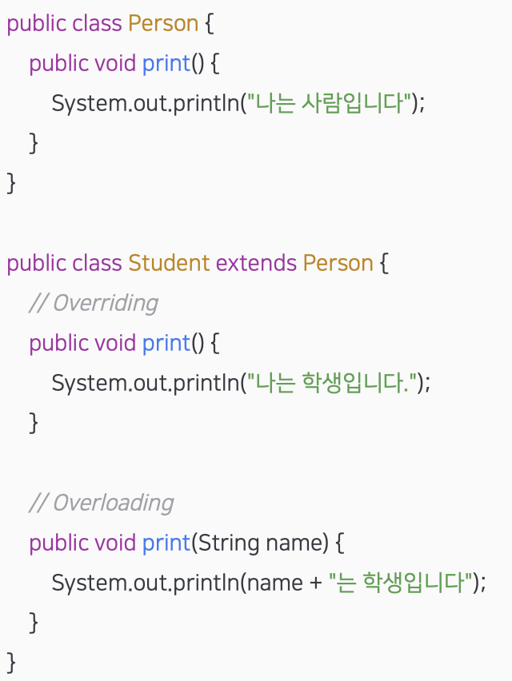
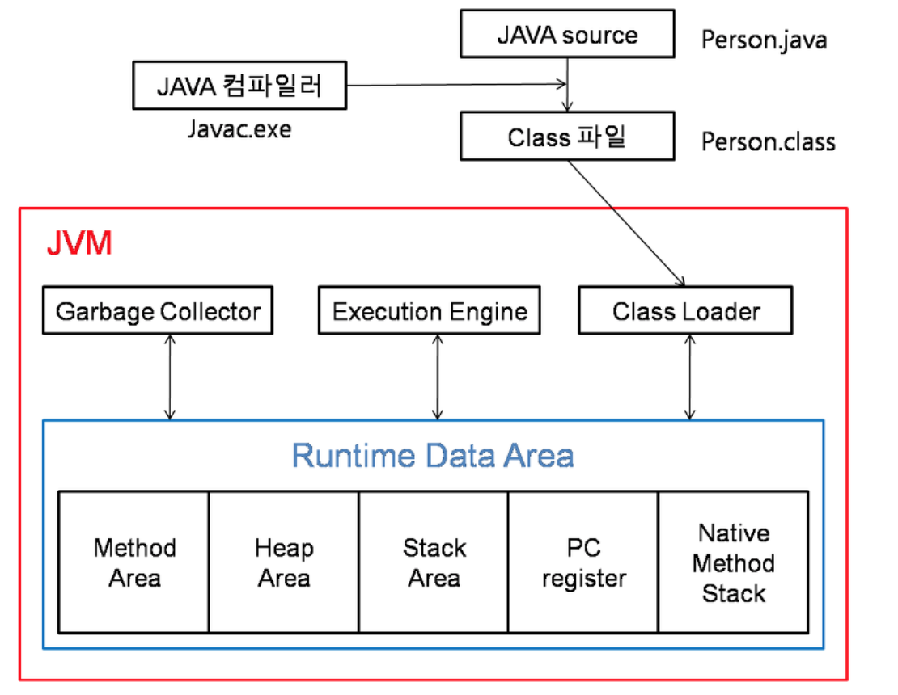

## Java

왜 우리는 자바를 사용할까? **자바의 장,단점**

#### 장점

- JVM [Java Vertual Machine] 위에서 동작하기 때문에 운영체제에 <u>독립적이다</u>
- GC [Garbage Collection]에 의해 메모리가 관리되기에 편리하다

#### 단점

- JVM 위에서 동작하기 때문에 실행 속도가 비교적 느리다.
- 다중 상속이나 타입에 엄격하며, 제약이 있는게 많다.

#### Java 에서의 Overriding & Overloading

- Overriding [오버라이딩]: 상위 클래스가 가지고 있는 메소드를 하위 클래스에서 재정의

- Overloading [오버로딩]: 매개변수 타입과 개수를 변경하면서 같은 이름의 메소드를 여러개 사용

   

- 클래스 (class), 객체 (object), 인스턴스 (instance)

- - 클래스: 객체를 만들어내기 위한 틀, 설계도
  - 객체: 설계도를 기반으로 선언된 대상, 클래스의 인스턴스
  - 인스턴스: 객체에 메모리가 할당되어 실제로 활용되는 객체

#### 추상클래스와 인터페이스

- - 추상 클래스 (abstract class):

- - - 단일 상속만이 가능
    - 모든 접근 제어자를 사용할 수 있다.
    - 변수와 상수를 선언할 수 있다.
    - 추상 메소드와 일반 메소드를 선언할 수 있다.

- - 인터페이스 (interface):

- - - 다중 구현이 가능하다
    - Public 접근 제어자만 사용할 수 있다.
    - 상수만 선언할 수 있다.
    - 추상 메소드만 선언할 수 있다.

#### Collection

Java Collection 에는 List, Map, Set 인터페이스를 기준으로 여러 구현체가 존재한다. 이에 더해 `Stack`과 `Queue` 인터페이스도 존재한다. 왜 이러한 Collection 을 사용하는 것일까? 그 이유는 다수의 Data 를 다루는데 표준화된 클래스들을 제공해주기 때문에 DataStructure 를 직접 구현하지 않고 편하게 사용할 수 있기 때문이다. 또한 배열과 다르게 객체를 보관하기 위한 공간을 미리 정하지 않아도 되므로, 상황에 따라 객체의 수를 동적으로 정할 수 있다. 이는 프로그램의 공간적인 효율성 또한 높여준다.

- List, Set, Map

- - List

  - - 데이터를 순차적으로 저장
    - 데이터 중복을 허용
    - 데이터로 null 허용

  - Set

  - - 순서없이 key로만 데이터 저장
    - Key 중복 허용 X
    - key로 null을 허용 X

  - Map

  - - 순서없이 key, value 로 데이터를 저장
    - value중복 허용, key 중복허용 x
    - key로 null 허용 X

- Java에서 Vector와 ArrayList 차이

- - Vector:

  - - 동기화를 지원
    - 속도가 느리지만 병렬상황에서 안전
    - 크기가 증가하는 경우, 2배 증가 (**Array Doubling**)

  - ArrayList:

  - - 동기화를 지원하지 않는다
    - 속도는 빠르지만 병렬 상황에서 안전하지 않다.
    - 크기가 증가하면 1.5배 증가

#### StringBuffer와 StringBuilder 차이

- - StringBuffer

  - - 동기화를 지원
    - 속도가 느리지만 병렬 상황에서 안전

  - StringBuilder

  - - 동기화를 지원하지 않음
    - 속도가 빠름, 병렬상황에서 안전하지 않음.

  - Java에서 문자열에 사용되는 대표적인 클래스, **String, StringBuffer, StringBuilder**

  - String은 불변 (immutable), String str = “hello”, str += “world” 하면 str이라는 스트링 객체가 새로운 메모리 영역을 가리키는것 ! 기본 hello를 할당하던 str은 Garbage 컬렉터가 나중에 지운다.

  - 이렇게 String 객체를 계속해서 변경하고 하면 Heap (힙) 영역에 임시 Garbage가 쌓이게 된다. 메모리 부족해짐!

  - 그래서 Mutable한 StringBuffer / StringBuilder를 사용

  - StringBuffer, StringBuilder는 메모리의 값을 변경시켜서 문자열을 변경. 즉 문자열 연산이 많으면 이걸 사용하는게 성능이 좋음 ! 

#### Synchronized (동기화)

- - Java에서 동기화는 여러 쓰레드가 하나의 자원을 이용하고자 할 때, 한 쓰레드가 해당 자원을 사용중인 경우, 데이터에 접근할 수 없도록 막는 것.

  - Synchronized 키워드를 이용하면 병렬 상황에서 자원의 접근을 안전하게 하지만, 자원을 이용하지 않는 쓰레드는 락에 의한 Dealock이 발생할 수 있음.

  - - 메소드 Synchronized: 한 시점에 하나의 쓰레드만이 해당 메소드를 실행할 수 있다.
    - 변수 Synchronized: 한 시점에 하나의 쓰레드만이 해당 변수를 참조할 수 있다.

### **JVM 구조** [JVM Structure]

- **Method Area** (메소드 영역): 클래스 변수의 이름, 타입, 접근 제어자 등과 같은 클래스 관련된 정보를 저장. Static 변수, 인터페이스 등이 저장된다. Constant Pool, Static, Final 변수 등이 생성된다.

- **Heap Area** (힙 영역): new 를 통해 생성된 객체와 배열의 인스턴스를 저장하는 곳. 가비지 컬렉터는 힙 영역을 청소하며 메모리를 확보한다.

- **Stack Area** (스택 영역): 메소드가 실행 되면 스택 영역에 메소드에 대한 영역이 1개 생김. 이 영역에 지역변수, 매개변수, 리턴값등이 저장.

- **PC register** : 현재 쓰레드가 실행되는 부분의 주소와 명령을 저장 (CPU register와는 별개)

- **Native Method Stack**: 자바 외의 언어(C, C++ 등) 작성된 코드를 위한 메모리 영역. JNI를 통해 사용된다.

- 

#### Java Program 실행 과정

1. 프로그램이 실행되면 JVM은 OS로부터 이 프로그램이 필요로 하는 메모리를 할당받는다.
   - JVM은 이 메모리를 용도에 따라 여러 영역으로 나누어 관리한다.
   - Method, Heap, Stack 등

2. 자바 컴파일러(javac)가 자바 소스코드(.java)를 읽어들여 자바 바이트코드(.class)로 변환시킨다.

3. Class Loader를 통해 class파일들을 JVM으로 로딩한다.

4. 로딩된 class파일들은 Execution engine을 통해 해석된다.

5. 해석된 바이트코드는 Runtime Data Areas 에 배치되어 실질적인 수행이 이루어지게 된다.

이러한 실행과정 속에서 JVM은 필요에 따라 Thread Synchronization과 GC같은 관리작업을 수행한다.

 

