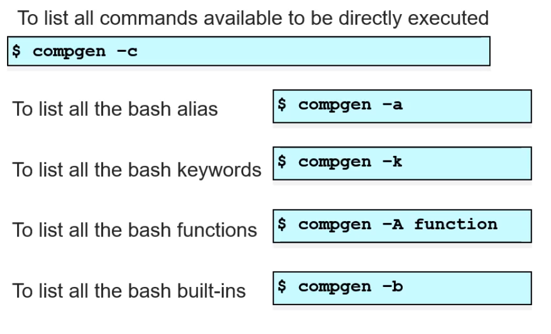
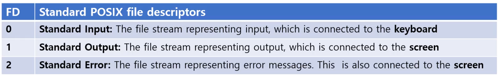
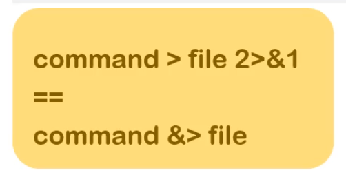

## Linux

> Linux Commands and Redirection

- Linux Commands
- Order of Executing Commands
- Built-ins vs. External Commands
- Command list
- Redirection


### Bash Option

먼저 shell option을 config 하는 법을 배워보자

bash에는 크게 두 가지가 있다

1. set

   - set -o : 설정 가능한 옵션들이 보여진다.

   ```bash
   $  set -o | column # 두 개의 컬럼으로 볼 수 있도록 column option
   allexport      	off	ignoreeof      	off	nounset        	off
   braceexpand    	on	interactive-comments	on	onecmd         	off
   emacs          	on	keyword        	off	physical       	off
   errexit        	off	monitor        	on	pipefail       	off
   errtrace       	off	noclobber      	off	posix          	off
   functrace      	off	noexec         	off	privileged     	off
   hashall        	on	noglob         	off	verbose        	off
   histexpand     	on	nolog          	off	vi             	off
   history        	on	notify         	off	xtrace         	off
   ```

   - **set -o / +o** 로 옵션을 on/off 할 수 있다.
     - -o: on
     - +o: off

2. shopt 

   ```bash
   $ shopt | column
   cdable_vars    	off		histverify     	off
   cdspell        	off		hostcomplete   	on
   checkhash      	off		huponexit      	off
   checkwinsize   	on		interactive_comments	on
   cmdhist        	on		lithist        	off
   compat31       	off		login_shell    	on
   dotglob        	off		mailwarn       	off
   execfail       	off		no_empty_cmd_completion	off
   expand_aliases 	on		nocaseglob     	off
   extdebug       	off		nocasematch    	off
   extglob        	off		nullglob       	off
   extquote       	on		progcomp       	on
   failglob       	off		promptvars     	on
   force_fignore  	on		restricted_shell	off
   gnu_errfmt     	off		shift_verbose  	off
   histappend     	off		sourcepath     	on
   histreedit     	off		xpg_echo       	off
   ```

   - **shopt -s/-u**
     - -s: on
     - -u: off


option중 ignoreeof: shell 에서 exit 누르면 shell이 종료되는데, 보통 ctrl+d를 눌러도 나가지는데, 의도치 않게 나갈수도 있어서 ctrl + d로 종료되지 않도록 방지해주는거. 이걸 켜보자

```bash
$ set -o | grep ignoreeof
ignoreeof      	off
$ set -o ignoreeof # ignoreeof 옵션 키기 
$ set -o | grep ignoreeof
ignoreeof      	on
$ Use "logout" to leave the shell. # ctrl+d를 눌렀을 때

$ set +o ignoreeof # ignoreeof 옵션 끄기 
$ set -o | grep ignoreeof 
ignoreeof      	off

$ logout # ctrl + d 눌렀을 때 종료됬다.
Saving session...
...copying shared history...
...saving history...truncating history files...
...completed.
Deleting expired sessions...none found.

[프로세스 완료됨]
```


**set [-o/+o]나 shopt [-s/-u]로 다양한 built-in shell 옵션들을 키고 끌 수 있다.**


#### Expand_aliases 옵션

```bash
$ shopt -u expand_aliases # expand_aliases option 끄기 
$ shopt | grep expand_a
expand_aliases 	off

$ shopt -s expand_aliases # 옵션 키기 
$ shopt | grep expand_
expand_aliases 	on
```

- alias는 긴 명령문에 별칭을 넣는것 ?

```bash
$ alias kill='who'
$ kill
jaemincho console  Dec 11 14:50  # who 명령이 된것 
jaemincho ttys000  Dec 11 21:01 
```


### Linux Command

> 명령어들이 어떻게 결합되고 확장되는지 살펴보기전에 명령어의 종류와 형태를 살펴보자

**compgen** 명령어를 통해 linux에서 제공되는 명령어를 listing하는데 사용할 수 있음

 

- -c 옵션: 명령어 다 보여줌

```bash
$ compgen -c | wc -l # word-count -l: 라인별로의 개수니까 총 몇개의 명령어가 있는지..
    2771
```

- $ compgen -a

  - bash alias 목록을 보여준다
  - alias는 사용자가 리눅스에서 사용하는 긴 명령문에 **별칭**을 붙히는것

  - alias command가 실행될 때는 어떤 명령어나 함수보다도 우선순위가 높다

- $ compgen -k

  - bash keyword 목록을 보여준다
  - compound command 작성시 사용된다

- $ compgen -A function 또는 declare -f

  - bash function 목록을 보여준다
  - 사용자가 임의로 원하는 함수를 만들어서 사용할 수 있다.

- $ compgen -b

  - built-in 명령어 목록들을 보여준다
  - Built-int 명령어는 shell 자체에 내장되서 제공되는 명령어들
  - 외부 명령어와 다르게 process 생성이나 파일 접근이 필요없어서 효율적이다.
  - shell 내부 상태를 조회/수정/사용 할때 사용되는 커멘드 들이다.

나머지 대 다수는 external command [utility] 이다.


### Order of Executing Commands

명령어는 중복되서 [같은 이름] 존재할 수 있다.

Command들의 실행 순서가 중요할 수 있다~

**alias가 가장 우선순위가 높으며, external command가 가장 우선순위가 낮다**

1. Bash alias
2. Keywords
3. Functions
4. Built-ints
5. $PATH 에서 찾는 순서
6. external commands

**type 으로 명령어의 종류를 찾을 수 있다.**

```bash
$ type -a kill # -a는 중복된 이름이 있으면 다 보여주라 
kill is a shell builtin
kill is /bin/kill
$ kill # 위 둘 중 built-in이 우선순위가 높다
 
$ kill() { echo "my function kill"; } # 함수 등록
$ alias kill='echo "my alias kill"' # alias 등록

$ type -a kill
kill is aliased to 'echo "my alias kill"' # alias가 우선순위가 가장 높다
kill is a function # 그 다음 함수
kill () 
{ 
    echo "my function kill"
}
kill is a shell builtin
kill is /bin/kill

$ kill
my alias kill  # alias가 가장 높기에 이게 추가된다.

$ unalias kill
$ unset kill
```


### Built-in vs. External Commands

> 보통 alias, keyword, function이 없으면 bash가 내장 명령어를 매칭하는 과정을 가지게된다.
>
> 내장 명령어는 **shell program 내부 명령어다**
>
> 즉 bash program은 내부 함수 [internal functions]로 이루어져있다고도 할 수 있다.

내장 명령어 built-in commands는 bash가 fork/exec 등으로 새로운 프로세스를 만드는것이 아니라, 내부 함수를 직접적으로 실행한다. 그래서 좀더 효율적으로 동작할 수 있다.

e.g. pwd, echo, cd 등


내장 명령어에서도 bash가 명령어를 못 찾는다면 [Alias, keyword, function, built-in 에서 못찾았다면,]

bash는 <u>PATH</u> 를 찾는다.

PATH는 경로들의 집합을 갖고있다 [:으로 분기] 

- e.g. /usr/bin:/bin
- 이건 디스크에서의 탐색. 내장 명령어보다 느리다.
- Left-to-right으로 찾는다


### Command Type

type 명령어는 

- 명령어의 유형
- 외부 명령어라면 명령어의 위치 정보

를 알 수 있다.

```bash
# type -t 명령어를 통해 해당 명령어가 어떤 종류인지 알 수 있다.
$  type -t type
builtin
$ type -t echo
builtin
$ type -t cd
builtin
$ type -t pwd
builtin
$ type -t kill
builtin

$ alias kill='echo "this is my kill"'
$ type -t kill
alias
$ compgen -a
kill

$ type -t ls
file

# type -p 옵션을 통해 경로를 알 수 있다.
$ type -p ls
/bin/ls
$ type -t mkdir
file
$ type -p mkdir
/bin/mkdir

```


### Command List

- 명령어 리스트
- 작업들을 연결해서 작업 리스트를 만들기위해
  - ';'
  - '&'
  - 를 사용한다


작업들을 순차적으로 실행하기 위해서 ';' 를 사용한다.

```bash
$ date ; sleep 1 ; sleep 1 ; sleep 1 ; date
2021년 12월 11일 토요일 21시 43분 06초 KST
2021년 12월 11일 토요일 21시 43분 09초 KST
```

- 부모 프로세스가 shell program인데, 수행할 작업들을 fork 해서 실행을 하면 종료할때까지 기다리고, 다음 작업을 fork 하는 .. 순차적으로 실행한다.


**비동기적으로 처리하고 싶다면 & 를 사용한다.**

연결리스트로 만들 수 있는데, 부모 프로그램이 fork하고 실행시키고 해당 fork 된 프로세스가 종료되기를 부모가 기다리지 않고 바로 실행한다.

```bash
$ date & sleep 1 & sleep 1 & sleep 1 & date
[1] 4987
[2] 4988
[3] 4989
[4] 4990
2021년 12월 11일 토요일 21시 47분 21초 KST
2021년 12월 11일 토요일 21시 47분 21초 KST
[1]   Done                    date
$ 
[2]   Done                    sleep 1
[3]-  Done                    sleep 1
[4]+  Done                    sleep 1
```

- 결국 병렬적으로 처리
- 실행의 순서가 중요한데 스케쥴링에 의해 결정된다.


&,  ; 혼합할 수 도 있다.


### Exit status [종료 상태]

- Linux나 Unix에서는 프로세스는 종료 상태 값을 갖고있다 (0 - 255)

- Main program에서의 return 값 / exit 값이 **종료 상태값이다**

  - 0이면 success 
  - 0이 아니면 Error !
    - e.g. signal N으로 종료된건 128 + N 으로 set 된다

- 종료 상태값을 알고 싶을때는 **$?** 파라미터로 확인한다

  ```bash
  $ cd /root/
  -bash: cd: /root/: No such file or directory # error
  $ echo $?
  1 # error
  
  
  $ ls
  Applications		Movies # 정상 출력
  $ echo $? # exit status 0 [정상]
  0
  
  ```

  **<u>Bash Conditional commands</u>**: 보통 종료상태 [exit status]는 조건에 따라 수행할 conditional commands에서 자주 사용된다.


### Conditional Command List

- '&&' = and
  - cmd1 && cmd2

- '||' = or
  - cmd1 || cmd2
- conditional command list는 프로그램 조건문에서 자주 보이는거다.

```bash
$ ls ~/.bashrc && cat ~/.bashrc
# ls 가 성공일때 cat 하겠다 ~ 파일이 없으면 수행하지 않겠다
```

```bash
$ cd ~/tempdir
$ rm -rf *
# 이렇게 두 개로 나누면 pwd가 바뀌지 않았을때 다 지우는 불상사가 생길 수 있다.

$ cd ~/tempdir && rm -rf *
# 해당 디렉토리가 있어서 pwd를 바꾼다면 안에 내용을 지우겠따
```

```bash
# OR
$ cd /config || echo "make config directory(mkdir)"

$ cd /config || echo "make config directory(mkdir)"
-bash: cd: /config: No such file or directory
make config directory(mkdir)
```


### Command Group

command list를 그룹화 해서 넣을 수 있다

$ **(** Command1 ; command2 ; command3 ; ... **)** : 괄호 ()로 묶는다 !!!

- shell에서 fork를 해서 child/sub shell에서 수행한다

```bash
$ pwd
/Users/jaemincho/Desktop
$ ( cd test ; mkdir my ) # fork해서 자식 shell이 수행한다 

$ pwd # 여전히 Desktop
/Users/jaemincho/Desktop
$ cd test
$ ls
a			my			# my가 생긴걸 볼 수 있다.
```


- 괄호가 아니라 {}면 current shell에서 수행한다. 또는 {}도 없이 수행

```bash
$ pwd 
/Users/jaemincho/Desktop
$ { cd test ; mkdir my ;} #괄호가 아니라 {}면 current shell에서 수행한다.
$ pwd
/Users/jaemincho/Desktop/test
```


### Standard Input/Output

- 리눅스 유닉스에서는 다양한 file이나 디바이스들을 통일된 방식으로 다루기 byte stream의 집합인 **file**로 관리한다.

##### File Descriptor Table 



- 0은 keyborad input: standard input [file stream]
- 1은 screen output: standard output [file stream]
- 2는 standard error: screen 

File Descriptor는 table형식으로 저장되어있으며, 이는 프로세스마다 갖고있다.

```bash
$ ls -l /dev/stdin
lr-xr-xr-x  1 root  wheel  0 12 11 14:50 /dev/stdin -> fd/0 # fd:0

$ ls -l /dev/stdout
lr-xr-xr-x  1 root  wheel  0 12 11 14:50 /dev/stdout -> fd/1

$ ls -l /dev/stderr
lr-xr-xr-x  1 root  wheel  0 12 11 14:50 /dev/stderr -> fd/2
```


### Standard Input <u>Redirection</u>: [0<]

- standard input을 필요로 하는 프로그램이 많다
  - wc : word count
  - sort : sort
  - bc: 계산기
  - 등 사용자로부터 입력을 받아 처리하는 프로그램이 많다

```bash
$ wc
hello
JaeMin Cho
Inha University
# ctrl + d
       3       5      33
     # 라인수 워드 수 캐릭터 수 
$ sort
abcd
bcde
fgef
acd
Hello
Cho
# ctrl + d
Cho
Hello
abcd
acd
bcde
fgef

$ bc # 계산기
bc 1.06
Copyright 1991-1994, 1997, 1998, 2000 Free Software Foundation, Inc.
This is free software with ABSOLUTELY NO WARRANTY.
For details type `warranty'. 
1 + 4
5
7*8
56
a = 1
b = 2
a + b
3
```

#### <0

표준 입력을 필요로하는 프로그램에 대해서,

stdout input (0 번 fd)가 아닌 **file로부터 입력을 받고싶다면** 

- **0<**  을 사용한다

```bash
$ cat test.txt 
user1
user2
user3
user4
$ wc 0< test.txt 
4       4      24
# 4개 라인, 4개 워드, user1\n~user4\n까지 6 * 4의 24
```

```bash
$ cat test.txt 
user5
user3
user1
user4
user5
$ sort 0< test.txt 
user1
user3
user4
user5
user5
```

```bash
$ cat test.txt 
user5
user3
user1
user4
user5
$ head -n 3 0< test.txt  # 앞에 세 라인만 보여줘
user5
user3
user1
$ tail -n 2 0< test.txt  # 뒤에서부터 두 라인
user4
user5

```

- standard input redirection은 대부분 파일로 바꾸는 경우인데 그럴때는 0을 생략할 수 있다

  - < 만사용한다

  ```bash
  $ cat test.txt
  user5
  user3
  user1
  user4
  user5
  
  $ sort < test.txt  # < 만 사용해도된다~
  user1
  user3
  user4
  user5
  user5
  ```


### Standard Output <u>Redirection</u>: [1>]

- standard output 1번 stream을 파일로도 바꿀 수 있다
- **즉 screen으로 나가야하는걸 파일로 바꿀 수 있다.**

```bash
$ echo "hello world"
hello world
# 기존 스크린으로 echo

$ echo "user2" 1> test.txt # test.txt로 standard output redirection
$ cat test.txt 
user2
```

- 존재하는 파일에 **1>**을 사용하면 **기존 내용이 사라지고 overwrite 된다**
- append 하기 위해서는 **1>>** 을 사용한다

```bash
$ cat test.txt 
Hello this is for standard output redirection test

$ echo "user1" 1> test.txt  # overwrite !
$ cat test.txt 
user1

$ echo "user2" 1>> test.txt # append
$ cat test.txt 
user1
user2
```

Standard input과 마찬가지로, 보통 File로 standard output을 바꿔주기에 1은 생략할 수 있다.

```bash
$ echo "user1" > test.txt  # overwrite !
$ cat test.txt 
user1

$ echo "user2" >> test.txt # append
$ cat test.txt 
user1
user2
```


### Standard Error <u>Redirection</u> : [2>]

- standard error도 파일로 Redirect 할 수 있다.

```bash
$ ls -l test.txt test2.txt
ls: test2.txt: No such file or directory # 실패, test2.txt는 존재 x
-rw-r--r--@ 1 jaemincho  staff  12 12 11 22:24 test.txt # 성공, 정상 메시지

$ echo $?
1 # 에러 발생
```

그렇다면 에러를 다른 출력으로 redirect 해보자

```bash
$ ls
test.txt

$ ls -l test.txt test2.txt 2> error.txt # 에러는 error.txt에 작성
-rw-r--r--  1 jaemincho  staff  0 12 11 22:28 test.txt

$ cat error.txt 
ls: test2.txt: No such file or directory

$ ls
error.txt	test.txt
```

마찬가지로 > 를 사용할 수 있다. 다만 그러면 1> 과 같은 의미로, 정상 메시지만 error.txt에 저장되고 에러만 출력할 수 있다. 


#####  > 와 2> 를 함께사용해보기

```bash
$ ls test.txt log.txt
ls: log.txt: No such file or directory # log.txt는 존재 X
test.txt

$ ls test.txt log.txt 2> error.txt > output.txt # error는 error.txt에 정상출력은 output.txt에

$ cat error.txt 
ls: log.txt: No such file or directory

$ cat output.txt 
test.txt
```


### Combination of Input and Output Redirection

- 예를들어 cat 같은 경우, 기본 파라메터 없이는 사용자의  stdin 을 기다린다

  ```bash
  $ cat > calc.txt
  1+3
  4+5
  5/4
  # 내용이 file로 저장된다
  
  $ bc 0< calc.txt 
  4
  9
  1
  
  $ bc -l < calc.txt > output.txt 
  $ cat output.txt 
  4
  9
  1.25000000000000000000
  ```

- 예를들어, 

  - **cat** **< file1 > file2**
  - cp file1 file2 와 같은 역할.. file1내용을 flie2로 옮긴거


### More on Redirection

- stdout [1]과 stderr [2] 를 동일한 파일에 쓰도록 해보자

  ```bash
  $ ls
  a
  $ ls a b
  ls: b: No such file or directory
  a
  
  $ ls a b > log.txt
  # stdout을 log.txt로 옮겼기에 stderr만 출력
  ls: b: No such file or directory 
  $ cat log.txt 
  a
  
  $ ls a b > log.txt 2>&1 
  $ cat log.txt 
  ls: b: No such file or directory
  a
  ```

  - 2>&1

    - stderr도 fd가 1번인 file stream으로 redirection 해라 라는 의미 !

    - command > file 2>&1

       

       = command &> file

      **&를 빼먹으면 2>1에서 2를 파일 이름으로 본다..**

  

### 실습

```bash
$ ls
$ cat > users
user1
user2
user4
user3
$ wc 0< users
       4       4      24
$ sort < users
user1
user2
user3
user4
$ head -n 3 < users
user1
user2
user4
$ tail -n 2 < users
user4
user3

$ sort < users > sorted_users
$ cat sorted_users 
user1
user2
user3
user4

$ ls -l users xxx
ls: xxx: No such file or directory
-rw-r--r--  1 jaemincho  staff  24 12 11 23:01 users

$ ls -l users xxx
ls: xxx: No such file or directory
-rw-r--r--  1 jaemincho  staff  24 12 11 23:01 users
$ ls -l users xxx 2> log.txt
-rw-r--r--  1 jaemincho  staff  24 12 11 23:01 users
$ cat log.txt 
ls: xxx: No such file or directory
```


