## NumPy (I)

> NumPy는 Python 기반의 상술, 및 과학 application에 꼭 필요한 Library이다.
>
> Python 기반의 상술 계산 도구는 대부분 NumPy를 default 로 가정하거나, 쉽게 연동할 수 있도록 돼있다.


- What is NumPy
  - Numpy가 무엇인지
  - 기능이 무엇인지
  - 왜 중요한지
- The NumPy ndarray
  - NumPy의 핵심 개념인 ndarray 객체에 대해 알아본다
  - n-dimentional array로, n차원의 배열 객체를 의미한다


### What is NumPy?

- NumPy는 Numerical Python 의 약자로, 산술 계산을 위한 가장 중요하고 필수적인 패키지이다.
- 과학 계산을 위한 대부분의 Package는, NumPy 배열의 객체를 데이터 교환을 위한 공용어처럼 사용한다.


- **NumPy의 기능** [features]

  - NumPy는 효율적인 다차원 배열 **ndarray** 를 통해 빠른 **배열 연산** 이 가능하다.

  - NumPy 배열은 Python List와 같은 내장 자료구조보다 훨씬 효율적으로 저장하고 다룰 수 있다.

  - **Broadcasting** 기능을 제공한다. [후에 알아보자]

  - NumPy 는 반복문 없이 배열로 표현된 데이터를 빠르고, 한 번에 계산할 수 있는 표준 **Mathematical functions** 를 제공한다.
    - 수치적 연산을 굉장히 빠르고, 편하게 할 수 있다.

  - 배열 Data를 disk에 쓰거나, 읽는 도구, memory에 적재된 파일을 다루는 도구[tools]를 제공한다.
    - 하지만 이 부분은 Pandas를 사용하는게 더 편하다. 다음에 Pandas에서 알아보자

  - 선형대수 [linear algebra], random number generation, 푸리에 변환 [Fourier transform] 기능과 같은 수치연산을 위한 기능을 제공한다.

  - C 나 , C++, Fortran으로 작성된 코드와 연결할 수 있는 C Api를 제공한다. 
    - 따라서, C/C++ 로 작성된 코드나 라이브러리는 NumPy의 자료구조에 접근하기 쉬우며, NumPy 배열을 복사하지 않고 바로 사용할 수 있다.

- **NumPy가 산술 영역에서 중요한 이유**

  - 대용량 데이터를 효율적으로 다룰 수 있도록 설계되었다 - "Designed for effiency on large arrays of data"
  - <u>Reasons</u>:
    - NumPy는 내장 Python 객체와 구분된 **연속적인 메모리 block** 에 데이터를 저장한다
    - NumPy의 라이브러리 알고리즘은 모두 C언어로 작성되어 있어서 Type 검사나 다른 Overhead없이 메모리를 직접 조작할 수 있다
    - Python의 List와 같은 파이썬 자료구조 보다 훨씬 **적은 메모리를 사용한다**
    - 반복문을 사용하지 않고, 전체 배열에 대한 복잡한 계산을 수행할 수 있다.


- NumPy 배열과 Python List간의 성능차를 비교해보자

  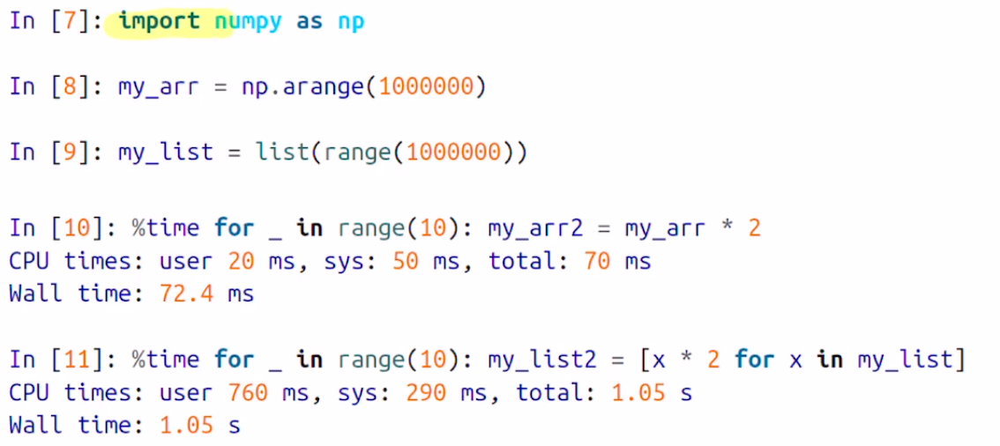 

  - "import numpy as np" 를 통해 numpy를 사용한다. 일반적으로 np로 줄여서 표현한다.
  - 1부터 1000000까지의 np 와 list를 선언하고, 각각에 모든 원소에 *2를 할때의 시간 비교
  - 약 10배 ~ 100배 이상 NumPy를 사용하는게 빠르며, 메모리도 적게 사용한다.	


### The NumPy ndarray

- ndarray: n-dimensional array, 즉 n차원 배열 

- 파이썬에서 사용 가능한 대규모 데이터 셋을 빠르고 유연하게 처리할수있는 **자료구조이다**.

  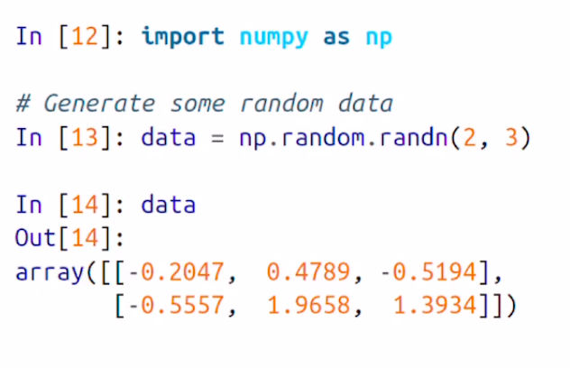 

  - numpy를 import 하고, random 함수를 통해 2*3 의 배열을 생성한 모습이다.


- **NumPy Batch Computation**

  - Numpy 배열은, scalar 연산과 같이 batch 연산을 수행한다.
  - 전체 data block에 대해서 연산을 한 번에 수행을 해서 **빠른 데이터 처리가 가능하다**.

- ndarray는 <u>**같은 종류**</u>의 데이터를 담을 수 있는 다차원 배열이다 - **homogeneous data**

- 배열 내의 모든 원소는 항상 같은 Type이다.

  - shape, dtype이라는 attribute로 알아볼 수 있다.

    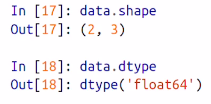  

  - shape: 배열의 크기를 알려준다. 이를 **형상** 이라고도 한다

  - dtype: 저장된 원소들의 data type을 알려준다.


### Creating ndarrays

- 가장 쉽게 ndarray를 생성하는 방법은 **array 함수를 사용하는** 것

```python
import numpy as nd

data1 = [6, 7.5, 8, 0, 1] # python의 list를 선언
arra1 = np.array(data1) # Python의 list를 넘겨받아 numpy 배열로 생성한다
```

- list안에 int, float가 있지만 numpy array로 생성되며 자동적으로 float로 형변환 되었다

```python
data2 = [[1,2,3,4],[5,6,7,8]]
arr2 = np.array(data2)
```

- 2차원 배열 역시 사용 가능하다
  - ndim: 배열의 차원을 넘겨준다 (예: arr2.ndim을 하면 2를 넘겨준다, 2차원 이니까)
  - shape: 배열의 형상 (arr2.shape = (2, 4))
  - dtype: 배열의 데이터 타입


- nparray는 새로운 배열을 생성하기 위한 여러 함수를 갖고있다

  - zeros(배열의 길이): 모든 원소가 0인 배열을 선언한다

    - ```python
      import numpy as np
      np.zeros(10) # 1차원에 10개 원소를 가진 배열을 생성한다 원소는 모두 0
      
      np.zeros((3,6)) # 3x6 형태의 2차원 numpy 배열을 생성한다.
      : array([0., 0., 0., 0., 0., 0.],
        	   [0., 0., 0., 0., 0., 0.],
          	 [0., 0., 0., 0., 0., 0.])
      ```

  - empty(): 초기화 되지 않은 쓰레기 값을 가진 배열을 생성한다.

  - arange(): 파이썬에 range 함수와 비슷한 ..

    - ```python
      import numpy as np
      np.arange(7)
      
      : array([0,1,2,3,4,5,6])
      ```

    - 0~인자-1 값까지의 값을 갖는 1차원 배열을 생성한다

  

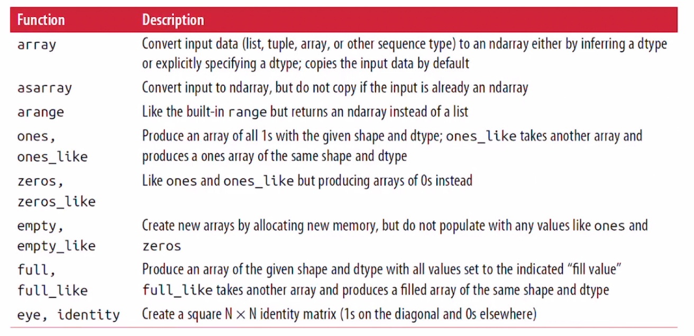 

- 배열의 생성을 위한 여러 함수들 - 몇 가지만 알아보자
  - ones: zeros와 비슷한데, 0 대신 1을 채운다
  - full: empty와 비슷한데, 인자로 받은 값을 전체 배열로 채운다.
  - eye: n x n 크기의 단위 행렬을 생성한다


### Data Types for ndarray

- dtype - ndarray의 데이터 타입

  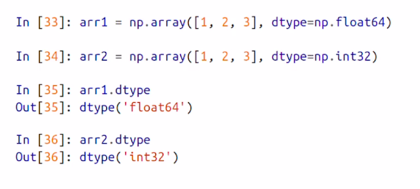 

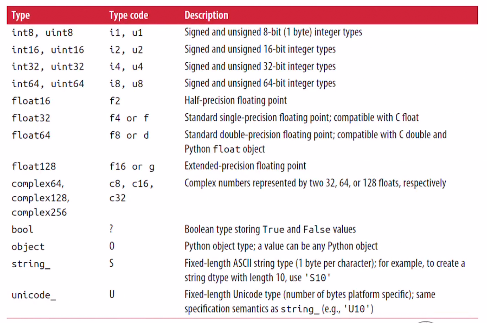 

- NumPy에서 사용되는 모든 자료형
  - NumPy는 산술연산에 초점되있기 때문에, 다른 자료형보다 **실수 float** 자료형을 가장 많이 쓴다.


- astype: 배열의 dtype을 다른 type으로 변환할 수 있다.

  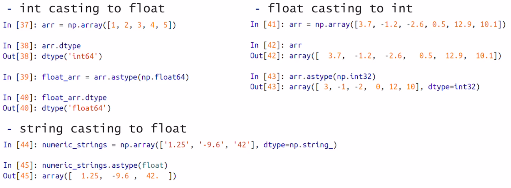

  ```python
  arr = np.array([1,2,3,4,5])
  arr.dtype
  : dtype('int64')
  
  float_arr = arr.astype(np.float64) # int형 array를 float로 바꾼다
  
  arr = np.array([3.7, 4.2, 5.5])
  int_arr = arr.astype(np.int32) # 이 경우 float형을 int형으로 바꾼다. 내림
  ```


- Astype을 이용하여 - 다른 배열의 dtype 속성을 이용해서 data type 변경이 가능하다

  ```python
  int_array = np.arrange(10)
  calibers = np.array([.22, .270, .357, .44, .50], dtype = np.float64)
  
  int_array.astype(calibers.dtype) #int 형 배열이던 int_array를 float이던 calibers 형으로 형변환 한다.
  ```


### Arithmetic with NumPy Arrays

> numpy 배열의 산술연산에 대해 알아보자


- **Vectorization**

  - NumPy 배열의 가장 중요한 특징은 **반복문을 사용하지 않고 [without writing any for loops]** 데이터 연산을 일괄적으로 batch 처리할 수 있다. 이를 **vectorization**이라고 한다.
  - vectorization에서는 같은 크기의 배열간의 산술 연산은 서로 매칭이 되는 원소들끼리 모두 한꺼번에 일괄적으로 처리한다.
  - Scalar 값이 포함된 연산의 경우, Scalar 인자가 모든 배열에 한번에 적용된다
    - 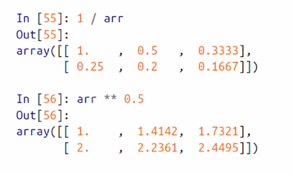 
  - 같은 크기를 배열들간의 비교연산을 하면 boolean 값을 리턴해준다
    - 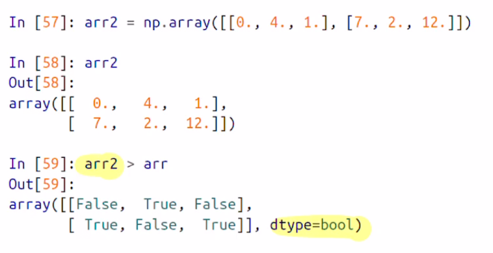 

- **Broadcasting**

  - 지금까지 크기가 같은 배열에 대한 연산만을 알아봤다면, 크기가 다른 배열의 연산인 broadcasting에 대해 알아보자

  - 가장 쉬운 예제는, scalar 값과 배열에 연산을 하는 경우이다

  - ```python
    arr = np.arange(5)
    arr * 4 # 모든 array의 원소에 적용이 된다.
    # 즉 모든 scalar값 4가 모든 원소에 적용이 되므로, scalar 4가 모든 배열에 broadcast 되었다고 할 수 있다.
    arr = (0,4,8,12,16)
    ```

  - **Broadcasting Rules**

    - 배열의 모든 column의 평균을 구하고, 각 컬럼에서 평균값을 빼는 예제

    - ```python
      import numpy as np
      
      arr = np.random.randn(4, 3)
      arr.mean(0) # arr의 각 column에 대한 평균을 구한다
      
      demeaned = arr - arr.mean(0) # 각 컬럼에서 컬럼의 평균값을 뺀 배열을 구한다.
      
      # arr은 4 x 3 배열이고, arr.mean(0)은 1차원 원소 3개가진 배열이다
      ```

    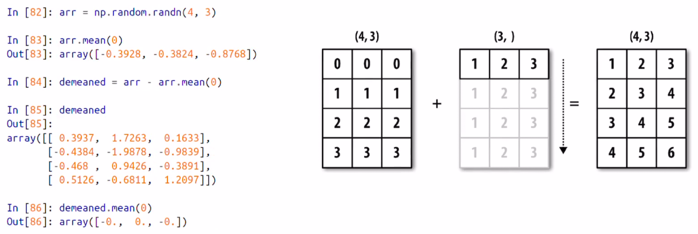 

    - arr.mean(0)이 1차원 배열이지만, arr에 모든 row에 동일하게 적용이 되서 연산이 한 번에 적용이 된다.

    - 이번에는 row의 평균을 구하고, 각 row에 평균값을 빼는 예제

    - ```python
      row_means = arr.mean(1) # mean()에 0을 넣으면 column의 평균, 1을 넣으면 row의 평균을 구해준다
      row_means.reshape((4,1)) # 1차원 원소 4개 배열을 4 x 1배열로 변경시켜 주어야 broadcasting이 가능하다. 크기를 변경하지 않으면, arr의 row, 3개 원소와 매칭이 되지 않는다
      ```

    - 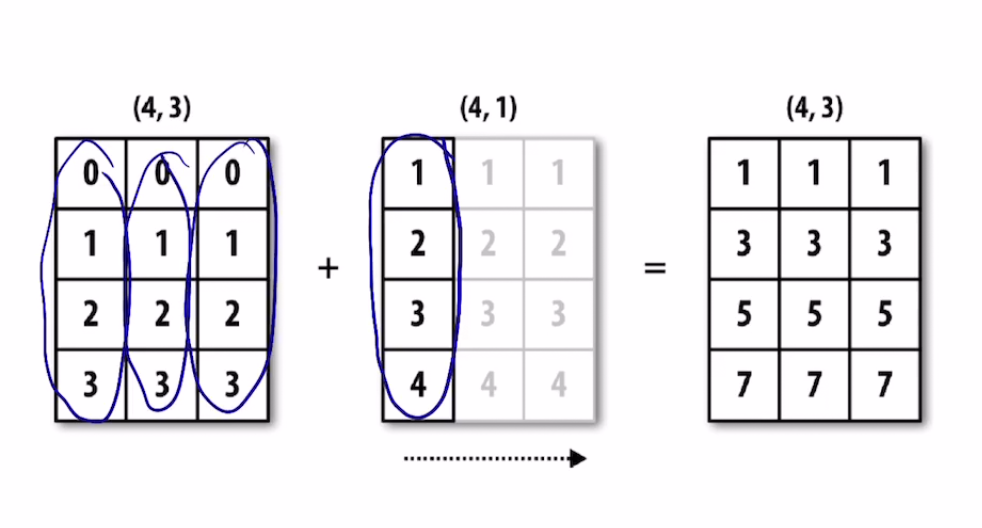 

  - Broadcasting 같은경우 2차원 뿐만 아니라, 다차원 배열에서 효율적으로 사용할 수 있다

    - 특히, 딥 러닝과 같이 행렬 곱 연산이 많은경우 broadcasting이 매우 효율적이다.
    - 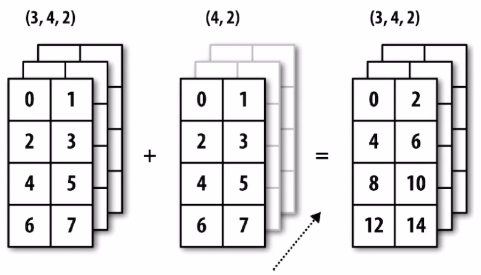 
    - 3차원 배열과 2차원 배열의 연산 결과. 마찬가지로 2차원 배열이 3차원 배열의 각 차원에 하나 씩 대응되어 한 번에 연산이 진행된다.


### Basic Indexing and Slicing

- Indexing 개념은 매우 광범위 하다
  - Data의 부분집합이나, 개별 원소를 추출하는 방법이 존재한다

1. **One-Dimensional Array [1차원 배열] - 파이썬과 비슷하다**

```python
>>> import numpy as np
>>> arr = np.arange(10)
>>> arr
array([0, 1, 2, 3, 4, 5, 6, 7, 8, 9])
>>> arr[5]
5
>>> arr[5:8]
array([5, 6, 7])
>>> arr[5:8] = 12
>>> arr
array([ 0,  1,  2,  3,  4, 12, 12, 12,  8,  9])
```

- 그렇다면 Python 배열과의 차이점은 무엇이 있을까?

  - Python의 list와 numpy 배열의 가장 큰 **차이점은** **배열의 조각은 원본 배열의 view 이다**

    - Data가 복사가 되지 않고, view 에 대한 변경이 그대로 원본 배열에 반영이 된다

    - ```python
      >>> arr_slice = arr[5:8] # arr이 원본이고, arr_slice가 arr의 view 가 된다.
      >>> arr_slice
      array([12, 12, 12])
      >>> arr_slice[1] = 12345 # view 인 arr_slice의 값을 변경해 보자
      >>> arr
      array([    0,     1,     2,     3,     4,    12, 12345,    12,     8,
                 9]) # 원본 배열 arr 역시 변경이 되었다.
      
      >>> arr_slice[:] = 64 # arr_slice의 모든 값을 변경해보자
      >>> arr
      array([ 0,  1,  2,  3,  4, 64, 64, 64,  8,  9]) # 이 경우에도 원본 arr의 값이 변경되었다.
      ```

  - View 가 아닌, 값을 복사하고 싶은경우에는 **copy** 메소드를 활용해야 한다


2. **Multi-dimensional Arrays [다차원 배열]**

   - 2차원 배열

     - 각 인덱스는 scalar 값이 아닌, 1차원 배열이 된다.

     - ```python
       >>> arr2d = np.array([[1,2,3],[4,5,6],[7,8,9]]) # 3 x 3 배열
       >>> arr2d[2] # 2번째 인덱스는 
       array([7, 8, 9]) # [7,8,9] 라는 리스트가 된다.
       ```

     - 만약 2차원 배열의 개별 요소에 접근하려면, 재귀적으로 접근 해야한다

     - ```python
       >>> arr2d = np.array([[1,2,3],[4,5,6],[7,8,9]])
       >>> arr2d[2]
       array([7, 8, 9])
       >>> arr2d[0][2]
       3
       ```

     - 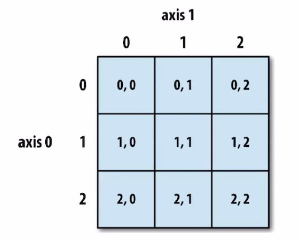 

   - 3차원 이상의 **다차원 배열**

     - 다차원 배열에서 마지막 색인을 생략하면 반환되는 객체는 상위 차원의 객체를 포함하는 한 차원 낮은 배열을 리턴한다

     - ```python
       >>> import numpy as np
       >>> arr3d = np.array([[[1,2,3],[4,5,6]],[[7,8,9],[10,11,12]]]) # 2 x 2 x 3 배열
       >>> arr3d
       array([[[ 1,  2,  3],
               [ 4,  5,  6]],
              [[ 7,  8,  9],
               [10, 11, 12]]])
       >>> arr3d[0] # 0번째 인덱스는, 가장 상위 차원이 생략되고 2 x 3 배열이 출력된다.
       array([[1, 2, 3],
              [4, 5, 6]])
       ```

     - 다 차원 배열에서도 스칼라 값과, 배열을 모두 대입할 수 있다.

     - arr3d[0] = 42는 모든 값이 42로 바뀐다

     - ```python
       >>> import numpy as np
       >>> arr3d = np.array([[[1,2,3],[4,5,6]],[[7,8,9],[10,11,12]]])
       >>> arr3d
       array([[[ 1,  2,  3],
               [ 4,  5,  6]],
       
              [[ 7,  8,  9],
               [10, 11, 12]]])
       >>> arr3d[0]
       array([[1, 2, 3],
              [4, 5, 6]])
       >>> arr3d[0] = 42
       >>> arr3d[0]
       array([[42, 42, 42],
              [42, 42, 42]])
       ```

     - 만약 실제 값을 복사해 두고 싶다면, copy() 메소드를 이용한다

     - ```python
       >>> import numpy as np
       >>> arr3d = np.array([[[1,2,3],[4,5,6]],[[7,8,9],[10,11,12]]])
       >>> old_values = arr3d[0].copy() # view 형식이 아닌, 실제 값을 복사 해둔다
       >>> arr3d[0] = 42 # 스칼라값을 입력해서 
       >>> arr3d[0]
       array([[42, 42, 42], # 모두 바뀐다
              [42, 42, 42]])
       >>> arr3d[0] = old_values # 복구잼
       >>> arr3d[0]
       array([[1, 2, 3], # 원래로 돌아옴 
              [4, 5, 6]])
       ```

     - 2 x 2 x 3 배열 arr3d의 arr3d[1, 0] 값은 ?

     - ```python
       >>> arr3d # 2 x 2 x 3 배열
       array([[[ 1,  2,  3],
               [ 4,  5,  6]],
       
              [[ 7,  8,  9],
               [10, 11, 12]]])
       >>> arr3d[1, 0] # 2 x 2가 생략이 되고, 3만 해당되는 값이 나온다  
       array([7, 8, 9]) # 상위 차원에서 1인덱스 에서, 두 번째 차원의 0 번째 인덱스 요소
       ```

   

3. **Indexing With Slices - Slicing을 통해 인덱싱 하는 방법**

   - 1차원의 경우는 Python의 list와 동일한 방법이다.

     - ```python
       >>> arr = np.array([0,1,2,3,4,5,6])
       >>> arr
       array([0, 1, 2, 3, 4, 5, 6])
       >>> arr[1:6] # 1:6은 1번째 인덱스 ~ 5번째 인덱스. 즉 1부터 5까지
       array([1, 2, 3, 4, 5])
       ```

   - 2차원 배열은 조금 복잡하다

     - ```python
       >>> arr2d = np.array([[1,2,3],[4,5,6],[7,8,9]])
       >>> arr2d # 3 x 3의 2차원 배열 
       array([[1, 2, 3],
              [4, 5, 6],
              [7, 8, 9]])
       >>> arr2d[:2] # arr2d의 상위차원의 0~1까지 
       array([[1, 2, 3],
              [4, 5, 6]])
       ```

     - [:#, #:]

     - ```python
       >>> arr2d[:2, 1:] # :2, 1:은 먼저 시작부터 ~ 1번째 인덱스를 선택을 하고, 1번째 인덱스부터 끝까지 선택
       array([[2, 3],
              [5, 6]])
       >>> arr2d[1, :2] # 1번째 인덱스 로우를 선택하고, 0~1까지의 컬럼 출력
       array([4, 5])
       ```

       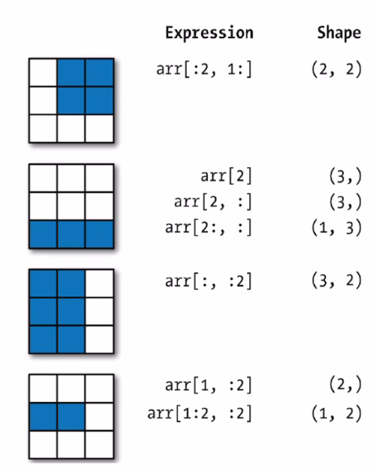 

     - 그림을 보고 잘 외워보자

       

4. **Boolean Indexing**

   - Boolean 을 통해 값을 선택하는 방법이다.

   - 중복된 이름을 포함한 배열과, 랜덤값을 갖고있는 배열을 생성해서 예제로 알아보자.

   - ```python
     >>> import numpy as np
     >>> names = np.array(['Bob', 'Joe', 'Will', 'Bob', 'Will', 'Joe','Joe'])
     >>> data = np.random.rand(7, 4)
     >>> names
     array(['Bob', 'Joe', 'Will', 'Bob', 'Will', 'Joe', 'Joe'], dtype='<U4')
     >>> data
     array([[0.90619798, 0.07890766, 0.17684533, 0.4307523 ],
            [0.37214875, 0.14012719, 0.70283782, 0.44281209],
            [0.63401744, 0.11182697, 0.09168805, 0.37780186],
            [0.61915163, 0.55190972, 0.42835299, 0.53515405],
            [0.7893932 , 0.18660942, 0.9018192 , 0.77473364],
            [0.0612653 , 0.73733162, 0.27634163, 0.27610722],
            [0.72168719, 0.94562081, 0.5851497 , 0.23431018]])
     ```

   - 배열의 산술 연산과 마찬가지로 비교연산 (==, !=, >, <)은 Vectorization이 가능하다

     - 즉, 한 번에 모든 원소가 비교가 된다 !

     - ```python
       >>> names == 'Bob'
       array([ True, False, False,  True, False, False, False]) # Boolean 배열 반환
       ```

   - 비교연산을 통해 얻은 Boolean 배열을 **Indexing** 으로 사용할 수 있다 !

     - ```python
       >>> data[names == 'Bob'] # names == 'Bob'은 0번째 인덱스와 3번째 인덱스가 True였다
       array([[0.90619798, 0.07890766, 0.17684533, 0.4307523 ], 
              [0.61915163, 0.55190972, 0.42835299, 0.53515405]])
       # 0 번째 Index, 3 번째 Index를 뽑아냈다 ! Why ? True이니까
       ```

     - ```python
       >>> data[names == 'Bob', 2:] # 특정 컬럼도 선택이 가능하다 	
       array([[0.17684533, 0.4307523 ],
              [0.42835299, 0.53515405]])
       ```

       - 0 번째 row 인덱스와, 3 번째 row 인덱스에서 2: 컬럼을 선택하라는 의미 !

   - ~ 연산자로 논리연산을 제외한걸 출력할 수 있다

     - ```python
       >>> data[~(names == 'Bob')] # 즉 bob이 아닌, 0과 3번째 인덱스 row를 제외한걸 출력 
       array([[0.37214875, 0.14012719, 0.70283782, 0.44281209],
              [0.63401744, 0.11182697, 0.09168805, 0.37780186],
              [0.7893932 , 0.18660942, 0.9018192 , 0.77473364],
              [0.0612653 , 0.73733162, 0.27634163, 0.27610722],
              [0.72168719, 0.94562081, 0.5851497 , 0.23431018]])
       ```

   - ~ 연산자는 일반적으로 조건을 반대로 쓰고싶을 때 유용하게 쓸 수 있다.

     - ```python
       >>> cond = names == 'Bob'
       >>> cond
       array([ True, False, False,  True, False, False, False])
       >>> data[~cond]
       array([[0.37214875, 0.14012719, 0.70283782, 0.44281209],
              [0.63401744, 0.11182697, 0.09168805, 0.37780186],
              [0.7893932 , 0.18660942, 0.9018192 , 0.77473364],
              [0.0612653 , 0.73733162, 0.27634163, 0.27610722],
              [0.72168719, 0.94562081, 0.5851497 , 0.23431018]])
       ```

   - & (and)와 | (or) 연산자를 통해 여러가지를 함께 표현할 수 있다.

     - ```python
       >>> mask = (names == 'Bob') | (names == 'Will') # or 연산. Bob이거나 Will인 인덱스
       >>> mask
       array([ True, False,  True,  True,  True, False, False])
       ```

   - **배열상에서 특정 조건에 해당하는 부분을 모두 바꾸는 방법도 있다 !**

     - ```python
       >>> data
       array([[0.90619798, 0.07890766, 0.17684533, 0.4307523 ],
              [0.37214875, 0.14012719, 0.70283782, 0.44281209],
              [0.63401744, 0.11182697, 0.09168805, 0.37780186],
              [0.61915163, 0.55190972, 0.42835299, 0.53515405],
              [0.7893932 , 0.18660942, 0.9018192 , 0.77473364],
              [0.0612653 , 0.73733162, 0.27634163, 0.27610722],
              [0.72168719, 0.94562081, 0.5851497 , 0.23431018]])
       >>> data[data < 0.5] = 0
       >>> data
       array([[0.90619798, 0.        , 0.        , 0.        ],
              [0.        , 0.        , 0.70283782, 0.        ],
              [0.63401744, 0.        , 0.        , 0.        ],
              [0.61915163, 0.55190972, 0.        , 0.53515405],
              [0.7893932 , 0.        , 0.9018192 , 0.77473364],
              [0.        , 0.73733162, 0.        , 0.        ],
              [0.72168719, 0.94562081, 0.5851497 , 0.        ]])
       ```

   

5. **<u>Fancy Indexing</u>** - Numpy 에서 사용되는 Indexing 개념

   - **Fancy Indexing은 NumPy의 정수 배열을 사용한 Indexing 방법이다 !** 

   - empty ndarray를 만들어서 예제로 이해해보자

   - ```python
     import numpy as np
     >>> arr = np.empty((8,4))
     >>> arr
     array([[ 2.68156159e+154, -1.73059889e-077,  3.61045471e-306,
              3.61184540e-306],
            [ 3.61323609e-306,  3.61462679e-306,  3.61601748e-306,
              8.08366669e+088],
            [ 3.42271680e-306,  5.40040462e+035,  3.68171433e+281,
              2.31980607e+045],
            [ 2.37298313e-301,  4.20292842e+122,  2.77399803e+127,
              6.79679620e+300],
            [ 4.27928698e+064,  3.62714302e-306,  4.59528213e+069,
              1.40598705e+161],
            [ 1.48198996e-296,  3.62992440e-306,  3.63131509e-306,
              4.88160888e+199],
            [ 3.21390743e+204,  8.82954410e+218,  3.85277273e+228,
              1.65507123e+238],
            [ 7.10984241e+247,  3.05424059e+257,  4.40947537e+122,
             -3.54446089e+262]])
     >>> for i in range(8):
     	arr[i] = i
     
     >>> arr
     array([[0., 0., 0., 0.],
            [1., 1., 1., 1.],
            [2., 2., 2., 2.],
            [3., 3., 3., 3.],
            [4., 4., 4., 4.],
            [5., 5., 5., 5.],
            [6., 6., 6., 6.],
            [7., 7., 7., 7.]])
     ```

   - arr[[4, 3, 0, 6]] 은 어떤 값을 return 할까 ?

     - 4 번째 index, 3 번째 index, 0 번째 index, 6 번째 index 의 값을 Return 한다 !

     - ```python
       >>> arr[[4,3,0,6]]
       array([[4., 4., 4., 4.],
              [3., 3., 3., 3.],
              [0., 0., 0., 0.],
              [6., 6., 6., 6.]])
       ```

     - -3, -5 번째 index도 가능하다 ! 

     - -3 은 뒤 에서 세 번째 이다

     

   - **다차원 배열에서의 Fancy Indexing**

     - ```python
       >>> arr = np.arange(32).reshape((8,4)) # 8 x 4 배열을 선언하고 0 ~ 31 값으로 채웠다
       >>> arr
       array([[ 0,  1,  2,  3],
              [ 4,  5,  6,  7],
              [ 8,  9, 10, 11],
              [12, 13, 14, 15],
              [16, 17, 18, 19],
              [20, 21, 22, 23],
              [24, 25, 26, 27],
              [28, 29, 30, 31]])
       ```

     - ```python
       >>> arr[[1,5,7,2],[0,3,1,2]] # (1, 0)에 해당하는 원소, (5,3), (7,1), (2,2) 원소가 나온다
       array([ 4, 23, 29, 10])
       ```

     - 만약 1, 5, 7, 2의 row에서 0, 3, 1, 2의 컬럼을 뽑고 싶다면 ?

     - arr[[1, 5, 7, 2]]\[:, [0, 3, 1, 2]] 를 사용하면 된다

     - ```python
       >>> arr[[1, 5, 7, 2]][:, [0, 3, 1, 2]]
       array([[ 4,  7,  5,  6],
              [20, 23, 21, 22],
              [28, 31, 29, 30],
              [ 8, 11,  9, 10]])
       ```


6. **Transposing Arrays and Swapping Axes**

   - 뒤바꾸거나, 축을 바꾸기 !

   - Transposing은 기존 배열의 **전치 행렬**을 출력해준다. 

     - 즉, 3 x 5 배열을 transpose 해주면, 5 x 3 배열이 나타난다.

     - transpose 메소드를 사용하거나, 대문자 T attribute를 사용한다

     - ```python
       >>> arr = np.arange(12).reshape(3,4)
       >>> arr # 3 x 4 행렬
       array([[ 0,  1,  2,  3],
              [ 4,  5,  6,  7],
              [ 8,  9, 10, 11]])
       >>> arr.T # T attribute 를 사용해서 transpose
       array([[ 0,  4,  8], # 4 x 3 행렬
              [ 1,  5,  9],
              [ 2,  6, 10],
              [ 3,  7, 11]])
       >>> arr
       array([[ 0,  1,  2,  3],
              [ 4,  5,  6,  7],
              [ 8,  9, 10, 11]])
       >>> arr.transpose() # transpose 메소드를 사용할 수도 있다
       array([[ 0,  4,  8],
              [ 1,  5,  9],
              [ 2,  6, 10],
              [ 3,  7, 11]])
       ```

     - 주로 행렬 계산에 자주 사용된다.

     - 예를들어, np.dot() 은 행렬의 내적연산 메소드인데, 이럴때 transpose를 이용해 계산한다

     - ```python
       >>> arr = np.arange(12).reshape(3,4)
       >>> arr
       array([[ 0,  1,  2,  3],
              [ 4,  5,  6,  7],
              [ 8,  9, 10, 11]])
       >>> arr.T
       array([[ 0,  4,  8],
              [ 1,  5,  9],
              [ 2,  6, 10],
              [ 3,  7, 11]])
       >>> arr2 = np.arange(8).reshape(2,4)
       >>> arr2
       array([[0, 1, 2, 3],
              [4, 5, 6, 7]])
       >>> np.dot(arr, arr2.T) # 내적 연산을 위해, arr = (3, 4) 와 arr2 = (2, 4) 계산을 위해
       # arr2를 transpose해서 4, 2 배열로 바꿔주면, 3 x 2 배열이 나온다
       array([[ 14,  38],
              [ 38, 126],
              [ 62, 214]])
       ```

   - **Transpose() Method**

     - 만약 2차원이 아닌, 3차원 이상의 다차원 배열의 경우, transpose 메소드는 **tuple** 형태로 **축을 받아서 형을 변환시켜준다.**

     - ```python
       >>> arr = np.arange(16).reshape((2, 2, 4)) # 2 x 2 x 4의 3차원 배열
       >>> arr
       array([[[ 0,  1,  2,  3],
               [ 4,  5,  6,  7]],
               [[ 8,  9, 10, 11],
               [12, 13, 14, 15]]])
       ```

     - 이때 arr [2 x 2 x 4] 배열을 transpose 해보자

     - ```python
       # 2x2x4에서 0번째 인덱스와 1 번째 인덱스가 순서를 바꿔준다
       >>> arr.transpose((1,0,2)) 
       array([[[ 0,  1,  2,  3],
               [ 8,  9, 10, 11]],
               [[ 4,  5,  6,  7],
               [12, 13, 14, 15]]])
       ```

     - a x b x c 의 3차원 행렬 arr을 transpose 한다 가정했을 때, 

     - arr.transpose(2, 1, 0) 이면 c x b x a 가 된다

     - ```python
       >>> arr # 2 x 2 x 4
       array([[[ 0,  1,  2,  3],
               [ 4,  5,  6,  7]],
               [[ 8,  9, 10, 11],
               [12, 13, 14, 15]]])
       >>> arr.transpose((2,1,0)) # 4 x 2 x 2 행렬이 된다, 즉 축이 바뀐다 
       array([[[ 0,  8],
               [ 4, 12]],
              [[ 1,  9],
               [ 5, 13]],
              [[ 2, 10],
               [ 6, 14]],
              [[ 3, 11],
               [ 7, 15]]])
       ```

       

   - **swapaxex Method**

     - 두 개의 축 번호를 받아서 해당 축들을 바꾸어준다.

     - ```python
       >>> arr # 2 x 2 x 4의 3차원 배열
       array([[[ 0,  1,  2,  3],
               [ 4,  5,  6,  7]],
               [[ 8,  9, 10, 11],
               [12, 13, 14, 15]]])
       >>> arr.swapaxes(1, 2) # 1 번째 축과 2 번째 축을 바꾸었다. 즉 2 x 4 x 2
       array([[[ 0,  4],
               [ 1,  5],
               [ 2,  6],
               [ 3,  7]],
              [[ 8, 12],
               [ 9, 13],
               [10, 14],
               [11, 15]]])
       ```

       


