## OSS (Open Source SW Overview)

- Software의 중요성
- Proprietary Software
- Free Software (FS) 와 Open Source Software (OSS) 차이
- Freeware and Shareware
- GNU & Linux
- Myths about OSS
- Advantagse and Disadvantages of OSS
- Summary

#### Why Software is Eating the world

소프트웨서 사용자 중심의 협업의 결과가 성공할 수 있는지 --> Encyclopedia (백과사전)

이전에 백과사전이 있었는데, 2012년도에 더이상 안나옴 (**Britannica 1768**)

**수시로 추가 / 변경되는 내용이 계속해서 전문가가 만들고, 또 다른 전문가가 이걸 검수하는데 시간과 비용이 많이든다**

- Wikipedia는 전문가가 아닌, 누구나 일반 사용자의 **참여에 의해** 작성되고 리뷰를 거친다. 빠르고 비용이 적게 든다
- 백과사전, 사용자 중심의 공유가 산업 전반에 어렵지 않게 볼 수 있고, 성공한 경우를 찾을 수 있다.

##### **OSSRA Report**

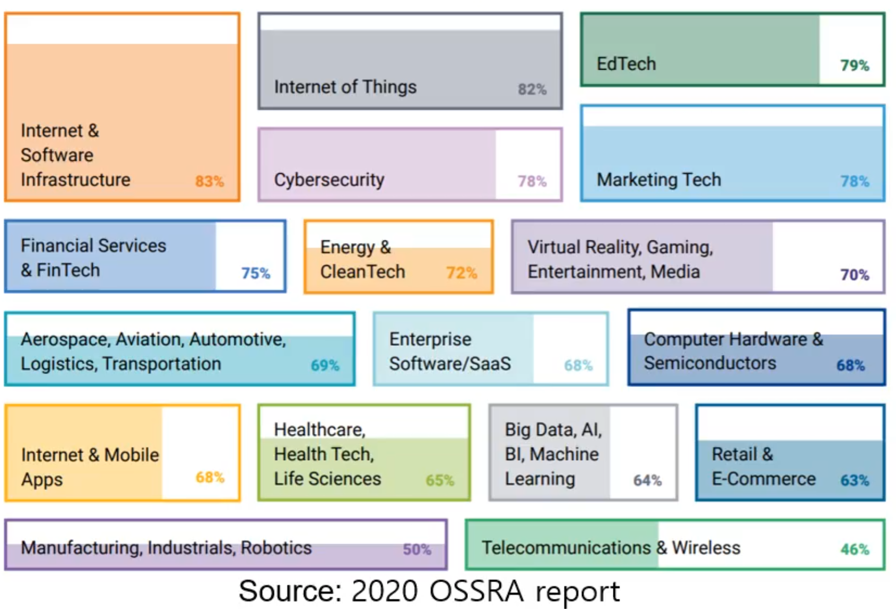 

거의 모든 Commercial Software에서 Open Source Library들이 중심이 돼있는걸 알 수 있다. 

Git 과 같은  codebases에서 사용된 Open source의 비율을 나타낸다.

### Software

> Software란, 컴퓨터, 통신, 자동화 장비와 그 주변창치에 대해서 입력, 출력, 처리가 가능하게 하는 Program 자료를 말한다.
>
> 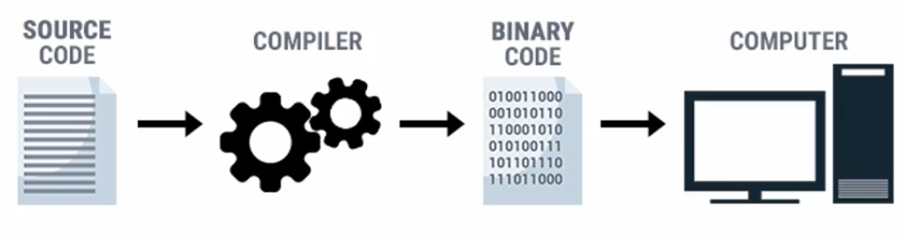 
>
> Source 코드를 컴퓨터가 최종적으로 이해할 수 있도록, Binary Code로 바꾸기 위해 Compile 과정을 거친다.
>
> S/W의 이해, 수정, 관리를 위해 Source Code가 반드시 필요하고, Software라는 용어를 언급할 때, Source Code와 Binary Code를 구분 관리할 필요가 있음.

### Proprietary Software [독점 소프트웨어]

> * 대부분의 나라는 Source Code를 만들면, 그 S/W에 대한 권리, 즉 사용 수정 배포 권리를 '저작권' 이라는 법적 형태로 소유권자에게 부여해준다. **Proprietary Software는 ** 이러한 권리를 주는것, **Free Software의 반대개념** 
>
> * 우리가 Proprietary Software를 구매했다는 것은, **Binary Code**를 사용할 권리를 샀다는 것, 소유권을 산게 아니다. 그래서 **배포할 수 없다. ** 예를들어, 윈도우즈를 구매했다는 것으로, 소스코드를 받고 수정 할 수 없다.
>   * Can't add feature
>   * Can't fix bug
>   * Can't do security audit
> * 미국에서는, 1970년대 Unix OS가 만들어지고, 저작권 법이 진행되어 1980년대부터 이러한 보호가 강력해졌다.  **GNU Project가 시작됨**

### Free Software [중요 - GNU, FSD, FSF, Copyleft]

> * 1980s 사용자의 측면에서 권리를 제약했었음. Free Software 운동이 시작됐고, 1983년에 Richard Stallman에 의해 Free Software라는 용어가 생김 
>
> * **No price가 아닌  'Freedom'**
>
> * 유럽에서는  Free/Libre 라고 한다. 즉 Library뒤에  Libre가 붙은건 Free software 일종이다.
>
> * Free software system = free software 집합, 커널, 시스템 프로그램 등 
>
>   * 이러한  Free Software System을 만들겠다는 것이 **GNU Project**
>
> * ##### 그렇다면 Free software의 free가 주는 자유는 무엇이냐 4가지 - **FSD [Free software Definition]** 중요 !!
>
>   * [1] Program을 어떤 목적이던지 실행할 수 있는 자유
>
>   * [2] Binary code가 아닌,  Software code를 공부하고 변경할 수 있는 자유 - Study & Modify
>
>     --------
>
>     - 이렇게 두 가지가 주어지면 개별 사용자가 어느정도는 사용할 수 있음. 
>     - Free Software 진영은 **end-user** 측면에서 바라본다. 개발자나 회사 기준이 아니다.
>       - end-user 는 개발자가 아닐 수 있음. 다른 전문가에게 배포할 수 있고, 또 다른 목적의 소프트웨어와 겹쳐서 새로운걸 만들 수 있다.
>     - 그렇기에 두 가지가 추가됐다. 
>
>   * [3] 재배포의 자유 - copy본의 재배포가 가능하다.
>
>   * [4] 내가 수정해서 새로운걸 만들었을 때도 배포할 수 있다 - modified version에 대한 배포도 가능
>
> * 이 네 가지가 만족됐을 때 사용자, end-user가 컴퓨터(프로그램) 를 완전히 컨트롤 할 수 있다. 
>
> * FSF - [Free Sofrware Foundation]을 85년도에 만들었다. 
>
> * 또 licence를 만들었다. 이러한 자유를 지키기 위해 (4가지) - **GPL**이 이러한 라이센스 종류중 하나
>
> * Free software를 확산시키기 위한 licence를 - **copyleft** 라고 하며,  GPL도 copyleft licence의 종류 중 하나
>
>   * licence는 권한을 행사하는 방식에 대한 계약

### GNU / Linux

- 83년도에 GNU project가 시작이 됐고, 92년도 경에 거의 완성했는데, 마지막 퍼즐  'Kernal'이 완성이 안됐음.
- 91년도에 Linux Torvalds가 Linux 초기  Kernal을 만들었음. 
- 리눅스 토발즈가 스톨만의 연설을 듣고 GNU를 접하고, 참여하여 마지막 퍼즐로 Linux가 참여하여 GNU Project가 완성됨.
-   

- Linux Kernal, GNU 프로그램들이 여러 조합으로 패키징 되어 리눅스 배포판의 형태로 아마 현존하는 가장 많이 활용되는 OS로 활용되고 있다.

### 그 이후... 

**지금까지는 90년대 초반에 대한 얘기.. 90년대 중반에 인터넷이 등장함 GNU/Linux 조합이 많이 배포됐고,,,기업들 입장에서 거부감이 생김. **

free를 지나치게 강조하다 보니, 무료라는 인식이 퍼졌음. 강한  GPL 조항으로 인해 기업들이 적극적으로 참여하지 못하게됐음.

- GPL 조항이란 - GPL Licence를 따르는 A라는 Source code를 다운받고, 이 source code를 우리가 수정해서 B라는 source code module을 만들었을 때, 이 B source code를 compile 하여 단일 저장물을 형성할 경우,  A와 B를 모두 공개해야하는 의무가 생김. 
- 기업입장에서는 내가 추가로 만든  B가 기술적인 요소가 많을 수 있어 거부감이 생길 수 있다. 

### OSS - Open Source Software

- 그러하여 98년도에 결성된 단채 Open Source Initiative 가 결성됐다.  Opensource.org에서 홈페이지를 확인할 수 있다. 
- Free software와 OSS는 거의 유사한데, 철학, 바라보는 측면이 다르다. 
- Free software 운동은 사용자의  Freedom (사용, 수정, 배포, 재배포) 측면으로 바라본것
- Open Source는 Source code를 '공개하고', 버그를 줄이고 개발 비용 시간 등 과정의 **실용적인 측면**으로 바라본 것
- 또한 구현하는 방법, GNU 정신은 양측에서 유사하다고 인정한다. 구현하는 방식이 다른데, Open Source 진영이 좀더 포용적이고 느슨하다. 
- 느슨하다는 것은 GPL과 같이 수정물을 의무적으로 공개해야하는 의무가 있는데, 이걸 포용적이게 만들었음. 다른 라이센스도 accept 하는 등의 결과를 보인다. 

#### The Cathedral and the Bazaar

- **성당과 시장**
  - Open Source 운동의 동기가 많이 된 essay.. 
  - 성당 모델 (cathedral model)과 시장 모델 (Bazaar Model) 을 비교한다.
  - 두가지 방식에 대한 S/W 개발 방법을 '성당과 시장에' 비유한 내용이다.
  - '성당 모델'
    - 레이몬드가 리눅스를 접하기 전까지 소프트웨어 개발은 성당 모델
    - 몇몇의 뛰어난 전문가들이 조심스럽게 쌓아올리는 방식
    - Source code가 release 때만 공개가 되고, 실제 개발중에는 일부 소수들에게만 제한돼있었음.
  - '시장 모델'
    - 계속 공유가 된다. 
    - Pulic하게 의견을 주고받음. 소란스러우니까 시장 모델에 비유..
    - 매우 효과/효율 적인 소프트웨어 방법론
  - 에세이 주제 [Linus's Law]
    - '보는 눈이 많으면 버그가 줄어든다.'
    - 'Given enough eyeballs, all bugs are shallow'
  - 98년도에 Open source initiative 설립에 큰 동기가 됐음. 

### Open Source Definition

##### 10 가지를 만족해야한다.

1. Free Redistribution - 자유로운 재배포

   - 수취인, Licence가 소프트웨어를 팔든, 주든 제한해서는 안된다.

2. Source Code - 소스코드

   - 소스코드가 필요하다.
   - 합리적이고, 널리 알려진 방법으로 제공되어야한다.

3. Derived Works

   - 파생 저작물
   - 프로그램 제작이 허용되고, 이러한 제작물의 재배포가 허용되어야한다.

4. Integrity of The Author's Source code

   - 소스코드의 원형을 유지해야한다.

   - 불가피하게 소스가 변형이 이루어질때, 원래 Owner가 Patch file이나 여러 조건을 붙힐 수 있는데, 원작자의 

     Copyright 을 명시

5. No Discrimination Against Persons or Groups

   - 개인과 그룹에 차별 금지 

6. No Discrimination Against Fields of Endeavor

   - 특별한 분야에 대한 차별 금지 

7. Distribution of License

   - 라이센스 배포
   - 별도의 라이센스가 없어도, 프로그램을 재배포 받은 라이센스가 기본 적용

8. License Must Not be specific to a Product

   - 특정 제품에만 유효한 라이센스는 금지 

9. License Must Not Restrict Other Software

   - Open source license가 적용된 software와 함께 배포된 다른 소프트웨어에 제한이 포함되면 안된다. 

10. License Must be Technology-Neutral

    - 라이센스는 기술 중립적이어야한다.
    - 인터페이스 등에 의존되어서는 안된다.

### Open Source Foundations

- Free software Foundation과 Open Source Initiative는 매우 유사하지만 급진적인 차이.
- 공공의 적은 'proprietary Software' 라고 명시돼있음.ㅋㅋ 
- 83년도 free software 운동부터 90년대 후반 Open source 운동까지는 철학/사상적으로 Foundation이 생기고
- 지금, 현재는 이 제단 [foundation]이 '기술 중심적으로' 세분화되어있음.
  - Apache Software Foundation
  - Linux Foundation
  - Mozilla Foundation
  - Eclipse Foundation
  - OpenJS Foundation
- Foundation에서 기술, 법률적인 지원을 받을 수 있음. 

### Shareware, Freeware and FOSS

- FOSS (Free and Open Source Software)
  - 미묘한 차이를 갖고있지만, 이를 신경쓰지않고 부르는 명칭 FOSS
  - Free/Libre 도 있기에 FLOSS 라고도 불림 
- Freeware
  - 정확한 정의가 어렵다.
  - Binary 형태로 다운로드 받아서, 마음대로 설치하고 사용하고 복사해서 재배포도 가능하지만, 결과적으로 Source code가 없기에 수정도 안되고, 수정물에 대한 재배포도 안되는 software
- Shareware
  - Binary 형태로 다운로드 받아서 설치하고 복사는 가능한데, 사용하는데 있어서 기능적인 제약, 시간적 제약이 걸려져있는 소프트웨어. 
  - 소스코드가 대부분 제공되지 않음.
- 대부분의 Freeware / Shareware software들은 FS/OSS가 아니다
  - 바이너리 코드만 제공됨 (no source code)
    - 일부가 제공해도, 수정물에 대한 권리를 다양한 형태로 행사함
  - proprietary software라고 보는게 맞음. 

### Open source Demand

- cloud service는 가상화 서비스가 기본 - 물리적인 하드웨어 자원을 효율적으로 논리적으로 제공.

- 가상화 서비스를 위해서는 Xen이나 KVM과 같은 Open source platform /container가 사용됨.

  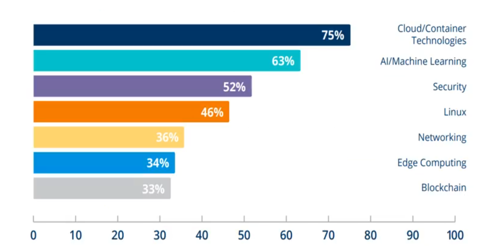  

  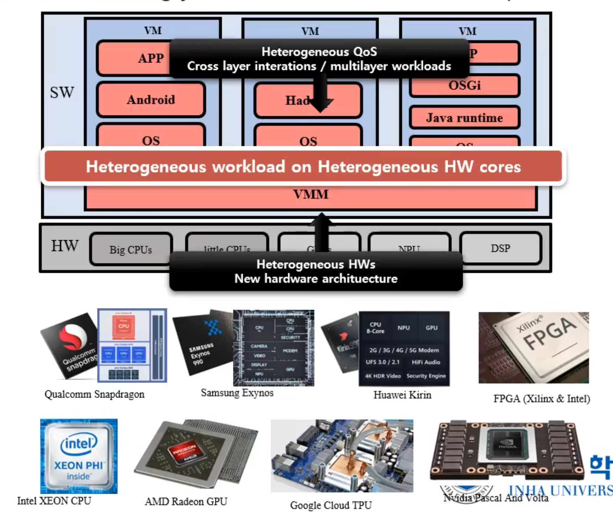 

- 또한 그 안에는 [VM 안에는] 다양한 응용에 맞는 소프트웨어 계층 - Multilayer 구조를 가지고 있다.

- workload가 다 다를 수 있다. AI, 차량 제어 등, workload가 다양하다. 

### Advantages of OSS

오픈소스 소프트웨어의 장점은 무엇일까?

1. Lower Cost
   - 윈도우를 사용하는것보다 Linux를 사용하는게 라이센스비용을 절감한다.
2. 개발 시간과 비용을 줄인다
   - 개발하는데 있어서, 사용하고자하는 오픈소스에 대해 잘 알고, 커스터마이징하는 비용이 크지 않다면, 새로운 코드를 작성하는것보다 빠르고 비용도 적게 된다. 
3. 신뢰성과 성능 (품질) 
   - 오픈소스는 보통 보는눈이 많기때문에 버그도 적고, 공개적으로 테스트 된다.
4. 풍부한 외부 지원
   - 커뮤니티, 공식 레퍼런스를 통해 다양한 도움을 받을 수 있다.
5. Reduces 'Vendor Lock-in' [vendor - 판매자, 파는사람]
   - Opensource s/w는 기술중립적, Vendor 에 종속적인 API 등을 지양한다. 
   - Vendor Lock-in을 해결할 수 있음

**항상 맞다고 할 수는 없지만, 어느정도 정설...**

### Disadvantages of OSS

1. User-Friendly, 친 사용자적이지 않을 수 있다.
   - Open Source Software의 개발 과정은, 목표를 정하고 milestone을 수행하는 과정에서 보통 대다수의 전문가와 사용자가 참여한다.
   - 최적화된 user-friendly 한 api를 갖기 힘들고 정석적/이상적으로 흘러갈 개연성이 높다.
2. 지식 재산권에 Risk가 존재
   - 저작권, 특허에 해당되는 것에 침해할 여지가 있다.
3. Hidden Cost - 잠재적인 코스트
   - 개발 과정에서, 어떤 S/W에 익숙하지 않을 때 Training, support하는데 비용이 추가될 수 있다.
   - Customizing 이 잘 안되고, 통합이 잘 안되면서 비용 발생 risk가 있을 수 있음.

### Myths about OSS

- OSS는 모두 무료다?
  - OSS License들이 조금씩 다 다를 수 있음. 회사의 법무팀등에서 상담할 필요가있음. 
  - 라이센스에서 제공되는 사용 권한을 잘 살펴봐야한다.
- 품질이 나쁠것이다 ?
  - Linux / 윈도우 성능 차이등 도 볼 수 있음
  - OSS 마다 다르다. 잘 알려진건 어느정도 보장되어있음.
- 덜 Secure 할 것이다 ?
  - 평균적으로 bug를 패치하는 시간을 보면, OSS가 보안패치 속도가 빠르다.
  - 일반적으로 잘 알려진 OSS는 보안상으로도 믿을 만 하다.

## OSS Licenses 

- Copyright [저작권]
- Wht do we need Licenses?
- Public Domain
- Copyleft Licenses
  - GPL [조금 Strong]
  - AGPL [조금 Strong]
  - LGPL [덜 Strong]
  - MPL [덜 Strong]
- Permissive Licenses
- License Compatibility - License들 간 법적으로 성격이 다른게 있는데, 양립할 수 없는 문제가 발생하기도한다.

Licenses는 크게 세 가지 [Public Domain, Copyleft Licenses, Permissive Licesnse] 로 분류한다.

**Caveat: 특정 절차를 따르는 통고, 경고**

### Copyright and License

**Copyright [저작권]**

- 창작물을 만들면 자연스럽게 생기는 독점적인 권리. 물론 소프트웨어에 집중해서 알아보자
- 저작권의 권한, 권리는 실행 수정 배포 등을 포함한다. 
- 어떻게 다른 사람들에게 이러한 **권한을** 행사할 것이냐?
- 이러한 권한을 **copyright** 라고 한다. 
- 자연 발생적으로 생긴다는게 중요하다. 저작권 위원회에 등록하지 않는다고 저작권이 없다는것이 아니다.
  - 저작권 위원회에 등록을 한다는 것은, 추종력? 저작권의 일시를 정확히 공공기관에서 인증 받는다는것
  - 저작권 분쟁이 생길 수 있기에, 이러한 인증이 중요해질 수 있다.

**License**

- 라이센스는, 창작자가 누군가에게 자신의 권한을 행사하는 방식의 Permission들, [예를 들어, 너는 실행만 가능, 너는 실행, 수정 가능, 너는 실행 수정 배포 가능 등 ]
- 라이센스는 결국 일종의 계약이다. 
  - Contract between the Licensor [창작자] and the Licensee [수취인]
- 오픈소스 라이센스는 다양한 대부분의 권한을 준다.
- 그러면서 Obligation [의무]가 있다. 지키지 않으면 반환을 해야할 수도있다. 아래와같은 이러한 의무가 있을 수 있다.
  - Attibution: 원저작자를 인정하는 것. 
  - 배포할때 copy of license를 함께 보내라.
  - share-alike: GPL같이 소스코드를 수정하고 그것을 배포할 때 binary로 배포하고 싶어도 **기존과 동일한 조건으로 **ㅂ 배포해라.
  - Patent Royalty Free: 특허, 다른사람한테 배포할 때 특허에 관련된 ...

##### Source Code without a license

- 인터넷에 소스코드만 있고 이걸 사용한다는 것은 굉장히 위험하다.
- 창작물에 대해서는 자연스럽게 저작권 [copyright]이 생긴다.
- 라이센스 없이는 맘대로 수정, 사용, 배포를 해서는 안된다. 

### Copyleft Licenses

- **Free software license + Share-alike license**
  - User에게 freedom 을 제공한다 [FSD]
    - 4가지 freedom 과 권한 freely run, modify and distribute, FSD 노트에 적어 놨음
  - free software 확산을 위해 share-alike 까지 있으면 **copyleft license 라고 한다**
    - share-alike은 동일 조건으로 동일 라이센스를 가지고 변경/배포 할 수 있어야 하는것.
- Reciprocal License [상호주의적인 라이센스] 라고도 불린다.
- 주요 목적은 Proprietary software를 막기 위한 것. 사용자가 Fully control 할 수 있도록.. FSD [/4가지 조건]
- Copyleft는 저작권이 없거나, 저작권이 주어진다는 것이 아닌, **Copyright 저작권 법 틀 안에서 합법적으로 Permission을 준다는 것 **
- 동일 조건에서 변경 내역을 배포한다는 것은 Permissive License와 매우 다른 성향
- copyleft code를 전파하기 위한 것.
- 그래서 viral, spread, propagate 등으로 표현하기도 함. Infect라고도 하지만 하지마셈 걍

### Free Software vs. Open Source

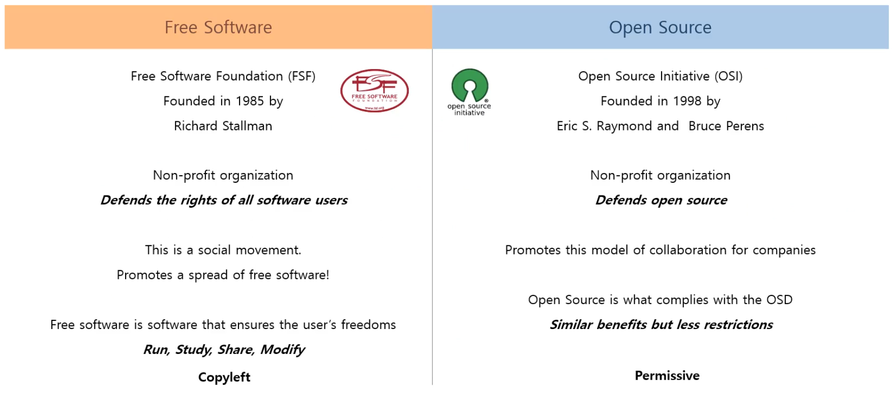 

**Free Software** 

- 사용자의 freedom 을 보장하는 software
- free software를 확산하는게 목적/목표이었고, 사회적인 문제를 파악한 운동이었음. 옳은것이었다.
  - "너가 소스코드를 받아서 사용하고 공헌한게 있으면, Free software 전파를 위해 너도 동일한 조건으로 같이 배포해라"

**Open source**

- 기업들은 분명 Free software에 부담을 느낄수도있음. 같은 조건하에 사용했다면 또 우리가 새롭게 쌓아올린걸 똑같은 조건으로 배포하기 부담스러움.
- Open source Initiative는, Source code를 open하고, 협업 모델을 확산하기 위해서는, 기업들이 참여해야한다. 
- **기업들의 참여를** 확산하기 위해, 좀더 느슨한 정책, Obligation을 줄여야 한다.
- 사용자에게 Freedom을 제공해야 한다는, Free Software의 정의와 OSI에서 정한 10가지 definition은 비슷하지만, 
- Obligation의 차이, 전략적 차이가 존재함.

### Copyleft vs. Permissive License

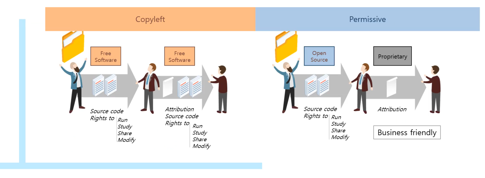 

결국 copyleft license와 permissive license의 가장 큰 차이점은 **Obligation에 중요도가 다르다.**

- Obligation, 수취자가 source code에 공헌, 수정을 했을 때 파생물을 동일 라이센스로 배포해야하는 Obligation이 생기는 것. - **Copyleft**
- Permissive 한 경우, Open source를 사용해서 변경, 수정물이 있어도 파생을 다른 라이센스 혹은 심지어 Proprietary 로 만들 수 있다. 다양한 여지를 남긴다.

### License Categories

> 우리가 소스코드를 창작하면, 나라마다 조금씩 다르지만 **저작권 법**에 의해 보호를 받는다 [**copyright protected**]
>
> 이것은 Open Source이던, Free Software이던 아니든 저작권 법 내에 있는 것.
>
> CopyLeft는 Free / OpenSource Software 에서 Obligation이 강하게 있는것, 좀 약한건 Permissive

1. Public Domain (공공 영역) -> 70년대까지의 소프트웨어, 저작권이 없는 상태

   A.   Copyright protection expired (저작권 만료)

   B.   Anonymous authorship (익명 저자)

### General Public License (GPL) - Copyleft

****

- GNU, GPL은 첫 번째 Copyleft license이다.
- 수정, 배포를 할 때 Source code가 함께 제공이 돼야한다.
- 주의할 점은, GPL 라이센스는 배포시에만 소스코드를 공개하면 된다. 로컬에서 사용, 테스트, 수정은 소스코드를 공개 할 의무가 없다.
- 다른 라이센스와의 호환을 위해 버전 없이 된다. 현재 2017년 버전 GPL version 3

**License Propagation**

- GPL 라이센스의 가장 큰 특징은 **강한 전파력**
- 여러가지 모듈이 하나의 실행파일로 만들어지고 shared space에서 하나의 프로그램으로 간주가 된다면, 모든 소스코드는 사용자에게 공개가 되어야한다.
- Static Linking, Dynamic Linking
- 하나의 프로그램으로 간주된다는 것은, **이 코드로 인한 파생물로 보는 것 **. 다 공개하는 강한 전파력
- 하나의 프로그램이냐, 분리된 프로그램이냐는 굉장히 **모호한 영역**
  - DBMS 코드가 있다면, ex. JDBC, dbms에 접근하기 위한 코드가 있는데 fork, exec 하면 다른 프로그램으로 볼 수 있음.
  - Linux Kernel은 GPL인데 단순히 시스템 콜을 한 경우 라이센스 예외를 적용 받아 전파 안될 수 있다.

##### Static Linking vs. Dynamic Linking

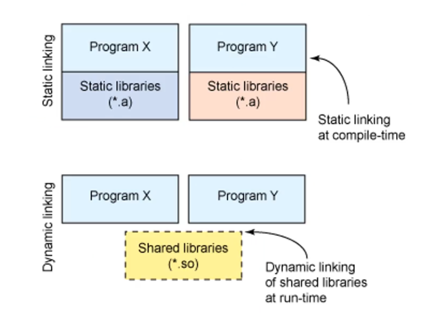 

Static Linking과 Dynamic linking의 차이는, 프로그램에서 미리 만들어진 함수를 재활용하고자 할 때, 이 두 방법으로 나뉜다.

**static linking**

- 실행시간 이전에, 컴파일 타임에 Link
- 리눅스에서는 보통 Static library를 *.a 형태로 확장자로 제공
- 컴파일 타임에 합처지기 때문에, 하나의 executable로 만들어져서 파일 사이즈가 커지는 단점이있음.
- 다만 Linking이 컴파일 시간에 되었던만큼, 실행시간이 보다 더 빠르다.
- 여러개의 응용 프로그램에서 static library를 사용했을 때 각각의 컴파인되는 형태로 붙혀지기에 메모리가 여러개로 비효율적일 수 있음.
- 각각의 static library (*.a)가 버전이 바뀌어도 각각이 연결되어있기 때문에 큰 문제가 발생 안할 수 있음.

**dynamic linking**

- Run-time에 Link, 실행도중에
- 리눅스에서는 보통 Shared Libraries라고, *.so 확장자로 제공
- 하나의 shared address space를 사용하기 때문에 메모리를 좀더 효율적으로 사용할 수 있음.
- Share 하는 경우 버전 관리에 문제가 있을 수 있음. 일관성유지를 위해 고려해야하는 사항이 생긴다

### GNU General Public License (GPL)

> Preamble [서문]
>
> **GPL은 free, copyleft license이다.** copyleft 이라는 것은 obligation이 크고 어디까지 공개하는지 검토 대상이 된다.
>
> 권한이 좀 나와있음
>
> Obligation도 나와있음

### Affero General Public License (AGPL)

- GPL 라이센스를 기본으로 하고 있기 때문에 역시나 **Copyleft License**이다.
- <u>Strong</u> copyleft license 이다. GPL보다 더 강력한 copyleft license임.

**GPL의 문제점**

> Source code를 공개하는 시점이 배포할때만 공개한다.
>
> 허점은, 서버 소스코드의 일부를 GPL 코드로 했을 때 배포하지 않아도 되는 경우.
>
> 서비스를 받는 client 코드와 통신하는 프로토콜 수정 만으로 client 코드에서 서비스를 받기 떄문에 이 소스코드를 배포하지 않아도 된다.
>
> 서버에서 GPL 코드가 수행함에도 사용자에는 단순 remote에서 서비스를 받을 수 있기 때문에, 허점이 존재한다.
>
> 이걸 해결하기 위해, 배포할때 뿐만 아니라, 실행하고 클라이언트에서 접속할 때도 소스코드를 공개하도록, 강력하게 
>
> \>> AGPL
>
> 2007년도에 AGPL v2 까지 나옴

### Lesser General Public License (LGPL)

- 조금은 'weak'한 copyleft license. FSF [Free software foundation]에서 만들어짐.
- GPL, AGPL 보다 obligation이 약함
  - **non-copyleft < LGPL < GPL < AGPL** 
  - 순으로 obligation 강력도를 나타낼 수 있음.
- Strong Copyleft와 non-copyleft의 중간 타협점..
- Standard C, GNU C Library를 사용한다면, 이게 GPL이라면 license propagation, dynamic이던 static이던 c library를 참조한다면, 전파가 된다. 
- Program + Library [linking 관계로 연결되어진경우 ] GPL은 파생으로 보고 다 공개한다.
- **그래서 static linking이나 dynamic linking 됀 경우는 Obligation을 주지말자**. 
  - 같은 File 에서만 수정된 부분으로 공개하면 된다
- LGPL 코드가 만약 shared library 형태로 사용이 됐다면 (Proprietary 이던 아니던,,), **LGPL 파트쪽의 수정사항만 공개하면 된다** ! 즉, 전파를 끊을 수 있음.
- Static linking 과 dynamic linking의 경계선의 모호한 부분이 있음. 
  - 일반적으로 Dynamic linking 같은 경우, 안전하게 LGPL code를 사용해도 공개할 의무가 없음.
- LGPL --> Library GPL에서 이름을 바꿨음.. Lesser로

### Mozilla Public License (MPL)

- **Weak copyleft license**
- Mozilla Foundation에서 2012년에 version 2.0 를 발표
- Weak copyleft인 만큼 hybrid한 성질이 있음. 
  - 수정한 것은, GPL copyleft 전략을 따르고, 아닌것은 non-copyleft 전략을 따른다
- **중요한것! ** 
  - "**File-level**" copyleft
  - 즉, MPL 라이센스에서 수정/변경이 이루어지면 소스코드를 공개해야한다
  - 다른 파일에서 추가한 것이면, 다른 라이센싱 전략을 취해도 된다.
  - MPL Source code의 수정물은 Copyleft Obligation, 부가적인것은 아니다.
  - Ecliipse Public License도 존재, 비슷한데, file-level이 아닌, module-level

### Written Offer

- Copyleft license의 issue !
  - Source code를 어떻게 제공할 것이냐 ?
  - 보통 배포시에 제공하는데, Object code나 실행 파일을 제공시에 어떤 저장 메체에 소스코드를 담아서 줄 수 있음.
  - 근데 embedded system (셋업박스, 스마트 티비 등)에서는 실행 파일 (executable file)이 이미 내장돼있다.
  - 보통은 written offer [**약정서**] 에 사용자가 요청하면 소스코드를 후에 주는 방법을 제공해야한다.
  - 삼전, LG 등 모두 URL로 제공한다. ex. https://opensource.samsung.com/index.jsp
  - 저작권에 대한 라이센스 등의 소스코드를 후에 제공하는 방식.

### Permissive Licenses

- Permissive license는 copyleft license와 다르다
  - copyleft license는 정도의 차이는 있지만, 최소환 LGPL, MPL등 weak copyleft license도 최소한 그 copyleft license 파트 만큼은 소스코드를 공개해야하는 obligation이 존재
  - Permissive license는 이러한 obligation 자체가 없다
- Obligation 없이, 마음껏 사용, 수정이 가능하다
- 심지어 proprietary software로 사용할 수 있다.
- **No copyleft / No Reciprocal**
  - Obligation이 존재하긴 하는데, **copyright notice**, **warranty disclaimers** 등 이 존재한다.
    - copyright 알림
    - 보증
- 대표적인 Permissive Licenses
  - BSD License
  - MIT License
  - Apache License
- 개발자 측면의 진정한 자유..
- 물론 Copyleft license도 end-user 관점에서는 자유롭지만, Permissive license는 개발자가 사용하고 소스코드를 공개할지 말지를 정할 수 있음.

### Why Open Source ? (even with permissive licenses)

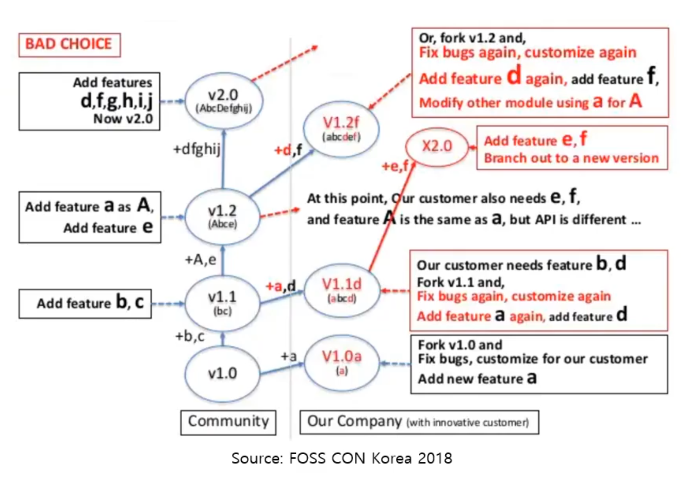 

Permissive License는 Obligation이 없기때문에 공개하지 않아야 된다는 생각이 있을 수 있다. 그런것들이 잘못된 것이라는걸 보여주는 자료임..

- X 라는 Open source를 community에서 fork 하여 사용했다고 해보자.
- 회사에서 A라는 기능을 추가, 및 버그 수정해서 사용 V1.0a
- 이 지점에서 B와 D의 요구사항 생김 --> update 하여 v1.1(b,c) 생김. 
- 이때 permissive license라는 가정으로 merge를 하지 않았다고 하면, b, c에 기존의 a를 추가하고 새로운 d를 추가하면서 **중복이 생긴다**
- a라는 기능을 아까 수정 했었는데, merge가 안돼있어서 v1.1 (b,c)에 a를 추가하는 작업이 생긴다.
- 또 v1.2(Abcde) 라는게 기존 1.1에서 a를 약간 수정해서 A, 그리고 e라는게 추가됐다 가정해보자
- 이 상황에서 회사에서 e, f 기능이 추가되면,, 선택의 기로에 놓인다. 우리의 버전 v1.1d(abcd) 에다가 e,f를 추가하던지, 또는 기존의 community에 있는 v1.2(Abcd)를 fork받아서 추가 작업을 해야한다.
- 이런경우가 반복적으로 발생한다. 즉 기존의 작업을 또 해야한다.
- <u>생산적인건 검정색 [즉 새로운 것 추가], 빨간건 중복되는 작업이라 볼 수 있다.</u>
- 즉 공개하지 않았을때, [merge하지 않았을 때 ] 나쁜 선택이 될 수 있음을 보인다.

**Merge를 한 경우, 공개한경우**

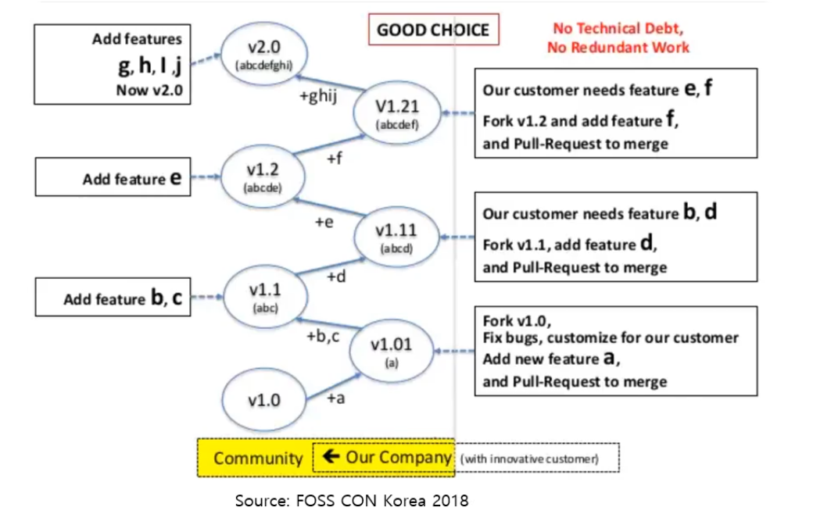 

- 동일하게 v1.0에 a라는 기능 추가 --> v1.01(a) 후에 merge
- community에서 b,c를 추가 --> 우리는 d가 필요하면 이 v1.1(abc)에 d기능 추가
- 중복된 work가 없다.
- 생산적이다.
- Open source를 사용하는데 community에 merge를 함으로써 **유지보수의 책임이** community에 있다
  - 유지보수 책임이 줄어든다.
- 이렇게 개발하는것이 Open source 측면에서 [즉 공개하는 것이] 효율적이다.
- 이것의 가정은 community의 update가 활발해야하고, 요구사항이 많은경우 더 효율적

### License and Project Examples

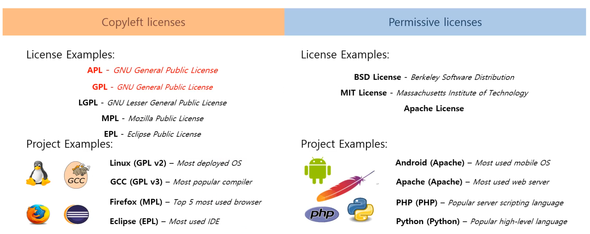

**Copyleft licenses와 Permissive licenses의 정리**

Copyleft license

- Strong copyleft license
  - AGPL - GNU General Public License
  - GPL - GNU General Public License
- Weak copyleft license
  - LGPL - GNU Lesser General Public License
  - MPL - Mozilla Public License
  - EPL - Eclipse Public License

- 대표적인 프로젝트
  - Linux
  - GCC
  - Firfox
  - Eclipse

Permissive License:

- BSD License - Berkeley Software distribution
- MIT License - 
- Apache License

- Project
  - Android (Apache)
  - Apache (Apache)
  - PHP (PHP)
  - Python (Python)

### Open Source Licenses and Compatibility

- 호환성

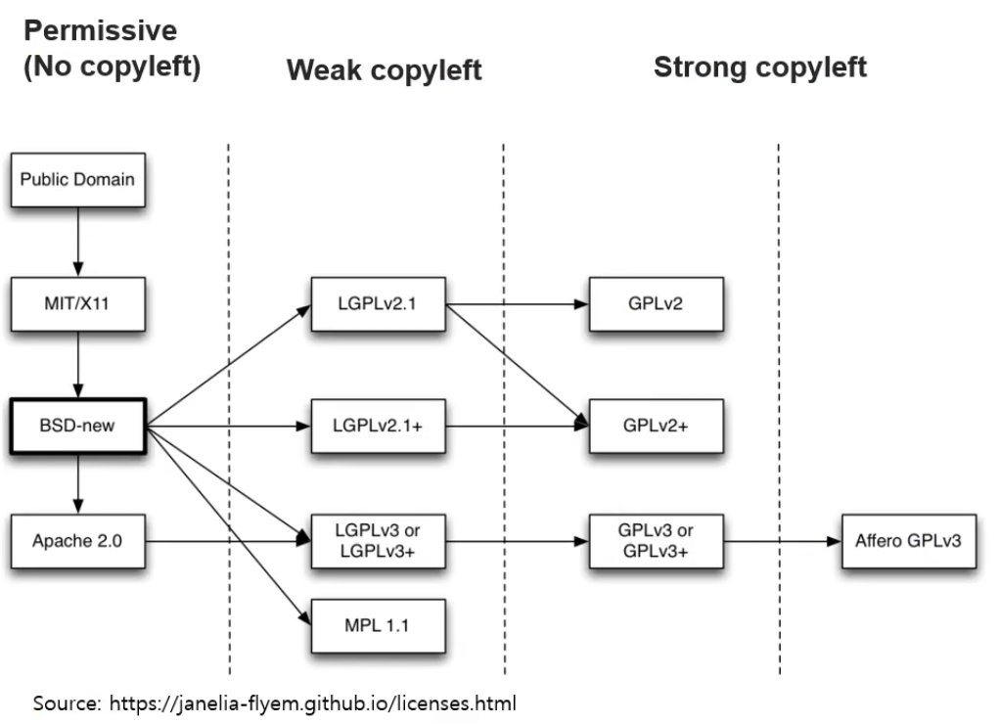 

지금까지 대표적으로 Permissive / Weak copyleft / Strong copyleft로 살펴봤음

이러한 대표적인 라이센스 말고도 알려진것만 2,000여가지가 넘는게 있고, 각 라이센스는 서로가 정의한 Permission,  Obligation이 다르다. **서로 양립할 수 없는 condition이 존재한다.** 예를들어 특허나, obligation

이런걸 호환성이라 한다

대표적으로 Apache 2.0과 GPLv2+가 호환이 안되서 버전이 올라감 GPLv3

최근 해결 방법으로 듀얼 라이센스로, 문제가 생겼을 때 선택할 수 있도록 할 수 있다. 

또는 hybrid license..

중요한 것은 개발하는 시점에 다양한 open source 를 사용하게 되고, 각 open source의 license를 확인해야 하며 그 라이센스의 obligation이 매우 중요하다. 어떤 소스코드를 공개하는 범주 obligation이 copyleft인데, 그 종류가 다양하기에 꼭 확인해야한다. 또한 호환성 문제가 있기에 이 부분도 open source를 사용해서 설계시에 검토해야한다.

