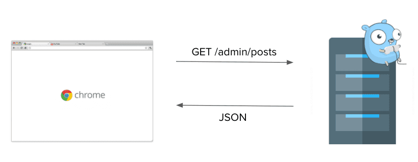
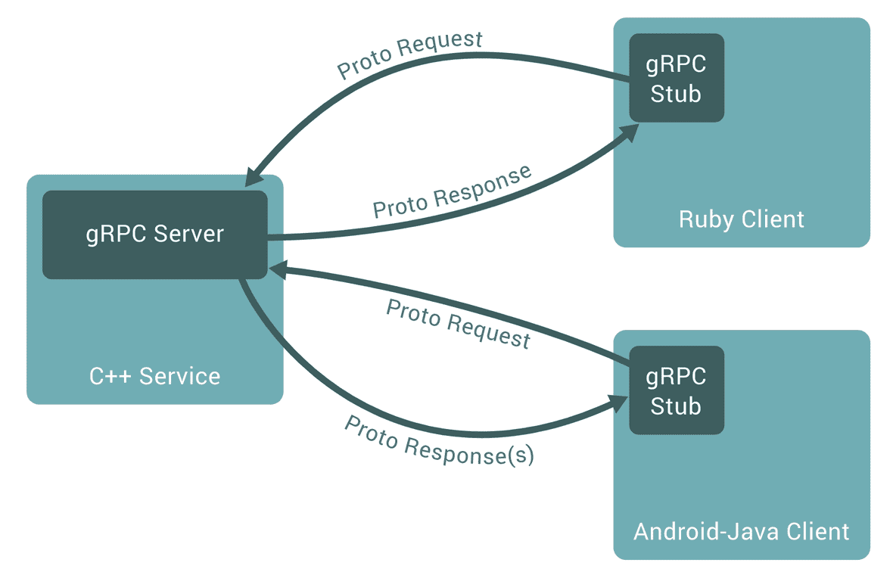

# gRPC (google Remote Procedure Call)

> gRPC 는 Google 에서 개발한 최신 오픈 소스 고성능 RPC (remote procedure call) 프레임워크이다.
> 
> Google 이 만든 protobuf (a.k.a protocol buffer) 라는 방식을 사용해 RPC 라는 protocol data를 주고받는 플랫폼이다.

## RPC (Remote Procedure Call)

원격 제어를 위한 코딩 없이 다른 주소 공간에서 함수나 프로시저를 실행할 수 있게 해주는 *Process 간의 통신 기술이다.*

MSA (Micro Service Architecture) 구조의 서비스에서 여러가지 언어 & 프레임워크로 개발이 진행되었을 때, 각 컴포넌트 간에 RPC를 이용하여 언어적 차이에 영향없이 원격 프로시저를 호출하여 사용할 수 있게 해준다.

즉, 이러한 MSA 환경에서 원격으로 별도 서비스 애플리케이션의 메소드를 나의 로컬 메서드 처럼 호출할 수 있어 통합 시스템 구성하기가 보다 용이하다.

gRPC (google 개발 RPC)는 RPC 시스템과 마찬가지로, 서비스를 정의하고 서비스에 필요한 매개변수와 반환 값을 가지는 메서드를 만든다는 아이디어를 갖고있다.

## gRPC 와 HTTP API 차이

gRPC에 대해 알아보기 전에, 기존에 다른 서비스의 메소드 호출을 통한 결과값 공유를 JSON을 활용한 HTTP API와의 비교로 생각해보자.

HTTP API는

- `server <-> client`

- `server <-> server`

두 관계 간 서로 데이터를 주고 받을 때 사용되는 통신 방법이다.

HTTP API는 위와같은 형식으로 데이터를 주고받는다고 할 수 있다.

다음은 [gRPC 홈페이지 | Introduction to gRPC](https://grpc.io/docs/what-is-grpc/introduction/) 에서 확인할 수 있는 통신 예제 사진이다.

HTTP API와 비슷하게, 각 서버 및 Client와 통신을 주고 받고있다. 

다만 차이점이라면,

HTTP API의 GET, POST, PUT 등 이 아닌, ***Proto Request*** 를 이용하여 전달하고, JSON을 response 받는 게 아닌, ***Proto Response(s)*** 를 전달받는다.

결국 gRPC도 

- `server <-> client`

- `server <-> server `

간의 통신 기법이다.

다음은 Microsoft 에서 제공하는 gRPC <-> HTTP API 간의 차이를 표로 나타낸 것이다.

| 기능          | gRPC                                                                                                                       | JSON을 사용하는 HTTP API   |
| ----------- | -------------------------------------------------------------------------------------------------------------------------- | --------------------- |
| 계약          | 필수(`.proto`)                                                                                                               | 선택 사항(OpenAPI)        |
| 프로토콜        | HTTP/2                                                                                                                     | HTTP                  |
| Payload     | [Protobuf](https://docs.microsoft.com/ko-kr/aspnet/core/grpc/comparison?view=aspnetcore-6.0#performance)(소형, 이진)           | JSON(대형, 사람이 읽을 수 있음) |
| 규범          | [엄격한 사양](https://docs.microsoft.com/ko-kr/aspnet/core/grpc/comparison?view=aspnetcore-6.0#strict-specification)            | 느슨함. 모든 HTTP가 유효합니다.  |
| 스트리밍        | [클라이언트, 서버, 양방향](https://docs.microsoft.com/ko-kr/aspnet/core/grpc/comparison?view=aspnetcore-6.0#streaming)               | 클라이언트, 서버             |
| 브라우저 지원     | [아니요(gRPC-웹 필요)](https://docs.microsoft.com/ko-kr/aspnet/core/grpc/comparison?view=aspnetcore-6.0#limited-browser-support) | 예                     |
| 보안          | 전송(TLS)                                                                                                                    | 전송(TLS)               |
| 클라이언트 코드 생성 | [예](https://docs.microsoft.com/ko-kr/aspnet/core/grpc/comparison?view=aspnetcore-6.0#code-generation)                      | OpenAPI + 타사 도구       |

## gRPC 장점

gRPC 의 장점은 다음과 같다.

1. FAST (성능 good)
   
   - gRPC는 효율적인 binary message 형식인 Protobuf (Protocol Buffer)를 사용하여 Serialize (직렬화) 한다.
   
   - Protobuf 는 서버 & 클라이언트에서 매우 빠르게 직렬화 한다. 매우 작은 messsage paylod 를 발생시키기에 모바일 앱 과같은 제한된 대역폭 시나리오에서 매우 중요하다.
   
   . HTTP 1.x에 비해 HTTP 의 주요 개정판인 HTTP/2 용으로 설계되었다.
     
     . 이진 프레이밍 및 압축, HTTP/2 프로토콜은 간단하고, request/response 모두 효율적이다.
     
     . 동일한 연결로 병렬적인 요청을 처리할 수 있고, 연결을 유지해서 connection을 매번 하는데 사용되는 cost도 줄일 수 있다.
     
     . 단인 TCP 연결보다 여러 HTTP/2 호출의 multiplexing (멀티플랙싱).

2. 엄격한 사양
   
   - gRPC를 통한 통신을 위해서는 protobuf 로 어떻게 데이터를 주고받을지 사전 정의가 필요하다 (JSON 처럼?). 
   
   - 이러한 사전 정의 가이드가 **코드**로 생성되기 때문에 별도의 API 문서가 필요로 하지 않다.
   
   - gRPC 개발의 핵심 파일은 gRPC 서비스 및 메시지의 계약을 정의하는 [.proto file](https://developers.google.com/protocol-buffers/docs/proto3) 이다.
