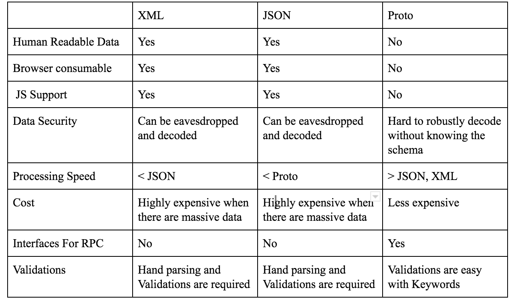
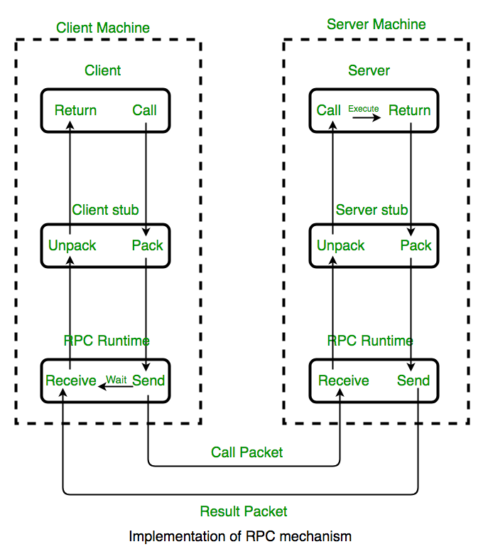
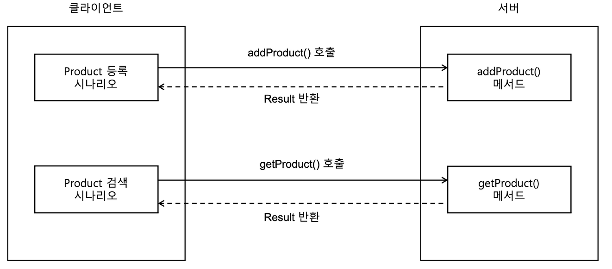
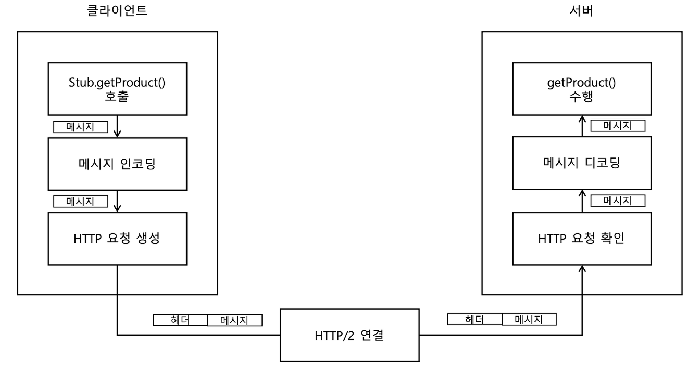
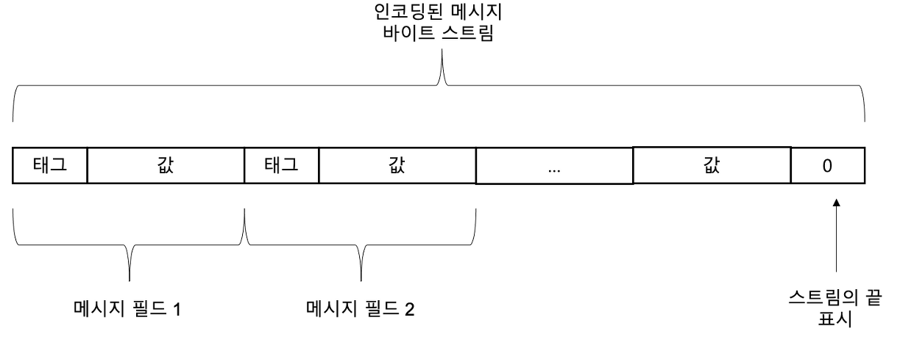
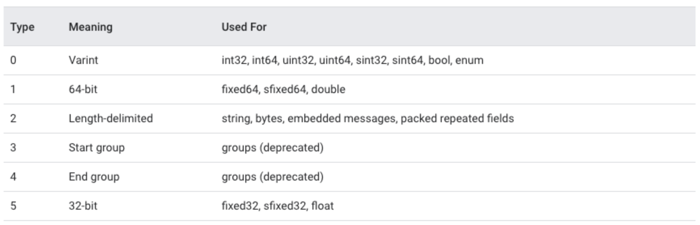
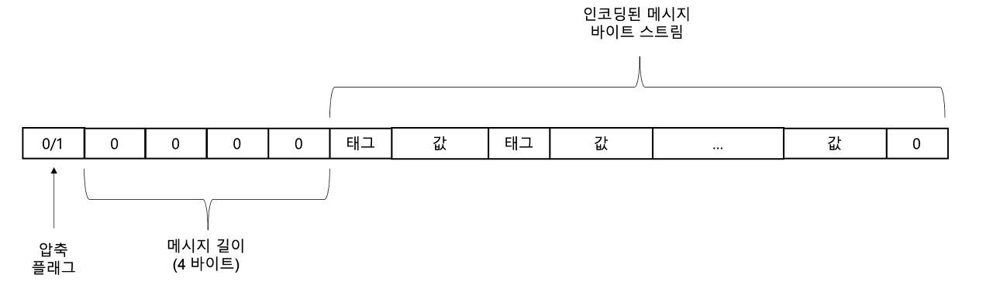
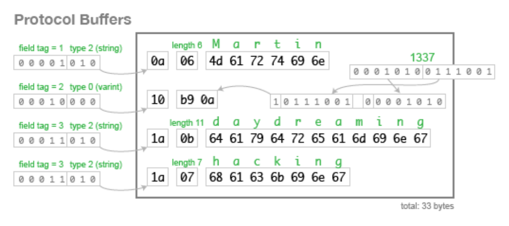

# gRPC (google or general Remote Procedure Call)

> gRPC 는 Google 에서 개발한 최신 오픈 소스 고성능 RPC (remote procedure call) 프레임워크이다. [Protocol Buffers | Google Developers](https://developers.google.com/protocol-buffers/)
> 
> Google 이 만든 protobuf (a.k.a protocol buffer) 라는 방식을 사용해 RPC 라는 protocol data를 주고받는 플랫폼이다.
> 
> 이름은 gRPC 여서 google 인가 ? 했지만 general 이라는 소리도 있다.

## RPC (Remote Procedure Call)

원격 제어를 위한 코딩 없이 다른 주소 공간에서 함수나 프로시저를 실행할 수 있게 해주는 *Process 간의 통신 기술이다.*

MSA (Micro Service Architecture) 구조의 서비스에서 여러가지 언어 & 프레임워크로 개발이 진행되었을 때, 각 컴포넌트 간에 RPC를 이용하여 언어적 차이에 영향없이 원격 프로시저를 호출하여 사용할 수 있게 해준다.

즉, 이러한 MSA 환경에서 원격으로 별도 서비스 애플리케이션의 메소드를 나의 로컬 메서드 처럼 호출할 수 있어 통합 시스템 구성하기가 보다 용이하다.

gRPC (google 개발 RPC)는 RPC 시스템과 마찬가지로, 서비스를 정의하고 서비스에 필요한 매개변수와 반환 값을 가지는 메서드를 만든다는 아이디어를 갖고있다.

gRPC 뿐 아니라, 여러 유명 software 회사에서 자체적으로 구현한 RPC 구현체들이 있다.

1. `ProtocolBuffer (Protobuf)` by Google

2. `Thrift` by Facebook

3. `Finalge` by Twitter

4. `Armeria` by LINE
   
   - [Armeria - LINE Engineering blog](https://engineering.linecorp.com/ko/blog/introduce-armeria)
   
   - [GitHub - line/armeria](https://github.com/line/armeria)

다음은 Wikipedia 에서 설명하는 RPC 개념이다.

> 원격 프로시저 호출(영어: remote procedure call, 리모트 프로시저 콜, RPC)은 별도의 원격 제어를 위한 코딩 없이 다른 주소 공간에서 함수나 프로시저를 실행할 수 있게하는 프로세스 간 통신 기술이다. 다시 말해, 원격 프로시저 호출을 이용하면 프로그래머는 함수가 실행 프로그램에 로컬 위치에 있든 원격 위치에 있든 동일한 코드를 이용할 수 있다.
> 
> *from [Wikipedia](https://ko.wikipedia.org/wiki/%EC%9B%90%EA%B2%A9_%ED%94%84%EB%A1%9C%EC%8B%9C%EC%A0%80_%ED%98%B8%EC%B6%9C)*

## gRPC 와 HTTP API 차이

gRPC에 대해 알아보기 전에, 기존에 다른 서비스의 메소드 호출을 통한 결과값 공유를 JSON을 활용한 HTTP API와의 비교로 생각해보자.

HTTP API는

- `server <-> client`

- `server <-> server`

두 관계 간 서로 데이터를 주고 받을 때 사용되는 통신 방법이다.


HTTP API는 위와같은 형식으로 데이터를 주고받는다고 할 수 있다.

다음은 [gRPC 홈페이지 | Introduction to gRPC](https://grpc.io/docs/what-is-grpc/introduction/) 에서 확인할 수 있는 통신 예제 사진이다.


HTTP API와 비슷하게, 각 서버 및 Client와 통신을 주고 받고있다. 

다만 차이점이라면,

HTTP API의 GET, POST, PUT 등 이 아닌, ***Proto Request*** 를 이용하여 전달하고, JSON을 response 받는 게 아닌, ***Proto Response(s)*** 를 전달받는다.

결국 gRPC도 

- `server <-> client`

- `server <-> server `

간의 통신 기법이다.

다음은 Microsoft 에서 제공하는 gRPC <-> HTTP API 간의 차이를 표로 나타낸 것이다.

| 기능          | gRPC                                                                                                                       | JSON을 사용하는 HTTP API   |
| ----------- | -------------------------------------------------------------------------------------------------------------------------- | --------------------- |
| 계약          | 필수(`.proto`)                                                                                                               | 선택 사항(OpenAPI)        |
| 프로토콜        | HTTP/2                                                                                                                     | HTTP                  |
| Payload     | [Protobuf](https://docs.microsoft.com/ko-kr/aspnet/core/grpc/comparison?view=aspnetcore-6.0#performance)(소형, 이진)           | JSON(대형, 사람이 읽을 수 있음) |
| 규범          | [엄격한 사양](https://docs.microsoft.com/ko-kr/aspnet/core/grpc/comparison?view=aspnetcore-6.0#strict-specification)            | 느슨함. 모든 HTTP가 유효합니다.  |
| 스트리밍        | [클라이언트, 서버, 양방향](https://docs.microsoft.com/ko-kr/aspnet/core/grpc/comparison?view=aspnetcore-6.0#streaming)               | 클라이언트, 서버             |
| 브라우저 지원     | [아니요(gRPC-웹 필요)](https://docs.microsoft.com/ko-kr/aspnet/core/grpc/comparison?view=aspnetcore-6.0#limited-browser-support) | 예                     |
| 보안          | 전송(TLS)                                                                                                                    | 전송(TLS)               |
| 클라이언트 코드 생성 | [예](https://docs.microsoft.com/ko-kr/aspnet/core/grpc/comparison?view=aspnetcore-6.0#code-generation)                      | OpenAPI + 타사 도구       |

## gRPC 장점

gRPC 의 장점은 다음과 같다.

1. FAST (성능 good)
   
   - gRPC는 효율적인 binary message 형식인 Protobuf (Protocol Buffer)를 사용하여 Serialize (직렬화) 한다.
   
   - Protobuf 는 서버 & 클라이언트에서 매우 빠르게 직렬화 한다. 매우 작은 messsage paylod 를 발생시키기에 모바일 앱 과같은 제한된 대역폭 시나리오에서 매우 중요하다.
   
   . HTTP 1.x에 비해 HTTP 의 주요 개정판인 HTTP/2 용으로 설계되었다.
   
     . 이진 프레이밍 및 압축, HTTP/2 프로토콜은 간단하고, request/response 모두 효율적이다.
   
     . 동일한 연결로 병렬적인 요청을 처리할 수 있고, 연결을 유지해서 connection을 매번 하는데 사용되는 cost도 줄일 수 있다.
   
     . 단인 TCP 연결보다 여러 HTTP/2 호출의 multiplexing (멀티플랙싱).

2. 엄격한 사양
   
   - gRPC를 통한 통신을 위해서는 protobuf 로 어떻게 데이터를 주고받을지 사전 정의가 필요하다 (JSON 처럼?). 
   
   - 이러한 사전 정의 가이드가 **코드**로 생성되기 때문에 별도의 API 문서가 필요로 하지 않다.
   
   - gRPC 개발의 핵심 파일은 gRPC 서비스 및 메시지의 계약을 정의하는 [.proto file](https://developers.google.com/protocol-buffers/docs/proto3) 이다.

## gRPC 단점

1. 브라우저 통신 미지원.
   
   - 현재까지 브라우저 <-> 서버 간 gRPC 통신이 지원되지 않는다.
   
   - 브라우저 에서는 jSON으로 요청하면 *grpc-gateway* 를 통해 protobuf 형식으로 변환하고 사용한다.

2. Human Readable 하지 않다.
   
   - HTTP API의 경우는 사람이 읽고 만들 수 있다.
   
   - gRPC는 protobuf로 encoding 되기 때문에 송/수신에는 효율적이지만 binary 형식으로 사용자가 메시지를 읽을 수 없다.
   
   - protobuf 메시지는 json 변환을 제공하긴 한다.
   
   - 다음은 XML vs. JSON vs. PROTO의 비교 차트이다.
     
     
     
     <출처: [gRPC 1 - gRPC란?](https://chacha95.github.io/2020-06-15-gRPC1/)>

## HTTP/2

> gRPC는 HTTP/2 용으로 설계되었는데, 이 HTTP/2가 무엇인지 간략하게 알아보자.
> 
> HTTP/2은 HTTP/1.1 의 Protocol을 상속/계승하여 동일한 API이면서 더 나은 성능을 제공한다.

- Multiplexed Streams
  
  - 하나의 connection으로 **동시에** 여러 개의 메시지를 주고받을 수 있으며, Response는 순서 상관없이 stream으로 주고 받는다.

- Stream Prioritization
  
  - 리소스 우선순위 (Priority)를 설정해서, Client에게 우선순위가 높은 resource를 먼저 보내줄 수 있다.

- Server Push
  
  - 서버는 클라이언트 요청에대한 응답 뿐 아니라, 직접 리소스를 보내줄 수 있다. (**양 방향 통신**)

- Header Compression
  
  - Header Table & Huffman Encoding  방식 (HPACK 압축 방식)으로 압축을한다.
    
    > HPACK 압축 방식: 데이터 문자의 빈도에 따라서 다른 길이의 부호를 사용하는 알고리즘이다.

- 다음은 HTTP 1.0과 Pipelining (HTTP 1.1) 그리고 HTTP/2의 차이를 보여준다.
  
  

## gRPC 동작 (RPC 동작 방식)

gRPC 의 동작원리를 알아보기 전에, 핵심 개념을 정리하자.

### Stub

gRPC 뿐 아니라 RPC 자체의 핵심 개념이 바로 `stub` 이다.

서버와 클라이언트는 서로 다른 주소 공간을 독립적으로 갖고 있다.

Server: `http://localhost:8080` & Client: `http://localhost:8081`

함수 호출에 사용되는 매개변수를 변환하는 작업이 필요하다.

이러한 변환을 Stub 에서 담당한다.

> 클라이언트가 서버에 존재하는 원격 메서드의 추상화를 제공하는 `stub` 객체를 통해 메소드를 이용하게 된다.

### Marshalling & Unmarshalling

Stub는 Client & Server 각각에 존재한다.

Client Stub는 함수 호출에 사용될 *Parameter*를 **변환한다.** 

- 이를 **Marshalling** 이라고 한다!

Server Stub는 client가 전달한 *Parameter*를 **역 변환한다.** 

-  이를 **Unmarshalling** 이라고 한다.

또, 함수 실행 결과를 반환한다.

### RPC 동작을 순서대로 봐 보자.



1. Client가 필요한 parameter를 넘겨 **client stub** proceture를 호출한다.
   
   - client stub은 클라이언트 주소 공간 내에 존재한다.

2- client stub이 parameter 들을 메시지로 모은다.

- Message를 모을 때 표준 포맷 (gRPC라면 여기서 protobuf)으로 변경하고, parameter를 복사해서 메시지로 넣는작업이다.

- 즉, Marshalling 작업 

3- client stub이 원격 server machine으로 메시지를 보내기 위해 transport layer로 메시지를 보낸다.

4- server에서 transport layer는 메시지를 server stub으로 보낸다. server stub 에서 전달받은 parameter 들을 모아주고, 일반적인 procedure call machanism 으로 서버 루틴을 호출한다.

5- 서버 프로시저가 완료될 때, 서버 프로시저는 server stub으로 반환된다. (이를테면 일반적인 프로시저 호출 반환값을 통해), server stub은 결과 값들을 모아서 메세지에 넣고, transport layer에 메세지를 보낸다.
6. transport layer는 결과 메세지를 다시 client transport layer로 보내고 client transport layer는 그 결과를 또 client stub에게 전달한다.
7. client stub은 반환 파라미터들과 실행 결과값을 다시 해체한다.

좀 더 알아보기 쉽게, 클라이언트 <-> 서버 간 product 통신을 예시로 봐 보자.



위와같은 시나리오로 작동되고자 한다. 이럴 때 RPC를 이용하면 다음과 같다.



client의 stub 객체의 getProduct 메소드를 호출하면, stub은 서버로 전송하고자 하는 메시지 (데이터) 를 구성하고 Encoding 하여 메시지를 만든다 (Protobuf, gRPC라면 2진형식으로 encoding 되어 전달된다).

만들어진 encoding message에 HTTP 헤더를 추가하여 요청을 생성하고, HTTP/2 연결 네트워크를 통해서 서버로 전송된다.

> 즉, gRPC는 **메시지를 인코딩 하는 방식의 차이와, HTTP / 2 연결**을 통한 전송을 이용하는 RPC 이다.

그렇다면 gRPC의 고유 기능인 Protocol Buffer (protobuf) 가 어떻게 동작하는지 알아보자

### Protocol Buffer (Protobuf)

위에서 설명했다 시피, gRPC는 message encoding 과정에서 Protocol Buffer를 사용한다.

Protocol Buffer는 JSON, XML과 마찬가지로 직렬화 (Serialized) 데이터 구조이다. 다른 구조에 비해 데이터의 크기가 작다.

Protocol Buffer의 인코딩 된 message (encoded message)의 byte stream 구성은 다음과 같다.



태그 & 값

- 태그는 필드 인덱스와 와이어 타입, 두 가지로 만들어진다.

```protobuf
message Product {
    string id = 1;
    string name = 2;
    string description = 3;
    float price = 4;
}
```

`.proto` 파일에 메시지를 정의 할 때 각 field에 **할당한 고유 번호**가 바로 **필드 인덱스**이다.

다음은 제공되는 와이어 타입 테이블이다.



필드의 데이터 값을 인코딩 할 때 Protocol Buffer는 위 그림과 같이 여러 데이터 타입에 따라 다른 인코딩 기술을 사용한다.

- 문자열 String은 UTF-8을 이용해 인코딩하고

- int32 값은 가변 길이 정수 인코딩 기술을 사용한다.

네트워크로 메시지를 전송하기 전에, Message Framing (메시지 프레이밍) 과정이 먼저 존재한다.

- gRPC는 `길이-접두사 지정 메시지 프레이밍` 기술을 사용한다.

- 이는, 메시지 자체를 전송하기 전, **각 메시지의 크기를 기록하는** 프레이밍 방식이다.



너무 내부로 깊이 들어가기보다는, JSON과의 직렬화 후 메시지 바이트 스트림의 크기 비교를 간략하게 해보자.

Person 객체를 JSON 포멧으로 만든다면 다음과 같다.

```json
{
    "userName" : "Martin",
    "favoriteNumber" : 1337,
    "interests" : [
        "daydreaming", "hacking"
    ]
}
```

공백을 제외하고 총 82Byte를 사용했다.

다음은 Protocol buffer 사용하여 인코딩 된 메시지이다.



33 byte의 메모리 공간을 사용하게 되었다. 

위와 같이 직렬화 하게된 설명을 `.proto` 파일에서 다음과 같이 정리할 수 있다.

```protobuf
message Person {
    required string user_name = 1;
    optional int64 favorite_number = 2;
    repeated string interests = 3;
}
```

userName 과 같은 불필요한 속성값을 숫자 (1, 2, 3, ...) 등으로 대체하였다.

데이터의 1 byte 를 5 bit, 3 bit 로 나누어서

- 5 bit 에는 proto file에 달아놓은 태그 (번호)

- 3 bit 는 type (string 등) 을 나타낸다.

그래서, 변환 된 데이터의 구조는

- 1 바이트: 메타 정보 (5 bit의 태그, 3 bit의 타입)

- 1 바이트: 데이터 길이

- 데이터 내용

## 출처:

- [Getting Started | grpc-spring-boot-starter](https://yidongnan.github.io/grpc-spring-boot-starter/en/server/getting-started.html)

- [Introduction to gRPC | gRPC](https://grpc.io/docs/what-is-grpc/introduction/)

- [gRPC] gRPC 동작 원리](https://codingffler.tistory.com/29)

- [[WEB] google이 만든 RPC, gRPC란](https://ssungkang.tistory.com/entry/WEB-google%EC%9D%B4-%EB%A7%8C%EB%93%A0-RPC-gRPC%EB%9E%80)

- [Spring Boot - gRPC 사용해보기](https://velog.io/@chb1828/Spring-boot%EB%A1%9C-Grpc%EB%A5%BC-%EC%82%AC%EC%9A%A9%ED%95%B4%EB%B3%B4%EC%9E%90)

- [제대로 이해하는 gRPC - YouTube](https://www.youtube.com/watch?v=VBtwIkE-W14)
