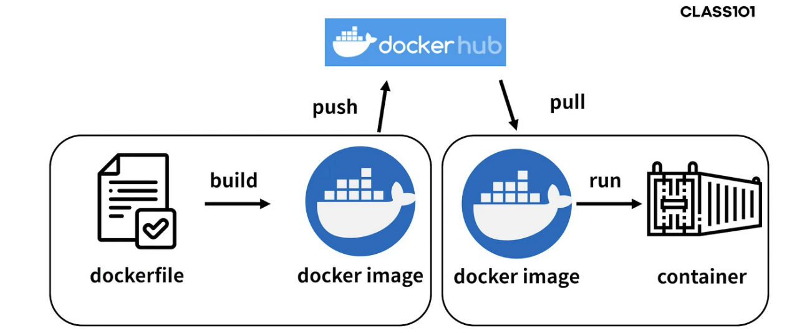
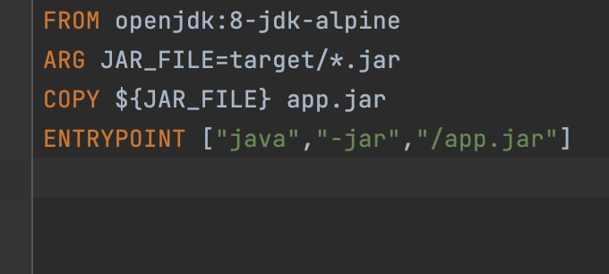

## Docker

도커에 대해서 알아보고, 실제로 어떻게 사용하는지 알아보자

#### 도커는 컨테이너 기반의 Open Source 가상화 플랫폼이다.

#### Container [컨테이너] 란?

- 운영체제를 기반으로 만들어진 소프트웨어는 실행을 위해 사용하는 동적 Library에 의존성 (dependency)를 갖는다.
- 실행을 위해 OS와 Library, 각종 파일들을 필요로 하는데 하나의 시스템에서 두 개의 소프트웨어를 동시에 실행한다면 문제가 발생할 수 있다.
- **이러한 문제점을 효율적으로 해결한 것이 바로 컨테이너이다.**
- 컨테이너(Container)는 개별 Software의 실행에 필요한 실행환경을 독립적으로 운용할 수 있도록 기반환경 또는 다른 실행환경과의 간섭을 막고 **실행의 독립성을 확보해주는 운영체계 수준의 격리 기술**을 말한다.

#### 이미지 [Image, Docker Image]

- 이미지는 **컨테이너 실행에 필요한 파일과 설정값등을 포함하고 있는 것**으로 상태값을 가지지 않고 변하지 않습니다(Immutable).
- <u>컨테이너는 이미지를 실행한 상태라</u>고 볼 수 있고 추가되거나 변하는 값은 컨테이너에 저장된다.

 

#### Dockerfile

- 도커는 이미지를 만들기 위해 `Dockerfile`이라는 파일에 자체 DSLDomain-specific language언어를 이용하여 이미지 생성 과정을 적는다.

 

**Local**

local에서 도커파일을 빌드하면 도커 이미지가 생긴다

우리는 외부 서버에서 이 도커파일을 실행시키고 싶기때문에

**도커허브에 도커 이미지를 Push 한다**

그리고 외부 서버에서 도커허브에서부터 **Pull 받는다**

**그 후 해당 도커 이미지를 run 하면된다.**

우선 컴퓨터에 도커를 설치한 뒤 스텝바이스텝으로 해보자 

1. 프로젝트 폴더에 도커 파일을 만들기
   - Intellij 에서 파일 생성 명명 docker file, 그 다음 뭐 구글링을 하던 spring docker 라 치고 나오는 내용을 안에 넣어준다. 
   -  

2. 도커 허브 사이트에 로그인 해서 [https://hub.docker.com/] repository 생성하자

3. - 레포지토리 생성하면 옆에 Docker Commands 라고 docker push whwoals21/~… 이라는 명령어가 있음. 사용자 이름 / 저장소 이름이 있다. 

4. 명령어 실행

5. - docker build --build-arg JAR_FILE=build/libs/\*.jar -t springio/gs-spring-boot-docker .
   - 명령어 의미, springio는 사용자 이름, gs-spring-boot-docker는 저장소 이름
   - docker build --build-arg JAR_FILE=build/libs/\*.jar -t whwoals21/test .

6. 생성된 이미지를 

7. - docker push whwoals21/test
   - 를 이용해서 도커 허브 레포지토리에 올린다

8. 서버로 가서 (도커가 설치되고 실행중인…) sudo docker pull whwoals21/test 로 받아온다

9. 실행 : sudo docker run -p [port:port] whwoals21/test

만약 현재 이미 서버에 Docker 가 실행중 이면서, 이미지를 실행하고있다면?

> docker ps
>
> 명령어를 사용하면 PID 와 함게 나온다
>
> 해당 pid를 kill 해주고, 다시 새로운 도커 이미지를 run 시켜주면 된다.

1. 