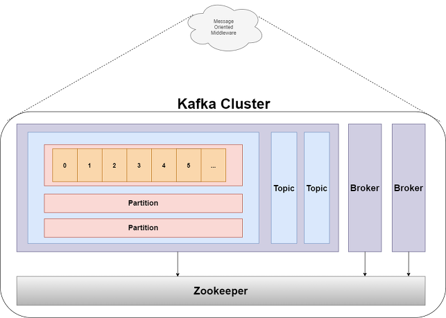
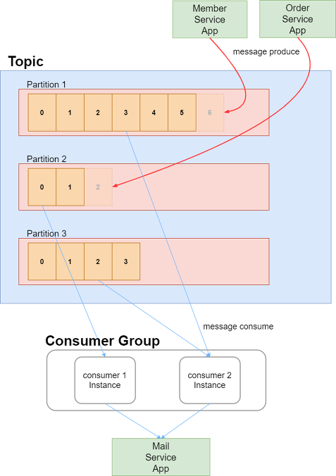

## Kafka

**Apache Kafka** 는 LinkedIn 에서 개발한 분산 메시징 시스템이다.

대용량의 실시간 로그처리에 특화된 아키텍쳐 설계를 통해, 기존 메시징 시스템보다 우수한 퍼포먼스를 보여준다.

참고로, 대표적인 메시징 시스템으로는 Kafka, RabbitMQ, Active MQ가 존재한다.

#### Kafka Structure

Kafka는 **publish & subscribe**, 즉 발행/구독 모델을 기반으로 동작하며, <u>producer, consumer, broker</u> 로 구성된다.

- Zookeeper (<u>Apache Zookeeper</u>)

  - Broker에 분산 처리된 메시지 큐의 정보들을 관리한다.

  - 클러스터를 관리하는 Zookeeper 없이는 Kafka 구동이 불가능합니다.

  - - 즉, Kafka 서버를 가동하려면 Zookeeper를 먼저 가동해줘야 합니다.( 그래서 Kafka 다운로드시 Zookeeper도 함께 제공해줍니다.)

​	

- Broker
  - Kafka Server 이다
  - 한 클러스터 내에서 여러대의 Kafka Server 를 띄울 수 있다.
- **Topic**
  - Message가 생산되고 소비되는 것.
- Partition
  - Topic 내에서 메시지가 분산되어 저장되는 **단위**
    - 예를들어, 한 Topic 내에 3 개의 Partition이 있다면, 3개의 Partition에 대해서 메시지가 분산되어 저장된다.
    - Queue 방식으로 저장되므로, Partition의 끝에 저장이 되어 순서를 보장해주지만, Partition 끼리의 메시지 순서를 보장해주지는 않는다.
- Log
  - Partition의 한 칸을 Log 라고 한다.
  - Log는 <u>key, value, timestamp</u> 로 구성된다.
- Offset
  - Partition의 각 메시지를 식별하는 유니크한 값
    - 메시지를 소비하는 Consumer가 읽을 차례를 의미하므로 Partition 마다 별도로 관리된다.
    - 0부터 1씩 증가한다

### Producer & Consumer

##### Producer

- Producer는 정해진 Topic으로 메시지를 기록한다.
- Partition이 여러 개 있을 경우, 기록 될 Partition의 선택은 기본적으로 Round-Robin 방식을 따른다.
- 각 Partition 내에서는 가장 마지막 offset 뒤에 신규 메시지가 저장되므로, Partition 내에서는 순서가 보장되며 기록이됩니다. 
  - 하지만 실제 메시지가 사용되는 순서는 순서가 보장되지 않는데요, 그 이유는 Consumer의 동작 방식을 이해해야 합니다.

##### Consumer Group

- Consumer Group은 하나의 Topic을 담당합니다. 

  - 즉, Topic은 여러 개의 Consumer Group이 접근할 수 있지만, 하나의 Consumer Group은 하나의 Topic에만 접근할 수 있습니다.

- 왜 존재하는가?

  1) Partition 접근하는 Consumer 관리

     - Consumer Group 내에서 Consumer 인스턴스들은 Topic내에 Partition에서 다음에 소비할 offset이 어디인지 공유하면서 메시지를 소비합니다. 그렇기 때문에 다음에 소비할 offset을 잘 관리할 수 있습니다.
       - 예를 들어 Consumer Group이 없을 경우, 하나의 Partition에 2개의 Consumer가 동시에 접근한다면 어떤 Consumer가 몇 번의 offset을 소비해야 하는지 알 수 없게 됩니다.

     - 즉, Consumer Group을 통해 하나의 Partition에는 하나의 Consumer 인스턴스만 접근할 수 있도록 관리합니다.

  2) offset을 공유하여 고가용성을 확보
     - Partition에는 하나의 Consumer 인스턴스만 접근할 수 있기 때문에, 특정 Consumer 인스턴스에 에러가 발생했을 시 다른 Consumer 인스턴스는 에러가 발생한 Consumer 인스턴스가 소비하던 Partition을 소비하게 됩니다.
       - 즉, Consumer가 다운될 때를 대비해 Consumer Group의 Consumer 인스턴스들은 offset을 공유하고 있으며, 이를 통해 고가용성이 확보됩니다.

