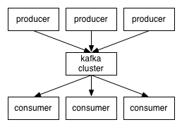

## Kafka

*Apache Kafka* 는 LinkedIn 에서 개발한 **분산 메시징 시스템**이다.

대용량의 실시간 로그처리에 특화된 아키텍쳐 설계를 통해, 기존 메시징 시스템보다 우수한 퍼포먼스를 보여준다.

- 분산 스트리밍 플랫폼이며 데이터 파이프 라인을 만들 때 주로 사용되는 시스템이다 !

참고로, 대표적인 메시징 시스템으로는 Kafka, RabbitMQ, Active MQ가 존재한다.

- 최근 MSA에서 Pub (publisher) / Sub (subscriber) 구조를 통한 **데이터 동기화 솔루션으로** 많이 사용된다.


### Message Broker

Kafka를 알아보기 전에, kafka에서 사용되는 Message broker (ex. Zookeeper, Kafka Broker) 에 대해 알아보자.


Message broker (사진 중간)은, Publisher (송신자, Producer) 로 부터 전달받은 메시지를, Subscriber (수신자, Consumer)로 전달해주는 중간 역할로, 소프트웨어 간에 메시지를 교환할 수 있게한다. 이 publisher로 부터 전달된 메시지가 저장되는 공간을 **Message queue**라고 하며, 메시지의 **그룹을 Topic**  이라 한다.


상황을 이해하기 쉽게 예를 들어보자,

> **A 서버**는 데이터를 수집하고 관리한다. **B 서버는** A서버에 수집 된 데이터를 이용해서 별도의 서비스에 사용한다. 흔히 생각할 수 있는 두 서버간의 데이터 공유는 어떤가 ? 특정 RDB에 A서버가 데이터를 저장 해 두고, B 서버는 해당 RDB에서 데이터를 꺼내와 사용할 수 있다. 다만, 실시간으로 데이터가 쌓이는 Table에서 B 서버가 데이터를 빠르게 조회하는 것은 힘들다.
>
> 이럴경우, **메시지 브로커**를 이용할 수 있다.
>
> A 서버에서 수집 된 데이터를 message queue에 **Publish** 하고, B 서버는 이 메시지 큐를 **Subscribe** 해서 바로 사용할 수 있다. 즉, 별도의 조회과정이 없이 메시지 큐에 적재되는 메시지를 <u>감시하고 있다가, 메시지가 적재되면 바로 사용할 수 있다.</u>


#### 단점

DB를 사용하는 경우 Query를 이용하여 원하는 데이터만 필터링하여 조회할 수 있다. 하지만 메시지 브로커를 이용하면 Queue에 적재된 **그대로 사용하기 때문에 불가능하다**. 

따라서, 적재할 때 필터링된 데이터를 적재하던가 적재된 데이터를 <u>Logstash</u>를 이용하여 필터링해서 사용해야 한다. 

또한, 메시지 큐에 적재된 메시지는 주로 7일을 보관하기 때문에 장기간 보관해야하는 경우 별도의 저장소에 저장해야한다.


#### Kafka Structure




​																								*대표적인 Kafka 구조*


큰 틀에서 보면, 4 개의 구성 요소가 필요하다.

1. Kafka Cluster 
   - 메시지를 저장하는 **저장소**
   - 하나의 kafka cluster는 여러개의 message broker로 구성되어있다.
   - Broker
     - 각각의 서버라고 볼 수 있다. (Kafka Server)
     - 메시지를 나누어서 저장을 하고, 이중화 처리를 하고, 장애 대응 등을 한다.
2. Zookeeper Cluster
   - Kafka Cluster를 관리하는 용도 !
   - Zookeeper 속에 kafka cluster 관리하는 정보가 들어간다.
   - Broker에 분산 처리된 메시지 큐의 정보들을 관리한다.
   - 클러스터를 관리하는 Zookeeper 없이는 Kafka 구동이 불가능하다.
     - 즉, Kafka 서버를 가동하려면 Zookeeper를 먼저 가동해줘야 한다.( 그래서 Kafka 다운로드시 Zookeeper도 함께 제공한다.)
3. Producer
   - Kafka cluster에 메시지를 보내는 것
4. Consumer
   - Kafka에서 메시지를 읽어온다.


Kafka는 **publish & subscribe**, 즉 발행/구독 모델을 기반으로 동작하며, <u>producer, consumer, broker</u> 로 구성된다.


- **Topic**
  - Message를 구분하는 단위이다 !
    - 파일시스템의 <u>폴더</u>와 비슷하다 생각할 수 있다.
  - **<u>한 개 이상의 파티션(Partition)으로 구성되어있다.</u>** 
  - 즉, Producer 내용을 저장할 때 <u>어떤 토픽에 저장할지를 명시하며,</u> 컨슈머는 <u>어떤 토픽에서 메시지를 읽어올지 지정한다.</u>
- Partition
  - Topic 내에서 메시지가 분산되어 저장되는 물리적인 **단위** (file)
    - 예를들어, 한 Topic 내에 3 개의 Partition이 있다면, 3개의 Partition에 대해서 메시지가 분산되어 저장된다.
    - Queue 방식으로 저장되므로, Partition의 끝에 저장이 되어 순서를 보장해주지만, Partition 끼리의 메시지 순서를 보장해주지는 않는다.
  - Append-only 파일, 즉 추가만 가능하다.
- Log
  - Partition의 한 칸을 Log 라고 한다.
  - Log는 <u>key, value, timestamp</u> 로 구성된다.
- Offset
  - Partition의 각 메시지를 식별하는 유니크한 값
    - 메시지를 소비하는 Consumer가 읽을 차례를 의미하므로 Partition 마다 별도로 관리된다.
    - 0부터 1씩 증가한다


### Producer & Consumer


##### Producer

- Producer는 정해진 Topic으로 메시지를 기록한다.
- Partition이 여러 개 있을 경우, 기록 될 Partition의 선택은 기본적으로 Round-Robin 방식을 따른다.
- 각 Partition 내에서는 가장 마지막 offset 뒤에 신규 메시지가 저장되므로, Partition 내에서는 순서가 보장되며 기록이됩니다. 
  - 하지만 실제 메시지가 사용되는 순서는 순서가 보장되지 않는데요, 그 이유는 Consumer의 동작 방식을 이해해야 합니다.

##### Consumer Group

- Consumer Group은 하나의 Topic을 담당합니다. 

  - 즉, Topic은 여러 개의 Consumer Group이 접근할 수 있지만, 하나의 Consumer Group은 하나의 Topic에만 접근할 수 있습니다.

- 왜 존재하는가?

  1) Partition 접근하는 Consumer 관리

     - Consumer Group 내에서 Consumer 인스턴스들은 Topic내에 Partition에서 다음에 소비할 offset이 어디인지 공유하면서 메시지를 소비합니다. 그렇기 때문에 다음에 소비할 offset을 잘 관리할 수 있습니다.
       - 예를 들어 Consumer Group이 없을 경우, 하나의 Partition에 2개의 Consumer가 동시에 접근한다면 어떤 Consumer가 몇 번의 offset을 소비해야 하는지 알 수 없게 됩니다.

     - 즉, Consumer Group을 통해 하나의 Partition에는 하나의 Consumer 인스턴스만 접근할 수 있도록 관리합니다.

  2) offset을 공유하여 고가용성을 확보
     - Partition에는 하나의 Consumer 인스턴스만 접근할 수 있기 때문에, 특정 Consumer 인스턴스에 에러가 발생했을 시 다른 Consumer 인스턴스는 에러가 발생한 Consumer 인스턴스가 소비하던 Partition을 소비하게 됩니다.
       - 즉, Consumer가 다운될 때를 대비해 Consumer Group의 Consumer 인스턴스들은 offset을 공유하고 있으며, 이를 통해 고가용성이 확보됩니다.


## Spring Reactive Kafka


대표적인 Kafka의 흐름이라 볼 수 있다. Producer가 stream에 publish 하고, Consumer는 이 stream을 subscribe해서 stream에 존재하는 데이터를 사용할 수 있다. 둘 중에 하나라도 없으면 시스템이 성립되지 않는다. 이 부분을 자세히 보니, 우리가 알고있는 **Reactive Programming** 과 매우 유사하다 !

ReactiveX의 **Observable**, Project Reactor 등에서 말하는 **Flux** 의 본질은, 어떤 **대상을 Async 하게 다루고 Stream으로 처리하겠다는것 !** 

그렇기에, 우리가 Kafka에서 구독하고 사용하는걸 **Flux**로 완전하게 대체가 가능하다 !


- 나는 특정 Topic을 구독하면서 Flux로 받을래
- 나는 Flux create를 하면서 데이터를 밀어넣어 주는 것 !


### Reactor Kafka

- Reactive Kafka Driver with Project Reactor


- Maven/Gradle dependency
- Kafka를 reactive하게 다룰 수 있는 driver를 제공한다 !


#### Producer


```java
public Flux<SendResult<String>> produce (Publisher<String> publisher) {
  return KafkaSender.create(SENDER_OPTIONS)
    								.send(publisher.map(o -> SenderRecord.create(...)))
}
```

KafkaSender라는 Class가 있고, 이 안에 factory Method인 create를 호출해서 **Sender에 해당하는 Option**을 넣어준다.

- 접속 정보, Zookeeper
- 어떤 Topic에 넣을 것인가
- 정책들

send method는 publisher를 받는다. 즉, Mono, Flux를 받아드릴 수 있다.

- 한 건씩 받는 Mono도 가능
- List형태의 Flux를 여러번 받거나, 연속적이지 않은 item도 flux로 전달해줄 수 있다.


#### Consumer


```java
public Flux<ReceiverRecord<String,String>> consume() {
  return KafkaReceiver.create(RECEIVER_OPTIONS)
    									.receive();
}
```

Consume 메소드, kafkareceiver에서 create에 option값을 집어넣는다.

- 어떤 Kafka Cluster에서 받아 올 것인지
- 무슨 Topic에서 받아 올 것인지

receive method를 호출하면서, Record 형태로 만들어진 Flux를 반환 받을 수 있다.


### Spring Kafka

2.3.0+ 이상부터 Reactor kafka를 사용할 수 있다.


- Maven/Gradle Dependency


사용법은 Reactor kafka와 거의 흡사하다


#### Producer


```java
public Flux<SendResult<Void>> produce (String topic, String message) {
  return new ReactiveKafkaProducerTemplate<>(SENDER_OPTIONS)
    									.send(topic, message);
}
```

ReactiveKafkaProducerTemplate<> 으로 만들어져서, send에 topic과 어떤 메시지를 보내줄 지를 정해주기만 해도 된다.


#### Consumer


```java
public Flux<ReceiverRecord<String,String>> consume() {
  return ReactiveKafkaConsumerTemplate<>(RECEIVER_OPTIONS)
    									.receive();
}
```

receive() 메소드를 호출하기만 해도 Flux로 받아드릴 준비가 된 것.


# Kafka Producer

Producer (프로듀서)는 보통 Kafka Producer api와 그것으로 구성된 애플리케이션이다. 프로듀서는 broker (브로커)에 **특정 토픽을 지정하여 <u>메시지를 전달하는 역할을 담당한다.</u>** 

프로듀서가 전달하는 메시지 구조는 다음과 같다.


- 토픽 (Topic)
- 토픽 중 특정 파티션 위치 (Partition)
- 메시지 생성 시간 (Timestamp)
- 메시지 키 (Key)
- 메시지 값 (Value)


### Producer Message 전달 과정


프로듀서는 메시지 전달 전 4 가지 과정을 통해 메시지를 브로커에 전달한다. 이는 **브로커에 메시지를 전송할수 있도록 변환 / 필요한 값을 지정해주는 작업** 이다.

1. 직렬화 (Serializer)
2. 파티셔닝 (Partitioner)


