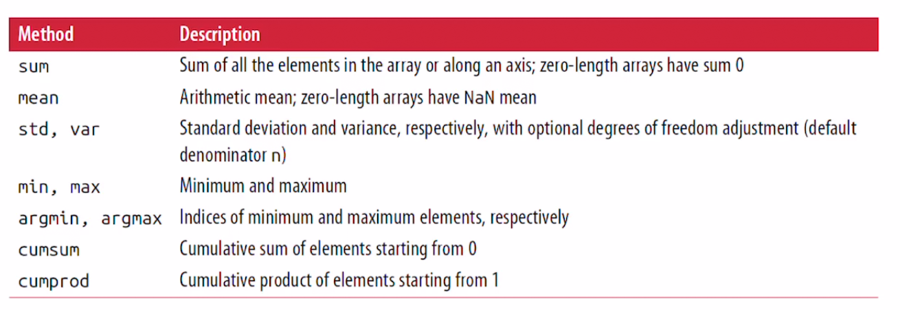
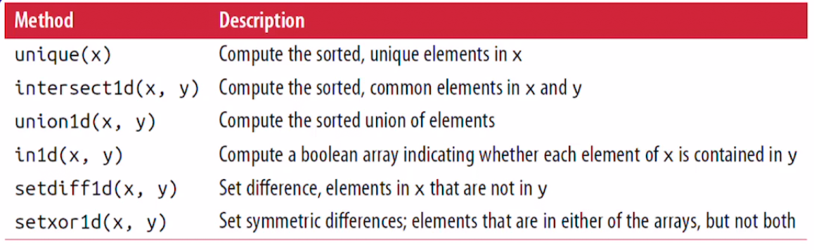
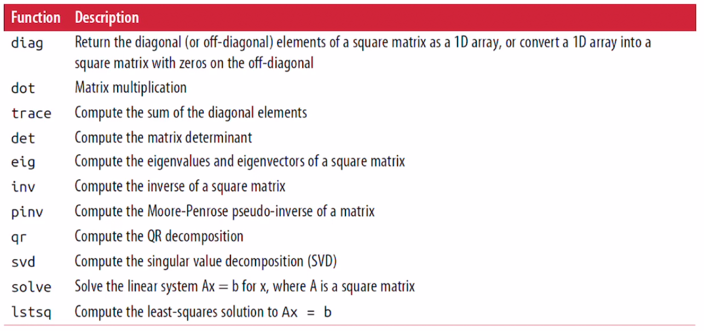
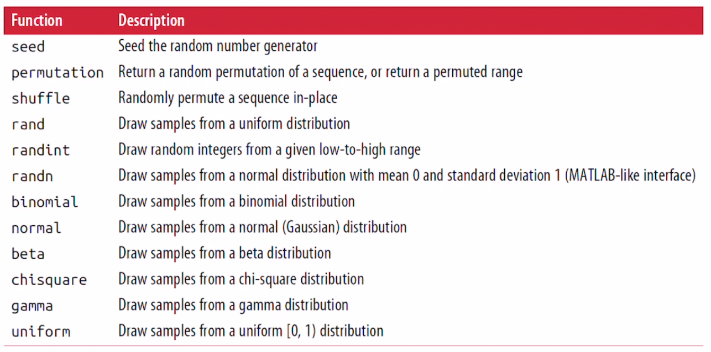

## NumPy (II)

- Univerisal Functions
- Array-Oriented Programming with Arrays
- Linear Algebra
- Pseudorandom Number Generation
  - Example: Random Walks
    - 계단 오르내리기 예제


### Universial Functions: Fast Element-Wise Array Functions

- 줄여서 **ufunc** 라고 부르기도 한다.
- ndarray 안에있는 데이터 원소별로 연산을 수행하는 함수이다. 
- <u>하나의 Scalar 값을 받아와서, 하나 이상의 값을 고속으로 반환하는 벡터화 연산이다.</u> 


##### Unary ufuncs - 한개의 인자만을 받을 수 있는 함수들

- sqrt, exp 가 대표적인 unary ufuncs이다.

- np.sqrt() - 루트를 씌운다

- ```python
  >>> arr = np.arange(10) 
  >>> arr
  array([0, 1, 2, 3, 4, 5, 6, 7, 8, 9])
  >>> np.sqrt(arr) # 인자로 배열을 받게되면, 배열 전체의 값의 루트를 씌운값을 리턴한다
  array([0.        , 1.        , 1.41421356, 1.73205081, 2.        ,
         2.23606798, 2.44948974, 2.64575131, 2.82842712, 3.        ])
  ```

- np.exp() - 지수함수로 exponential 값으로 리턴

- ```python
  >>> arr
  array([0, 1, 2, 3, 4, 5, 6, 7, 8, 9])
  >>> np.exp(arr) # 지수, e^
  array([1.00000000e+00, 2.71828183e+00, 7.38905610e+00, 2.00855369e+01,
         5.45981500e+01, 1.48413159e+02, 4.03428793e+02, 1.09663316e+03,
         2.98095799e+03, 8.10308393e+03])
  ```

- 여러가지 unary ufuncs

   


##### Binary ufuncs - 한개가 아닌, 두 개의 인자를 받는 함수들

- add, maximum이 대표적인 binary universial functions 이다

- np.maximum(x, y) : x와 y 두 개의 인자를 받아 더 큰 값을 출력해준다.

- ```python
  >>> x = np.random.randn(8)
  >>> y = np.random.randn(8)
  >>> x
  array([ 0.02639527,  0.50329932,  0.61280701, -0.22789028, -0.33461457,
         -0.49653344, -0.40311991, -0.55079384])
  >>> y
  array([ 0.15470707,  0.31211103,  0.48624562, -0.21248388,  0.43903926,
          1.50029202, -1.1371477 ,  0.46858609])
  >>> np.maximum(x, y)
  array([ 0.15470707,  0.50329932,  0.61280701, -0.21248388,  0.43903926,
          1.50029202, -0.40311991,  0.46858609])
  ```


- 여러가지 binary ufuncs

   

  

##### 다수의 배열을 반환하는 ufuncs 

- modf 함수

  - Pythond의 divmod 와 비슷하다
  - 분수를 받아서 몫과 나머지, 두 개의 값을 반환한다

- ```python
  >>> arr = np.random.randn(7) * 5
  >>> arr
  array([ -3.49076365,  -2.15200316, -12.59448904,  -1.84189255,
           2.3156052 ,   2.88632847,  -2.67318928])
  >>> remainder, whole_part = np.modf(arr) # 나머지와 몫을 각각 저장 
  >>> remainder # 나머지
  array([-0.49076365, -0.15200316, -0.59448904, -0.84189255,  0.3156052 ,
          0.88632847, -0.67318928])
  >>> whole_part # 몫 
  array([ -3.,  -2., -12.,  -1.,   2.,   2.,  -2.])
  ```


Universial Functions에는 ***OUT*** 이라는 argument가 option으로 존재한다.

```python
>>> arr = np.random.randn(6)
>>> arr
array([0.7535022 , 0.62450454, 1.34713659, 0.24808857, 0.55869509,
       0.51200395])
>>> np.sqrt(arr)
array([0.86804504, 0.790256  , 1.16066213, 0.4980849 , 0.74745909,
       0.71554451])
>>> np.sqrt(arr, arr) # 두 번째 인자가 out argument가 된다
array([0.86804504, 0.790256  , 1.16066213, 0.4980849 , 0.74745909,
       0.71554451])
>>> arr # out argument로 arr이 됐기에 여기에 np.sqrt() 값이 저장 되었다.
array([0.86804504, 0.790256  , 1.16066213, 0.4980849 , 0.74745909,
       0.71554451])
```

여기서 out argument의 의미는 두 번째 인자인 arr에 결과를 저장하라, 즉 arr에 np.sqrt(arr) 결과가 저장된다.


### Array-Oriented Programming with Arrays

> NumPy 배열은 반복문을 사용하지 않고, 간결한 배열 연산을 이용해서 많은 데이터 처리를 한꺼번에 처리할 수 있다.
>
> 반복문이 없이 배열연산을 하는 것을 **vectorization** 이라고 하였다.
>
> 일반적으로 NumPy에서 vectorized된 배열연산을 하는 연산 속도는 Python에 비해 수배 ~ 수십배 빠르다.
>
> 따라서 NumPy를 활용한 배열 연산은 vectorization을 잘 활용해야 한다.

- 예를들어, grid에서 sqrt(x^2 + y^2) 의 값을 계산한다고 해보자. 

  - np.meshgrid 함수는 <u>두 개의 1차원 배열을 인자로 받아, 가능한 모든 (x,y) 쌍을 만들 수 있는 2차원 배열 두 개를 반환한다.</u>

  - ```python
    >>> points = np.arange(-5, 5, 0.01)
    >>> xs, ys = np.meshgrid(points,points)
    >>> ys
    array([[-5.  , -5.  , -5.  , ..., -5.  , -5.  , -5.  ],
           [-4.99, -4.99, -4.99, ..., -4.99, -4.99, -4.99],
           [-4.98, -4.98, -4.98, ..., -4.98, -4.98, -4.98],
           ...,
           [ 4.97,  4.97,  4.97, ...,  4.97,  4.97,  4.97],
           [ 4.98,  4.98,  4.98, ...,  4.98,  4.98,  4.98],
           [ 4.99,  4.99,  4.99, ...,  4.99,  4.99,  4.99]])
    >>> xs
    array([[-5.  , -4.99, -4.98, ...,  4.97,  4.98,  4.99],
           [-5.  , -4.99, -4.98, ...,  4.97,  4.98,  4.99],
           [-5.  , -4.99, -4.98, ...,  4.97,  4.98,  4.99],
           ...,
           [-5.  , -4.99, -4.98, ...,  4.97,  4.98,  4.99],
           [-5.  , -4.99, -4.98, ...,  4.97,  4.98,  4.99],
           [-5.  , -4.99, -4.98, ...,  4.97,  4.98,  4.99]])
    ```

  - xs는 ys를 transpose한 결과로 출력이 된다.

  - 이 두 값의 제곱을 더해서 루트를 취해보자

  - ```python
    >>> z = np.sqrt(xs ** 2 + ys ** 2)
    >>> z
    array([[7.07106781, 7.06400028, 7.05693985, ..., 7.04988652, 7.05693985,
            7.06400028],
           [7.06400028, 7.05692568, 7.04985815, ..., 7.04279774, 7.04985815,
            7.05692568],
           [7.05693985, 7.04985815, 7.04278354, ..., 7.03571603, 7.04278354,
            7.04985815],
           ...,
           [7.04988652, 7.04279774, 7.03571603, ..., 7.0286414 , 7.03571603,
            7.04279774],
           [7.05693985, 7.04985815, 7.04278354, ..., 7.03571603, 7.04278354,
            7.04985815],
           [7.06400028, 7.05692568, 7.04985815, ..., 7.04279774, 7.04985815,
            7.05692568]])
    ```

  - 이 z 값을 matplotlib으로 시각화 해보자.

    - python에서 가장 많이 사용되는 2차원 데이터 시각화 라이브러리.


### Expressing Conditional Logic as Array Operations

> 배열 연산을 통해 조건문을 표현하는 방법을 알아보자

- **np.where** 메소드

  - x if condition else y 와 같은 ternary expression의 vector화 된 버전이다

  - ```python
    # 두 개의 float 배열 xarr, yarr과 하나의 boolean 배열 cond
    >>> xarr = np.array([1.1, 1.2, 1.3, 1.4, 1.5])
    >>> yarr = np.array([2.1, 2.2, 2.3, 2.4, 2.5])
    >>> cond = np.array([True, False, True, True, False])
    ```

  - 만약 Python에서 이러한 ternary expression을 수행하기 위해서는, xarr yarr 중 cond 값에 따라 xarr 혹은 yarr을 취하기 위해, for 문을 사용하며 작성해야한다.

    - ```python
      >>> result = [(x if c else y) 
                for x, y, c in zip(xarr, yarr, cond)]
      >>> result
      [1.1, 2.2, 1.3, 1.4, 2.5]
      ```

  - 이런경우 문제점이 발생할 수 있다 [list comprehention has multiple problems]

    - 큰 배열에 대해 빠른 처리가 불가능하다
    - 다차원 배열에는 사용이 불가능하다

  - np.where 함수를 통해 해결할 수 있다.

  - ```python
    >>> result = np.where(cond, xarr, yarr) 
    >>> result
    array([1.1, 2.2, 1.3, 1.4, 2.5])
    ```

  - np.where(조건, True 경우, False 경우)

  - np.where의 두 번째와 세 번째 인자는 꼭 배열일 필요가 없다. 둘 다 스칼라 값이어도 된다.

  - ```python
    >>> arr = np.random.rand(4, 4)
    >>> arr
    array([[0.24851681, 0.46708219, 0.12548759, 0.49661352],
           [0.96433469, 0.21777612, 0.18683939, 0.95094556],
           [0.55114047, 0.01677012, 0.24257106, 0.08822876],
           [0.00734677, 0.73353986, 0.98643337, 0.53293186]])
    >>> arr > 0.5
    array([[False, False, False, False],
           [ True, False, False,  True],
           [ True, False, False, False],
           [False,  True,  True,  True]])
    >>> np.where(arr > 0.5, 1, 0)
    array([[0, 0, 0, 0],
           [1, 0, 0, 1],
           [1, 0, 0, 0],
           [0, 1, 1, 1]])
    ```


### Mathematical and Statistical Methods 

> 수학과 통계 메소드를 알아보자
>
> NumPy 에서는 배열 전체나, 혹은 배열 한 축에대한 통계를 계산하는 여러가지 수학 함수를 제공한다.
>
> 예를들어, 배열의 전체 평균, 해당 row의 평균, 합 등을 구할 수 있다.

- 대표적으로 sum, mean, std와 같은 수학 함수가 존재한다.

```python
>>> import numpy as np
>>> arr = np.random.randn(5, 4)
>>> arr
array([[ 0.03311999, -0.80618316,  0.50462446, -0.36230708],
       [ 0.5577589 , -0.15873583, -0.61212862, -0.75326294],
       [ 0.27741144, -0.48799727, -0.84172633,  0.00817903],
       [ 0.6069631 , -0.74095307, -0.48270394,  0.65000629],
       [ 1.31144234,  0.2390702 , -0.06327546, -0.38344169]])
>>> arr.mean()
-0.07520698182914799
>>> np.mean(arr)
-0.07520698182914799
>>> arr.sum()
-1.5041396365829598
>>> np.sum(arr)
-1.5041396365829598
```

mean, sum과 같은 함수는 전체 배열의 평균, 합을 구할수도있고, 특정 **축에대한** 평균과 합도 구할 수 있다.

- arr.mean(1): row 에 대한 평균을 구하라는 뜻 
- arr.sum(0): column 에 대한 합을 구하라는 뜻

```python
>>> import numpy as np
>>> arr = np.random.randn(5, 4) # 5 x 4 행렬
>>> arr
array([[ 0.03311999, -0.80618316,  0.50462446, -0.36230708],
       [ 0.5577589 , -0.15873583, -0.61212862, -0.75326294],
       [ 0.27741144, -0.48799727, -0.84172633,  0.00817903],
       [ 0.6069631 , -0.74095307, -0.48270394,  0.65000629],
       [ 1.31144234,  0.2390702 , -0.06327546, -0.38344169]])
>>> arr.mean(axis = 1) # 각 row 대한 평균을 구하라는 것
array([-0.15768645, -0.24159212, -0.26103328,  0.0083281 ,  0.27594885])
>>> arr.mean(axis = 0) # 각 column 대한 평균을 구하라는 것
array([ 0.55733915, -0.39095983, -0.29904198, -0.16816528])
```


<u>cumsum</u>(), <u>cumprod</u>() 함수는 **각 원소의 누적 합과, 누적 곱을 표현할 수 있다**

```python
>>> arr = np.array([0, 1, 2, 3, 4, 5, 6, 7]) 
>>> arr.cumsum()
array([ 0,  1,  3,  6, 10, 15, 21, 28])
>>> np.cumsum(arr)
array([ 0,  1,  3,  6, 10, 15, 21, 28])
```

- cumsum() 메소드는 1차원 배열 뿐만아니라, 다차원 배열에서도 적용이 가능하다. 이때는 축 axis를 지정해야한다

  - axis = 0 이면 column 별
  - axis = 1 이면 row 별로 계산한다

  ```python
  >>> arr
  array([[1, 2],
         [3, 4]])
  >>> arr.cumsum(axis = 1) # 로우 별로 누적 합
  array([[1, 3],
         [3, 7]])
  >>> arr.cumsum(axis = 0) # 컬럼 별로 누적 합
  array([[1, 2],
         [4, 6]])
  ```

- NumPy에서 제공하는 배열 통계 메소드

 


### Methods for Boolean Arrays

- Boolean 배열의 값은 1 (True), 0 (False) 로 구성되어있다.
- sum() 메소드를 사용하면 Boolean의 true 값이 총 몇 개인지 확인할 수 있다.

```python
>>> arr = np.random.randn(100)
>>> (arr > 0).sum() # arr중 양수인 부분은 True로 바꾸고 이 True의 개수가 55개
55
```

**any와 all** method는 boolean 배열에서 유용하게 사용할 수 있다.

- any 

  - boolean 배열에서 하나 이상의 값이 트루인지 

- all

  - boolean 배열에서 모든 값이 true인지 검사한다.

  ```python
  >>> bools = np.array([True, False, True, False])
  >>> bools.any() # 하나 이상의 값이 True 이기 때문에 True
  True
  >>> bools.all() # 모든 값이 True 가 아니기 때문에 False
  False
  ```


### Sorting

- Python 에서의 List 처럼 NumPy 배열도 Sort 메소드를 이용해 정렬이 가능하다.

- 1차원 배열은 List와 동일하다 

  ```python
  >>> arr = np.random.randn(6)
  >>> np.sort(arr)
  array([-2.41499866, -0.98650468, -0.39178569,  0.38077017,  0.47471758,
          1.12548788])
  >>> arr
  array([-0.39178569, -2.41499866,  0.38077017,  1.12548788, -0.98650468,
          0.47471758])
  >>> arr.sort()
  >>> arr
  array([-2.41499866, -0.98650468, -0.39178569,  0.38077017,  0.47471758,
          1.12548788])
  ```


**2차원 이상의 다차원 배열은 차이점이 존재한다.**

- sort 메소드에 인자에 따라서 차원을 결정을 하고 sort를 진행한다.

  ```python
  >>> arr = np.random.randn(5,3) # 5 x 3 배열
  >>> arr
  array([[-1.34848345,  0.128653  ,  0.35649733],
         [-0.36423384, -1.34180095, -0.14723622],
         [-0.61700563,  0.92606405,  1.55656851],
         [ 1.82265354, -0.31681937, -0.93771108],
         [-1.03043776, -0.1191259 , -1.08047116]])
  >>> arr.sort(1) # 1차원 부분에 대해서 정렬을 진행, 즉 각 row (5 x 3중 3) 에 대해 정렬.
  >>> arr
  array([[-1.34848345,  0.128653  ,  0.35649733],
         [-1.34180095, -0.36423384, -0.14723622],
         [-0.61700563,  0.92606405,  1.55656851],
         [-0.93771108, -0.31681937,  1.82265354],
         [-1.08047116, -1.03043776, -0.1191259 ]])
  
  >>> arr.sort(0) # 1차원 부분의 컬럼에 대해 정렬한다 
  >>> arr
  array([[-1.34848345, -1.03043776, -0.14723622],
         [-1.34180095, -0.36423384, -0.1191259 ],
         [-1.08047116, -0.31681937,  0.35649733],
         [-0.93771108,  0.128653  ,  1.55656851],
         [-0.61700563,  0.92606405,  1.82265354]])
  ```

- **쉽게 설명해 A x B 행렬 [A 는 column, B는 row]중 axis = 0 or 1 로 해당 부분을 sort 하는것** 


np.sort() 를 사용할 경우, 배열의 quantiles [분위 수] 를 쉽게 구할 수 있다.

```python
>>> large_arr = np.random.randn(1000)
>>> large_arr.sort()
>>> large_arr[int(0.05 * len(large_arr))] # 5% 분위값 quantile
-1.8034779286222562
```

즉, 상위 5%에 존재하는 값을 출력한다. 약 50번째 위치하는 수를 출력.


### Unique and Other Set Logic

> 집합과 관련된 함수들
>
> NumPy에는 1차원 ndarray에 대한 기본적인 여러 집합 연산을 제공한다.

**np.unique()** 는 가장 많이 사용되는 집합 메소드 중 하나.

- <u>배열 내에서 중복된 원소를 제거하고, 남은 원소를 정렬된 형태로 반환해준다</u>

- ```python
  >>> names = np.array(['Bob', 'Joe', 'Will', 'Bob', 'Will', 'Joe', 'Joe'])
  >>> np.unique(names) # 이름들 중 중복을 제거하고 남은 배열을 정렬 오름차순
  array(['Bob', 'Joe', 'Will'], dtype='<U4')
  
  >>> ints = np.array([ 1,  2,  3,  4,  3,  2, 14,  5,  3,  5])
  >>> np.unique(ints)
  array([ 1,  2,  3,  4,  5, 14])
  ```

- Python에서 이러한 unique 함수와 같은 역할을 사용하고자 한다면

- ```python
  >>> sorted(set(names)) # set에 이름들을 담고, 그걸 정리한다. set은 중복 불가 
  ['Bob', 'Joe', 'Will']
  ```


**np.in1d** 함수

- 두 개의 배열을 인자로 받아, 첫 번째 배열의 원소가 두 번째 배열의 원소를 포함하는지에 대한 결과를 boolean 배열로 반환한다.

```python
>>> ints
array([ 1,  2,  3,  4,  3,  2, 14,  5,  3,  5])
>>> np.in1d(ints, [3,4,3]) # 1은 3,4,3 에 포함안되고,,, 뭐 쭉쭉 간다
array([False, False,  True,  True,  True, False, False, False,  True,
       False])
```

- 각종 Set 메소드

 


### Linear Algebra

> 선형 대수의 개념을 NumPy로 구현해보자.
>
> - 행렬의 곱셈 [multiplication]
> - 행렬 분해 [decomposition]
> - 행렬식 [determinants]
>
> 배열 연산이 매우 중요하다 !!


**dot** 함수

- 두 행렬의 곱셈이나 내적을 출력해준다

- ```python
  >>> x = np.array([[1, 2, 3], [4, 5, 6]])
  >>> y = np.array([[6, 2],[8, 9],[-1, 3]])
  >>> x # 2 x 3 배열
  array([[1, 2, 3],
         [4, 5, 6]])
  >>> y # 3 x 2 배열
  array([[ 6,  2],
         [ 8,  9],
         [-1,  3]])
  >>> x.dot(y)
  array([[19, 29],
         [58, 71]])
  >>> np.dot(x,y)
  array([[19, 29],
         [58, 71]])
  ```


**Matrix Multiplication**

- 2차원 배열과 1차원 배열간의 dot 연산도 가능하다.

- ```python
  >>> np.dot(x, np.ones(3)) # 2 x 3의 2차원 배열 x와 np.ones(3) 은 3 x 1형태의 1차원 배열 with 1
  array([ 6., 15.])
  ```

- Python 3.5 버전 이후부터는 '@' 연산자로 dot 연산을 대체할 수 있다. 행렬의 곱셈

- ```python
  >>> x @ np.ones(3) 
  array([ 6., 15.]) # .dot()과 같은 결과를 보여준다
  ```


**numpy.linalg**

- 행렬 분해 [decomposition]에 필요한 여러 함수들을 포함하고 있다

- ```python
  from numpy.linalg import inv, qr
  ```

  - inv: 함수의 역행렬을 구하는 함수
  - qr: qr 분해를 구하는 함수이다

  ```python
  >>> from numpy.linalg import inv, qr
  >>> X = np.random.randn(5, 5)
  >>> mat = X.T.dot(X)
  >>> inv(mat)
  array([[ 3.7546581 , -2.62088762,  1.78032326, -2.0587325 ,  0.11105634],
         [-2.62088762,  2.13986003, -1.24171239,  1.4732143 ,  0.06792415],
         [ 1.78032326, -1.24171239,  1.00031345, -1.13194125,  0.18040704],
         [-2.0587325 ,  1.4732143 , -1.13194125,  1.94459377, -0.47940477],
         [ 0.11105634,  0.06792415,  0.18040704, -0.47940477,  0.48276365]])
  >>> mat.dot(inv(mat))
  array([[ 1.00000000e+00,  9.99090450e-16, -1.84529058e-16,
          -4.82833273e-16, -5.74272613e-17],
         [ 2.19968630e-15,  1.00000000e+00,  8.25382296e-16,
          -1.90270041e-16,  6.39371859e-17],
         [ 2.12600229e-15,  8.83322971e-16,  1.00000000e+00,
           1.18096880e-15, -1.09496565e-16],
         [-7.04172210e-16, -9.64505764e-16, -1.90627484e-16,
           1.00000000e+00,  6.56445627e-17],
         [-2.47656422e-15,  1.03097972e-15, -1.28693493e-15,
           4.95923865e-16,  1.00000000e+00]])
  >>> q, r = qr(mat)
  >>> r
  array([[-5.03588664, -2.84984584,  7.08706726,  0.87450686, -0.29041604],
         [ 0.        , -5.90030073, -5.36876689,  3.2856568 ,  7.26053206],
         [ 0.        ,  0.        , -3.36090104, -2.85030699, -2.26645191],
         [ 0.        ,  0.        ,  0.        , -0.36933993, -1.07869268],
         [ 0.        ,  0.        ,  0.        ,  0.        ,  1.39701928]])
  ```

  q, r 로 분해된 것..

  

- Linear Algebra의 각종 함수들

    


### Pseudorandom Number Generation

> NumPy에서 난수를 생성하는 방법을 알아보자
>
> numpy.random 을 통해 생성된 랜덤 값을 <u>pseudorandom number</u> 라고 한다.

- numpy.random 이라는 모듈을 사용한다.

  - 기존 Python의 내장 함수인 random 함수를 모방해서, 다양한 확률 분포로부터 랜덤값을 추출한다.

  ```python
  >>> samples = np.random.normal(size = (4,4))
  >>> samples
  array([[ 0.49599373,  0.24412042,  0.82463025,  1.51566467],
         [ 0.32540562,  0.50987511,  0.61040847, -0.189515  ],
         [-0.46878822, -0.61894152, -0.68448412, -0.38935298],
         [ 0.26686689,  0.52153431,  0.15811083,  2.42852441]])
  ```

  - np.random.normal 함수를 사용하면 **표준 정규 분포로** 표본을 생성한다.

- numpy의 random 모듈과 Python의 random 함수 효율성 비교

  - Python의 랜덤 함수는 한 번에 하나의 값만 생성
  - numpy 의 random은 많은 표본을 한 번에 생성할 수 있다.

- numpy.random 모듈을 통해 생성된 랜덤 값을 **pseudorandom** 값이라고 한다.

  - 랜덤 제너레이터의 시드 값에 따라 생성되었기 때문이다.
  - seed 값은 np.random.seed( 값 ) 으로 설정할 수 있다. 다른 랜덤값을 위해 선언한다.


**Numpy.random**의 경우는 **Global random seed**를 사용한다.

그렇기 때문에, global 상태를 피하고 싶다면, <u>np.random.RandomState(seed 값)</u> 으로 다른 랜덤 제너레이터와 격리된 랜덤 값을 생성할 수 있다.

- numpy.random의 일부 함수들

   


### Example: Random Walks

> 계단을 오르 내리는 예제, 같은 확률로 계단을 올라가거나, 내려가는 것.
>
> 예를들어, 1이 나오면 계단을 오르고, -1이 나오면 계단을 내려간다고 해보자


- 순수 Python [Pure Python] code

  ```python
  >>> import random
  >>> position = 0
  >>> walk = [position]
  >>> steps = 1000
  >>> for i in range(steps):
  			step = 1 if random.randint(0, 1) else -1
  			position += step
  			walk.append(position)
  ```

  

- Using NumPy

  - 파이썬에서 구한 것 보다 훨씬 쉽고 효율적으로 구할 수 있다.

  ```python
  >>> nsteps = 1000 # 계산 수 1000개
  >>> draws = np.random.randint(0, 2, size = nsteps) # 0이나 1 둘 중하나의 값을 1000개 출력
  >>> steps = np.where(draws > 0, 1, -1) # 0보다 크면 1 작으면 -1
  >>> walk = steps.cumsum() # 누적 합을 넣어준다
  
  >>> walk.min() # 계단 위치 최솟 값
  -11
  >>> walk.max() # 계단 위치 최댓 값
  28
  ```

  - python에서는 for 문을 썻지만 단 세줄만에 표현할 수 있다.


계단의 처음 위치에서 최초로 10 칸 떨어질 때 까지 얼마나 걸렸는지 계산해보자 !

**np.abs(walk) >= 10** 최초 위치에서 -10 또는 10 만큼 떨어졌을 때

```python
>>> (np.abs(walk) >= 10).argmax() # 최초로 나오는 index를 반환한다.
287
```


**한 번이 아닌, 여러번의 시뮬레이션도 numpy로 하면 빠르게 구할 수 있다.**

```python
>>> nwalks = 5000 # 새로운 scalar 값
>>> nsteps = 1000
>>> draws = np.random.randint(0, 2, size =(nwalks,nsteps)) # 배열에 5000 x 1000 크기의 랜덤 값 0, 1의 원소를 넣는다
>>> steps = np.where(draws > 0, 1, -1) 
>>> walks = steps.cumsum(1) 
>>> walks
array([[  1,   2,   3, ..., -36, -35, -36], # 각 1000을 5천 회
       [ -1,   0,   1, ...,   4,   5,   4],
       [ -1,   0,   1, ..., -24, -23, -24],
       ...,
       [  1,   0,   1, ...,  32,  33,  32],
       [ -1,   0,   1, ..., -32, -33, -34],
       [  1,   2,   1, ...,  -8,  -7,  -8]])
>>> walks.max()
120
>>> walks.min()
-114
>>> walks.shape
(5000, 1000)
```


**5000 회의 Random walk에 대한 통계값들 **

- 누적합 시 30 또는 -30 이 되는 최초 지점

  ```python
  >>> hits30 = (np.abs(walks) >= 30).any(1)
  >>> hits30
  array([ True, False,  True, ...,  True,  True, False])
  >>> hits30.sum() # 30이나 -30에 도달 한 것들의 합
  3359
  
  >>> crossing_times = (np.abs(walks[hits30] >= 30).argmax(1)) # 각 row에서 최초 30이 된 지점
  >>> crossing_times.mean() # 지점들의 평균
  250.7660017862459 # 평균 250회에 30에 도달.
  ```

  
