## OSS Tools - SW Development Tools [6주차]

> Open Source S/W에서 필요한 개발 도구들에 대해서 알아보자

- OSS Tools
  - Searching OSS project - 프로젝트 찾는 법
  - Scanning OSS Component - 라이센스 문제가 없는지 ?
  - Identifying OSS Vulnerabilities

- SW Development Tools Overview
- Lint / Code Review
- Phased Integration \*
- Incremental Integration \*
- Continuous Integration \* 
- Version Control System

**\*왜 도구들이 필요한지를 이해하자!\* **

> Phased / Incremental / Continuous 의 각 차이를 이해하자
>
> Version Control System이 왜 필요한지 이해하자


### Open Source Licenses

- 알려진 오픈소스만 2,000여가지가 넘는다.

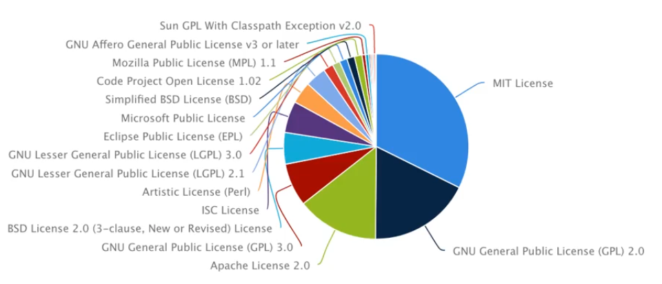 

Open Source Code를 받아서 수정하고 배포하는 범위에 따라 

- GPL License
- LGPL
- AGPL
- Permissive 

정도로 구분할 수 있고, **두 가지로 나누면 copyleft와 permissive**

분포로 보면 점차 Permissive 가 늘어나고있다.

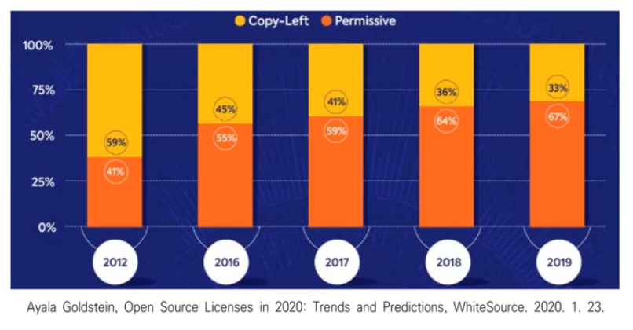 


### Searching OSS Project

> 오픈소스를 어떻게 찾을까

- Free Open Source Software
   ▪ http://freeopensourcesoftware.org/

- Wikipedia
   ▪ https://en.wikipedia.org/wiki/List_of_free_and_open-source_software_packages

- Google

- Code Project 

  ▪ https://www.codeproject.com/

- SourceForge

  ▪ https://sourceforge.net

  > Code Project & SourceForge는 개발자들 사이에서 가장 유명한 오픈소스 다운로드 공간이다 (커뮤니티).
  >
  > 개발할때 예전에는 이 두 곳을 가장 먼저 가봤다. 비슷한 오픈소스 키워드로 검색

- GitHub, GitLab, BitBucket (in Repository)

  > 요즘에는 레포지토리 중심으로 검색하기도 한다.

- BlackDuckOpenHub
   ▪ https://www.openhub.net

- Best Open Source
   ▪ https://www.findbestopensource.com/home


#### Black Duck Open Hub

- 옛 명칭은 **Ohloh**
- 오픈소스 소프트웨어 개발 커뮤니티를 찾는데 도움을 주는 웹서비스이다.
- 여기서 키워드를 통한 프로젝트를 검색할 수 있으며, 다양한 언어 및 라이센스, 액티브 정도 등 각 정보를 얻을 수 있음
- 좋은 기능은, 프로젝트를 비교하는 기능이 존재한다.
  - 핵심 정보, 기본 정보를 기반으로 비교해준다


### Scanning OSS Component

> Open source component를 라이센스 중심으로 찾는 방법

최근들어 법적인 분쟁때문에 라이센스의 complience 문제가 굉장히 중요해졌다.

- Fossology
- Protex
- CodeEyes  - 한국 저작권 위원회

등의 서비스가 존재한다.

**Scanning OSS (FOSS, FLOSS)**

>  **내가 소프트웨어를 올리면, 그 소프트웨어 안에 오픈소스 컴포넌트가 있는지 찾아주고 (scan), 그 오픈소스 소프트웨어의 profile 정보 [라이센스 등]을 찾아주고, 의존성 관계 등의 문제 등을 레포팅 해준다 ** 

 

### Identifying OSS Vulnerabilities

- 우리가 OSS 사용할 때 항상 최신버전을 사용하게 되는건 아니고, 때로는 프로젝트와 가장 적합한 이상적인 버전을 찾게 되는데, 이때 오픈소스의 패치상태를 확인할 필요가 있다. 
- 취약성 분석 등을 위해 사용되는 툴이 존재한다
  - NVD [National Vunerabilties]


### SW Development Tools

- 소프트웨어 개발도구들.
- 오픈소스를 활용해서 대규모 프로젝트를 진행할 때, 가장 먼저 해야 할 것은 현존하는 가장 좋은 **도구** 를 찾아야한다.
  - Survey, 분석, 기능 요구 분석, 프로젝트에 fit 한지 여부를 분석한다
  - Survey 기간이 매우 길 수 있고, 엔지니어 마다 다른 관점이 존재할 수 있음.
- 표준화된 개발 도구를 사용해야한다
  - OS, Editor, compiler/interpreter, library, 등 
- 언제라도 개발 환경을 재구성 할 수 있도록 해야한다
  - Disk image를 만들기도 한다, 백업본을 만들고, 한 켬퓨터에 소프트웨어 개발도구를 다 설치하고 팀원에게 전달.
    - Ghost program으로 디스크 이미지를 만들기도 했었다
  - Macro를 이용하기도 한다, gcc 등, 절대경로의 매크로를 사용해라 등
- 버전 내용, 디테일 내용을 문서화 해라 [explicit document]
- **더 중요한건**
  - 이러한 위 목차는 도구들
  - 도구의 요구사항을 확인하는데 너무 많은 시간 투자를 하여서는 안된다.
  - 내부 도구들의 복잡도를 잘 manage 해야한다


### Error Propagation

소프트웨어 개발 도구를 선정할때 소프트웨어의 **품질**이 중요하다. 소프트웨어의 품질에서 **Error management가 중요하다**. 그것을 위한 error 특징을 알아보자

```python
def callee():
  x = foo() # Fault Hear
  return x
```

>  **Fault는 Error의 첫 번째 근본 원인이라 한다**

x = foo()에서 최초의 에러 [<u>fault</u>]가 발생했다 하면, 여기서 나온 x값이 잘못된것.

즉 이 x = foo()를 호출하는 callee()값이 잘못되었고 이 함수를 사용한 모든 모듈은 잘못된 에러가 나온다.

버그가 나타나서 디버깅 시간이 지연되면 에러와 연관된 모듈들이 증가할 수 있다.

보통 error를 fix하는게 늦춰지면 다른 엔지니어가 버그 존재를 모르고 다른데 복사하는 등 **error 전파가 될 수 있다.**

**error는 propagation 될 수 있기에 빠르게 찾고 고쳐야한다.**

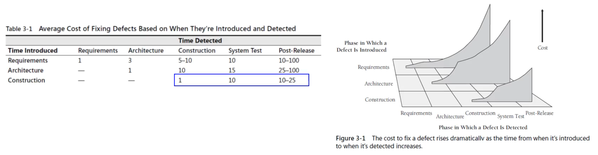

**Error가 발생하고 찾아질때까지 지연이 계속되면 디버깅 비용이 증가할 수 있음을 보이는 표와 그림 **

[Code Complete - 2nd Edition] : Microsoft의 엔지니어가 출간한 책

- 소프트웨어 개발 방법론중 가장 많이 활용되고 추천되는 책
- 표는 각 개발 단계에서 에러 탐지가 지연될수록 Cost가 증가됨을 보인다.
- 요구사항 단계에서 Cost비용을 1 이라고 하면, Test Level에서 버그가 발생하면 이게 10배가 된다.. 
- 또 Construction 단계에서 버그의 cost가 1이라면 test 단계에서는 10배가 된다. 


### Lint

> Error를 빠르게 탐지하기 위해, compiler, interpretor에서 제공하는 문법 오류 이외에도 code analysis 등의 도구가 제공되며, 대표적인 도구 중 **Lint** 가 있다.

Lint 에서 제공하는 다양한 Message

- Variable Not Used: 변수가 사용되지 않음
- Unreachable codes
- Erroneous assignment: Assignment error [예를들어, ==, = 등]

다양한 메시지를 제공하며, python에서는 Pylint가 있다

$pip install pylint 하면 다운 가능


### Code Review

> Compiler, interpretor가 제공하여 문법 오류를 찾을 수 있고, lint로 이들이 찾지 못한 추가적인 오류를 찾을 수 있다.
>
> 그럼에도 찾지 못한 논리적인 오류, 퍼포먼스 이슈, 취약점 등을 찾기 위해 Code Review 단계를 권장한다
>
> QA Quideline이라는 ISO 표준

Open Source로 프로젝트를 진행할땐 훈수충이 많아서 Code Review 등이 많다. 다양한 사용자의 contribution으로 가독성, 코드 퀄리티, 퍼포먼스 이슈, 취약점 등의 다양한 코멘트를 받을 수 있다.


### Issue Tracking System [중요 !]

- 다양한 단계에서 이슈가 발생할 수 있다
  - compiler/ interpreter : syntax error
  - Lint: 추가적인 오류
  - Code Review: 잠재적인 오류, 논리적인 오류 등 [correctness, 성능 이슈, 취약점 등]
    - 이 단계에서는 debugging도 사용된다
  - Run-time error / 논리적인 error 를 찾기위한 **Unit test**
    - 자기 자신이 만든 코드를 테스트 하는게 unit test
    - 자신의 코드를 다른 모듈과는 독립적으로 테스트한다
  - Integration Test: 다른 모듈과 내 코드를 통합해서 테스트
    - 모듈간 발생할 수 있는 오류, Deadlock, Race-condition, interface mismatch 등을 찾을 수 있다.
    - 3rd party app, DMBS를 붙혀 다양한 이슈를 해결
- 이러한 issue들을 관리하는게 **issue tracking system**
  - 언제 발생한 issue 인지
  - 누구의 responsibility 인지
  - Deadline에 맞춰 언제 수정할 것인가 / 보류 할 것인가


------

### Integration Frequency - Phased or Incremental \[*핵심내용]

> 얼마나 자주 Integration을 해야하는가 ?!!

**Phased** **Integration** = [단계적인 Integration]

- <u>전통적으로</u> 우리는 각 모듈을 개발하고 한 번에 통합하는 방식. [All components are integrated at the same time]
- 한 번에 통합하고, 한 번에 테스트 및 디버깅 하는 방식
- 이러한 방식의 **문제점**
  - 이전에 테스트 / 디버깅 된 적이 없기에 **버그들이 한 번에 나타난다**
    - Poorley tested class
    - 두 class 사이의 인터페이스 문제
    - 상호작용 하는데 나타나는 버그
  - 한 번에 버그가 쏟아져 나오기에 디버깅이 어렵다
    - 두 개의 파일을 만들고 서로 다른 에러가 있을 때, error는 propagation 이 된다. 파일 A --> 파일 B로 error propagation이 되면 우리가 디버깅 해야 하는 파일의 수가 많고 찾아내기 어려워진다.


**Incremental Integration** = [점진적인 Integration]

- Phased integration의 문제점때문에 나온 방식이다
- **한 번에 하나의 file만 통합 !**
  - 처음에는 아주 작고, 핵심 부분 [Skeleton] 을 만들어 놓고 **하나씩 모듈이 추가될 때마다 통합하고 테스트를 진행**.
- 하나씩 하나씩 점진적으로 통합해가는 방식이다.
- 장점
  - 하나씩 하나씩 통합하기 때문에, 버그가 여러군대 나왔어도 근본 원인 [**fault**]를 찾기 쉽다
  - Unit test 할 때 전체 시스템과 통합해서 하기 때문에 이전 Phased integration보다 테스트가 잘 진행된다.
  - 명백하게 되는지/안되는지 진행사항을 모니터링 할 수 있음 - improved progress monitoring


### Incremental Integration Strategies

> 대규모 소프트웨어는 모듈이 많은데, <u>스켈레톤에</u> 어떤 모듈부터 통합할지가 Incremental Integration 방법의 가장 중요한 Issue ! [스켈레톤은 최초의 아주 작고 핵심 부분]
>
> 순서를 정하는걸 생각해야한다.

- 모듈들이 계층구조를 갖고 있을 때 
  - 상위레벨 모듈: concept, 디자인 요소
  - 하위레벨 모듈: 구현 Issue 를 담고 있다
  - Bottom-up 방식으로 [하위레벨 --> 상위레벨] 나중에 design이 변경될 수 있고
  - Top-down 방식으로 진행하면 구현적인 Issue가 발생할 수 있기에
  - 중간방식인 hybrid 방식을 활용한다
- **Sandwitch Integration**
  - high-level --> low-level --> mid-level 방식으로 통합
    - 중간 level은 상대적으로 유연하기에 high-low-mid 로
- **Risk-oriented Integration**
  - 각 module별로 risk 를 정하고 [구현의 난이도, 중요도] 분류한 뒤 먼저 통합해 나간다
    - 상대적으로 쉬운 모듈을 통합시켜 성공 확률을 높힌다
- **Feature-oriented Integration**
  - 논리적인 기능별로 나누어서, feature 를 기준으로 통합해 나간다
- 각 프로젝트마다 다르기 때문에 뭐가 좋고 나쁜지 전략을 판단하여야 한다.


### Daily Build and Smoke Test

> Incremental Integration 방법은 **Daily Build** 라고도 언급된다

**Daily Build**

- 모듈이 많은 소프트웨어는 점진적으로 통합해 나가기 위해서는 거의 매일 통합해 나가야함을 의미한다
- 하나의 File을 매일 통합
- 만약 Weekly Build를 한다면, 어떤 주에 broken되면 좋은 상태의 버전을 찾기 위해서는 몇 주 전의 버전을 봐야한다

**Smoke Test**

- Daily Build와 함께 사용되는 Test 방법 중 하나
- \*전체 프로그램이 수행 되느냐 ? **즉, 테스트가 가능 하냐** 등 핵심적인 [critical]한 base functionality를 보는 것\*
  - 프로그램이 수행하는데 연기가 나냐 안나냐..

**Daily Build & Smoke Test 장점**

- Daily Build와 Smoke Test를 통해 계속해서 좋은 품질, 상태를 유지한다
- 버그를 쉽게 찾을 수 있음
- 문제점이 있으면 끝날때까지 누적시키지 않고 계속해서 해결해 나간다
- 실제로 많이 사용되는 방식이다.


### Continuous Integration

> Daily Build에 더 나아가서 Commit이 Push 될 때 마다 하루에 몇 번이고 통합해 나가는 방식
>
> 줄여서 CI - Continuous Integration

- Tool로는 Travis CI, Jenkins 가 존재한다
  - Commit, Push 될때 program을 build하고 다양한 종류의 자동화된 Test 방법을 지원한다
  - Test 결과를 개발자에게 Notice 해준다.

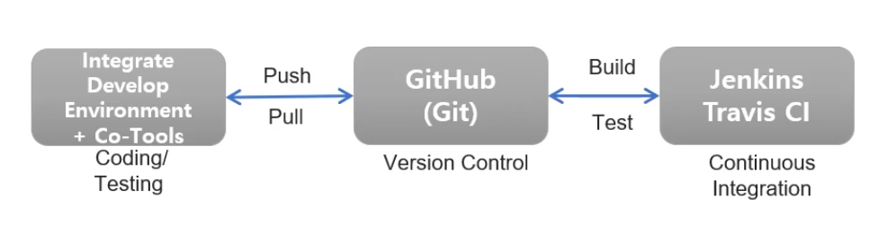 

1. IDE [Integrate Develop Environment] + Co-Tools
   - IDE와 협업 도구를 통해 coding, testing을 한다
2. GitHub 등 Repository에 IDE/Co-Tools를 통해 작성된 코드를 Push/Pull 한다
3. 연동 된 Jenkins나 Travis CI를 통해 Build/Test를 진행한다

**Continuous Integration의 핵심은, 개발환경 뿐만 아니라 모든 실행환경의 모든 commit이 build되고 test된다.**

**최신 Build 된 결과물을 모두가 공유하고 확인할 수 있다**


### Version Control System

- Daily Build나 CI 방법은 Build나 Test가 빈번하다
  - Build System이 Build 한다는 것은 Shared-server에 올리고 공유한다는 것
  - 그렇다면 해당 모듈, 파일의 버전이 업데이트 돼야한다.
- 많은 버전을 관리하기 위한 Version Control System이 필요하다.

**Version Control System**

- 알려진 VCS 유명한건, [Git, CVS, SUBVERSION]
  - git의 사용률이 75%를 넘는다. 그다음 subversion, 그 다음 cvs
- 모든 종류의 파일에 대해 수정된 정보의 내용을 tracking 할 수 있다.
- revision control system 이라고도 불린다
- File 들의 변화를 볼 수 있음.
  - 특정 시점의 수정 내용
  - 현재와 특정 날짜 사이의 변화 내용 등
  - 모든 정보를 확인할 수 있음
- Recovery/Rollback 기능을 제공해서, 특정 시간으로 version을 돌릴 수 있다
- Branch를 나누어 다양한 버전을 다룰 수 있다


**Version Control System은 전형적으로 두 가지 모델로 구현된다**

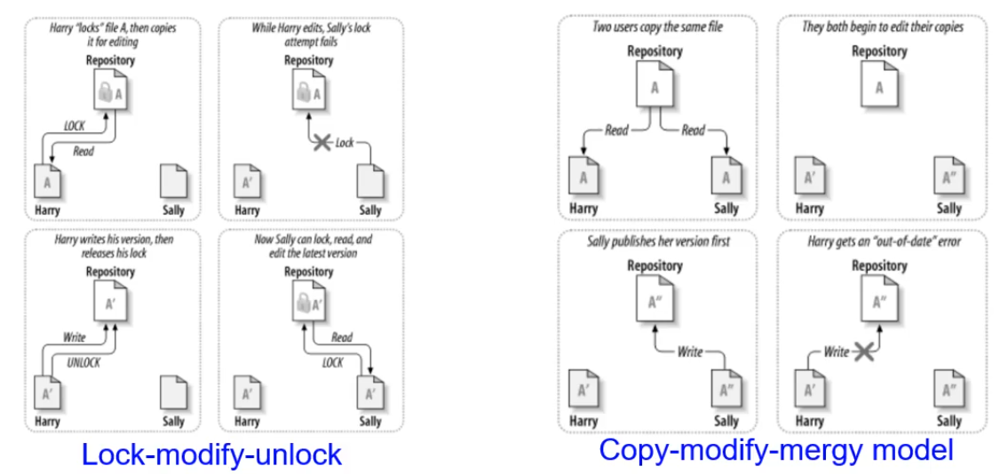 


1. Lock-Modify-Unlock model

   - "Locking Mechanism"을 사용하여 Repository에 수정하고 싶다면, **한 번에 한 사용자가 파일을 수정할 수 있음** 

   - 중앙에 공유되는 Repository가 존재

     - 읽을때는 locking이 필요없고 write 할 때 locking 한다. 이러한 locking을 **check-out** 이라고도 한다.
     - Check-out: 수정하기 위해 locking을 건다는 것
     - locking 돼어있는 상황에서 locking 된 소스코드는 다른 사용자가 lock 할 수 없다. 즉 수정할 수 없다
     - A 파일을 lock 한 뒤 수정하여 A' 을 만들고 write, 즉 unlock을 하는 것을 **check-in** 한다고 한다.

   - 이러한 방식의 **문제점**

     - Source-safe
     - 사용자가 여러 파일을 동시에 수정하는 상황에서 개발하고 check-in을 할 때까지 다른 사용자가 접근을 못한다.
     - 예를들어 금요일에 check-out을 한 상태로 퇴근.. 그 동안은 해당 파일들은 다른사람에 의해 작업 불가하다
     - 함께 작업해야하는 경우 문제가 발생할 수 있다.
     - 강제로 check-in 상태로 돌릴 수 있지만, 기존 작업 내용이 날라갈 수 있다.
       - 그렇기 때문에 Lock 대신 cOpy 하자 ! 해서 copy-modify..

     

2. Copy-Modify-Merge model
   - Locking 하지 않고 **copy해서 수정하고 합처나가는 방법**
   - 문제점
     - Check-in 할 때 문제가 될 수 있다.
     - A'와 A''중 A''이 먼저 write/check-in 했을 때 A'의 내용이 날라갈 수 있다. <u>그렇기 때문에 **Merge** 를 해야한다.</u>
     - Merge는 VCS에서 지원되기도 하지만, **최종 책임은 마지막 check-in 하는 사람이 지어야 할 수 있다.**


### Reference

- Code Complete 2nd Edition
- Python Debug with Pdb
- How to make Mistakes in Python Mike Pirnat, O'Reilly


## OSS Tools II [Testing and Debugging in Python]

지난 수업까지는 Open Source Software를 사용해서 개발을 할때, 각 개발 단계에서 어떤 도구들이 사용되었는지, 또 관련 용어와 왜 필요한지를 공부하였다. 오늘은 Python 에서의 debugging, 특히 **<u>pdb</u>** 를 자세히 알아보자

- Dubugger
- Python Debugger: **pdb**
- Unit Test
- Pdb Commands
  - Examine the variables and expressions
  - Breakpoints
  - Execution Control
  - Call Stack Control
  - Conditional Breakpoints

****

### Debugger

- 왜 Debugger를 사용하는가 ?
  - 어떤 프로그램이 수행중 이거나, Crahsed 됐을 때 그 프로그램의 내부가 어떻게 돌아가는지, 컴퓨터가 실행하는 방식으로 동일하게 동작원리를 파악할 수 있는 기능을 제공하는 도구이다. 
- 기본 기능
  - 프로그램 실행을 control 할 수 있다 [ex. 한 스탭 다음, 10 스탭 다음 등]
  - 중단됐을 때 다양한 인자의 값, 메모리 값을 파악할 수 있음
  - 조건이 됐을때 멈추는, conditional breakpoint 제공

- 디버거는 오류를 찾을 때 사용되기도 하지만, <u>내가 짠 코드가 아닌 다른 사람의 코드를 정확히 이해하는데 동적 분석의 용도로 사용되기도 한다.</u>
  - 개발 단계에서도 다른사람의 코드를 이해해야하기도 하는데, 그럴때 사용된다.


### Python Debugger: pdb

- Python 표준 library 안에 존재하는 디버거, pdb.
- 디버거 종류 크게 **두 가지**
  - PDB - promp를 통해 사용자와 interact 하는, **interactive command-line** 
  - GUI Debugger: Visual Studio에서 제공하는 Debugger
    - Visual GUI 기반의 Debugger
    - IDE 마다 생김새, 명령어가 다르다.
- GUI Debugger를 사용하지 못하는 경우가 있을 수 있다.
  - Terminal이나, Prompt 창 에서 디버깅을 진행하는 상황이 생길 수 있음.
- 그럴 때 언제든지 사용 가능한 debugging 툴이 바로 **pdb** 이다. 
  - pdb는 python library 안에 존재하기 때문
- pdb를 알아두면, interactive command-line [gdb, jdb, pdb, ipdb, rdb, wdb, ... ] 들의 명령어가 모두 비슷하기에 편리함이 있고 적응이 빠르다.
- **pdb를 수행하는 방법은 두 가지가 존재**
  - Hard coding 방법: 처음에 중단할 곳 [breakpoint()] 를 <u>코드 내에</u> 지정하면 prompt 화면이 뜬다
  - 코드내에 변화가 없이 디버깅을 실행하고 싶다면, "-m pdb" option을 주면된다.


### 4 Phases for Debugging with Testing

> Debugger의 목적: Debugging 또는 동적 분석에 활용된다 하였다.
>
> 디버깅 할때 일반적으로 거치는 네 가지 단계

- Test 

  > 최초의 에러 발생지 [fault]를 못잡고 시간이 지나면, 이 file/module을 호출한 애들이 잘못 된 값을 받아가면서 error가 전파된다 [error propagation]. 이 중에서 Error를 찾는 행위를 **Test**라 한다. Coverage를 100%로 하는 것이 목표이다.

  - Wide range of inputs

- Stabilize

  > Error가 Test 때 어쩔때는 발견되고, 어쩔때는 발견되지 않을 수 있다. 
  >
  > 에러를 재현하는 것, 에러가 발생할 수 있도록 항상 condition/state을 유지시키는 것이 **stabilize 이다**

  - Regenerate the specific error

- Localize

  > 오류를 어떤 state 상황에서 만들어 냈을 때 Fault를 찾기 위해 연결된 파일의 범위를 좁혀가는 단계가 **Localize**
  >
  > 즉 근본 원인, Fault 를 찾는것

  - Where is the cause of error ?
  - Narrow range of possibilities

- Correction

  - Fix the fault itself

보통 QA 팀에서 Test, Stabilize를 진행한다. 보통은 개발자가 대다수를 진행한다.


### Unit Testing

- 자신이 짠 코드를 모든 라인에 대해서 테스트 하는것을 Unit Test 라고 한다. 

- 목적은 problem/error를 최대한 빨리 찾기 위하여

- Python에서 제공하는 Tools

  - Python's unittest: 기본 제공하는 도구

    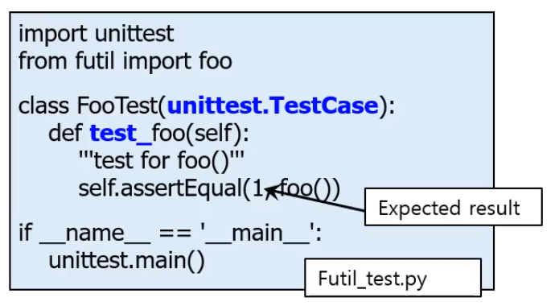 

    > unittest.TestCase를 상속받아서 test_ 로 시작하는 메소드를 만들어서 사용한다.

  - Pytest

  - Tox

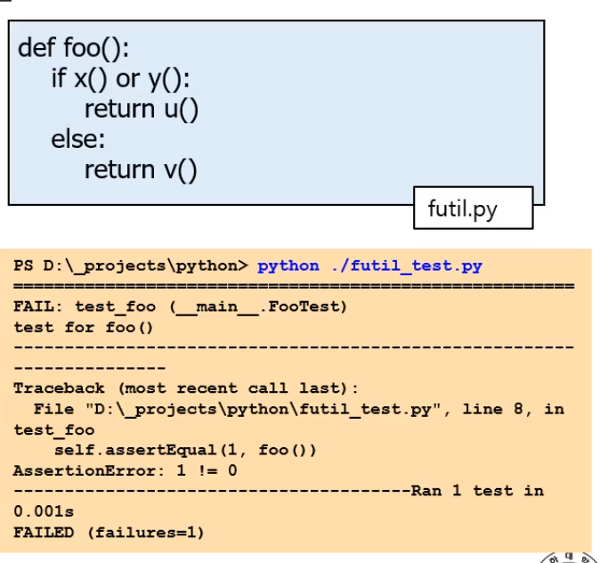 

Test를 진행할 때, 모든 line이 실행이 되야 Test 됐다 하는데, if 와 같이 expression이 있는 경우 여러 줄이 테스트가 진행되지 않을 수 있다.

예를들어, x() 함수가 True를 return 한다면, y() 메소드와 v() 메소드는 테스트에 포함되지 않는다.

이런것들을 **<u>Test Coverage</u>** 라고한다.


### pdb - All the commands

> 실습은 IDLE로 진행. Pdb prompt로 진입하기 위해, breakpoint() 를 호출하여 종료시킴며 자동으로 디버깅 화면인 pdb로 진입하자.

- 기본적으로 help 명령어를 치면 명령어들을 볼 수 있다.

  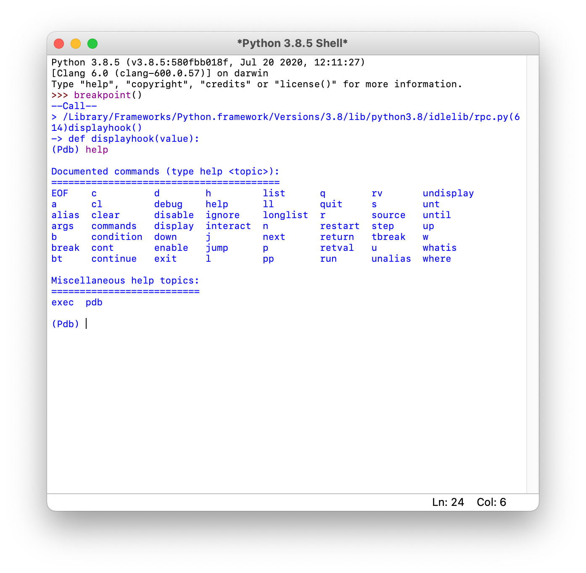 

### Explicit Trace Point

-  Hard Coding a breakpoint: pdb를 실행시키기 위해 강제적으로 breakpoint() 를 호출시켜서 pdb prompt 화면으로 넘어간다. 코드 내에 작성해야한다.
  - import pdb; pdb.set_trace() --> 3.7 이전, 이후에는 breakpoint() 를 호출하면 된다.

### Debugging without modifying sources

- Code 내에 breakpoint() 함수를 작성해서 강제적으로 해당 위치에서 디버깅을 시작하는 방법이 아닌 코드를 건드리지 않고 디버깅을 실행하는 방법이다
- 수정이 없다는 장점이 존재한다
- $python -m pdb sample.py 
  - -m pdb 를 실행시 함께 명령어로 넣어준다.
- 다만 파일을 실행과 동시에 디버깅을 시작한다.


### Getting Started

- Python에서 기본적으로[내부적으로] 관리하는 두 가지 변수

  - \__name__: 현재 수행중인 모듈의 이름을 저장하는 변수
  - \__file__: 수행중인 모듈의 전체 경로를 저장한다.

  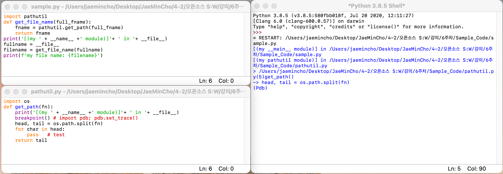 

  - 첫 번째로, print('[(my ' + \_\_name__ +' module)]'+ ' in '+ \_\_file__) 에 의해 \_\_name\_\_ 가 현재 main sample.py에서는 main 임을 보이며, pathutils에서는 pathutil module 임을 보이고  \_\_file\_\_ 이 두 파일, sample.py 와 pathutil.py의 파일 위치 경로를 알려준다.

  - breakpoint()에 의해 pdb로 진입한 뒤, 보여주는 정보

    ```python
    > /Users/jaemincho/Desktop/JaeMinCho/4-2/오픈소스 S:W/강의/6주차/Sample_Code/pathutil.py(5)get_path()
    -> head, tail = os.path.split(fn)
    ```

    1. 파일 이름 & 라인 번호 & 함수 이름
       - ../pathutil.py(5)get_path() : 
         - pathutil.py 라는 파일 이름
         - 5 번째 라인
         - get_path() 라는 메소드
    2. 그 다음 수행하는 소스코드
       - --> head, tail = os.path.split(fn)


### Pdb Commands: Call Stack Control

- Python 프로그램을 수행할 때 'Call Stack'을 사용한다.

  - Call Stack은 Stack frame들의 집합

  - 함수가 호출될 때 새로운 stack frame이 생겨서 call stack에 쌓이고, 함수가 종료되면 frame이 자동적으로 사라진다.

  - 예를들어, sample.py와 pathutils.py 함수의 경우,

    1. get_file_name: called 

    2. get_path: called

    그렇다면 앞 뒤로, 프레임이 하나 씩 생겨 총 세 개의 스택 프레임이 생겼다고 할 수 있다.

    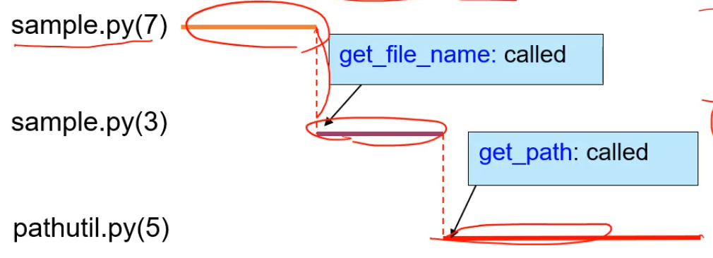 

- 여러개의 모듈들이 있는데 중단되었을 때 그때의 depth를 알고싶으면 '**w**' 또는 '**bt**' 명령어를 사용한다.

  - 즉, w (where) or bt: current staack frame을 알려준다.

    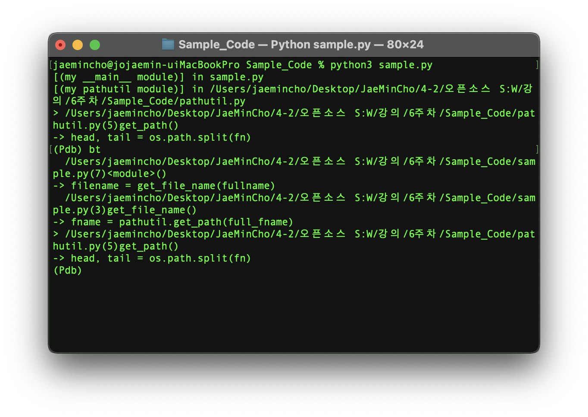 

    - bt 명령어를 통해 현재 스택, 이전 스택들을 순서대로 보여준다.

- Call Stack에서 자유롭게 Up, Down을 할 수 있다

  - u (up)
  - d (down)
  - 인자로 숫자를 넣을 수 있다. 이동하고싶은 만큼.. 기본 디폴트는 1 만큼 움직인다.

  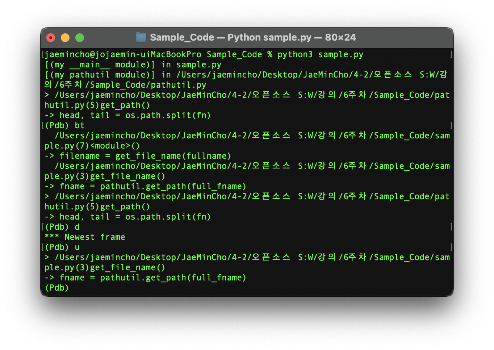 

- 명령어 '**step**': 다음 수행할 차례의 함수에 들어가도록 하는 명령어이다.


### pdb Commands: Viewing the source

pdb mode에서 소스코드를 보는 명령어가 있다

- l (list): 인자가 없거나 1 개, 2개 있을 수 있음.

  - l: 인자없으면, current line에서 11개의 라인이 출력된다
  - l 100: 1개의 인자, 100번지 라인중심으로 11개의 라인이 보인다
  - l . : 무조건 current line 중심으로 11개, l을 계속 사용하면 뒤로 가는데, Current Line 중심으로 다시 보여준다.
  - l 100, 200: 100번째 라인부터 200번째 라인을 보여준다
  - l 200, 50: 뒷 숫자가 더 작다면 200번째 라인부터 50줄을 보여준다.

- ll (longlist): 현재 전체 소스코드의 **함수부분의 전체 코드를 보여준다**.

  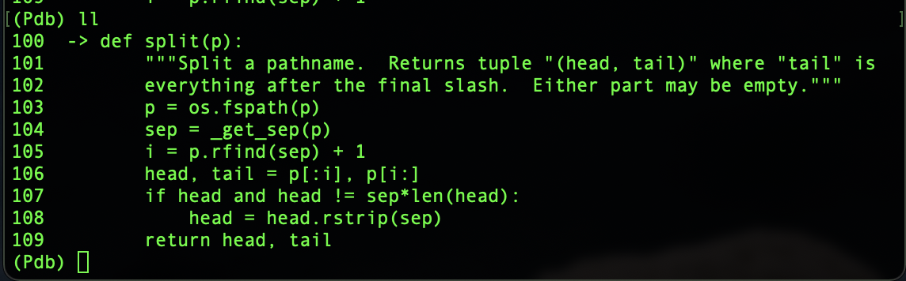 


### pdb commands: Examine the variables

변수나, expression을 확인 해 보자.

1. p(print): 예를들어, 위 함수 def split (p): 에서 접근 가능한 변수는 이다. 그때 **(Pdb) p** p 라는 명령어를 쓰면 해당 expression의 값을 보여준다.

    

2. pp [expression]: Single line에 하나의 아이템씩 정돈된 형식으로 출력해준다. 보통은 dictionary나 list에서 사용된다. 

3. Display [expression]:  출력하는건 동일하지만, 그 이후에 값이 변경될때마다 자동 출력하는 기능이다.

   - 인자 없이 display를 입력하면, 현재 display에 등록된 변수들을 보여준다.
   - 등록된 display를 지우고 싶다면, undisplay [expression], 인자 없이 하면 다 지운다.

4. whatis arg: type을 출력한다. 

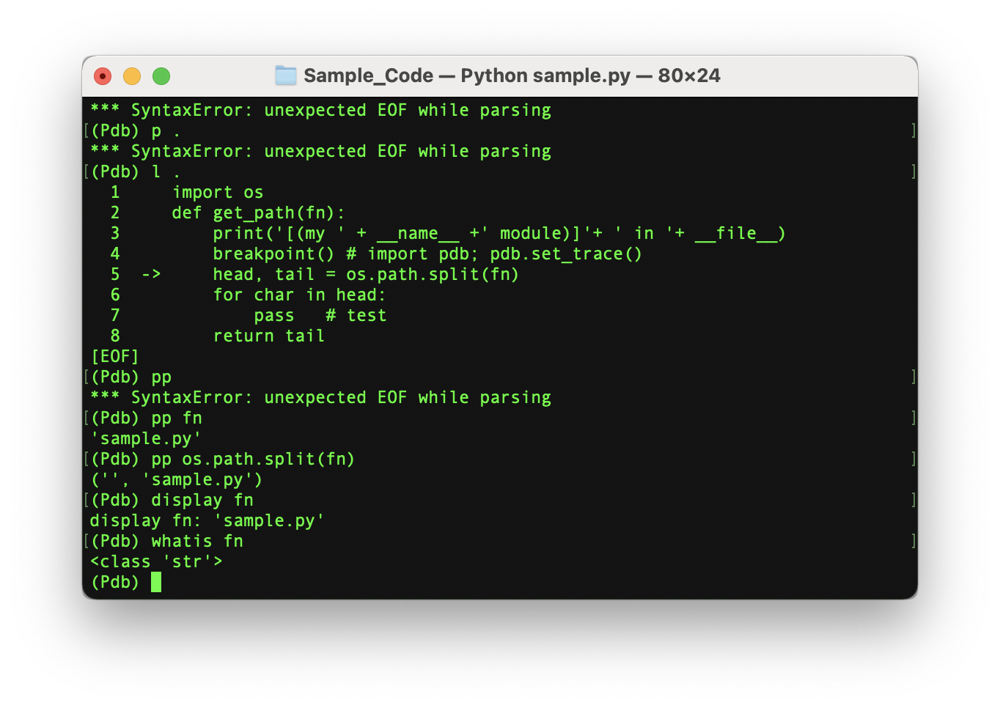 

명령어 '**a**' : 현재 frame에서의 인자.

 

p [expression]: 해당 라이브러리의 값 [주소]

pp [expression]: 여러줄을 한 줄씩 single line으로 정돈하여 보여준다.

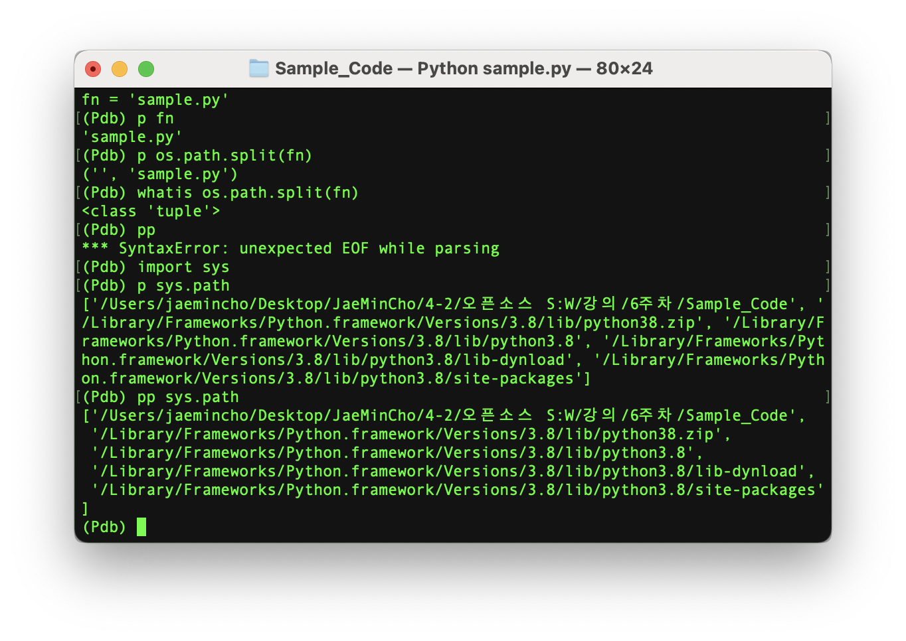 

### pdb commands: Breakpoint

- 중단점 [breakpoint()]은 디버깅하는데 생산성을 결정한다. 

- **디버깅 중 추가적인 디버깅 포인트 [breakpoint]를 설정하거나 = b 명령어, 디버깅이 필요없는경우 breakpoint를 삭제 = cl 명령어 를 이용하여 생산성을 늘릴 수 있다.**

- 디버거가 중단점을 만나면 중단이 되며 Prompt가 깜빡이고 명령어를 받도록 한다.

- **b(break)**:  [file이름:라인번호:함수번호] 형식으로 사용한다.

  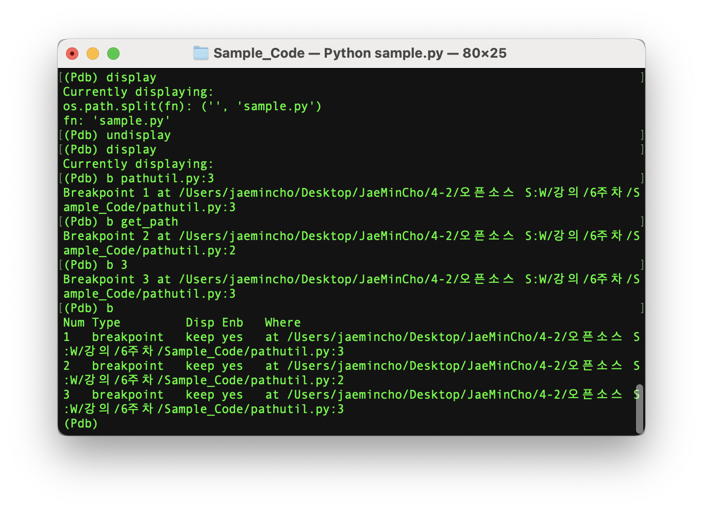 

  - b 파일이름:라인번호
  - b 함수명
  - b 라인번호
  - b : 모든 breakpoints를 보여준다

- **cl (clear)**: [bpnumber] - breakpoint 숫자를 입력하면 해당 breakpoint를 지워준다.

  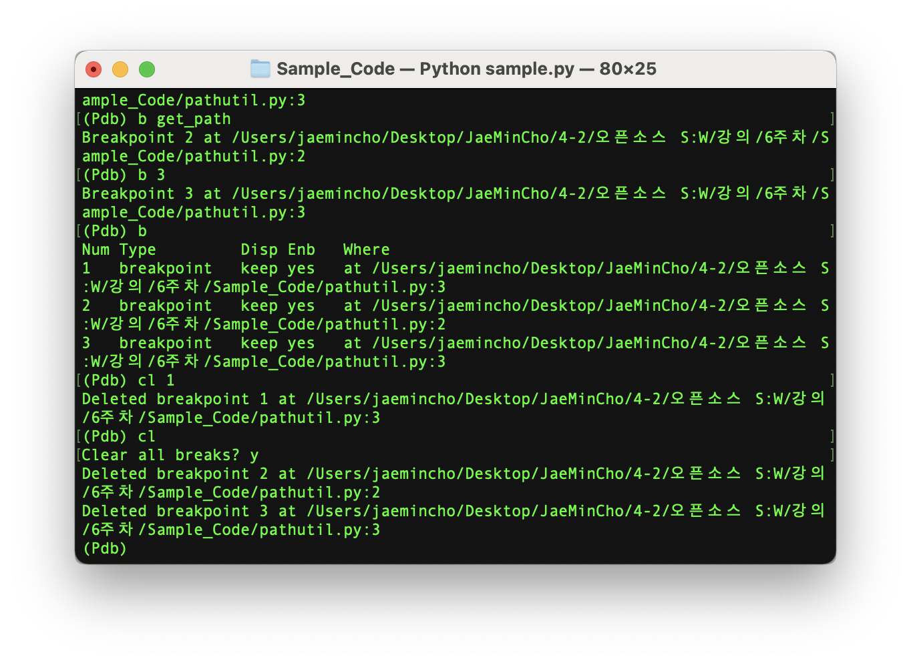 


### pdb commands : Execution Control

실행을 control 하는 명령어들. 

프로그램을 다시 수행 한 이후에 어디서 멈추게 할 것인가를 결정하는 명령어.

1. c (continue): 추가적으로 중단점이 있다면, 다음 중단점을 만날때 까지 수행하라

2. n (next): 현재 함수에서 다음 라인까지 수행 - 중요한것은 현재 function 내에서 수행, 현재 수행 할 함수가 있어도, 건너띈다 즉 **step over** F10?

3. s (step): 현재 디버깅 line에서 들어갈 function이 있다면 들어가서 수행한다 즉 **step into** 개념. F11? 다른 함수에 들어가서 라인을 수행. 이때 pdb에서 \--Call-- 명령어를 보여줄 것

4. r (return): 함수에서 나올 때 사용한다. 즉 **step out**

5. **unt (until)** [line#]: ex. (unt 10) 인자로 라인 번호가 들어간다. 뜻은, 라인번호 이상 실행할 때까지 수행한다. 반복문 등에서 많이 사용된다. 예를들어 반복문 줄에 있을 때 next를 하면 또 반복문으로 들어가는데, 이때 반복문 밖의 라인번호를 인자로 넘기면 반복문을 모두 수행한 뒤로 갈 수 있다.

   라인 번호를 인자로 안주면, 현재 current line 보다 큰 라인번호로 취급한다.


### pdb commands: Conditional Breakpoint

- b (break) [파일이름 : 라인번호 또는 함수명] - 중단점을 설정한다

- b (break) [파일이름 : 라인번호 또는 함수명] **,** **(condition)** - 뒤에 condition을 줄 수 있다. 즉 조건을 줄 수 있다. 

  - ex) b 7, char == 'h' 

  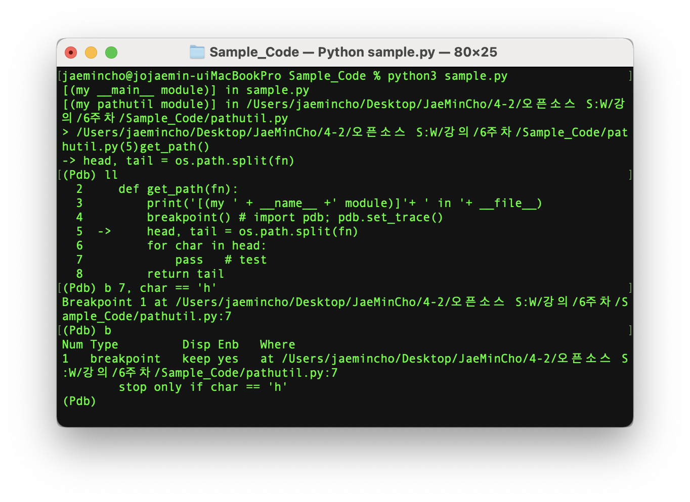 

  즉, line 7이 char가 h 일때, 중단점을 걸 수 있다.

  ex) b 7, **not** expression 

- condition [breakpoint #]: breakpoint #의 조건을 변경할 때 사용한다.

  - ex. condition 1 char == 'n'
  - breakpoint 1번의 condition을 바꾼다.


