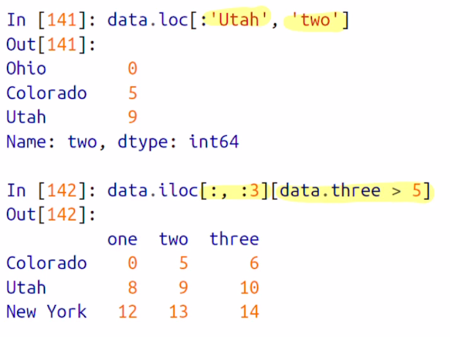
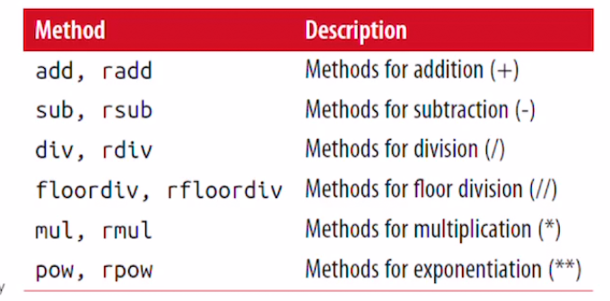
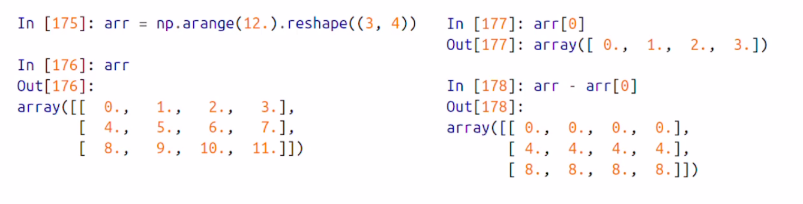
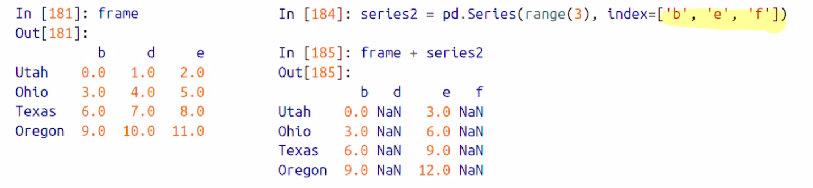
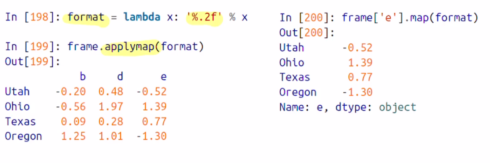
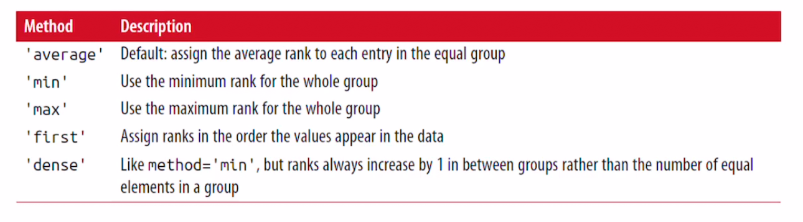

## Pandas(II)


### Reindexing

- the <u>reindex</u> method

  - 새로운 index에 맞도록 객체를 새로 생성해준다.

    ```python
    >>> obj = pd.Series([4.5, 7.2, -5.3, 3.6], index = ['d','b','a','c'])
    >>> obj
    d    4.5
    b    7.2
    a   -5.3
    c    3.6
    dtype: float64
      
    
    >>> obj2 = obj.reindex(['a', 'b', 'c', 'd', 'e'])
    >>> obj2
    a   -5.3
    b    7.2
    c    3.6
    d    4.5
    e    NaN
    dtype: float64
    ```

  - reindex를 사용해서 새로운 값들을 index에 맞게 생성해준다.

  - 존재하던 값들을 넣었으면, 그 값에 맞게 재 배치가 되며, 없는 값은 NaN이 들어간다


- time series 같은 순차적 데이터를 reindex 하면 값이 보관 [interpolation]하거나, 채워 넣어야 할 수 있다. 

  - 이땐 Method option을 사용하면 된다
  - **ffill** 로 누락된 값을 채울 수 있다.
    - ffill 은 직전의 값으로 누락된 값을 채워넣는것 ! [forward fill 이다]

  ```python
  >>> obj3 = pd.Series(['blue', 'purple', 'yello'], index = [0, 2, 4])
  >>> obj3
  0      blue
  2    purple
  4     yello
  dtype: object
  >>> obj3.reindex(range(6), method = 'ffill')
  0      blue
  1      blue
  2    purple
  3    purple
  4     yello
  5     yello
  dtype: object
  ```

  - 기존에 0, 2, 4의 인덱스 밖에 없는데, reindex로 0~ 5까지의 인덱스를 새로 생성했고, 없는 값에 method = 'ffill'로 직전 인덱스의 값으로 채운다.

  ```python
  >>> obj3.reindex(range(6))
  0      blue
  1       NaN
  2    purple
  3       NaN
  4     yello
  5       NaN
  dtype: object
  ```

  - method = 'ffill' 을 사용하지 않은 경우이다 !


- DataFrame 상에서도 reindex가 가능하다.

  - **row index와 column index 모두 변경이 가능하다**
  - 그냥 배열로 reindex를 하면 <u>row</u>의 index가 제배치된다.

  ```python
  >>> frame = pd.DataFrame(np.arange(9).reshape((3,3)), index=['a','c','d'],
  		     columns =['Ohio', 'Texas', 'California'])
  >>> frame
     Ohio  Texas  California
  a     0      1           2
  c     3      4           5
  d     6      7           8
  ```

  - DataFrame을 선언하고, 기존 row index는 a, c,d 

  ```python
  >>> frame2 = frame.reindex(['a','b','c','d'])
  >>> frame2
     Ohio  Texas  California
  a   0.0    1.0         2.0
  b   NaN    NaN         NaN
  c   3.0    4.0         5.0
  d   6.0    7.0         8.0
  ```

  - Reindex를 하니 row index를 변경하였다.


- DataFrame의 column의 인덱스를 Reindex 하고싶다면?

  - column keyword를 사용한다

  - ```python
    >>> states = ['Texas', 'Utah' ,'California']
    >>> frame.reindex(columns = states)
       Texas  Utah  California
    a      1   NaN           2
    c      4   NaN           5
    d      7   NaN           8
    ```

  - Texas, Utah, California로 변경 Utah는 값이 없었기에, NaN 으로 채워진다

- <u>loc</u>를 쓰면 라벨링을 통해 reindexing을 더 간결하게 처리할 수 있다

  - loc 을 통해, 첫 번째 배열 [] 은 row의 인덱스를, 두 번째 배열값에 column의 인덱스를 동시에 reindex 할 수 있다.

  ```python
  >>> frame2.loc[['a', 'c','d'], states]
     Texas  Utah  California
  a      1   NaN           2
  c      4   NaN           5
  d      7   NaN           8
  ```


#### Reindex 함수의 alguments

 


### Dropping Entries from an Axis

- The **drop **method

- Method에 인자로 사용된 인덱스의 값을 삭제시킨다 !!

  ```python
  >>> obj = pd.Series(np.arange(5.), index = ['a', 'b', 'c', 'd','e'])
  >>> obj
  a    0.0
  b    1.0
  c    2.0
  d    3.0
  e    4.0
  dtype: float64
  >>> new_obj = obj.drop('c') # c 인덱스를 뺀것
  >>> obj
  a    0.0
  b    1.0
  c    2.0
  d    3.0
  e    4.0
  dtype: float64
  >>> new_obj
  a    0.0
  b    1.0
  d    3.0
  e    4.0
  dtype: float64
    >>> obj.drop(['d','c'])
  a    0.0
  b    1.0
  e    4.0
  dtype: float64
  ```

  - 동시에 여러개 삭제도 가능 !


- DataFrame의 경우는 drop 함수를 사용해서 row index에 해당되는 값을 모두 삭제한다

- ```python
  >>> data = pd.DataFrame(np.arange(16).reshape((4, 4)), index = ['Ohio', 'Colorado', 'Utah', 'New York'], columns = ['one', 'two', 'three', 'four'])
  >>> data
            one  two  three  four
  Ohio        0    1      2     3
  Colorado    4    5      6     7
  Utah        8    9     10    11
  New York   12   13     14    15
  >>> data.drop(['Colorado', 'Ohio'])
            one  two  three  four
  Utah        8    9     10    11
  New York   12   13     14    15
  ```

  - drop 을 사용해서 매칭되는 row 전체를 삭제하였다 !

- DataFrame에서는 row 뿐만 아니라 column의 값도 삭제할 수 있다.

  ```python
  >>> data.drop('two', axis = 1)
            one  three  four
  Ohio        0      2     3
  Colorado    4      6     7
  Utah        8     10    11
  New York   12     14    15
  >>> data.drop('two', axis = 'columns')
            one  three  four
  Ohio        0      2     3
  Colorado    4      6     7
  Utah        8     10    11
  New York   12     14    15
  ```

  - axis = 1 또는 'columns'로 할당할 수 있다.

- Drop 함수를 통해서 DataFrame이나 Series의 원본 객체를 변경하면, 새로운 객체가 반환된게 아닌, 변경된 원본 객체를 리턴한다. 즉 변경되지않고 변경사항만 보여준다


- 실제로 값을 drop하고 그 값을 저장하고 싶다면

  - '**Inplace = True**' 옵션을 사용한다

  ```python
  >>> data.drop(['three', 'four'], axis = 1, inplace=True)
  >>> data
            one  two
  Ohio        0    1
  Colorado    4    5
  Utah        8    9
  New York   12   13
  ```


### Indexing, Selection, and Filtering

- Series Indexing - 시리즈의 인덱싱 

  - NumPy 배열의 인덱스와 유사하지만, 차이점은 정수 인덱스가 아닌 다른 인덱스 값을 사용할 수 있다.

    ```python
    >>> obj = pd.Series(np.arange(4), index = ['a','b','c','d'])
    >>> obj
    a    0
    b    1
    c    2
    d    3
    dtype: int64
    ```

    - obj 가 index가 'a', 'b', 'c', 'd' 라벨을 갖은 Series가 있다.

    ```python
    >>> obj['a']
    0
    >>> obj['c']
    2
    ```

    - index 라벨 자체로도 값을 가져올 수 있다.

    ```python
    >>> obj[1]
    1
    >>> obj[1:4]
    b    1
    c    2
    d    3
    dtype: int64
    ```

    - index 순서 정수로도 가능하고 slicing이 가능하다.

    ```python
    >>> obj[['a','b']]
    a    0
    b    1
    dtype: int64
      
    >>> obj[[1, 3]]
    b    1
    d    3
    dtype: int64
      
    >>> obj[obj < 2]
    a    0
    b    1
    dtype: int64
    ```

    - 정수배열, 또한 Boolean 으로도 사용 가능하다.

  - **Label 값을 통한 slicing** - 정수 슬라이싱과의 차이점

    ```python
    >>> obj['b':'c']
    b    1
    c    2
    dtype: int64
    >>> obj['c':'b']
    Series([], dtype: int64)
    ```

    - 'b' 부터 'c' 까지 양 끝을 포함해서 slicing 하라는 것
    - 즉 b index부터 c index 까지 !
    - python slicing은 시작 ~ 끝 - 1 인거와 차이가 있다.

    ```python
    >>> obj['b':'c'] = 5
    >>> obj['b':'c']
    b    5
    c    5
    dtype: int64
    ```

    - 값을 변경도 할 수 있다 . slicing 으로


- DataFrame Indexing

  - DataFrame은 column과 row 각각에 index가 존재하기 때문에, 각각의 경우가 다르게 있다

  

  - 하나의 컬럼, 여러개의 컬럼값을 가져올 수 있다.
  - DataFrame도 정수를 사용한 slicing을 통해 row를 선택할 수 있다.

  

  - Boolean으로 인덱싱이 가능한데, [즉, 조건에 맞는 row를 선택할 수 있음]
    - data < 5 면 해당 조건에 따라 스칼라 값과의 비교, dataFrame이 해당 조건에 따라 boolean DataFrame으로 변경이되고 출력을 한다

  

- Slicing with **loc** and **iloc **- loc과 integer loc

  - loc과 iloc을 사용하게 되면, label을 통해 row, column을 모두 인덱싱 할 수 있다
  - loc을 사용하면 row, column에 라벨을 사용해 인덱싱
  - iloc을 사용하면 정수를 이용해 인덱싱이 가능하다.

  ```python
  data.loc['row', 'column'] 
  ```

   

  - 즉 row가 Colorado 이면서, column이 two, three인걸 출력
  - iloc도 각각 row, column을 넣는다
  - 단일 인자면 row값을 출력해준다.

- loc과 iloc으로도 슬라이싱이  가능하다.

   

- DataFrame에서의 indexing

 


### Integer Indexes

- Pandas에서는 정수 인덱스를 사용할 경우, python의 list나 tuple의 정수 인덱스와 차이점이 있다.

  - 주의해야한다

  ```python
  >>> ser = pd.Series(np.arange(3.))
  >>> ser[-1] # 에러가 난다 !
  
  >>> ser
  0    0.0
  1    1.0
  2    2.0
  dtype: float64
  # 정수 인덱스를 사용하라는 것인지, label 인덱스를 사용하는지 헷갈린다.
  
  >>> ser = pd.Series(np.arange(3.), index = ['a','b','c'])
  >>> ser[-1]
  2.0
  >>> ser
  a    0.0
  b    1.0
  c    2.0
  dtype: float64
  ```

  - index를 지정해주면 에러가 나지 않는다. 모호함이 없어져서~ 

- 정수가 라벨인 경우 ! integer index

  ```python
  >>> ser = pd.Series(np.arange(3.0))
  >>> ser
  0    0.0
  1    1.0
  2    2.0
  dtype: float64
  ```

  - ser가 0, 1, 2가 라벨인 인덱스를 갖고 있다.

  - 보통 라벨을 먼저 찾지만, 인덱싱과 슬라이싱을 제대로 하고싶고, label 인덱싱을 하고싶다면

    - loc (for labels)

  - 정수 인덱싱을 하고 싶다면 

    - iloc (for integers)

    ```python
    >>> ser.loc[:1]
    0    0.0
    1    1.0
    dtype: float64
    >>> ser.iloc[:1]
    0    0.0
    dtype: float64
    ```

    - loc을 사용한다면, 라벨 기준이기 때문에 0부터 1까지 포함해서 출력을 하고
    - iloc을 사용한다면 0부터 1-1 까지 0만 출력한다


### Arithmetic and Data Alignment

> 산술연산을 통한 데이터 정렬

Pandas에서 가장 중요한 기능 중 하나는, **다른 인덱스를 가진 객체들간에 산술 연산이 가능하다는 것 !**

DB에서 outer join과 유사하게 동작한다.

```python
>>> s1 = pd.Series([7.3, -2.5, 3.4, 1.5], index = ['a' ,'b','c','d'])
>>> s1
a    7.3
b   -2.5
c    3.4
d    1.5
dtype: float64
>>> s2 = pd.Series([-2.1, 3.6, -1.5, 4, 3.1], index = ['a', 'c', 'e', 'f', 'g'])
>>> s2
a   -2.1
c    3.6
e   -1.5
f    4.0
g    3.1
dtype: float64
```

- s1은 a,b,c,d를 인덱스로, s2는 a,c,e,f,g를 인덱스로 갖는 Series들이다
- 이 두 시리즈를 더할경우, 매칭되는 인덱스끼리 덧셈이 되고, 서로 겹치지 않는 값은 NaN으로 채워진다

```python
>>> s1 + s2
a    5.2
b    NaN
c    7.0
d    NaN
e    NaN
f    NaN
g    NaN
dtype: float64
```

- 산술연산의 경우 missing value가 전파된다 !!
  - 즉 예를들어, b index 같은경우, s1 + s2는
    - -2.5 + NaN = NaN 이 된것이다 !


##### DataFrame에서의 Data 정렬

- DataFrame에서 정렬은 row와 column에 모두 적용이 된다.
- 예시로 두 dataFrame을 더한 결과를 살펴보면서 알아보자

```python
>>> df1 = pd.DataFrame(np.arange(9.).reshape((3, 3)), columns = list('bcd'), index = ['Ohio', 'Texas', 'Colorado'])
>>> df2 = pd.DataFrame(np.arange(12.).reshape((4, 3)), columns = list('bde'), index = ['Utah', 'Ohio', 'Texas', 'Oregon'])
>>> df1
            b    c    d
Ohio      0.0  1.0  2.0
Texas     3.0  4.0  5.0
Colorado  6.0  7.0  8.0
>>> df2
          b     d     e
Utah    0.0   1.0   2.0
Ohio    3.0   4.0   5.0
Texas   6.0   7.0   8.0
Oregon  9.0  10.0  11.0

>>> df1 + df2
            b   c     d   e
Colorado  NaN NaN   NaN NaN
Ohio      3.0 NaN   6.0 NaN
Oregon    NaN NaN   NaN NaN
Texas     9.0 NaN  12.0 NaN
Utah      NaN NaN   NaN NaN
```

- 두 데이터 프레임을 더한 결과를 보면, 두 DataFrame에 존재하는 row index, column index가 하나로 합쳐지며, 각각에 겹치는 인덱스만 연산이 진행되며, 겹치지 않는건 NaN으로 채워진다


- 공통되는 Column , row label을 연산하면 NaN인데 서로 겹치지 않으면 NaN

- Nan 값을 채우는 방법 

  - np.nan 을 쓰면 NaN 값을 넣을 수 있는데,

  - Add method 를 사용하고  fill_value 옵션으로 NaN에 해당값을 변경할 수 있다.

  - ```python
    >>> df1.add(df2, fill_value=0)
                b    c     d     e
    Colorado  6.0  7.0   8.0   NaN
    Ohio      3.0  1.0   6.0   5.0
    Oregon    9.0  NaN  10.0  11.0
    Texas     9.0  4.0  12.0   8.0
    Utah      0.0  NaN   1.0   2.0
    ```

  - 왜 안되는지 모르겠다. 근데 이론상으로는 fill_value 값을 더한다는 느낌

  - 즉 없는데 a + NaN = NaN 이 아닌, a + fill_value 로 진행되는것

- reindex할때도 NaN을 fill_value로 채워줄 수 있다.  


산술연산 메소드들

 

```python
>>> 1/df1
                 b         c      d
Ohio           inf  1.000000  0.500
Texas     0.333333  0.250000  0.200
Colorado  0.166667  0.142857  0.125
>>> df1.div(1)
            b    c    d
Ohio      0.0  1.0  2.0
Texas     3.0  4.0  5.0
Colorado  6.0  7.0  8.0
>>> df1.rdiv(1)
                 b         c      d
Ohio           inf  1.000000  0.500
Texas     0.333333  0.250000  0.200
Colorado  0.166667  0.142857  0.125
```

- 앞에 r이 달린 짝궁 메소드가 존재하는데,
- df1 / 1은 df1.div(1) 과 같은 연산이며
- 1/ df1 은 df1.rdiv(1)과 같은 연산이다
- 즉 연산의 방향이 바뀐다 !


### Operations between DataFrame & Series

> DataFrame과 Series 간의 산술연산을 알아보자

DataFrame은 2차원 배열, Series는 1차원 배열이라고 생각할 수 있다.

NumPy에서 배운 broadcasting과 비슷하다.

 

```python
>>> frame = pd.DataFrame(np.arange(12).reshape((4,3)), columns = list('bde'), index = ['Utah', 'Ohio', 'Texas', 'Oregon'])
>>> frame
        b   d   e
Utah    0   1   2
Ohio    3   4   5
Texas   6   7   8
Oregon  9  10  11

>>> series = frame.iloc[0]
>>> series
b    0
d    1
e    2
Name: Utah, dtype: int64
    
>>> frame - series
        b  d  e
Utah    0  0  0
Ohio    3  3  3
Texas   6  6  6
Oregon  9  9  9
```

- Series 가 frame의 0번째 row값을 갖고 있는데, 여기서 frame과의 연산을 진행하면
- broadcasting 과 비슷하게 각 row에 뺄셈 연산을 한다.


만약 DataFrame의 column이나, Series의 index값을 찾을 수 없다면, 그 객체는 reindex 형태로 출력이 된다.

 

- d, f는 NaN으로 표현


만약 각 row에 대해 DataFrame과 Series간에 연산을 진행하고 싶다면,**산술 연산 메소드를 사용하자**

```python
>>> series3 = frame['d']
>>> frame
        b   d   e
Utah    0   1   2
Ohio    3   4   5
Texas   6   7   8
Oregon  9  10  11
>>> series3
Utah       1
Ohio       4
Texas      7
Oregon    10
Name: d, dtype: int64
>>> frame.sub(series3, axis = 'index')
        b  d  e
Utah   -1  0  1
Ohio   -1  0  1
Texas  -1  0  1
Oregon -1  0  1
```

- sub 메소드를 사용한 경우이다. axis=0 또는 axis ='index'를 통해 row에 대한 연산이 가능하다.


### Function Application and Mapping

> Pandas 객체에 함수를 적용하기

Pandas 객체도 NumPy의 ufuncs를 적용할 수 있다 !

```python
>>> frame
        b  d  e
Utah   -1  0  1
Ohio   -1  0  1
Texas  -1  0  1
Oregon -1  0  1
>>> np.abs(frame)
        b  d  e
Utah    1  0  1
Ohio    1  0  1
Texas   1  0  1
Oregon  1  0  1
```


각 컬럼이나 로우에, 1차원 배열을 함수에 적용할 수도 있다!

Apply method를 주로 사용한다.

```python
>>> f = lambda x : x.max() - x.min()
>>> frame = pd.DataFrame(np.arange(12).reshape((4,3)), columns = list('bde'), index = ['Utah', 'Ohio', 'Texas', 'Oregon'])
>>> frame
        b   d   e
Utah    0   1   2
Ohio    3   4   5
Texas   6   7   8
Oregon  9  10  11
>>> frame.apply(f)
b    9
d    9
e    9
dtype: int64
```

- 함수 f는 series의 최솟값과 최댓값의 차이를 계산하는 함수인데 이걸 dataFrame에 적용할 수 있따 [.apply(f)]
- frame 객체의 column의 최댓값과 최솟값의 차이를 계산해서 리턴한다
- axis=로 원하는 row, 혹은 column에 적용할 수 있다.


apply method에 전달되는 함수는 꼭 scalar일 필요는 없다

- Sequence data를 리턴값으로 가질수도있다 ~


**applymap()**

- series는 각 원소에 지정하는 함수를 map 메소드가 있기에, dataframe에서는 applymap()을 사용할 수 있음.

 


### Sorting and Ranking

> Series와 DataFrame을 sorting하고, 순위를 매기는 법을 알아보자


#### Sorting

- row나  column의 인덱스를 오름차순으로 정렬하고 싶다면

  - sort_index method를 사용한다

    ```python
    >>> obj = pd.Series(range(4), index = ['d','a','c','b'])
    >>> obj
    d    0
    a    1
    c    2
    b    3
    dtype: int64
    >>> obj.sort_index()
    a    1
    b    3
    c    2
    d    0
    dtype: int64
    ```

- DataFrame의 경우는, row나 column 둘 중 하나를 기준으로 sort할 수있다

  - default는 row 기준이다

    ```python
    >>> frame = pd.DataFrame(np.arange(8).reshape((2, 4)), index = ['three','one'], columns = ['d','a','b','c'])
    >>> frame
           d  a  b  c
    three  0  1  2  3
    one    4  5  6  7
    >>> frame.sort_index()
           d  a  b  c
    one    4  5  6  7
    three  0  1  2  3
    ```

  - axis = 1로 넣어주면 column 정렬이 가능하다

    ```python
    >>> frame.sort_index(axis = 1)
           a  b  c  d
    three  1  2  3  0
    one    5  6  7  4
    ```

- ascending 옵션을 통해 내림차순이 가능하다

  - ascending = False 


##### sort_values 를 통해 index가 아닌, 값을 기준으로 정렬할 수 있다.

```python
>>> obj = pd.Series([4, 7, -2, 1])
>>> obj
0    4
1    7
2   -2
3    1
dtype: int64
>>> obj.sort_values()
2   -2
3    1
0    4
1    7
dtype: int64
```

NaN값이 있는데 정렬하면, 맨 마지막에 있다.


**DataFrame에서도 sort_values를 사용할 수 있다**

- by라는 옵션으로 하나, 혹은 하나 이상의 컬럼 값들을 정렬할 수 있다.

```python
>>> frame =pd.DataFrame({'b': [4, 6, -3, 2], 'a': [0,1,0,1]})
>>> frame
   b  a
0  4  0
1  6  1
2 -3  0
3  2  1
>>> frame.sort_values(by='b')
   b  a
2 -3  0
3  2  1
0  4  0
1  6  1
>>> frame.sort_values(by=['b','a'])
   b  a
2 -3  0
3  2  1
0  4  0
1  6  1

>>> frame.sort_values(by=['a','b'])
   b  a
2 -3  0
0  4  0
3  2  1
1  6  1
```

- frame.sort_values(by=['a','b']) 의 경우
  - 먼저  'a'를 통해 정렬을 하고, 동일한 값이 존재할 때 b를 통해 정렬을 진행한다


**Ranking**

- Sorting과 비슷하지만, sorting을 하여 순위화 한 정보를 반환한다
- rank() 메소드를 사용
- 1등에 N점을, 꼴등에 1 점을 부여한다. 동점인경우 평균값을 넣어준다

```python
>>> obj = pd.Series([7, 2, 7, -5, 3, 4, 6, 6])
>>> obj.rank()
0    7.5 # 8개 값, 1등이 두 개라 7.5 [8 + 7 / 2 = 7.5]  
1    2.0
2    7.5
3    1.0
4    3.0
5    4.0
6    5.5
7    5.5
dtype: float64
```

- method 옵션을 사용하면, 동점인 경우 순위화를 사용할 수 있따

  ```python
  >>> obj.rank(method = 'first')
  0    7.0
  1    2.0
  2    8.0
  3    1.0
  4    3.0
  5    4.0
  6    5.0
  7    6.0
  dtype: float64
  ```

- method = 'first' 라면, **데이터가 나타나는 순서에 따라 순위화를 할 수 있다**
  - 0과 2가 동점이었는데, 먼저 출연한 순서대로 7점 8점을 부여했다


ranking은 오름차순이 default이며,  ascending = False 옵션으로 내림차순도 가능하다

mmehod = 'max' 인 경우, 동율일 경우, 더 높은 점수를 부여하라는 것

**ranking method의 옵션들**

 


**DataFrame도 각각 column과 row에 대한 순위화가 가능하다**


### Axis Indexes with Duplicate Labels

> 중복된 인덱스에 대해 알아보자

Pandas 에서도 대부분의 인덱스는 중첩되지 않게 만들지만, 중첩되게 만들수도있다

```python
>>> obj = pd.Series(range(4), index = ['a','b','a','b'])
>>> obj
a    0
b    1
a    2
b    3
dtype: int64
```

이 인덱스가 중복 인덱스인지, 아니면 유니크한 건지 알아보기 위해

is_unique() 메소드를 쓸 수 있다

```python
>>> obj.index.is_unique
False
```

- index가 중복된경우  False를 리턴


