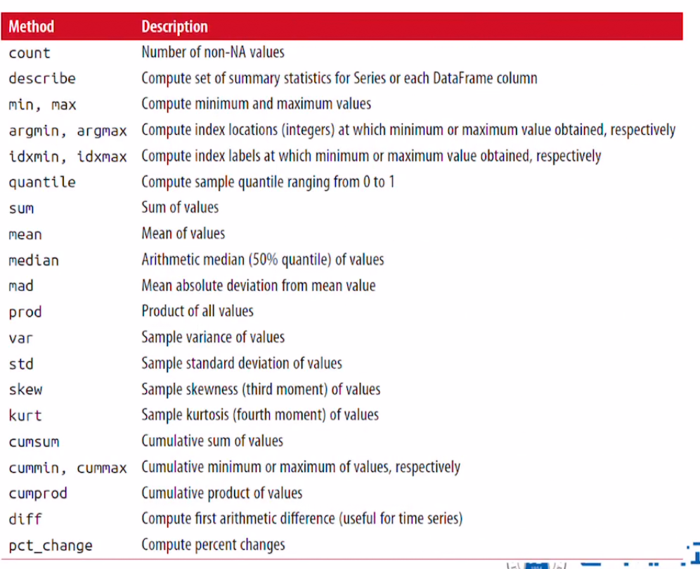
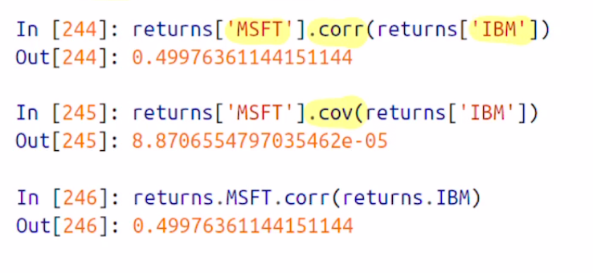
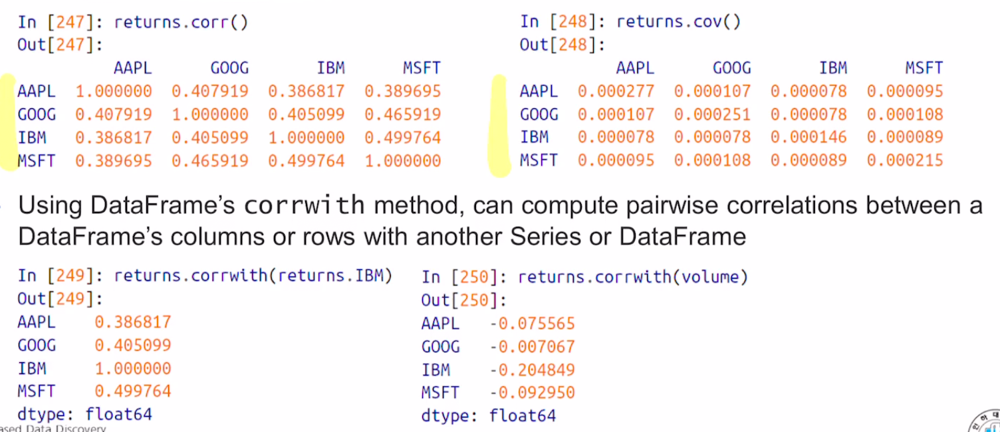
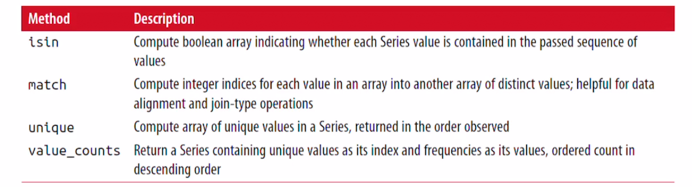

## Pandas(III)

- Reduction or Summary Statistics
  - Row나 column의 하위나 평균을 구하는 메소드가 속해있다
- Correlations and Convariance
  - Correlation: 상관관계
  - Covariance: 공분산
  - 두 데이터가 선형관계에 연관성이 있는지 통계적인 척도. 개념적으로는 같다
  - 상관관계는 공분산을 정규화 해서 1 이내의 값으로 정규화 한것
- Unique Values, Value Counts, and Membership
  - 유일값 찾기, value 카운팅과 membership


### Reduction or Summary Statics

#### Reductions

- reduction 메소드는 series나 dataFrame의 row나 column으로부터 생성된 series 객체로부터 하나의 값을 추출하기 위해 만들어진 메소드이다.
- 기본적으로 NaN값을 제외시키고 연산을 해준다.

```python
>>> df = pd.DataFrame([[1.4, np.nan], [7.1, -4.5], [np.nan, np.nan], [0.75, -1.4]], index = ['a', 'b', 'c','d'], columns= ['one', 'two'])

>>> df
    one  two
a  1.40  NaN
b  7.10 -4.5
c   NaN  NaN
d  0.75 -1.4

>>> df.sum()
one    9.25
two   -5.90
dtype: float64
```

- sum()메소드를 적용하면 default로 one과 two 컬럼에 대해 합을 출력해준다

- row로 출력하고 싶다면 axis = 'column' or axis = 1

  ```python
  >>> df.sum(axis = 1)
  a    1.40
  b    2.60
  c    0.00
  d   -0.65
  dtype: float64
  ```

- Reduction은 기본적으로 NaN value를 없애는데, 만약 포함하고 싶다면

  - **skipna = False**를 추가한다

  ```python
  >>> df.sum(axis = 1, skipna = False)
  a     NaN
  b    2.60
  c     NaN
  d   -0.65
  dtype: float64
  ```


#### Summary Statictis

- reduction과 동일한 개념이라 생각할 수 있다
- idxmax method = 최댓값을 가지고있는 index를 반환해준다

```python
>>> df
    one  two
a  1.40  NaN
b  7.10 -4.5
c   NaN  NaN
d  0.75 -1.4

>>> df.idxmax()
one    b
two    d
dtype: object
```

- idxmin()은 최솟값을 갖는 인덱스를 반환해준다

- cumsum()은 누적합 !

  - default는 각 컬럼별로.

- describe()

  - summary staticstics에 가장 근접

  - Non-numeric data

    - ```python
      >>> obj = pd.Series(['a','b','c','a','d'] * 4)
      >>> obj
      0     a
      1     b
      2     c
      3     a
      4     d
      5     a
      6     b
      7     c
      8     a
      9     d
      10    a
      11    b
      12    c
      13    a
      14    d
      15    a
      16    b
      17    c
      18    a
      19    d
      dtype: object
        
      >>> obj.describe()
      count     20
      unique     4
      top        a
      freq       8
      dtype: object
      ```

    - 총원소의 개수 count

    - 유일한 원소 개수 unique

    - 가장 많이 나오는 원소 top

    - 가장 많이 나오는 원소의 개수 freq

  - Numeric Data

    - ```python
      >>> df
          one  two
      a  1.40  NaN
      b  7.10 -4.5
      c   NaN  NaN
      d  0.75 -1.4
      
      >>> df.describe()
                  one       two
      count  3.000000  2.000000
      mean   3.083333 -2.950000
      std    3.493685  2.192031
      min    0.750000 -4.500000
      25%    1.075000 -3.725000
      50%    1.400000 -2.950000
      75%    4.250000 -2.175000
      max    7.100000 -1.400000
      ```

      - 더 많은 정보를 보여준다
      - count: NaN이 아닌 값의 개수
      - mean: NaN 이 아닌 값들의 평균
      - std: 표준편차
      - min, max
      - 25 % , 50 %, 75%는 해당 series내에서 분위값.


 

 


### Correlation and Covariance

> 상관관계와 공분산
>
> 상관관계와 공분산을 계산하기 위해서는, **두 쌍의 데이터가 필요하다**.
>
> 이를 위해 pandas-datareader package를 이용해서 해보자


#### Series에서의 Correlation and Covariance

##### corr method와 cov method

- corr method는 상관관계를 측정
- cov method는 공분산을 측정

 

- 즉 MicroSoft와 IBM간의 주식 데이터 쌍에대한 상관관계와 공분산을 계산한 결과를 보여준다


#### DataFrame에서의 Correlation and Covariance

DataFrame상에 corr method와 cov method를 실행시키면 **행렬값으로 ** 리턴이 된다.

 

회사별로 상관관계와 공분산을 계산해서 출력을 해주는것을 볼 수 있다.

Series 객체와는 달리, **corrwith** 메소드가 존재하는데, 이는 다른 시리즈 객체나 DataFrame과 상관관계를 측정 해준다.


### Unique Value, Value counts, and Membership

> 이와같은 메소드들은, 1차원 Series 객체들에서 값의 정보를 추출하는 메소드이다.


#### Unique Method

중복되는 값을 값을 제거하고, 유일한 값만 담고있는 Series 객체를 반환해준다.

```python
>>> obj = pd.Series(['c', 'a', 'd', 'a', 'a', 'b', 'b', 'c', 'c'])
>>> uniques = obj.unique()
>>> uniques
array(['c', 'a', 'd', 'b'], dtype=object)
```

unique() 메소드를 적용하여 중복되는 값을 제거하고 유일한 원소들을 리턴하였다.


#### Value Counts

unique한 값들의 개수를 카운트 해주는 함수: value_counts()

```python
>>> obj
0    c
1    a
2    d
3    a
4    a
5    b
6    b
7    c
8    c
dtype: object


>>> obj.value_counts()
c    3
a    3
b    2
d    1
dtype: int64
```

Series 객체에서 각 원소의 개수를 계산해서 출력을 해준다.

```python
>>> pd.value_counts(obj.values, sort = False)
c    3
a    3
d    1
b    2
dtype: int64
```


#### Membership

- isin method
  - 어떤 값이 Series 객체 내에 존재하는지 boolean 형식으로 알려준다.
  - Series나 DataFrame의 column에서 원하는 값을 골라내고 싶을때 매우 유용하게 사용된다.

```python
>>> obj
0    c
1    a
2    d
3    a
4    a
5    b
6    b
7    c
8    c
dtype: object
  
>>> mask = obj.isin(['b', 'c']) # 'b', 'c'가 있는지 찾아본다
>>> mask
0     True
1    False
2    False
3    False
4    False
5     True
6     True
7     True
8     True
dtype: bool
```

mask라는 boolean series 객체를 만들었다. 이걸 또 인자로 사용한다면, b와 c의 존재 위치를 알 수 있음.

```python
>>> obj[mask]
0    c
5    b
6    b
7    c
8    c
dtype: object
```


- Index.get_indexer method
  - isin과 비슷하다.
  - isin은 index와 value의 쌍을 출력해주는데, index.get_indexer는 여러 값이 들어가있는 배열에 유일한 값에 인덱스 배열을 구할 수 있다.

```python
>>> to_match = pd.Series(['c', 'a', 'b', 'b', 'c', 'a'])
>>> unique_vals = pd.Series(['c', 'b', 'a'])
>>> pd.Index(unique_vals).get_indexer(to_match)
array([0, 2, 1, 1, 0, 2])
```

- 중복된 값이 들어있는 to_match series와, unique한 값을 갖고있는 unique_vals
- index.get_indexer에 넣고 실행을 시키면, to_match 시리즈 객체의 값과 unique_vals 값을 매칭을 해서 위치에 해당한 인덱스를 출력해준다.


#### Histogram

- DataFrame의 각 컬럼에 대해 히스토그램을 구하는 방법

```python
>>> data = pd.DataFrame({'Qu1': [1,3,4,3,4], 'Qu2' : [2,3,1,2,3], 'Qu3': [1, 5, 2, 4,4]})
>>> data
   Qu1  Qu2  Qu3
0    1    2    1
1    3    3    5
2    4    1    2
3    3    2    4
4    4    3    4
```

apply 함수를 사용해서 pd.value_counts를 써주고 missing value를 0으로 채워보자

```python
>>> result = data.apply(pd.value_counts).fillna(0)
>>> result
   Qu1  Qu2  Qu3
1  1.0  1.0  1.0
2  0.0  2.0  1.0
3  2.0  2.0  0.0
4  2.0  0.0  2.0
5  0.0  0.0  1.0
```

- 각 column에 대해 1 부터 5 까지 몇 개가 나오는지를 출력해준다.


#### unique values, counts, membership 

 

