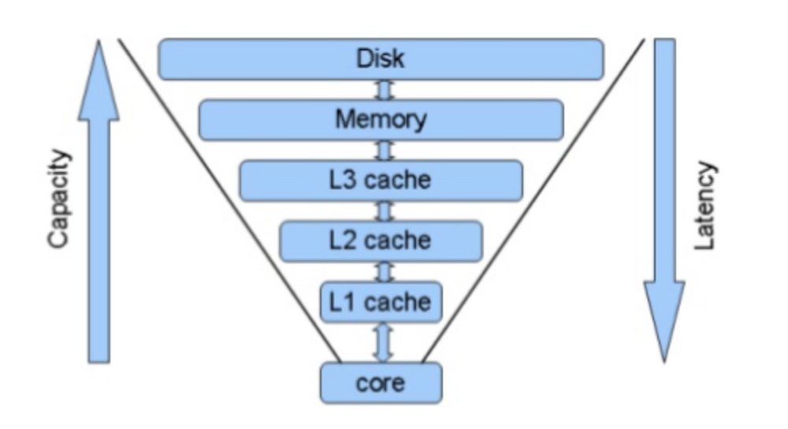
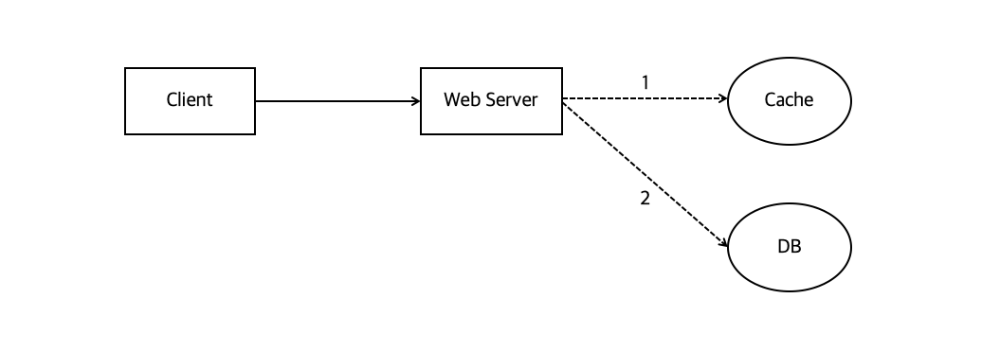
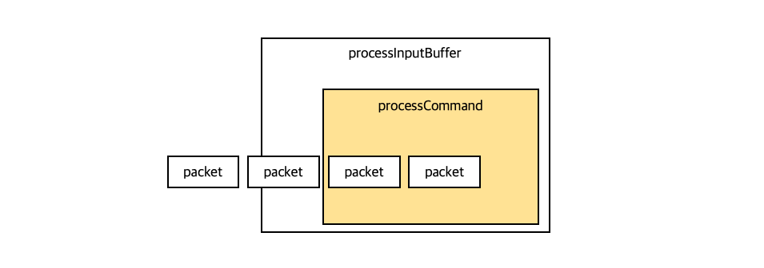
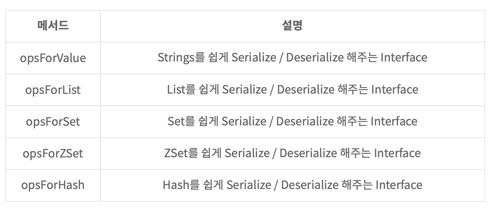

## Redis

Redis (Remote Dictionary Server) 란 다음 특징의 data Structure 이다

1. Remote에 위치한다.
2. Process에 존재한다.
3. In-Memory 기반이다.
4. “Key-Value” 구조의 대이터 관리 시스템, : 비 관계형이며, 키-값 구조이기 때문에 별도 쿼리 없이도 데이터를 간단히 가져올 수 있다.

*“*즉*, Key-Value* 형식의 *in-memory Database*이며*,* 비관계형인 *NoSQL*에 속한다*”*

또한 Redis는 Memcached와는 다르게 Collection, 즉 String, List, Set, Sorted Set, Hash 등의 자료구조를 지원한다.

#### Redis의 등장배경

 

서비스가 커지면서 필연적으로 발생하게 되는 과도한 DB 연결과 방대해지는 DB의 사이즈로 인해 발생하는 성능 저하를 극복하기 위해 캐시(Cache)를 사용한다.  캐시는 휘발성 데이터로 용량이 크진 않지만 데이터를 읽고 쓰는 속도가 굉장히 빠르므로 자주 요청되는 데이터만을 저장하여 활용한다. 

파레토의 법칙에 따르면 전체 요청의 80%는 고작 20%의 사용자에 의해 발생하게 된다. 즉, 대부분의 요청은 적은 수의 사용자에 의해 발생하는 비슷비슷한 내용일 것이다. 따라서 이러한 요청들을 캐시로 저장하여 빠르게 읽고 쓸 수 있다면 좋은 성능의 어플리케이션을 제공할 수 있게 된다.  

이러한 이유로 고가용성 in-memory 데이터베이스인 레디스가 등장하게 되었다.

### Redis Collection

**Redis Collection**

1. String

 가장 단순한 key-value 매핑 구조이다. 

2. List

 Linked List와 같은 형태로 처음과 끝에 데이터를 저장하거나 조회할 때 동일한 시간이 소요된다. LPUSH, RPUSH, LPOP, RPOP 명령어를 통해 List 형식으로 레디스 자료구조를 사용할 수 있다. 

3. Set

 Set은 중복된 데이터가 없는 문자열의 모음이다. 데이터의 중복체크용이나 SADD, SMEMBERS, SISMEMBER 명령어를 사용한다.

4. Sorted Set

 중복된 데이터가 없고 Score를 기준으로 정렬된 레디스 자료구조이다. 정렬 기능을 활용하여 유저의 랭킹 보드에 많이 사용된다.

5. Hash

 field-value 쌍의 hash 형태로 데이터를 저장한다. HGET, HSET 명령어를 사용한다.

서비스의 특성이나 상황에 따라 이걸 **1) 캐시**로 사용할 수도 있고, **2) Persistence Data Storage** 로 사용할 수도 있다.

<u>Collection 은 분명 편리하지만 사용할 때 주의할 점도 있다.</u>

- 하나의 컬렉션에 너무 많은 아이템을 담으면 좋지 않다.
   가능하면 10000개 이하의, 몇천개 수준의 데이터셋을 유지하는게 Redis 성능에 영향주지 않는다.
- Expire 은 Collection 의 아이템 개별로 걸리지않고, 전체 Collection 에 대해서만 걸린다.
   즉, 10000 개의 아이템을 가진 Collection 에 expire 가 걸려있다면, 그 시간 이후에 10000 개의 아이템이 모두 삭제된다.

**메인쓰레드(이벤트루프)는 싱글스레드로 운용된다.**

- 장점 : atomic 보장, race condition 회피

- 단점 : 오래걸리는 명령을 실행하면 다른 명령에 영향을 줌

- - O(N) 명령어는 사용 자제 : KEYS, FLUSHALL, FLUSHDB, DEL 등

### **캐시로 사용할 때**

서비스 사용자가 증가했을 때, 모든 유저의 요청을 DB 접근으로만 처리하게 된다면 DB 서버에 무리가 갈 수 밖에 없다. 물론 데이터베이스는 데이터를 디스크에 저장하기 때문에 서버의 장애와는 별개로 데이터를 유지할 수는 있지만, 요청이 증가하는 상황에서는 기존 성능을 기대하기 힘들다.

이런 맥락에서 캐시는 **나중에** **요청된** **결과를** **미리** **저장해두었다가** **빨리** **제공하기** **위해** 사용한다.

 

[출처: https://velog.io/@hyeondev/Redis-란-무엇일까]

- 일반적인 패턴 : **[Look aside cache]**

- 1. 웹 서버는 클라이언트 요청을 받아서, 데이터가 존재하는지 캐시를 **먼저** 확인한다.
  2. Cache 에 데이터가 있으면 그걸 꺼내주는데, 만약 없으면
  3. DB 에서 읽어서 -> 먼저 캐시에 저장한다음 클라이언트에게 데이터를 돌려준다.

- **[Write Back]**
   데이터를 캐시에 전부 먼저 저장해놓았다가 특정 시점마다 한번씩 캐시 내 데이터를 DB에 **insert** 하는 방법이다.
   insert 를 1개씩 500번 수행하는 것보다 500개를 한번에 삽입하는 동작이 훨씬 빠름에서 알 수 있듯, write back 방식도 성능면에서 뒤쳐지는 방식은 아니다.
   하지만 어쨌든 여기서 데이터를 일정 기간동안은 유지하고 있어야 하는데, 이때 이걸 유지하고 있는 storage 는 **메모리 공간**이므로 서버 장애 상황에서 데이터가 손실될 수 있다는 단점이 있다. 그래서 다시 재생 가능한 데이터나, 극단적으로 heavy 한 데이터에서 write back 방식을 많이 사용한다.

**Redis를 이용하여** **Race Condition** **을 피할 수 있다**

- Redis 자료구조는 Atomic 하다는 특징 때문에 이런 race condition 을 피할 수 있다. 즉, Redis Transaction 은 한번의 딱 하나의 명령만 수행할 수 있다. 이에 더하여 single-threaded 특성 을 유지하고 있기 때문에 다른 스토리지 플랫폼보다는 이슈가 덜하다고 한다.
- 따라서 레디스는 remote data storage 로서 여러 서버에서 같은 데이터를 공유하고 보고싶을 때 많이 사용한다. 그래서 우리는 인증 토큰을 저장하거나 유저 API limit 을 두는 상황 등에서 레디스를 많이 사용하고 있다.
- 하지만 이 특징이 더블클릭 같은 동작으로 같은 데이터가 2번씩 들어가게 되는 불상사는 막을 수 없기 때문에 별도 처리가 필요하다.

 

### Redis가 Process를 처리하는 과정

 

TCP 에서는 패킷이 끊어져서 올 수 있다. 이럴때 패킷이 들어와서 명령 하나를 실행시키는 과정이 어떻게 수행되는지 정리하였다.

1. 패킷 하나가 들어오면 processInputBuffer 에서 패킷을 하나의 command 로 만든다.

2. command 가 완성됐는지 확인하고

3. command 가 완성되었으면 processCommandAndReset 이라는 걸 해서 다시 타고 들어온 후

4. 1. 그 시점에 완성된 command 하나를 그냥 실행시켜버린다.

따라서 이런 상황에서 해당 패킷 하나가 처리되는 동안 뒤의 패킷은 아무것도 못하고 그냥 쌓이는 것이다. 이후 패킷 처리가 완료되어 루프를 탈출해야만 다시 그 다음 명령 (packet -> command) 들을 처리할 수 있다.

이러한 동작 과정에서 알 수 있듯 **Redis 는 한번에 하나의 명령만 실행할 수 있기 때문에 긴 처리시간을 요하는 명령어를 쓰면 불리하다**. 그럼 보통 '긴' 명령이 될 수 있는, 대표적인 O(N) 명령들은 무엇이 있을까.

- KEYS : 모든 아이템을 순회하는 명령이다. 하지만 아이템이 많아지면 서버에서 exception 을 트리거하니 주의해야한다.
   
   예를 들어, Key 가 백만개 이상인데 확인을 위해 KEYS 명령을 사용하는 경우는 결국 모니터링 스크립트가 일초에 한번씩 이걸 호출하게 되는 것이다. 

- - KEYS 대신 scan **명령을 사용하는 것으로 하나의 긴 명령을 짧은 여러번의 명령으로 바꿀 수 있다.** 이 짧은 명령들 텀 사이에 다른 get / set 같은 명령들을 또 실행시킬 수 있다. 이 사이에 굉장히 처리를 잘 시켜준다.

- FLUSHALL, FLUSHDB : 데이터를 다 날린다.

- Delete Collections : Collection 내 아이템을 전부 삭제하는 명령이다. 예를 들어 100만개 아이템 삭제를 의도했다면, 이 명령을 처리하는 데에만 1~2초 정도 걸리므로 이 시간동안 아무것도 못하게 된다.

- Get All Collections : 10만개를 매번 다 가져온다면? 당연히 느려진다.

**Spring Data Redis를 이용해 Redis에 접근**

- Spring Data Redis는 Redis를 2가지 방식으로 접근할 수 있도록 제공합니다. Redis 통신 framework로 잘 알려진 Lettuce와 Jedis입니다. Lettuce는 별도의 설정없이 사용할 수 있으며 Jedis를 사용하고자 하시면 별도의 의존성을 필요로 한다.

implementation 'org.springframework.boot:spring-boot-starter-data-redis’

implementation 'it.ozimov:embedded-redis:0.7.2'

 

RedisTemplate: RedisTemplate : Redis Command 를 도와주는 Template

**Redis String: 일반적으로 사용되는 Key - Value의 형식을 가지는 자료구조**입니다. key와 value의 관계는 1 : 1이다. 

- 기본 명령어: get, set, del

- - get key - key에 해당하는 value를 가져옵니다.
  - set key value - key에 value를 저장합니다.
  - del key - key를 삭제합니다.

**Redis List: List는 redis Strings의 묶음 자료구조**

- 기본 명령어: plush, rush, lpop, pop, lrang

- - lpush key value - List의 index 0 쪽으로 데이터를 넣습니다. ( redis의 list index는 0부터 시작합니다.)
  - rpush key value - List의 index last 쪽으로 데이터를 넣습니다.
  - lrange key start end - List의 start부터 end까지의 element를 반환합니다.
  - lpop key - List의 index 0의 데이터를 뺍니다.
  - rpop key - List의 index last의 데이터를 뺍니다.

**Redis Set:** 중복되지 않는 값을 데이터로 가지는 Collection입니다. 때문에 동일한 값을 입력하면 결과적으로 하나의 값만 남는다.

- 기본 명령어 - sadd, srem, smembers, scard, spop

- - sadd key member - set에 value를 하나 추가합니다.
  - srem key - set에서 key를 삭제합니다.
  - smembers key - set에 속해있는 모든 member를 조회합니다.
  - scard key - set에 속해있는 member을 갯수를 구합니다.
  - spop - set에서 무작위로 member를 가져옵니다.

**Redis Sorted Set:** 중복되지 않는 값을 데이터로 가지는 Collection입니다. 또한 가중치(Score)를 가지고 있고 가중치(Score)에 따른 정렬된 순서를 가지고 있습니다. Score가 같으면 value로 sort됩니다. Value는 중복되지 않으며 Score는 중복될 수 있습니다.

- 기본 명령어 - zadd, zcard, zrange, zrangebyscore

- - zadd key score member - 집합에 Score와 Value를 추가합니다.
  - zcard key - 집합 속에 있는 member의 갯수를 조회합니다.
  - zrange key start stop - index를 범위로하여 조회합니다.
  - zrangebyscore key min max - socore를 범위로하여 조회합니다.

**Redis Hash:** 내부에 또 다른 Key - value로 이루어진 자료구조입니다. Hashes는 key 하나에 여러개의 field와 value로 구성됩니다. key 하나에 field와 value 쌍을 40억개(4,294,967,295)까지 저장 가능합니다.

- 기본 명령어 - hset, hget, hdel, hlen, hgetAll, hkeys, hvals

- - hset key field value : key에 field와 value를 쌍으로 저장합니다.
  - hget key field : key에서 field로 value를 가져옵니다.
  - hdel key field : key에서 field를 삭제합니다.
  - hlen key : field의 갯수를 반환합니다.
  - hgetAll key : field와 value를 모두 반환합니다.
  - hkeys key : 모든 field를 반환합니다.
  - hvals key : 모든 value를 반환합니다.