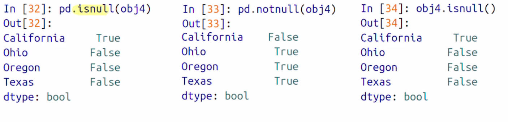
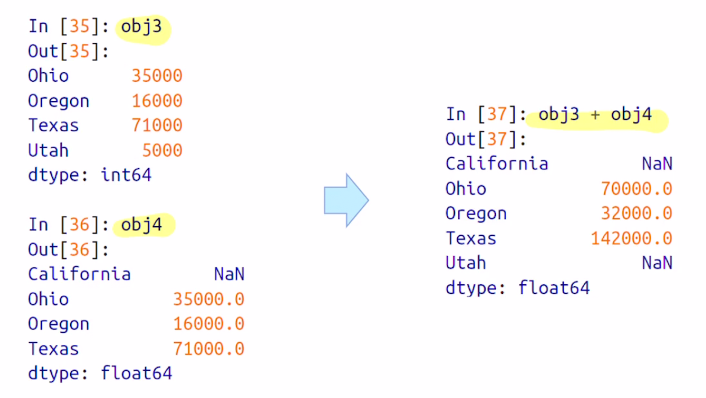
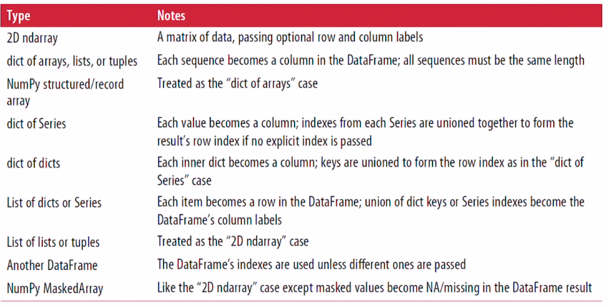
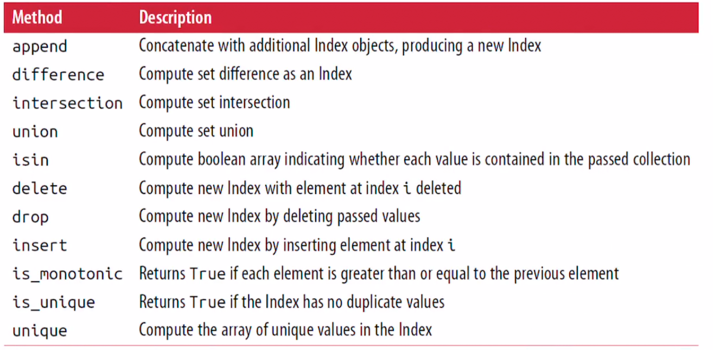

##  Pandas (I)

> Pandas 는 Python에서 쉽고 빠르게 사용할 수 있는 <u>데이터 분석</u> 도구를 제공한다
>
> NumPy와 비슷한 경향이 있지만, 데이터 분석에 초점이 맞춰져 있다.
>
> NumPy는 배열 계산에 초점이 맞춰져 있다.


- What is Pandas ?
- Introduction to pandas Data Structures
  - Series
  - DataFrame
  - Index Objects


### What is Pandas

- Pandas는 테이블 상에서 빠르고 쉽게 <u>data cleaning과 분석 [analysis]</u> 가 가능한 자료구조와 데이터 조작 툴을 제공한다.
- Pandas는 주로 NumPy, SciPy 등 유명한 라이브러리 들과 함께 사용된다.
- 배열 기반 연산 스타일을 사용해서, 배열 기반의 함수나 반복문 없이 데이터를 처리하는 방안을 제공한다.


##### Pandas와 NumPy의 차이점

> Pandas는 Heterogeneous data [이중형태의 데이터]를 다루는데 초점이 되어있고, NumPy는 Homogeneous data, 즉 동일한 종류의 데이터를 다루는데 초점이 맞춰져있다.


### Introduction to pandas Data Structures

- Pandas의 자료구조인 **<u>Series & DataFrame</u>** 에 대해 알아보자

- ```python
  import pandas as pd
  from pandas import Series, DataFrame
  ```


### Series

- Series는 1차원 배열 객체를 의미한다.

  - 연속적인 **homogeneous data**와 **index** 라고 불리는 **data labels** 을 포함한다.

  - 가장 간단한 series 객체는 array로부터 가져올 수 있다

  - ```python
    >>> import pandas as pd
    >>> from pandas import Series, DataFrame
    >>> obj = pd.Series([4, 7, -5, 3])
    >>> obj
    0    4
    1    7
    2   -5
    3    3
    dtype: int64
    ```

  - 여기서 0 부터 3 까지가 index, 4, 7, -5, 3이 Series 의 value이다.

- The value and index attributes - **Series에서 Value와 index를 따로 추출하고 싶다면**

  - the value attribute

    - ```python
      >>> obj.values  # series의 value를 반환
      array([ 4,  7, -5,  3])
      ```

  - the index attributes

    - ```python
      >>> obj.index
      RangeIndex(start=0, stop=4, step=1)
      ```

    - 여기서 기본 인덱스를 갖고 있지만, obj.index로 인덱스를 지정할 수 있다

    - ```python
      >>> obj.index = ['A', 'C', 'E', 'F']
      >>> obj
      A    4
      C    7
      E   -5
      F    3
      dtype: int64
      ```

    - 이러면, ACEF가 obj 의 index attribute, 4, 7, -5, 3이 value attributes


- Pandas는 각각의 데이터를 지칭하는 인덱스를 지정할 수 있다

  - obj.index

  - Series 객체를 선언하는 시점에 지정할 수 있음.

  - ```python
    >>> obj2 = pd.Series([4, 6, -5, 3], index = ['A', 'C', 'E', 'F'])
    >>> obj2
    A    4
    C    6
    E   -5
    F    3
    dtype: int64
    ```

  - 또한 단일 값을 선언하거나, 인덱스를 지정해서 값을 가져올 수 있으며, 변경도 가능하다.

  - ```python
    >>> obj2['A']
    4
    >>> obj2['E'] = 6 # 값 변경
    >>> obj2[['E','A','F']] #원하는 인덱스 값들만 불러오기 
    E    6
    A    4
    F    3
    dtype: int64
    ```


- Series에서 Index-value는 연결이 되어있다. **그리고 이는 보존이 되어있다.**
  -  
  - Boolean 배열을 사용한 값 걸러네기, Scalar, Numpy를 사용해도
  - Index-value는 연결되있고, value에만 영향을 준다


- Series를 쉽게 이해하기 위해

  - **Series는 고정된 길이의 정렬된 Dictionary 라고 할 수 있다.** 

  - index - value가 맵핑이 되므로, Pandas의 dictionary와 유사하다

  - Series는 Python의 dictionary를 대체해서 사용하거나, 실제로 Python의 Dictionary를 불러서 Series를 불러서 생성할 수 있다.

    - ```python
      >>> sdata = {'A' : 10, 'T': 102, 'O': 123} # Python Dictionary !
      >>> obj3 = pd.Series(sdata) # dictionary를 이용해서 생성할 수 있다.
      >>> obj3
      A     10
      T    102
      O    123
      dtype: int64
      ```

  

- Python의 dictionary 자료를 사용해 Series 객체를 생성하면, 생성된 Series 객체의 Index는 dictionary의 key 값이 순서대로 들어간다.
  - Series 객체의 Index를 다른 인덱스 리스트로 지정하는게 가능하다.
  -  
  - State 배열을 index로 넣으면, California에는 NaN, 기존 sdata에 존재하지 않는 index..
  - Nan = Not a Number 


-  누락 된 값인 NaN값을 찾는 방법
  - isnull 과 notnull 함수를 사용해서 Pandas에서 누락된 값을 찾을 수 있다.
  - 
  - **isnull은 NaN 값을 True로 리턴**
  - **notnull은 NaN 값을 False로 리턴**
  - pd.isnull() 로 사용할 수도 있고, 객체.isnull() 로도 사용할 수 있다


- **Series 객체간의 산술 연산에서 인덱스 라벨을 자동 정렬해주는 기능**

  -  
  - 인덱스에 매칭되는 값들 끼리 연술이 된다.. !!

  

- **Name Attribute** [중요]

  - Series 객체와, 인덱스는 name attribute를 갖고있다

  - ```python
    >>> obj4 = pd.Series([4, 6, -5, 3], index = ['A', 'C', 'E', 'F'])
    >>> obj4
    A    4
    C    6
    E   -5
    F    3
    dtype: int64
    >>> obj4.name= 'population'
    >>> obj4.index.name = 'alphabet'
    >>> obj4
    alphabet
    A    4
    C    6
    E   -5
    F    3
    Name: population, dtype: int64
    ```

  - obj4.index.name 을 사용해서 인덱스에 명을 지정할 수 있고, obj에 이름을 지정해줄 수 있다.


### DataFrame

> excel 과 같은 spreadsheet 형태의 자료구조 !
>
> 직사각형의 테이블에 여러개의 컬럼이 존재하면, 서로 다른 종류의 데이터를 저장할 수 있다.
>
> RDB 형태와 비슷하다 - row index 와 column index 둘 다 갖고있다.
>
> 1차원 형태의 자료구조가 아닌, 2차원 블록에 저장이 된다 !


##### DataFrame Construct [생성]

- 가장 흔한 방법은, **같은 길이의 List에 담긴 Dictionary나 numpy 배열을 사용하는 것**

  - ```python
    >>> data = {'state' : ['Ohio', 'Ohio', 'Nevada', 'Nevada'], 'year' : [2000, 2001, 2000, 2002], 'pop' : [1.5, 1.7, 3.6, 2.9]}
    >>> data
    {'state': ['Ohio', 'Ohio', 'Nevada', 'Nevada'], 'year': [2000, 2001, 2000, 2002], 'pop': [1.5, 1.7, 3.6, 2.9]}
    >>> frame = pd.DataFrame(data)
    >>> frame
        state  year  pop
    0    Ohio  2000  1.5
    1    Ohio  2001  1.7
    2  Nevada  2000  3.6
    3  Nevada  2002  2.9
    ```

  - 각 각의 row는 동일한 위치에 존재하는 각등의 쌍으로 되어있고

  - column 값은 dictionary의 value로 이루어져 있다.


- head method()
  - 엄청나게 큰 데이터 프레임이 존재하면, 유용하게 사용할 수 있다.
  - DataFrame.head() 를 사용하면 처음 **5개 row를 출력해준다**

- DataFrame의 columns

  - ```python
    >>> frame
        state  year  pop
    0    Ohio  2000  1.5
    1    Ohio  2001  1.7
    2  Nevada  2000  3.6
    3  Nevada  2002  2.9
    >>> pd.DataFrame(data, columns = ['year', 'state', 'pop'])
       year   state  pop
    0  2000    Ohio  1.5
    1  2001    Ohio  1.7
    2  2000  Nevada  3.6
    3  2002  Nevada  2.9
    ```

  - column의 인덱스는 자동으로 오름차순 정렬.

  - column을 사용자가 원하는 순서로 지정해서 출력할 수 있당


##### Dictionary에 없는 값을 컬럼의 요소로 넣어주고 싶다면?

- 해당 컬럼의 모든 값이 NaN으로 채워진다

- ```python
  >>> frame2 = pd.DataFrame(data, columns =['year', 'state', 'pop', 'debt'], index = ['one', 'two', 'three', 'four'])
  >>> frame2
         year   state  pop debt
  one    2000    Ohio  1.5  NaN
  two    2001    Ohio  1.7  NaN
  three  2000  Nevada  3.6  NaN
  four   2002  Nevada  2.9  NaN
  ```

- 기존에 debt는 data안에 없지만, DataFrame을 만들면서 생성해주었다. 

- 그 결과 새로운 column debt가 생겼고, NaN으로 모두 채워졌다.

```python
>>> frame2.columns
Index(['year', 'state', 'pop', 'debt'], dtype='object')
```


##### DataFrame상의 column을 접근하고자 한다면, Series 객체와 같이, dictionary 형식이나, attribute 형식으로 접근할 수 있다.

```python
>>> frame2['state']
one        Ohio
two        Ohio
three    Nevada
four     Nevada
Name: state, dtype: object
>>> frame2.year
one      2000
two      2001
three    2000
four     2002
Name: year, dtype: int64
```

##### DataFrame에 row는 <u>loc</u> attribute로, index값을 넣어주면 얻어올 수 있다.

```python
>>> frame2
       year   state  pop debt
one    2000    Ohio  1.5  NaN
two    2001    Ohio  1.7  NaN
three  2000  Nevada  3.6  NaN
four   2002  Nevada  2.9  NaN
>>> frame2.loc['three'] # loc
year       2000
state    Nevada
pop         3.6
debt        NaN
Name: three, dtype: object
```


##### DataFrame Column의 경우 특정한 값을 대입하여 수정할 수 있다. 

- Scalar 값, array 값 등을 넣을 수 있따.
- 단, list나 array를 dataframe에 넣기 위해서는, 그 길이가 DataFrame의 row의 길이와 같아야한다.

```python
>>> frame2['debt'] = 16.5 # scalar 값을 넣어서 모든 debt의 값을 변경해 주었다.
>>> frame2
       year   state  pop  debt
one    2000    Ohio  1.5  16.5
two    2001    Ohio  1.7  16.5
three  2000  Nevada  3.6  16.5
four   2002  Nevada  2.9  16.5

>>> frame2['debt'] = np.arange(4) # 0부터 3까지 대입
>>> frame2
       year   state  pop  debt
one    2000    Ohio  1.5     0
two    2001    Ohio  1.7     1
three  2000  Nevada  3.6     2
four   2002  Nevada  2.9     3
```

- Series 객체를 DataFrame의 column에 넣는다면, 데이터 프레임의 인덱스에 따라 값이 대입되고, 존재하지 않는 값은 NaN이 된다.

```python
>>> val = pd.Series([-1.2, -1.5, -1.7], index = ['two', 'three', 'four'])
>>> frame2['debt'] = val
>>> frame2
       year   state  pop  debt
one    2000    Ohio  1.5   NaN
two    2001    Ohio  1.7  -1.2
three  2000  Nevada  3.6  -1.5
four   2002  Nevada  2.9  -1.7
```

- two, three, four에 매칭이 되서 val 값으로 변경이 되고, 매칭이 안된 one index는 NaN이 됐다.


**Column을 삭제하는 방법**

- Python의 dictionary 처럼, delete 키워드를 사용한다.

- ```python
  >>> frame2['eastern'] = frame2.state == 'Ohio'
  >>> frame2
         year   state  pop  debt  eastern
  one    2000    Ohio  1.5   NaN     True
  two    2001    Ohio  1.7  -1.2     True
  three  2000  Nevada  3.6  -1.5    False
  four   2002  Nevada  2.9  -1.7    False
  
  >>> del frame2['eastern'] # del 키워드를 이용해 column 삭제 !
  >>> frame2.columns
  Index(['year', 'state', 'pop', 'debt'], dtype='object')
  >>> frame2
         year   state  pop  debt
  one    2000    Ohio  1.5   NaN
  two    2001    Ohio  1.7  -1.2
  three  2000  Nevada  3.6  -1.5
  four   2002  Nevada  2.9  -1.7
  ```


Dictionary 내에 Dictionary 가 존재해도, DataFrame을 생성할 수 있다 !

```python
>>> pop = {'Nevada' : {2001: 2.4, 2002: 2.9}, 'Ohio' : {2000: 1.5, 2001:1.5, 2002: 3.6}} # dictionary 내에 dictionary 가 중첩되어 있다.
>>> frame3 = pd.DataFrame(pop)
>>> frame3
      Nevada  Ohio
2001     2.4   1.5
2002     2.9   3.6
2000     NaN   1.5

>>> frame3.T # Transpose !
        2001  2002  2000
Nevada   2.4   2.9   NaN
Ohio     1.5   3.6   1.5
```

- 바깥쪽 dictionary key Nevada, Ohio 가 column의 index가 되었고, 안쪽 key인 년도 2000, 20001이 row의 index가 된 것을 확인할 수 있다.
- T attribute로 transpose 할 수 있다 !


**Nested dictionary를 통해 DataFrame을 처리하면 내부 dictionary의 key가 row의 인덱스가 되는데, 따로 지정할 수도 있다.**

```python
>>> pop = {'Nevada' : {2001: 2.4, 2002: 2.9}, 'Ohio' : {2000: 1.5, 2001:1.5, 2002: 3.6}}
>>> pd.DataFrame(pop, index = [2001, 2002, 2003])
      Nevada  Ohio
2001     2.4   1.5
2002     2.9   3.6
2003     NaN   NaN
```

- 기존 2000이 없고, 2003으로 인덱스를 지정해 줬다. 값이 없기에 NaN이 들어갔다.


**Series 객체를 담고있는 dictionary의 경우도 같은 방법으로 취급된다**

```python
>>> frame3
      Nevada  Ohio
2001     2.4   1.5
2002     2.9   3.6
2000     NaN   1.5

>>> pdata = {'Ohio' : frame3['Ohio'][:1], 'Nevada' : frame3['Nevada'][:2]}
>>> pd.DataFrame(pdata)
      Ohio  Nevada
2001   1.5     2.4
2002   NaN     2.9
```


#### DataFrame의 Index와 column 속성을 통해서 column의 이름, row 이름을 선언할 수 있다.

```python
>>> frame3.index.name = 'year'
>>> frame3.columns.name = 'state'
>>> frame3
state  Nevada  Ohio
year               
2001      2.4   1.5
2002      2.9   3.6
2000      NaN   1.5
```

- index를 가리키는 이름으로 year가 들어가고
- column을 가리키는 이름을 통해 state가 들어간걸 볼 수 있다.


### DataFrame: Value Attribute

- values attribute를 사용하면, 저장된 값을 2차원 배열로 얻어올 수 있다. 

  ```python
  >>> frame3.values
  array([[2.4, 1.5],
         [2.9, 3.6],
         [nan, 1.5]])
  ```

- 만약 dataframe의 column이 서로 다른 dtype을 갖고 있다면, 모든 컬럼을 취급하기 위해 배열 객체의 dtype을 선택해서 object로 선택된다.

  ```python
  >>> pop = {'Nevada' : {2001: 'hello', 2002: 2.9}, 'Ohio' : {2000: 'hi', 2001:1.5, 2002: 3.6}}
  >>> frame4 = pd.DataFrame(pop)
  >>> frame4
       Nevada Ohio
  2001  hello  1.5
  2002    2.9  3.6
  2000    NaN   hi
  >>> frame4.values
  array([['hello', 1.5],
         [2.9, 3.6],
         [nan, 'hi']], dtype=object)
  ```

  


#### DataFrame 을 생성하기 위해 입력할 수 있는 data의 종류

 


### Index 객체

> Pandas의 index 객체는, data에서 각 row와 column에 대한 인덱스 명이나 metaData를 저장하는 객체이다.
>
> 주로 Series나 DataFrame 객체의 인덱스 정보를 반환한다.

```python
>>> obj = pd.Series(range(3), index = ['a','b','c'])
>>> obj
a    0
b    1
c    2
dtype: int64
>>> index = obj.index
>>> index
Index(['a', 'b', 'c'], dtype='object')
>>> index[1:]
Index(['b', 'c'], dtype='object')
```

- obj의 index를 반환하는것을 볼 수 있다.

DataFrame이나 Series의 Value는 변경이 가능했다. 하지만 **Index 객체는 값의 변경이 불가능하다**

```python
>>> index[1] = 'd' # 에러 !!
```


**배열과 유사하게, Index 객체도 고정된 크기로 동작한다**

```python
>>> frame3
state  Nevada  Ohio
year               
2001      2.4   1.5
2002      2.9   3.6
2000      NaN   1.5
>>> frame3.columns
Index(['Nevada', 'Ohio'], dtype='object', name='state')
>>> frame3.index
Int64Index([2001, 2002, 2000], dtype='int64', name='year')

>>> 'Ohio' in frame3.columns
True
>>> 2003 in frame3.index
False
```

- Frame3의 column은 두 개 [Nevada, Ohio], row는 3개 [2000,2001,2002] 이다.
- 그렇기 때문에 columns는 두 개만 출력을 해주고, 
- index는 row의 값만 출력을 해준다.


Python의 set 자료형과는 달리, pandas는 index의 중복을 허용한다

- 즉 , 중복된 index를 허용한다.

- ```python
  >>> dup_labels = pd.Index(['foo', 'foo', 'bar', 'bar'])
  >>> dup_labels
  Index(['foo', 'foo', 'bar', 'bar'], dtype='object')
  ```


#### Index Method

