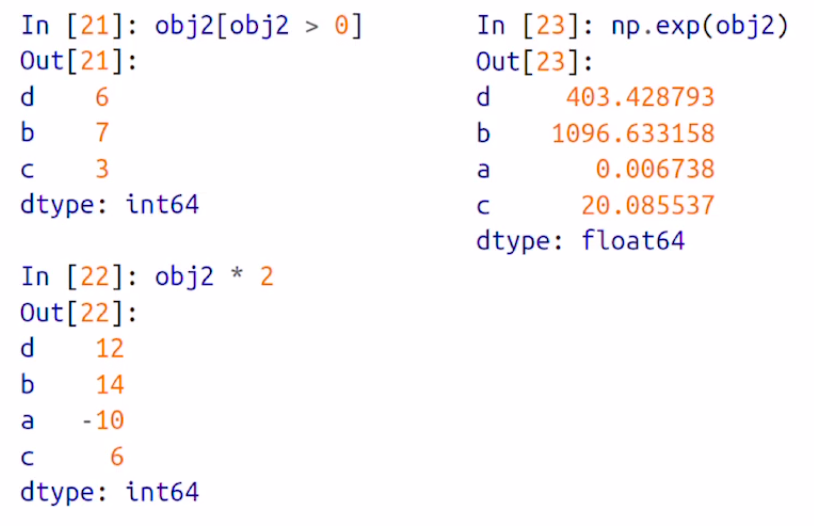
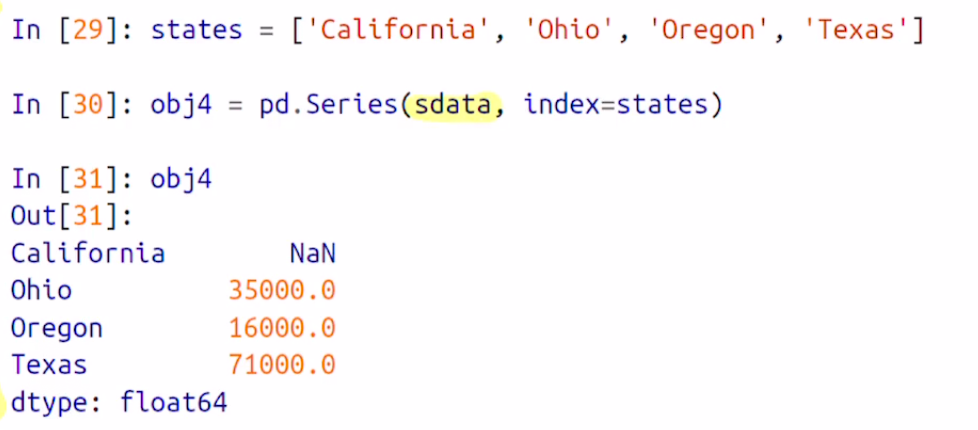

##  Pandas (I)

> Pandas 는 Python에서 쉽고 빠르게 사용할 수 있는 <u>데이터 분석</u> 도구를 제공한다
>
> NumPy와 비슷한 경향이 있지만, 데이터 분석에 초점이 맞춰져 있다.
>
> NumPy는 배열 계산에 초점이 맞춰져 있다.


- What is Pandas ?
- Introduction to pandas Data Structures
  - Series
  - DataFrame
  - Index Objects


### What is Pandas

- Pandas는 테이블 상에서 빠르고 쉽게 <u>data cleaning과 분석 [analysis]</u> 가 가능한 자료구조와 데이터 조작 툴을 제공한다.
- Pandas는 주로 NumPy, SciPy 등 유명한 라이브러리 들과 함께 사용된다.
- 배열 기반 연산 스타일을 사용해서, 배열 기반의 함수나 반복문 없이 데이터를 처리하는 방안을 제공한다.


##### Pandas와 NumPy의 차이점

> Pandas는 Heterogeneous data [이중형태의 데이터]를 다루는데 초점이 되어있고, NumPy는 Homogeneous data, 즉 동일한 종류의 데이터를 다루는데 초점이 맞춰져있다.


### Introduction to pandas Data Structures

- Pandas의 자료구조인 **<u>Series & DataFrame</u>** 에 대해 알아보자

- ```python
  import pandas as pd
  from pandas import Series, DataFrame
  ```


### Series

- Series는 1차원 배열 객체를 의미한다.

  - 연속적인 **homogeneous data**와 **index** 라고 불리는 **data labels** 을 포함한다.

  - 가장 간단한 series 객체는 array로부터 가져올 수 있다

  - ```python
    >>> import pandas as pd
    >>> from pandas import Series, DataFrame
    >>> obj = pd.Series([4, 7, -5, 3])
    >>> obj
    0    4
    1    7
    2   -5
    3    3
    dtype: int64
    ```

  - 여기서 0 부터 3 까지가 index, 4, 7, -5, 3이 Series 의 value이다.

- The value and index attributes - **Series에서 Value와 index를 따로 추출하고 싶다면**

  - the value attribute

    - ```python
      >>> obj.values  # series의 value를 반환
      array([ 4,  7, -5,  3])
      ```

  - the index attributes

    - ```python
      >>> obj.index
      RangeIndex(start=0, stop=4, step=1)
      ```

    - 여기서 기본 인덱스를 갖고 있지만, obj.index로 인덱스를 지정할 수 있다

    - ```python
      >>> obj.index = ['A', 'C', 'E', 'F']
      >>> obj
      A    4
      C    7
      E   -5
      F    3
      dtype: int64
      ```

    - 이러면, ACEF가 obj 의 index attribute, 4, 7, -5, 3이 value attributes


- Pandas는 각각의 데이터를 지칭하는 인덱스를 지정할 수 있다

  - obj.index

  - Series 객체를 선언하는 시점에 지정할 수 있음.

  - ```python
    >>> obj2 = pd.Series([4, 6, -5, 3], index = ['A', 'C', 'E', 'F'])
    >>> obj2
    A    4
    C    6
    E   -5
    F    3
    dtype: int64
    ```

  - 또한 단일 값을 선언하거나, 인덱스를 지정해서 값을 가져올 수 있으며, 변경도 가능하다.

  - ```python
    >>> obj2['A']
    4
    >>> obj2['E'] = 6 # 값 변경
    >>> obj2[['E','A','F']] #원하는 인덱스 값들만 불러오기 
    E    6
    A    4
    F    3
    dtype: int64
    ```


- Series에서 Index-value는 연결이 되어있다. **그리고 이는 보존이 되어있다.**
  -  
  - Boolean 배열을 사용한 값 걸러네기, Scalar, Numpy를 사용해도
  - Index-value는 연결되있고, value에만 영향을 준다


- Series를 쉽게 이해하기 위해

  - **Series는 고정된 길이의 정렬된 Dictionary 라고 할 수 있다.** 

  - index - value가 맵핑이 되므로, Pandas의 dictionary와 유사하다

  - Series는 Python의 dictionary를 대체해서 사용하거나, 실제로 Python의 Dictionary를 불러서 Series를 불러서 생성할 수 있다.

    - ```python
      >>> sdata = {'A' : 10, 'T': 102, 'O': 123} # Python Dictionary !
      >>> obj3 = pd.Series(sdata) # dictionary를 이용해서 생성할 수 있다.
      >>> obj3
      A     10
      T    102
      O    123
      dtype: int64
      ```

  

- Python의 dictionary 자료를 사용해 Series 객체를 생성하면, 생성된 Series 객체의 Index는 dictionary의 key 값이 순서대로 들어간다.
  - Series 객체의 Index를 다른 인덱스 리스트로 지정하는게 가능하다.
  -  
  - State 배열을 index로 넣으면, California에는 NaN, 기존 sdata에 존재하지 않는 index..
  - Nan = Not a Number 


-  누락 된 값인 NaN값을 찾는 방법
  - isnull 과 notnull 함수를 사용해서 Pandas에서 누락된 값을 찾을 수 있다.
  - 


