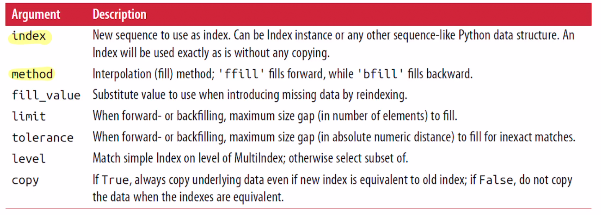
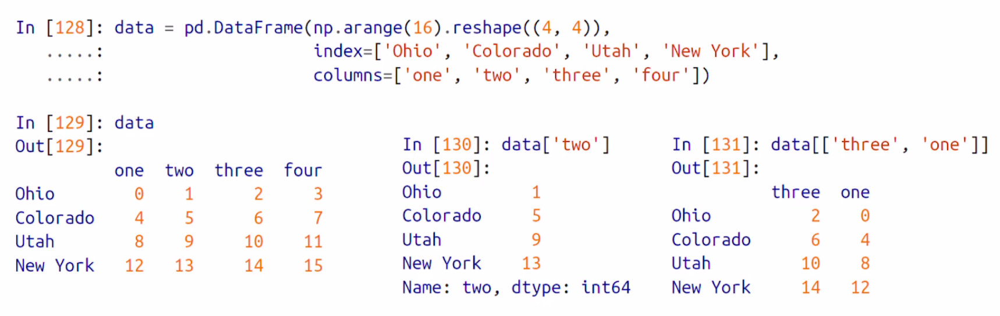
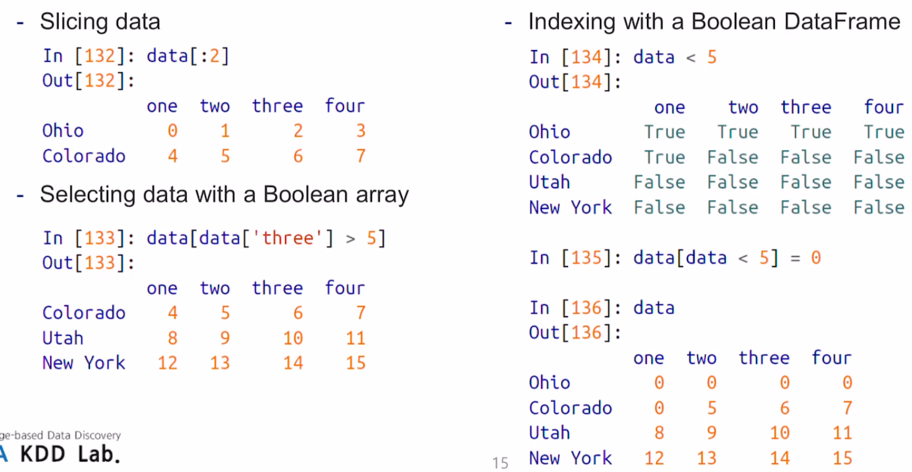
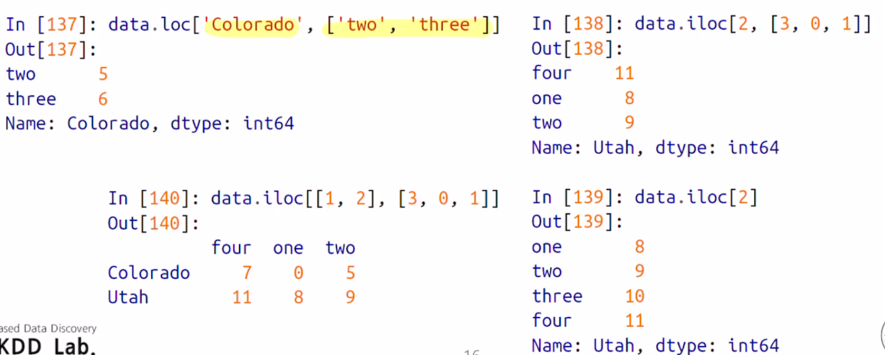
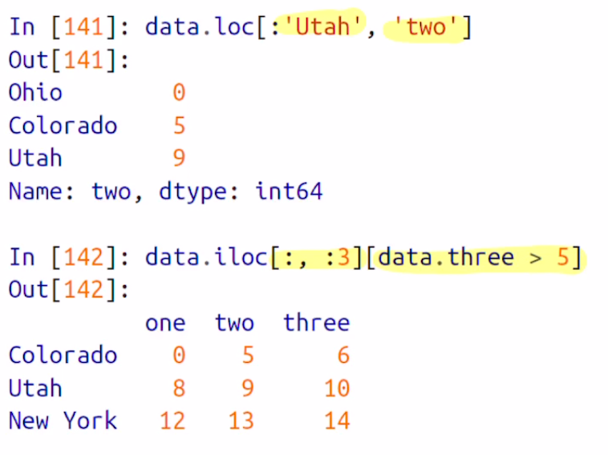
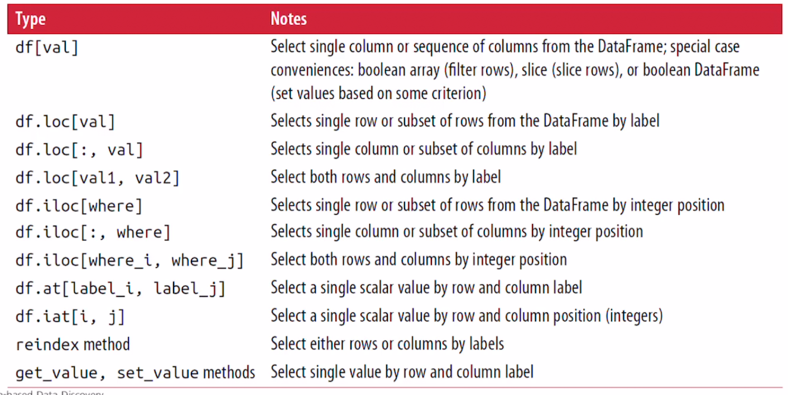

## Pandas(II)


### Reindexing

- the <u>reindex</u> method

  - 새로운 index에 맞도록 객체를 새로 생성해준다.

    ```python
    >>> obj = pd.Series([4.5, 7.2, -5.3, 3.6], index = ['d','b','a','c'])
    >>> obj
    d    4.5
    b    7.2
    a   -5.3
    c    3.6
    dtype: float64
      
    
    >>> obj2 = obj.reindex(['a', 'b', 'c', 'd', 'e'])
    >>> obj2
    a   -5.3
    b    7.2
    c    3.6
    d    4.5
    e    NaN
    dtype: float64
    ```

  - reindex를 사용해서 새로운 값들을 index에 맞게 생성해준다.

  - 존재하던 값들을 넣었으면, 그 값에 맞게 재 배치가 되며, 없는 값은 NaN이 들어간다


- time series 같은 순차적 데이터를 reindex 하면 값이 보관 [interpolation]하거나, 채워 넣어야 할 수 있다. 

  - 이땐 Method option을 사용하면 된다
  - **ffill** 로 누락된 값을 채울 수 있다.
    - ffill 은 직전의 값으로 누락된 값을 채워넣는것 ! [forward fill 이다]

  ```python
  >>> obj3 = pd.Series(['blue', 'purple', 'yello'], index = [0, 2, 4])
  >>> obj3
  0      blue
  2    purple
  4     yello
  dtype: object
  >>> obj3.reindex(range(6), method = 'ffill')
  0      blue
  1      blue
  2    purple
  3    purple
  4     yello
  5     yello
  dtype: object
  ```

  - 기존에 0, 2, 4의 인덱스 밖에 없는데, reindex로 0~ 5까지의 인덱스를 새로 생성했고, 없는 값에 method = 'ffill'로 직전 인덱스의 값으로 채운다.

  ```python
  >>> obj3.reindex(range(6))
  0      blue
  1       NaN
  2    purple
  3       NaN
  4     yello
  5       NaN
  dtype: object
  ```

  - method = 'ffill' 을 사용하지 않은 경우이다 !


- DataFrame 상에서도 reindex가 가능하다.

  - **row index와 column index 모두 변경이 가능하다**
  - 그냥 배열로 reindex를 하면 <u>row</u>의 index가 제배치된다.

  ```python
  >>> frame = pd.DataFrame(np.arange(9).reshape((3,3)), index=['a','c','d'],
  		     columns =['Ohio', 'Texas', 'California'])
  >>> frame
     Ohio  Texas  California
  a     0      1           2
  c     3      4           5
  d     6      7           8
  ```

  - DataFrame을 선언하고, 기존 row index는 a, c,d 

  ```python
  >>> frame2 = frame.reindex(['a','b','c','d'])
  >>> frame2
     Ohio  Texas  California
  a   0.0    1.0         2.0
  b   NaN    NaN         NaN
  c   3.0    4.0         5.0
  d   6.0    7.0         8.0
  ```

  - Reindex를 하니 row index를 변경하였다.


- DataFrame의 column의 인덱스를 Reindex 하고싶다면?

  - column keyword를 사용한다

  - ```python
    >>> states = ['Texas', 'Utah' ,'California']
    >>> frame.reindex(columns = states)
       Texas  Utah  California
    a      1   NaN           2
    c      4   NaN           5
    d      7   NaN           8
    ```

  - Texas, Utah, California로 변경 Utah는 값이 없었기에, NaN 으로 채워진다

- <u>loc</u>를 쓰면 라벨링을 통해 reindexing을 더 간결하게 처리할 수 있다

  - loc 을 통해, 첫 번째 배열 [] 은 row의 인덱스를, 두 번째 배열값에 column의 인덱스를 동시에 reindex 할 수 있다.

  ```python
  >>> frame2.loc[['a', 'c','d'], states]
     Texas  Utah  California
  a      1   NaN           2
  c      4   NaN           5
  d      7   NaN           8
  ```


#### Reindex 함수의 alguments

 


### Dropping Entries from an Axis

- The **drop **method

- Method에 인자로 사용된 인덱스의 값을 삭제시킨다 !!

  ```python
  >>> obj = pd.Series(np.arange(5.), index = ['a', 'b', 'c', 'd','e'])
  >>> obj
  a    0.0
  b    1.0
  c    2.0
  d    3.0
  e    4.0
  dtype: float64
  >>> new_obj = obj.drop('c') # c 인덱스를 뺀것
  >>> obj
  a    0.0
  b    1.0
  c    2.0
  d    3.0
  e    4.0
  dtype: float64
  >>> new_obj
  a    0.0
  b    1.0
  d    3.0
  e    4.0
  dtype: float64
    >>> obj.drop(['d','c'])
  a    0.0
  b    1.0
  e    4.0
  dtype: float64
  ```

  - 동시에 여러개 삭제도 가능 !


- DataFrame의 경우는 drop 함수를 사용해서 row index에 해당되는 값을 모두 삭제한다

- ```python
  >>> data = pd.DataFrame(np.arange(16).reshape((4, 4)), index = ['Ohio', 'Colorado', 'Utah', 'New York'], columns = ['one', 'two', 'three', 'four'])
  >>> data
            one  two  three  four
  Ohio        0    1      2     3
  Colorado    4    5      6     7
  Utah        8    9     10    11
  New York   12   13     14    15
  >>> data.drop(['Colorado', 'Ohio'])
            one  two  three  four
  Utah        8    9     10    11
  New York   12   13     14    15
  ```

  - drop 을 사용해서 매칭되는 row 전체를 삭제하였다 !

- DataFrame에서는 row 뿐만 아니라 column의 값도 삭제할 수 있다.

  ```python
  >>> data.drop('two', axis = 1)
            one  three  four
  Ohio        0      2     3
  Colorado    4      6     7
  Utah        8     10    11
  New York   12     14    15
  >>> data.drop('two', axis = 'columns')
            one  three  four
  Ohio        0      2     3
  Colorado    4      6     7
  Utah        8     10    11
  New York   12     14    15
  ```

  - axis = 1 또는 'columns'로 할당할 수 있다.

- Drop 함수를 통해서 DataFrame이나 Series의 원본 객체를 변경하면, 새로운 객체가 반환된게 아닌, 변경된 원본 객체를 리턴한다. 즉 변경되지않고 변경사항만 보여준다


- 실제로 값을 drop하고 그 값을 저장하고 싶다면

  - '**Inplace = True**' 옵션을 사용한다

  ```python
  >>> data.drop(['three', 'four'], axis = 1, inplace=True)
  >>> data
            one  two
  Ohio        0    1
  Colorado    4    5
  Utah        8    9
  New York   12   13
  ```


### Indexing, Selection, and Filtering

- Series Indexing - 시리즈의 인덱싱 

  - NumPy 배열의 인덱스와 유사하지만, 차이점은 정수 인덱스가 아닌 다른 인덱스 값을 사용할 수 있다.

    ```python
    >>> obj = pd.Series(np.arange(4), index = ['a','b','c','d'])
    >>> obj
    a    0
    b    1
    c    2
    d    3
    dtype: int64
    ```

    - obj 가 index가 'a', 'b', 'c', 'd' 라벨을 갖은 Series가 있다.

    ```python
    >>> obj['a']
    0
    >>> obj['c']
    2
    ```

    - index 라벨 자체로도 값을 가져올 수 있다.

    ```python
    >>> obj[1]
    1
    >>> obj[1:4]
    b    1
    c    2
    d    3
    dtype: int64
    ```

    - index 순서 정수로도 가능하고 slicing이 가능하다.

    ```python
    >>> obj[['a','b']]
    a    0
    b    1
    dtype: int64
      
    >>> obj[[1, 3]]
    b    1
    d    3
    dtype: int64
      
    >>> obj[obj < 2]
    a    0
    b    1
    dtype: int64
    ```

    - 정수배열, 또한 Boolean 으로도 사용 가능하다.

  - **Label 값을 통한 slicing** - 정수 슬라이싱과의 차이점

    ```python
    >>> obj['b':'c']
    b    1
    c    2
    dtype: int64
    >>> obj['c':'b']
    Series([], dtype: int64)
    ```

    - 'b' 부터 'c' 까지 양 끝을 포함해서 slicing 하라는 것
    - 즉 b index부터 c index 까지 !
    - python slicing은 시작 ~ 끝 - 1 인거와 차이가 있다.

    ```python
    >>> obj['b':'c'] = 5
    >>> obj['b':'c']
    b    5
    c    5
    dtype: int64
    ```

    - 값을 변경도 할 수 있다 . slicing 으로


- DataFrame Indexing

  - DataFrame은 column과 row 각각에 index가 존재하기 때문에, 각각의 경우가 다르게 있다

  

  - 하나의 컬럼, 여러개의 컬럼값을 가져올 수 있다.
  - DataFrame도 정수를 사용한 slicing을 통해 row를 선택할 수 있다.

  

  - Boolean으로 인덱싱이 가능한데, [즉, 조건에 맞는 row를 선택할 수 있음]
    - data < 5 면 해당 조건에 따라 스칼라 값과의 비교, dataFrame이 해당 조건에 따라 boolean DataFrame으로 변경이되고 출력을 한다

  

- Slicing with **loc** and **iloc **- loc과 integer loc

  - loc과 iloc을 사용하게 되면, label을 통해 row, column을 모두 인덱싱 할 수 있다
  - loc을 사용하면 row, column에 라벨을 사용해 인덱싱
  - iloc을 사용하면 정수를 이용해 인덱싱이 가능하다.

  ```python
  data.loc['row', 'column'] 
  ```

   

  - 즉 row가 Colorado 이면서, column이 two, three인걸 출력
  - iloc도 각각 row, column을 넣는다
  - 단일 인자면 row값을 출력해준다.

- loc과 iloc으로도 슬라이싱이  가능하다.

   

- DataFrame에서의 indexing

 


