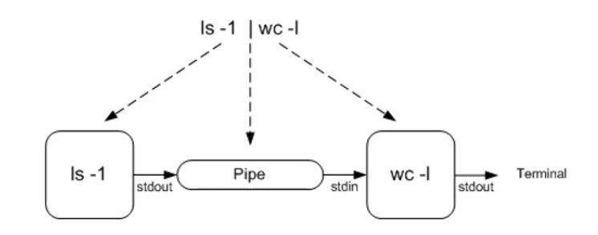
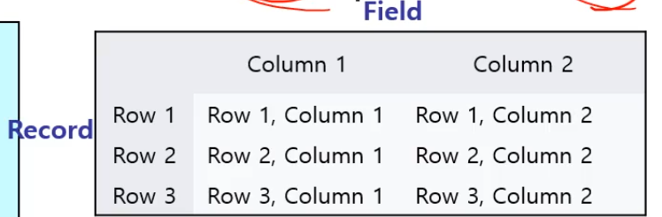
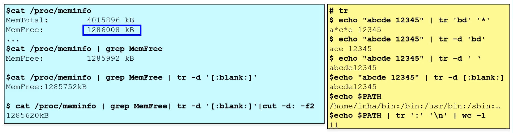
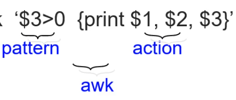
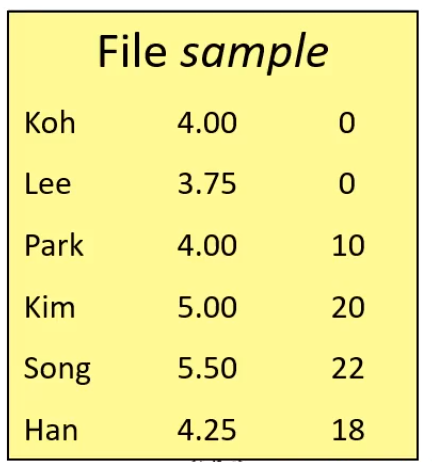
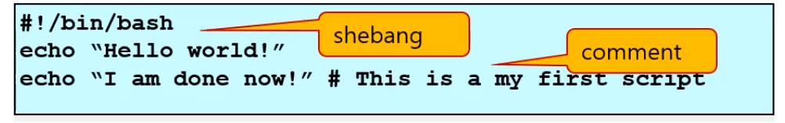
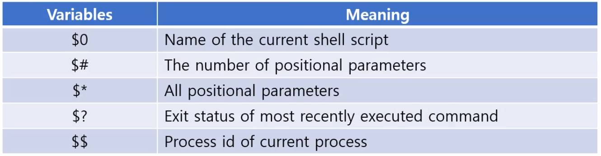
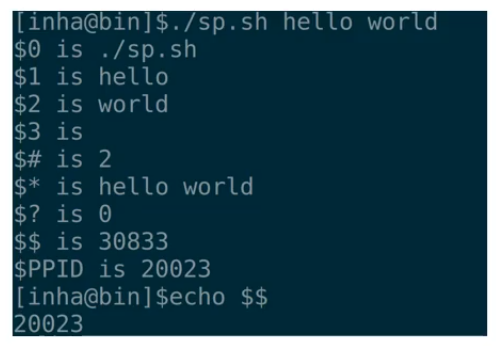
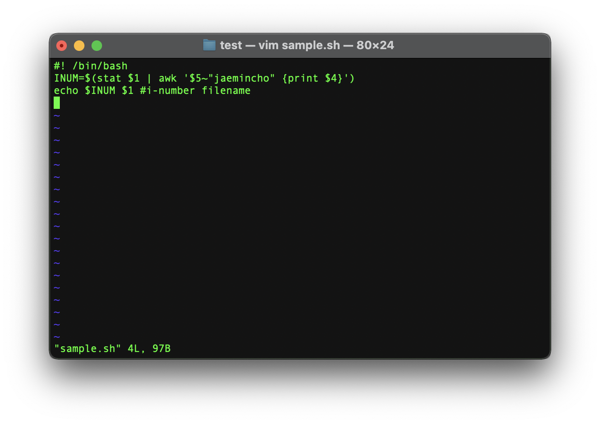

## Pipe and Shell Script

- Pipe and Filter
- Cut and Awk [**중요**]
- Alias [명령어 확장]
- Shell Script
- Position Parameter
- User Input


### Pipe

- | 로 표현된다
  - command1 | command2 로 **왼쪽 command1의 stdout 을 command2의 stdin 으로 연결한다**
- Linux나 Unix에서 기존 명령어를 통해 조합을 해 새로운 명령어/작업 [모듈화 - module] 을 구현하는 한 방법이다.



- 운영체제 관점에서는 Pipe는 프로세스들로 구현되고 실행되는데, 각기 다른 process는 서로 다른 주소공간을 갖기 때문에 다른 프로세스의 정보를 볼 수 없다.
  - IPC 라는 통신 방법이 필요하다 [Interprocess Communication]
  - IPC의 한 방법이 **Pipe이다**

```bash
$ ls -l | wc -l
      17
```

- ls -l 로 나오는 표준 출력이 모니터에 나오지 않고, wc -l 명령의 standard input으로 들어간다 !

```bash
$ who > a.txt ; date > b.txt
$ cal > c.txt ; ls > d.txt
$ wc -l *
       2 a.txt
       1 b.txt
       8 c.txt
       4 d.txt
      15 total
$ wc -l * | sort -n # n option은 숫자로 처리해라 num
       1 b.txt
       2 a.txt
       4 d.txt
       8 c.txt
      15 total
$ wc -l * | sort -n | head -n 1
       1 b.txt
```

- | 로 sort에 인자로 전달
- 그걸 또 head -n 1로 전달하면 sort 된 데이터의 첫 번째것 출력


### Filter

- pipe를 통해 [command1 | command2 | command3 | command4 ..] 명령어들이 연결될 수 있는데, 각각의 명령어는 **standard input과 standard output이 정의돼있어야한다.**
- 첫 번째 명령어는 stdoutput이 반드시 필요하며, 두 번째 ~ 명령어는 stdin, stdout이 정의되 있어야한다.


Linux 명령어들 중 standard input & output을 모두 사용하는 명령어도 있고, 둘 중 하나만 사용하는 명령어가 있다.

1. 둘 다 사용 [**Filter**]
   - cat, cut, awk, grep, wc, sort, bc, head, ...
2. 둘 중 하나만
   - standard output만 사용 - **이것들은 pipe module의 첫 번째로 사용할 수 있다.**
     - date, du, df, ls, ps, pwd, who, ...
   - Standard input & output 둘 다 없는경우
     - mkdir, rmdir, cd
     - cp, mv, rm


그렇기 때문에 pipe에 module로서 사용되기 위해서는 **standard input & standard output이 모두 정의된** 커맨드 여야 하는데, 이것들을 **Filter** 라고한다.

```bash
$ date
2021년 12월 12일 일요일 00시 00분 54초 KST

$ date | cut -d" " -f1
2021년
$ date | cut -d" " -f2
12월
$ date | cut -d" " -f5
00시

 cat /etc/passwd | cut -d: -f1 | sort | wc -l
     120
```

- cut: -d 는 구분자, " "  문자를 바탕으로 구분하고 -f1는 필드. 몇 번째 열인지


### Pipe and filter example : cut

**$ cut**: file 또는 standard input을 **문자, field** 단위로 **잘라서 standard output 으로 추출할 수 있다.**

- field는 Table의 열과 행 중 

  - 행: record
  - 열: field

   

- Database에서는 

  - field: attribute
    - Field 개수 : degree [예시에서 degree = 2]
  - record: tuple
    - record 개수: cardinality [예시에서 cardinality = 3]


- -d 옵션으로 field 단위로 잘랐고
- -c 는 문자 단위로 자른다
  - -c -10 은 0~9까지 10개 단어


- tr: translate 또는 delete characters

 

- 성능이 중요하다면,, C 처럼 시스템 코딩
- 성능이 중요하지 않다면 shell 명령어 조합으로 얻어올 수 있다.


**tr 명령어**

- 문자들을 변환 또는 삭제한다

  ```bash
  $ echo "abcde 12345" | tr 'bd' '*'
  a*c*e 12345
  ```

  - b와 d 문자를 *로 변환

  ```bash
  $ echo "abcde 12345" | tr -d 'bd'
  ace 12345
  
  $ echo "abcde 12345" | tr -d ' '
  abcde12345
  
  $ echo "abcde 12345	123" | tr -d [:blank:]
  abcde12345123
  ```

  - -d 옵션을 넣으면 변경이 아닌 삭제를 할 수 있다.
  - 공백문자는 다양한게 있다 ' ', 'tab' 등 
    - [:blank:] 라는 미리 정의된 클래스를 사용하면 모든 종류의 공백을 삭제해준다.

  ```bash
  $ echo $PATH
  /opt/anaconda3/bin:/opt/anaconda3/condabin:/usr/local/bin:/usr/bin:/bin:/usr/sbin:/sbin
  $ echo $PATH | tr ':' '\n' | wc -l
         7
  $ echo $PATH | tr ':' '\n'
  /opt/anaconda3/bin
  /opt/anaconda3/condabin
  /usr/local/bin
  /usr/bin
  /bin
  /usr/sbin
  /sbin
  ```

  - :로 나누어진 것들을 기준으로 field들의 합. 즉 컴포넌트의 수를 알 수 있다.


cut과 tr 많이 사용되긴 하지만 **awk**도 존재한다


### Awk: [Aho, Weinberger and Kernighan]

콜론을 기준으로 잘 정의되 있는 것들도 있지만, **다양한 형태의 포맷이 존재한다**

확장적 기능을 하는 awk을 써야할 수 있다.

**awk 프로그램의 주요 핵심은**: 텍스트 형태의 입력 데이터가 주어졌을 때, **field 와 record 별로 데이터를 처리해서 출력할 수 있다.**

- awk 프로그램은 **pattern과 action의** 순서쌍이다: 

- awk '$3>0 {print $1, $2, $3}' sample

    

  - Pattern: 조건
  - Action: 동작

- 즉, 이 조건을 만족하면 동작해라

record 단위로, **$ 다음 숫자가 field 순서 !**

- file sample에서
  - koh가 $1
  - 4.00이 $2
  - 0이 $3 이다

즉, $3 가 (3번 째 field가 ) 0보다 크면 다 출력해라 라는 의미.

```bash
$ cat sample | awk '{print $1}' # 조건이 없으면 항상 True
Koh
Lee
Park
Kim
...

$ cat sample | awk '$3==0 {print $1}'
Koh
Lee

$ cat sample | awk '$3>0 {print $1, $2*$3}'
Park	40
Kim 100
Song ...
```


- Variable

  - Built-int: NF (number of fields), NR (Number of Records)
    - 둘 다 1부터 시작한다

- Printf format convention

  - 즉, format!
  - %c: char, %d: decimal, %o : unsigned octal, %f, ...

  - Example
    - cat sample | awk 'NR!=2{print NR, $1, $2*$3, NF}'
      - NR이 2가 아닐때 $1, $2 * $3, NF


- **Seletion**
  - By Computation
    - cat sample | awk '$2*$3>=100 {print $2*$3, $1}'
    - 100 Kim
    - 121 Song
  - By Text content
    - cat sample | awk '$1~"Son" {print $2*$3, $1}' 
      - 여기서 tilde ~ 는 **포함되어 있다면, 이라는 의미**
    - 121 Song
    - cat sample | awk '$1=="Song" {print $2*$3, $1}' 
    - 121 Song
  - By combinations (&& || !)
    - cat sample | awk '$2*$3>=100 && $1~"Son" {print $2*$3, $1}'
    - 121 Song


### Awk Example (1)

```bash
$ df -h # disk 사용 량을 확인하기 위한
Filesystem                    Size   Used  Avail Capacity iused      ifree %iused  Mounted on
/dev/disk1s1s1               932Gi   14Gi  675Gi     3%  553788 9767424372    0%   /
devfs                        188Ki  188Ki    0Bi   100%     651          0  100%   /dev
/dev/disk1s5                 932Gi  2.0Gi  675Gi     1%       4 9767978156    0%   /System/Volumes/VM
/dev/disk1s3                 932Gi  434Mi  675Gi     1%    1892 9767976268    0%   /System/Volumes/Preboot
/dev/disk1s6                 932Gi  5.5Mi  675Gi     1%      19 9767978141    0%   /System/Volumes/Update
/dev/disk1s2                 932Gi  239Gi  675Gi    27% 1200087 9766778073    0%   /System/Volumes/Data
map auto_home                  0Bi    0Bi    0Bi   100%       0          0  100%   /System/Volumes/Data/home
/Applications/Spectacle.app  932Gi  239Gi  677Gi    27% 1198200 9766779960    0%   /private/var/folders/kf/0pb4z4092bncjf548nhkft240000gn/T/AppTranslocation/0803DD33-C502-4083-B08A-0EFF6043E5B8

# 우리가 /dev/disk1s5의 Avail을 얻어오고 싶다면? [2.0Gi]
$ df -h | awk '$1~"/dev/disk1s5" {print $3}' 
2.0Gi
```


### Awk Example (2)

```bash
$ touch sample.py
$ stat sample.py  # stat으로 meta 정보 출력
16777221 29747141 -rw-r--r-- 1 jaemincho staff 0 0 "Dec 12 00:58:51 2021" "Dec 12 00:58:51 2021" "Dec 12 00:58:51 2021" "Dec 12 00:58:51 2021" 4096 0 0 sample.py

# Inode 정보를 추출해보자
$ stat sample.py | awk '$4~"inode" {print $4}'
```


### Alias

Redirection, pipe, command list 등은 긴 명령어이다. 하나의 Alias 명령어로 지정해서 사용할 수 있다.

```bash
$ alias # alias 등록된 것들 보기

$ alias mm='date | cut -d" " -f2'
$ mm
12월
```

- alias [name]=[command] 로 등록
- unalias [name] 으로 등록 해제


### First Script

여러개의 명령어들을 하나의 script로 처리하는 방법을 알아보자.

 

- Shabang (shebang or hashbang)

  - 첫 문장 !

    ```bash
    #!/bin/bash 
    ```

  - #! 를 매직넘버? 라고한다.

  - shell script는 subshell에서 실행이 되는데 **어떤 interpretor로 실행되는지 지정한다**

  - #!/bin/bash , 즉 bash로 작성하겠다는것.

  - #은 주석

  ```
  #!/bin/bash
  Echo 
  ```

  

### Positional Parameters

>  Shell Script에 **인자를 전달하는 방법**

- Positional parameter는 shell 프로그램의 변수

  - 즉, 값 세팅이 가능하다.
  - 프로그램이 실행될 때 명시한 argument로 Set 된다.

- **${digit}** 으로 표현한다

  - $ x.sh arg1 arg2 arg3 ...

    ```bash
    $ x.sh arg1 arg2 arg3 ...
    ```

  - 한 자리 일때는 {} 를 생략 가능 - $1 ~ $9

  - 두 자리 이상은 {} 가 필요 ${10}

- 인자를 적어주면 값이 실행될 대 set 된다

```bash
$ cat x.sh
echo $4 ${15} $7 $3 $1 ${20}

$ x.sh {A..Z} # brace expansion으로 A ~ Z 26개 인자 전달
D O G C A T
# $4는 D ${15}는 O ...
```


### Shell Parameters - Special

Positional Parameter 이외에도 특별한 파라미터가 정해져있다.



- $0 : shell script의 **이름**
- $# : positional parameter의 개수
- $* : 모든 positional parameter
- $? : 가장 마지막 명령어의 exit status
- $$ : 현재 process 의 PID - subshell에서 수행되기 때문에
- $PPID : parent pid




### Script Example (I)

- Backup script example

```bash
$ tar -cvf sample.tgz . # 현재 경로에 sample.tgz 압축파일
$ tar -xvf sample.tgz # 압축 풀기
x ./
x ./.DS_Store
```

```bash
$ #!/bin/bash
$ BACKUPDIR=.
$ BACKUPNAME=${BACKUPDIR}/my-backup-$(date +%Y%m%d).tgz # ${BACKUPDIR} 변수 확장 
# $() 명령어 확장
```


- Inode script example

```bash
$ stat sample.py 
16777221 29748541 -rw-r--r-- 1 jaemincho staff 0 0 "Dec 12 01:23:24 2021" "Dec 12 01:23:24 2021" "Dec 12 01:23:24 2021" "Dec 12 01:23:24 2021" 4096 0 0 sample.py

# 여기서 jaemincho가 포함됬을 때 permission 정보 값을 가져오는걸 만들어보자
```

sample.sh 를 생성하고 안에 #! /bin/bash로 설정



```bash
$ ./sample.sh
-bash: ./sample.sh: Permission denied # 권한을 바꿔주자 +x로

$ sudo chmod +x sample.sh 
Password:

$ ./sample.sh sample.py  # sample.py 라는걸 넘겼다.
-rw-r--r-- sample.py
```


### User Input Example

지금까지 shell program에 사용자의 인자를 넘기는 방법을 보았다.

이제 프로그램 수행 중에 사용자로부터 동적으로 입력값을 받는걸 알아보자

- read varname [여러개 var 가능]

  - scanf와 비슷한거라 보면된다

  ```bash
  $ read myvar
  7 # 내가 입력한 값
  $ echo $myvar
  7
  
  $ read myvar1 myvar2
  hello jaemin
  $ echo "$myvar1, and $myvar2"
  hello, and jaemin
  ```

- read -s

  - secure
  - 비밀번호 등을 받을 때

  ```bash
  $ read -s pass
  #보이지는 않지만 비밀번호를 입력하고 엔터눌렀당
  $ echo $pass
  my_password
  
  ```

- read -t숫자 timeout

  - 초 단위로 timeout 을 걸 수 있다.
  - **Read는 blocking 함수**
    - 시간제한을 두어야 한다 !

  ```bash
  $ read -t5 timeout # 5초 안에 값을 입력해야 timeout 변수에 저장된다
  $ read -t5 timeout2
  10
  $ echo $timeout
  
  $ echo $timeout2
  10
  ```


##### Shell script로 만들어보자

 

- read -p:
  - 안내 문구를 쓸 수 있다. "enter your name"

```bash
$ ./sample.sh 
enter your name: jaemin Cho
First name: jaemin
Last name: Cho
```

