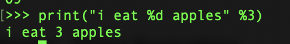

##   Open Source S/W


##### 8월 30일 (월)

- 첫 수업
- OpenSource에 대해서 다룬다. 오픈소스를 직접 개발하는게 아니다.
  - (1) Python programming 3주동안 진행
    - Numpy
    - Pandas - 굉장히 유명한 데이터 분석 Tool, 예전에는 R을 썻는데 이제 Pandas로 다 대체가 된다.
    - Scikit-learn
    - TensorFlow
    - Linux
  - (2) Opensource Licensing 4~5주차
    - 왜 Open Source를 사용하는지
  - (3) Git - 중간고사 전까지


### 1주차 - Introduction to Opensource SW

#### Introduction to Python

- What is Python ?

  - Python은 가장 인기있는 프로그래밍 언어.. 가장 대중적임
  - 1991년 **Guido van Rossum** 이 개발했음. 심지어 Java보다 먼저 개발됐다.
  - **Interpreter** (Interpreted language or Scripting language) 언어.
    - Java나 C 등은 Compile언어라고 한다.
    - Python은 한 줄씩 코드를 실행해서 결과를 바로 확인할 수 있는 **Interpreter 언어**
    - 코드를 수정하고 즉시 실행이 가능하다.
  - 왜 이름이 Python ?
    - 자신이 좋아하는 코미디 쇼의 이름... 
      

- Features of Python

  - 인간의 사고체계를 그대로 따서 만듬

    ```python
    if 4 in [1,2,3,4]: print("There is a 4")
    ```

  - 배우기 쉽다.

  - 오픈소스 S/W 이다.

  - 다양한 라이브러리를 통해 머신러닝 & 딥러닝 등에 활용할 수 있다.

  - 개발 속도가 빠르다.
    

- What can Python do ? & What can not Python do ?

  - Python으로 할 수 있는 일
    - Utility 프로그램 개발 가능하다: 컴퓨터에 도움이 되는 (ex. 백신 프로그램)을 개발할 수 있다.
    - GUI (Graphic User Interface) 개발 가능하다. 
      - Tkinter 라는 프로그램을 이용해 개발할 수 있다.
    - Glue language (접착 언어, with C/C++)
      - 다른 언어와 접착이 잘 된다. 
      - 일반적으로 Python으로 뼈대를 만들고, 수행시간이 빨라야 하는 부분을 C/C++로 개발한다
    - Web programming
      - Django 
    - **Numpy** 라는 수칙연산 라이브러리를 제공해서 complex mathematics 연산에 유용하다.
    - MySQL, Oracle, PostgreSQL과 같은 DB에 연결이 손쉽다.
    - **Pandas**를 이용해 Big-Data 분석을 쉽고 빠르게 할 수 있다.
      - 기존에는 R을 데이터 분석에 많이 썻는데, 이제는 Python이 대체됐다.
  - Python 으로 할 수 없는 일
    - Mobile programming
      - Andriod & iOS 개발은 지원이 안된다.
    - System Programming
      - Python은 High-level language이기에 system programming은 어렵다.
        

- Basic syntax of Python

  - 4칙연산

    > Addition
    >
    > 1 +  2
    >
    > 3
    >
    > -------------
    >
    > Subtraction

  - Python의 대화형 Interpretor를 "**shell**"이라 부르고,  (">>>") 꺾은 괄호를 **promp**라고 부른다.

  - Python variable

    - C/C++이나 Java와 달리 data type을 따로 선언하지 않는다.

      > Integer
      >
      > a = 1
      >
      > b = 2
      >
      > a + b
      >
      > 3
      >
      >
      > String
      >
      > a = "this is a String"

  - Python에서 입력 값을 받기 위해 사용되는 input() 함수를 쓴다.

    > a = input() 
    >
    > Life is too short
    >
    > a
    >
    > 'Life is too short'

    input("숫자를 입력해 주세요: ") 라고 하면 힌트를 줄 수 있다.

     

    - **input으로 받은 값은 string 문자열로 취급된다**
    - 입력받은 값을 정수, 실수로 쓰고싶으면 형 변환을 해야한다.

  - 조건문 if

    - 공백을 띄워야 한다.
    - 파이썬 에서는 공백 네 칸 (    )이 약속이고 보통 'tab' 키를 사용한다.
    - : 를 이용해 if문임을 알린다

    ```python
    a = 3
    if a > 1:
      print("a is greater than 1")
    ```

  - While & for 반복문 

    ```python
    i = 0
    while i < 3:
      i = i + 1
      print(i)
    ```

    * for 문, c & 자바에서는 초기값, 조건식, 증감식이 들어가는데
    * python에서는 **in** 을 쓴다

    ```python
    for a in [1, 2, 3]:
      print(a)
    ```

  * Python 함수

    * def: 함수를 만들때 사용하는 ''예약어''

    ```python
    def add(a, b):
      return a + b
    
    add(3, 4)
    ```

    * add: 함수 이름
    * (a, b): parameters
    * (3, 4): arguments
      

- Editors of Python
  - Python IDLE (Intergraed Development and Learning Environment)
    - 가장 기본적인 것... Terminal에 설치가 돼 있으니까 거기서 개발하는거
    - Shell Window (Idle 기본 실행창)
  - Visual Studio Code
  - PyCharm
    - 가장 많이 사용된다.
    - 코드 자동 완성기능을 제공하며 GUI를 제공한다.
    - 실행과 관리가 용이하다.
  - Anaconda & Jupyter Notebook
  - 중간고사 이후 Jupyter Notebook으로 수업진행할 예정


### 2주차 - Python Data Type

- Number
- String
- List
- Tuple
- Dictionary
- Set
- Bool
- Variable

일반적으로 int, floot, string 등을 쓰지만 Python은 자동으로 입력값에 따라 Data Type이 정해진다.

Python에서 제공하는 data type:

> Text type: <u>str</u>
>
> Numeric Types: <u>int</u>, <u>floot</u>, complex
>
> Sequence Types: <u>list</u>, <u>tuple</u>, <u>range</u>
>
> Mapping type: <u>dict</u>
>
> Set types: <u>set</u>, frozenset
>
> Boolean type: <u>bool</u>

* type() 함수를 사용해서 해당 변수의 type을 알 수 있다.
* print(type()) 하면 해당 type을 print해서 볼 수 있음.


##### Int

- Python에서는 정수, 실수, 8진수, 16진수를 사용한다. 정수형, 실수형만 알아보자
- Int는 정수, 양의정수, 음의정수, 0 이 포함된다.

##### floot

* 1.2 등의 소수점을 담을 수 있다.

* 지수의 표현도 있다

* ```python
  a = 4.24E10 : 4.24 * 10^10
  a = 4.24e-10 : 4.24 * 10^-10
  ```


##### 제곱 출력

```python
>>> a = 3
>>> b = 4
>>> a ** b
81
```

- **을 사용한다

##### 나눗셈의 나머지 & 몫

```python
>>> 7 % 3
1
>>> 3 % 7
3

>>> 7 // 4
1
```

- // 를 쓰면 몫만 나온다. 7 / 4는 1.75인데 7 // 4는 1만 나온다


### String

Python에서 문자열을 표시할때는 ' ' 나 " " 안에 넣어준다.

**Multiple** **Strings**

> 여러줄에 걸쳐서 String으로 표현하고 싶다면 ''' 를 사용한다

```python
multipleline = '''
Life is too short
You need Python
'''

또는

multipleline = """
Life is too short
You need Python
"""

>>> print(multipleline)
Life is too short you need python
```


Python 에서는 문자열을 ' '이나 " "로 감싼다. **그렇다면 문장 내에 "나 '를 출력하려면 ?**

- Single Quotation mark (' ')

- 문자열 내에 ' '나 " "를 포함시킬 수 있다

  ```python
  >>> food = "Python's favorite food is perl"
  >>> food
  "Python's favorite food is perl"
  
  ```

- Double Quotation mark

  ```python
  >>> say = '"Python is very easy". he says.'
  >>> say
  "Python is very easy." he says
  ```

- 또는 backslash (\\) 를  이용할 수 있다.

  ```python
  >>> food = 'Python\'s favorite food is perl'
  >>> say = "\"Python is very easy.\" he says."
  ```


####  문자열 연산 - Concatenation (문자열 연결)

##### String Concatenation

**\+ 연산자를 사용하면된다 !**

```python
>>> head = "Python"
>>> tail = " is fun!"
>>> head + tail
'Python is fun !'
```

\* 연산자를 사용하면 **반복적으로 출력한다**

```python
>>> a = "Python"
>>> a * 2
'PythonPython'

프로그램 구분선을 위해 사용될 수 있다

print("=" * 20)
print("My Program")
print("=" * 20)

====================
My Program
====================
```

##### 

##### String - length: 길이

* **len()** 함수를 사용하면 바로 길이가 나온다

  ```python
  >>> a = "hello ~"
  >>> len(a)
  7
  ```


##### String - Indexing 

> String에서 Indexing 이라는 것은, 특정한 위치를 가리키는 것 !
>
> Python의 문자열도 다른 언어와 같이 배열에 문자열을 저장한다.

```python
>>> a = "Life is too short, you need python"
>>> a[3]
'e'
```

- Python도 첫 번째 index는 0이다
  - a[0]: 'L', a[1]: 'i' ....

* 맨 뒷 글자를 **-1** 로 할 수 있다.
  - a[-1] : 'n'
  - a[-0] : 'L'
  - a[-2] : 'o'

##### String - Slicing

> 인덱싱이 한 번에 하나의 글자를 가져온다면, 부분 길이를 가져오기 위해 Slicing 해서 가져올 수 있다.
>
> a[시작 인덱스 : 끝 인덱스] 
>
> 이런식으로 가져오는데, 주의할 것은 끝 인덱스 -1까지 가져온다

```python
>>> a = "Life is too short, you need python"
>>> a[0:4] --> 0,1,2,3 이 출력된다
'Life'
>>> a[0:3] --> 0,1,2
'Lif'
```

* 시작인덱스 안넣은 경우 a[:10] --> 자동으로 0으로 시작
  * a[:17] --> 0 ~ 16
  * 'Life is too short'
* 끝 인덱스 선언 안하면 a[19:] --> 끝까지 간다
* negative index 쓸 수 있다 a[19:-7]  

**문자열 Slicing은 특정한 패턴을 가진 문자열을 규정할 때 사용된다.**

```python
>>> a = "20210930Rainy"
>>> year = a[:4]
>>> month = a[4:6]
>>> day = a[6:8]
>>> weather = a[8:]
>>> year
'2021'
>>> month
'09'
>>> weather
'Rainy'
>>> month + day + weather
'0930Rainy'
```


##### String - String formatting

> 문자열 포멧팅..
>
> 문자열 내에 특정한 값을 상황에 따라 바꾸는 것을 의미한다.
>
> %s : string
>
> %c : A character
>
> %d : Integer
>
> %f : Floating-point
>
> %% : Literal %

- 숫자를 삽입하고 싶다면 **%d**

  \>\>\> "I eat %d apples." %3

  'I eat 3 apples'

- 변수 대입 **%s**

   


한번에 두 개 이상의 값을 넣을 수 있다 % (number, day) 등

```python
>>> number = 10
>>> day = "Three"
>>> "I ate %d apples. So I was Sick for %s days." % (number, day)
'I ate 10 apples. So I was Sick for Three days.'
```

 

**%s는 어떤 값이던 상관없이 string으로 넣어줄 수 있다**.


##### format() 함수

```python
>>> "I ate {0} apples".format(3)
'I ate 3 apples'
```

{0} 여기서의 0이 index를 입력하고, format() 함수 내에 순서에 따라 보여줄 수 있다.

**여러가지 값을 넣을 수 도 있다. format()**

```python
>>> number = 10
>>> day = 'three'
>>> "I ate {0} apples. so I was sick for {1} days.".format(number, day)
'I ate 10 apples. so I was sick for 30 days.'

number는 {0}과 매칭, day는 {1}과 매칭이된다.
순서에도 유의해야 한다.

{names} 방식도 존재한다 !
>>> "I ate {number} apples. so I was sick for {day} days.".format(number = 10, day = 3)

섞어서도 가능 !
>>> "I ate {0} apples. so I was sick for {day} days.".format(10, day = 3)
```


#### 문자열 내장 함수

**count()**

- 문자열 내에 특정 문자 개수를 count 해준다

  ```python
  >>> a = "hobby"
  >>> a.count('b')
  2
  ```


**join()**

- 문자열 문자 사이사이에 특정 문자를 삽입해준다

  ```python
  >>> ",".join('abcd')
  'a,b,c,d'
  
  >>> "hello".join('abcd')
  'ahellobhellochellod'
  a와 b 사이, b와 c 사이, c와 d 사이에 hello를 삽입해준다
  ```


**find() 와  index()**

- 문자열에서 특정 문자의 위치를 알려주는데, 두 함수는 기능은 같은데 차이점은 특정 문자가 존재하지 않을 경우 리턴값이 다르다.

```python
find()

>>> a = "Python is the best choice"
>>> a.find('k')
14
>>> a.find('k')
-1

index()
>>> a = "Life is too short"
>>> a.index('t')
8
>>> a.index('k')
Traceback (most recent call last):
  File "<stdin>", line 1, in <module>
ValueError: substring not found
```

- find()는 없으면 -1, index()는 오류 리턴


**upper() 와 lower()**

- 영어 문자를 대문자, 소문자로 바꿔준다.


**lstrip()과 rstrip() 그리고 strip()**

- 공백을 없애준다
- Lstrip은 왼쪽의 공백을 없애주고 rstrip()은 오른쪽 공백을 없애준다.
- strip()은 양 옆 공백을 없애준다.

```python
>>> a = " hi "
>>> a.lstrip()
'hi '

>>> a.rstrip()
' hi'

>>> a = " h i h i "
>>> a.strip()
'h i h i'
```


**replace()**

- 문자열을 바꿔준다
- replace("바뀌게 될 문자열", "바꿀 문자열")

```python
>>> a = "Life is too short"
>>> a.replace("Life", "Your Leg")
'Your Leg is too short'

>>> a.replace("Life", "your leg").upper()
'YOUR LEG IS TOO SHORT'
```


**split()**

- 특장 문자를 기준으로 문자열을 나눠준다.
- split() , 인자가 없다면 공백을 기준으로 나눠준다. 
- 리스트 형식으로 돌려준다

```python
>>> a = "Life is too short"
>>> a.split()
['Life', 'is', 'too', 'short']

>>> b = "a:b:c:d"
>>> b.split(':')
['a', 'b', 'c', 'd']
```


### Lists

- List, 리스트 자료형은 C의 행렬처럼 여러 요소를 한번에 저장한다
- 대 괄호 [] 를 사용한다
- C, Java와의 차이점은 Python은 어떤 자료형도 다 사용 가능하다

```python
>>> a = [] # 빈 List (Empty List)
>>> b = [1, 2, 3] # Number
>>> c = ['Life', 'is', 'too', 'short'] # String
>>> d = [1, 2, 'Life', 'is'] # Number + String
>>> e = [1, 2, ['Life', 'is']] # Number + List
```


**List - Indexing**

문자열과 동일..

 

**List - Change and Delete**

- 바꾸는 법.. index에 값을 바꾸면된다

```python
>>> a = [1, 2, 3]
>>> a[1] = 4
>>> a[1,4,3]
```

- 삭제 delete() 함수 사용

```python
>>> a = [1, 2, 3]
>>> del a[1]
>>> a
[1, 3]
```


#### List 관련 Methods


**append()**

- List에 요소를 [맨 마지막에] 추가한다

```python
>>> a = [1,2,3]
>>> a.append(4)
>>> a
[1,2,3,4]

>>> a.append([5,6])
>>> a
[1,2,3,4,[5,6]]
```


**sort()**

- List내 요소들을 오름차순 정렬한다.
- 숫자, 문자 둘다 오름차순 정렬을 해준다.
- 내림차순 정렬은 .sort(reverse = True) 로 하면된다.


**reverse()**

- List내 요소를 뒤집는다
- sort가 아닌, 요소 인덱스를 뒤집는다 생각하면 된다.


**index()**

- List내 index를 return 한다

  ```python
  >>> a = [1,2,3]
  >>> a.index(3)
  2
  ```

- List내 존재하는 값이 아니면 에러를 출력한다.


**insert(a, b)와 remove(x)**

- append() 함수가 무조건 맨 마지막에 넣는거라면, insert(a,b)는
- insert (a, b): a번째 index에 b를 삽입

```python
>>> a = [1,2,3]
>>> a.insert(0,4)
>>> a
[4,1,2,3]
```


**pop()**

- 마지막 element를 출력하고 지운다

```python
>>> a = [1,2,3]
>>> a.pop()
3
>>> a
[1, 2]
```

- pop(x): 인자로 인덱스를 넘기면,해당 인덱스 값을 출력하고 삭제한다

```python
>>> a = [1,2,3]
>>> a.pop(1)
2
>>> a
[1, 3]
```


**count(x)**

- list내 x값이 몇개인지 알려준다

```python
>>> a = [1, 2, 3, 1]
>>> a.count(1)
2
```

**extend(x)**

* list를 확장하기 위해 사용된다

```python
>>> a = [1, 2, 3]
>>> a.extend([4,5])
>>> b = [6, 7]
>>> a.extend(b)
>>> a
[1, 2, 3, 4, 5, 6, 7]
```


### Tuple

> List와 비슷하지만, **변경할 수 없는** 요소 값들을 사용한다.
>
> Tuple은 () 괄호를 통해 선언한다
>
> 선언만 가능하고, **추가, 삭제, 변경** 등이 불가능하다

```python
>>> t1 = ()
>>> t2 = (1,2,3)
```

- 만약 Tuple 내에 요소를 변경, 삭제하려면 ?
  - <u>오류가 발생한다 !</u> - 'tuple' object doesn't support item deletion / assignment


- Tuple의 연산은 List와 비슷하다, indexing, slicing, addition 등등이 모두 사용가능하다


### Dictionary

> "Key:Value" 쌍으로 저장하는 Dictionary 자료구조.
>
> Key값을 통해 value값을 얻는다.
>
> {} 를 통해 선언한다.

```python
>>> dic = {
  'name' : 'pey',
  'phone' : '01064781498',
  'birth' : '1118'
}
>>> a = {1 : 'hi'}
>>> a = {'a' : [1,2,3]}
```

- Key 값은 **변경이 불가능하고**, Value 값은 **변경이 가능/불가능 변수가 사용될 수 있다**
- Key 값으로 **List** 를 넣을 수 없다 ! 왜냐면 변경이 불가능해야하기때문


Dictionary 사용 예제

```python
>>> a = {1 : 'a'}		
>>> a[2] = 'b'	# 숫자형 Key 값 2에 'b'라는 value 추가
>>> a
{1 : 'a', 2 : 'b'}

>>> a['name'] = 'pey'		#문자열 'name' 의 key 값에 value 'pey' 추가

>>> a[3] = [1, 2, 3] # 숫자 3의 key에 list [1,2,3] 을 value로 삽입
>>> a
{1 : 'a', 2 : 'b', 'name' : 'pey', 3 : [1,2,3]}

```


Dictionary 에서 삭제를 하고싶다면, **del** 함수를 사용한다.

- 삭제하고 싶은 요소의 'key' 값을 넣어서 삭제한다.

```python
>>> del a[1]
a
{2 : 'b', 'name' : 'pey', 3 : [1,2,3]}
```


Dictionary에서 특정 **"key"** 값의 Value를 얻고싶다면

- a['key'] 로 가져올 수 있다.


**Dictionary 사용의 주의사항**

- Key 값은 **중복해서 사용할 수 없다**

  - ```python
    >>> a = {1 : 'a', 1 : 'b'}
    
    이런경우 두 번째의 key 값만 넣어지고 앞에 중복되는 키 는 무시된다
    >>> a
    {1 : 'b'}
    ```

- List는 Key 값으로 사용될 수 없다.

  - 반대로 Tuple은 값을 변경할 수없기에 사용할 수없다.
  - 또한 Dictionary의 key로 dictionary를 쓸 수 없다.


#### Dictionary - Methods


**keys()**

- dictionary의 key값들을 모두 불러온다.

```python
dic = {
    'name' : 'pey',
    'phone' : '01064781498'
}

print(dic.keys())
>>>  dict_keys(['name', 'phone'])
```


**values()**

- dictionary의 value 값들을 모두 불러온다

```python
dic = {
    'name' : 'pey',
    'phone' : '01064781498'
}

print(dic.values())
>>> dict_values(['pey', '01064781498'])
```


**items()**

- key와 value의 쌍을 Tuple 형태로 불러온다.

```python
dic = {
    'name' : 'pey',
    'phone' : '01064781498'
}

print(dic.items())
>>> dict_items([('name', 'pey'), ('phone', '01064781498')])
```


**get()**

- key 값을 인자로 받아 해당 key의 value값을 돌려준다.

```python
dic = {
    'name' : 'pey',
    'phone' : '01064781498'
}

print(dic.get('name'))
>>> 'pey'
```

- 즉 이 방법은 dic['name'] 과 동일한데, **차이점은** 존재하지 않는 key의 검색일경우
  - get() 함수는 **None** 을 리턴하지만
  - [] 는 에러를 발생시킨다.


**clear()**

- dictionary 내에 key, value 쌍을 모두 지워준다


**in**

- dictionary 내에 key 값의 존재 여부를 확인할 때 사용된다.

```python
dic = {
    'name' : 'pey',
    'phone' : '01064781498'
}

print('name' in dic)
>>> True
print('type' in dic)
>>> False
```


### Set

> set은 집합 자료형. 집합 연산을 쉽게하기위해 사용된다.
>
> set() 이라는 키워드로 선언된다
>
> ```python
> >>> s1 = set([1,2,3])
> >>> s1
> {1, 2, 3}
> ```
>
> **집합 내의 요소들이 indexing 되어 있지 않으며, 순서가 존재하지 않는다.**
>
> **중복값을 제거하고 출력해준다! **
>
> 즉 중복을 제거하는 **Filter** 역할로 사용된다.

중복 제거 예)

```python
>>> s1 = set("Hello")
>>> s1
{'e', 'H', 'l', 'o'}
```


집합 자료형을 index 방식으로 접근하고 싶다면, **List나 Tuple 등으로 형 변환을 한다.**

```python
>>> s1 = set([1, 2, 3])
>>> l1 = list(s1)
>>> l1
[1, 2, 3]
>>> l1[0]
1
>>> t1 = tuple(s1)
>>> t1
(1 , 2, 3)
>>> t1[0]
1
```


**교집합 (intersection), 합집합 (Union), 차집합 (Difference) **

```python
>>> s1 = set([1,2,3,4,5,6])
>>> s2 = set([4,5,6,7,8,9])
```

- 교집합 '&' 를 사용한다.

  - ```python
    >>> s1 & s2
    {4, 5, 6}
    >>> s1.intersection(s2)
    {4, 5, 6}
    ```

- 합집합 '|' 을 사용한다

  - ```python
    >>> s1 | s2
    {1,2,3,4,5,6,7,8,9}
    >>> s1.union(s2)
    {1,2,3,4,5,6,7,8,9}
    ```

- Difference (-)

  - ```python
    >>> s1 - s2
    {1, 2, 3}
    
    >>> s2 - s1
    {8, 9, 7}
    
    >>> s1.difference(s2)
    {1, 2, 3}
    ```

    

**add(), update(), remove()**

- add는 set 집합에 추가하는것. 하나만 들어간다
- update() 는 여러개를 새롭게 넣어주는것
- remove는 특정 요소를 삭제


### Bool

- True or False 두 가지 값만 가질 수 있다.

   

  - Empty String을 제외하고 모든 String 은 **True**
  - 0을 제외한 모든 숫자는 True
  - list, tuple, set, dictionary는 **True** 이지만, empty면 False


**bool()**

- Data type의 True or False를 알려주는 함수이다

```python
>>> bool('python')
True
```


### Variables

- Python은 data type을 선언하지 않아도 된다.
- 변수를 생성할때는 간단하게 = 를 이용해 사용하면 된다.
  - a = 1
- Python의 변수는 **pointer** 라고 할 수 있다.
  - id(a) 로 확인할 수 있다.


**변수명** **규칙**

 

- 변수명의 시작은 항상 문자 or _ 
- 소문자와 대문자를 구분한다


> - Camel case
>   - myVariableName = "John"
> - Pascal case
>   - MyVariableName = "John"
> - Snake case
>   - my_variable_name = "John"


**두 값을 변경하기 **

```python
>>> a = 3
>>> b = 5
>>> a, b = b, a
>>> a
5
>>> b
3
```


### 2주차 - Conditional Statements

#### **조건문** [if]

- 기본 구조

  ```python
  if condition:
    statement 1
    statement 2
    ...
    
  >>> a = 33
  >>> b = 200
  >>> if b > a :
  ... 	print("b is greater than a")
  ```


if문은 else: 와 함께 사용된다.

* Logical Operators (and, or, not)

  ```python
  >>> money = 2000
  >>> card = True
  >>> if money >= 3000 or card:
  ...			print("Take a cab")
  ...	else:
  ...			print("Just walk")
  
  Take a cab
  ```

  and: 두 조건 모두 참이여야 True

  or: 둘 중 하나만 True면 True

  not: 조건 결과를 반대로, not(x < 5 and x < 10)

* Membership Operators

  * in 을 사용한다

  ```python
  >>> pocket = ['a', 'b', 'c']
  >>> if 'a' in pocket:
    ~~
  ```

  - not in도 존재한다


**Elif**

- if, elif, else 순서.. 


**conditional expressions**

> **If the condition is True** <u>if</u> **Condition** <u>else</u> **If the condition is False**

```python
>>> if score >= 60:
...	  message = "success"
... else:
...		message = "failure"

이와 같은 내용을 한 로 쓸 수 있다.

>>> message = "success" if score >= 60 else "failure"
```


### 반복문 While

```python
while condition:
  statement 1
  statement 2
  statement 3
  ...
  
```

건너띄고 싶으면 continue...


### For

- 기본 구조

  - List나 Tuple 내에 요소들을 처음부터 마지막까지 훑는것

  ```python
  for variable in list(or tuple, string):
    statement 1
    statement 2
    ...
  ```

  - 예제

  ```python
  test_list = ['one', 'two', 'three']
  for i in test_list:
    print(i)
  
  one
  two
  three  
  
  
  for x in "banana":
    print(x)
  
  b
  a
  n
  ...
  
  
  
  a = [(1, 2), (3, 4), (5, 6)] # tuple을 list로 갖고있다
  for (first, last) in a:
    print(first, last)
  
  1 2
  3 4
  5 6
  
  a = [(1, 2), (3, 4), (5, 6)]  # tuple을 list로 갖고있다
  for (first, last) in a:
      print(first + last)
      
  3
  7
  11
  ```

  

for문 사용 예제:

```python
marks = [90, 25, 34, 66, 72, 45, 80]
i = 0
for mark in marks:
    i = i + 1
    if mark >= 60:
        print("Student %d passed the Test" % i)
    else:
        print("Student %d failed the Test" % i)

Student 1 passed the Test
Student 2 failed the Test
Student 3 failed the Test
Student 4 passed the Test
Student 5 passed the Test
Student 6 failed the Test
Student 7 passed the Test        

```


**range()** 함수

- 특정 숫자 나열을 Return 해준다.

  ```python
  a = range(10)
  a
  range(0, 10) # 0부터 10 미만의 수를 갖고있는 object, 즉 range 객체 
  
  a = range(1, 11)
  a
  range(1, 11) # 시작 1부터 11 미만의 숫자를 range 객체로 받아온다.
  
  a = range (2, 30, 3) # 마지막 3은 증가 범위. 없다면 기본 Default 는 1 이다
  즉 2부터 3씩 증가시켜서 30미만까지
  2, 5, 8, ...
  
  for x in a:
      print(x)
  
  2
  5
  8
  11
  14
  17
  20
  23
  26
  29
  ```


구구단 예제~

```python
for i in range(2, 10):
    for j in range(1, 10):
        print(i * j, end=" ")
    print(' ')

---------구구단 예제---------
2 4 6 8 10 12 14 16 18  
3 6 9 12 15 18 21 24 27  
4 8 12 16 20 24 28 32 36  
5 10 15 20 25 30 35 40 45  
6 12 18 24 30 36 42 48 54  
7 14 21 28 35 42 49 56 63  
8 16 24 32 40 48 56 64 72  
9 18 27 36 45 54 63 72 81  
```

**end= 로 줄 바꿈을 방지한다**


### 3 주차 

### Functions - 함수

> What is the functions?
>
> - 호출이 되는 경우에만 실행이 되는 code block
> - parameter라는 데이터를 함수에 넣으면, 함수내의 코드에 의해 출력값이 return 된다.
>
> Why we use the functions?
>
> - 코드의 길이가 길어지고 있을 때 반복적인 코드를 입력하는건 비효율적이다.
> - 똑같은 기능을 하는 반복적인 부분은 함수를 만들어서 재사용하는게 효율적
> - 코드의 가독성도 높아진다


#### Python에서의 함수 선언 - def

```python
def name(parameters):
  statement 1
  statement 2
  ...
  
  
Example)
def add(a, b):
  return a + b
```

**def 라는 키워드를 이용해 함수임을 선언한다 ! **


#### Parameters & Arguments

- Parameter: 함수 내부의 입력 값, 함수 내에 존재하는 값, arguments에 의해 전달되는 값
- Arguments: 함수 외부의 입력 값, 이 값이 함수 parameter에 복사가 된다

```python
def add(a, b): # a, b는 Parameter
  return a + b

print(add(3, 4)) # 3, 4는 Arguments
```


#### Types of Function 

함수의 형태는 **input (parameter & arguments) / output (return) ** 의 존재 여부에 따라 네 가지로 나뉜다.

1. 일반적인 함수 형태는 arguments, return 값이 **모두 존재한다**

   ```python
   def name(a, b):
     statement1 
     return result
   ```

2. 입력값이 없지만 결과값이 존재하는 형태

   ```python
   def name():
     statement1
     return result
   ```

3. 입력값이 있지만 결과값이 없는 형태

   ```python
   def name(parameter):
     statement
     ...
   ```

4. 입력/출력 값이 모두 없는 형태

   ```python
   def name():
     statement
     ...
   ```


#### Keyword Arguments**

- 파라미터를 지정하여 함수를 호출하는 방법
- 함수 호출 시 argument 순서에 상관 없이 원하는 parameter 값 전달이 가능하다
- key = value 쌍 형태로 지정한다

```python
def add(a, b):
  return a + b

result = add(a = 3, b = 7)
print (result)
>>> 10

result = add(b = 5, a =3)
```

> kwargs 라고 줄여서 사용한다


#### Arbitrary Arguments**

- 입력값의 개수가 정해저 있지 않은경우
- \* 를 넣어서 사용하고, 보통 args라는 이름을 쓴다 (\*args) 

```python
def add_many(*args):
    result = 0
    for i in args:
        result = result + i
    return result

result = add_many(1,2,3,4)
print(result)
>>> 10
```


- 단순 parameter와 함께 사용될 수 있다.

```python
def add_mul(choice, *args):
    if choice == "add":
        result = 0
        for i in args:
            result += i
    elif choice == "mul":
        result = 1
        for i in args:
            result *= i
    return result

result = add_mul("mul", 1, 3, 4, 5)
print(result)
>>> 60
result = add_mul("add", 1, 3, 5)
print(result)
>>> 9
```

 

#### Arbitrary Keyword Argument

- **Arbitrary Argument**는 Arguments의 개수가 정해저 있지 않은경우, **Keyword Argument**는 원하는 parameter에 원하는 값을 넘길때
- Keyword arguments의 개수가 정해저 있지 않을 때, 어떻게 선언할 것인가?
- parameter 앞에  **\**를 넣어서 선언한다 !**
- 보통 kwargs로 선언한다

```python
def print_kwargs(**kwargs):
    print(kwargs)

print_kwargs(a = 1)
>>> {'a': 1}
print_kwargs(name = 'foo', age = 3)
>>> {'name': 'foo', 'age': 3}

```

Dictionary 형태로 저장된다 !! 

```python
def my_function(**kid):
    print("His last name is " + kid["lname"])

my_function(fname="Tobias", lname="Cho")
>> His last name is Cho
```


#### Return Values

- 이런식으로 return 한다면?

  ```python
  def add_and_mul(a, b):
      return a + b, a * b
  ```

  **Tuple 형태로 return 한다 !!!**

  ```python
  def add_and_mul(a, b):
      return a + b, a * b
  
  print(add_and_mul(3, 4))
  >>> (7, 12)
  ```

  그렇기에 tuple의 값을 지정해 받아올 수 있다

  ```python
  
  def add_and_mul(a, b):
      return a + b, a * b
  
  result = add_and_mul(3, 4)
  result1, result2 = add_and_mul(3, 4)
  
  print(result)
  >>> (7, 12)
  print(result1)
  >>> 7
  print(result2)
  >>> 12
  ```


#### Default Parameter Value

- ###### 함수의 초깃값을 설정하는 방법 (Parameter 초기 값 = default parameter)!!

```python
def say_myself(name, age, man = True):
    print("My name is %s. " % name)
    print("My age is %d. " % age)
    if man:
        print("I am a Man")
    else:
        print("I am a Woman")

>>> say_myself('JaeMin', age = 25)
My name is JaeMin. 
My age is 25. 
I am a Man
>>> say_myself('JeongMin', 25, False)
My name is JeongMin. 
My age is 25. 
I am a Woman
```


##### default parameter 주의할 점 - 위치

- Parameter의 위치에 주의해야한다.
  - 항상 다른 Parameter보다 **뒤에** 위치해야한다.
  - 다른 Parameter 보다 앞에있다면, [non-default argument follows default argument] 에러가 발생한다


#### Lambda

- 단일 문장으로 표현되며, return 값이 없어도 결과물을 돌려준다

```python
add = lambda a, b : a + b
result = add(3, 4)
print(result)
>>> 7

mul = lambda a, b : a * b
print(mul(3, 4))
>>> 12
```


### Input & Output

**input() 함수 이용**

```python
a = input()
a = input("please enter a number:")
```

- 모든 값은 **문자열**로 입력받기에, 형 변환을 해야한다


**print() 함수 이용**

- 입력한 자료형을 출력

함수이기에 parameter 존재한다. 

한 번에 하나의 argument만 선언할 수 있음


- Object(s) : 실제 print를 통해 출력되는 문자열
- **sep**=separater: 문자열을 구분하는 구분 문자열, default는 공백 ' '
- **end**=end: 문자열 뒤에 어떤 문자를 들어갈지. default 는 '\n' 한줄 띄 기

```python
*sep*
print("life", "is", "too short")
>>> life is too short

print("010", "111", "1234", sep = "-")
>>> 010-111-1234
```

```python
*end*
for i in range(3):
  print(i)
>>> 0
>>> 1
>>> 2
default 는 \n 이다

for i in range(10):
  print(i, end = ' ')
  
>>> 0 1 2 3 4 4 5 6 7 8 9 
```


### File Handling

- File Open
- Write Files
- Read Files
- Append Data in a File


##### File Open

- open() 함수를 사용한다
  - 두 개의 Parameter, f = open(filename, mode) # <u>f is file object</u>
  -  
    - r: read (읽어온다. 존재하지 않는 파일은 에러)
    - w: write (기존에 파일이 있으면 해당 파일의 내용을 **모두 지우고** 새로 덮어쓴다, 또는 파일 새로 만들기)
    - a: append (내용추가, 파일 존재하면 뒤에 추가, 없으면 새로운 파일 만들기)
  - 기존에 존재하는 파일인지, 새로 생성한 파일인지에 따라 파일 열기 mode가 달라진다
- 중요한건 파일의 위치 ! - 파일 명
  - 동일한 directory면 '파일명' 으로 사용가능
  - 다른 위치라면, file 위치의 절대경로를 명확하게 명시해야한다.
- f.close() 는 항상 쌍처럼, open() 과 함께 사용한다


##### Write Files

- open() 을 사용하며 mode는 w를 사용한다

  ```python
  f = open("/Users/jaemincho/Desktop/test/newfile.txt", 'w')
  for i in range(1, 11):
    data = "This is line %d.\n" %i
    f.write(data)
  f.close()
  ```

  print()문으로도 write가 가능하지만, file 객체에 존재하는 write 함수가 더 편리하다.

  새로운 파일 'newfile.txt' 에 내용이 입력된다


##### Read files

- open() mode는 'r' 로 
- **readline()** 함수를 사용하면, 파일을 한 줄씩 읽어온다.

```python
f = open("/Users/jaemincho/Desktop/test/newfile.txt", 'r')
line = f.readline()
print(line)
f.close()


f = open("/Users/jaemincho/Desktop/test/newfile.txt", 'r')
while True:
	line = f.readline()
  if not line: break
    print(line)
f.close()
```

- <u>빈 문자열은 false 이기 때문에, if not으로 반복을 종료시킨다</u>


**한번에 모든 줄을 읽기**

- readlines()

  - 모든 줄을 read해서, 각 각의 줄을 문자열 리스트로 넣어준다.

    ```python
    f = open("/Users/jaemincho/Desktop/test/newfile.txt", 'r')
    lines = f.readlines()
    print(lines)
    for line in lines: # list
      print(line)
    f.close()
    ```

    문자열리스트! lines

- read()

  - 파일 내용 전체를 **하나의 문자열로 넘겨준다**

    ```python
    f = open("/Users/jaemincho/Desktop/test/newfile.txt", 'r')
    data = f.read()
    print(data)
    >>>This is line 1.
    >>>This is line 2.
    >>>This is line 3.
    >>>This is line 4.
    This is line 5.
    This is line 6.
    This is line 7.
    This is line 8.
    This is line 9.
    This is line 10.
    
    f.close()
    ```

    작은 크기의 파일이라면, 한 번에 문자열을 읽는게 편하지만,

    큰 파일이라면 memory를 많이 잡아먹는다.


#### Append()

- 이미 있는 파일을 write mode 'w'로 연다면 overwrite... 기존 내용을 지워버린다
- append mode는 기존 내용 뒤에 추가를 해준다

```python
f = open("/Users/jaemincho/Desktop/test/newfile.txt", 'a')
for i in range(11, 21):
  data = "This is line %d.\n" % i
  f.write(data)
f.close()
```


## 3주차 - Class

- Why do we need Class ?
- Class and Object
- Create Class
- Constructor
- Inheritance
- Class variables


#### Why do we need Class ?

> 파이썬도 객체지향 설계가 가능하다.
>
> 다수의 계산기를 만든다면 ?
>
> 변수명과 함수명을 각 각 만들어 주어야한다.
>
> **Class 라는 것을 만들어서, Object 선언만으로 재사용성이 용이해진다**

```python
class Calculator:
  def __init__(self):
    self.result = 0

  def add(self, num):
    self.result += num
    return self.result

  def sub(self, num):
    self.result -= num
    return self.result

cal1 = Calculator()
cal2 = Calculator()

print(cal1.add(3))
>>> 3
print(cal2.add(4))
>>> 4
print(cal1.add(3))
>>> 6
print(cal2.add(7))
>>> 7
```


#### Class & Object

- 클래스를 통해 원하는 기능을 구현을 하고 Object를 통해 코드로 선언한 Class를 사용한다
- 따라서 Class는 Object를 생성하기 위한 '설계도'
- Object는 Class에 의해 구현된 모든 대상
- Cookie 를 만드는 '틀' = Class, 만들어진 모든 Cookie는 Object


#### Instance vs. Object

- Instance는 특정 Class의 개별 Object
- 즉 어떤 Class의 Object인지, **관계를 설명할 때 사용되는 용어가 Instance**
- a = Cookie() 
- a는 Object, a는 Cookie() 클래스의 Instance


#### Create Class

```python
# object를 만들기 위한 최소... class
class FourCal:
    pass # 아무것도 수행하지 않고 임시로 코드 작성시 사용
  
a = FourCal()
type(a)
<class '__main__.FourCal'>
```


**Class 내에 함수를 만들어서 \<Method> 기능을 구현한다**

- Class 내의 함수 == Method
- Method를 이용해 Object에 값을 지정할 수 있게 해준다
- 주로 **setter** 메소드를 이용한다

```python
class FourCal:
  def setData(self, first, send): # setter method
    self.first = first
    self.second = second

a = FourCal()
a.setData(4, 2)
```

Parameter가 세 개가 존재하는데,

Python에서는 다른 객체지향과 다르게 메소드의 **첫 번째 파라미터로 항상 self 를 사용한다**

여기서 self는 **개별 Object 자기 자신을 참조하는 것**

 

물론 다른 parameter 이름을 사용해도 되지만, 첫 번째 위치의 parameter가 object 자기 자신.

하지만, method를 object를 통해 호출할때는 생략한다 (a.setData(4, 2), self는 생략)


#### Instance variable (or Object Variable)

- FourCal() 클래스의 first와 second처럼 class의 method 내에 선언이 되고, 각각의 Object에 생성되는 **Object만의 Variable을 Instance Variable 또는 Object Variable 이라 한다.**

```python
a = FourCal()
a.setdata(4, 2) 
print(a.first) # first는 a의 instance variable
>>> 4

b = FourCal()
b.setData(3,7)
print(b.second) # second는 b object의 instance variable
>>> 7

print(id(a.first))
print(id(b.first))
# a.first와 b.first가 다른 object variable 이다.
a.first 는 b object에 영향을 받지 않는 a만의 instance variable이다.
```


#### Method

```python
class FourCal:
    def setData(self, first, second):
        self.first = first
        self.second = second

    def add(self):
        result = self.first + self.second
        return result

a = FourCal()
a.setData(3, 7)
print(a.add())
>>> 10

```


여기까지는 Object 선언하고 setter method로 instance variable을 만들었다. 따라서 Object 선언 후 바로 add method 실행시키면  no attribute 에러가 나온다. 초깃값을 선언하기 위해 constructor 개념이 필요하다

### Constructor

- 생성자는 Object가 생성될 때 자동으로 호출되는 method
- \__init__() 함수로 선언한다

```python
class FourCal:
    def __init__(self, first, second):
        self.first = first
        self.second = second

    def setData(self, first, second):
        self.first = first
        self.second = second

    def add(self):
        result = self.first + self.second
        return result

    def setFirst(self, first):
        self.first = first

a = FourCal(3, 4)
print(a.add())
>>> 7
```


#### Inheritance

- 상속
- Class의 상속을 사용하면, 다른 Class로 현재 모든  Method나 properties를 옮길 수 있다.
- Parent Class - Base class, 기능을 전달하는 class
- Child Class - derived class, 기능을 전달 받는 class

```python
class FourCal:
    def __init__(self, first, second):
        self.first = first
        self.second = second

    def setData(self, first, second):
        self.first = first
        self.second = second

    def add(self):
        result = self.first + self.second
        return result

    def setFirst(self, first):
        self.first = first

class MoreFourCal(FourCal):
    pass

b = MoreFourCal(11, 11)
print(b.add())
>>> 22
```

- MoreFourCal은 FourCal의 모든 기능을 받아서 사용할 수 있다.
- Class MoreFourCal(부모  class)
- FourCal에 Constructor가 있기에 역시 사용할 수 있다


**왜  Inheritance를 사용하나?**

- 기존의 Class의 코드 수정 없이, 다른 기능을 추가할 수 있다.

```python
class MoreFourCal(FourCal):
  def pow(self):
    result = self.first * self.first
    return result
  
a = MoreFourCal(4, 2)
print(a.pow())
>>> 16
```


**Method Overriding**

- Child class가 Parent Class에 있는 Method를 동일한 이름으로 만들어서, 기능을 추가하거나 변경하는 방법

```python
class MoreFourCal(FourCal):
  def add(self): # FourCal의 add method를 overriding 했다
    result = self.first + self.second + 1 
    return result
```


#### Class Variable

- class variable은 **모든 class에 공유가 되는 변수**

```python
class Family:
  lastname = "Kim" # Class Variable, 모든 Class에서 사용하는 Variable이다
  
a = Family()
b = Family()
id(a.lastname)
id(b.lastname)
같은 ID !
```


### 과제 주문 Process

- 원하시는 주문 번호 입력: [1]
- 주문할 메뉴 번호 입력: [2]
  - 메뉴판 보여줌
  - 메뉴 없는거면 존재하지 않는 메뉴면 [2]로 회귀
- 선택한 메뉴이 수량 입력: [3]
  - 수량이 부족하면 수량 부족 [3]으로 회귀
  - 품절 되었다면 [2]로 회귀
- end 입력할 때까지 다시 [2]로 회귀


