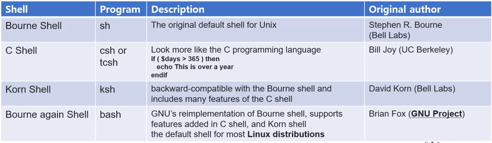
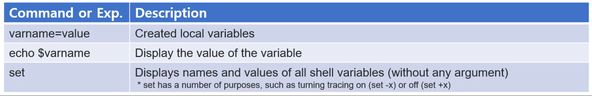
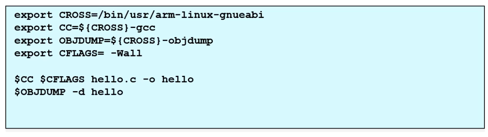
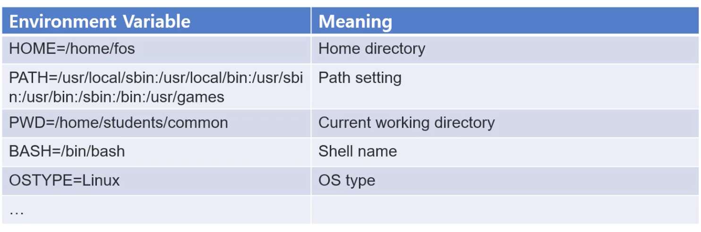
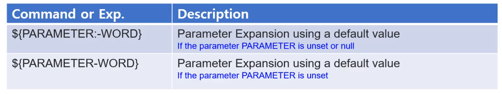
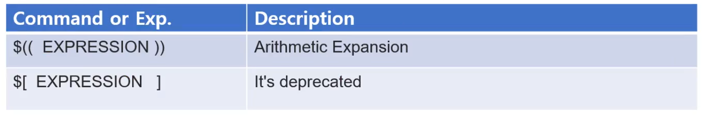
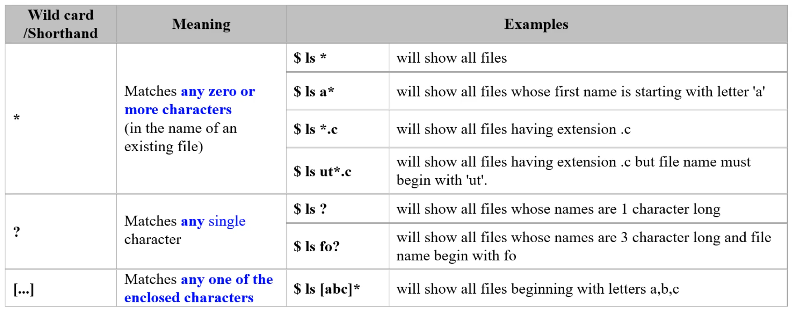
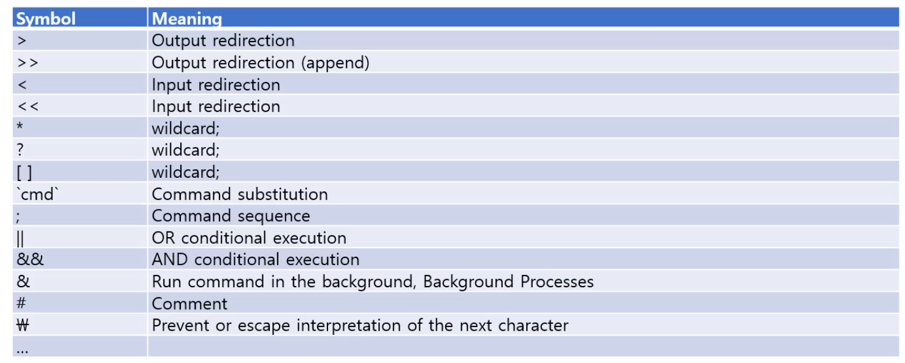

## Shell Environment

Linux 환경에서의 Shell Environment 를 알아보자

- Road map
- Shell
- Bash
- Advantages and Disadvantages
- Shell Variables
- Environment Variables
- Built-in Environment variables


### Terminology

Disk에는 크게 두 가지로 나눌 수 있다. 

1. Kernel: 운영체제의 핵심적인 프로그램, 부팅될 때 제일 먼저 메모리에 로딩된다.
2. Utility: 실행타임 [run-time]에 로딩된다. 프로그램이다.


test.c 파일을 만들고 그 파일을 컴파일 하면, binary 형태의 실행파일이 존재한다. 

Utility 중에 Shell이 존재한다. Shell 도 on-demand 실행을 한다고 하면 동작을한다.

Shell을 이용해 test.c파일을 컴파일해서 나온 a.out 파일을 넘기면 [./a.out] 

Shell이 fork를 해서 새로운 프로세스를 만들어서 메모리에 a.out을 올려준다.

Shell 도 하나의 Utility인데, **다른 Utility들을 관리하기 위한 Utility이다.**


Shell은 사용자로부터 타입된 커맨드를 읽고, 입력된 커맨드를 Interpret 해서 다른 utility를 실행하도록 커널에 요청한다.

Shell은 중간다리 역할을 하는 것.


### Shell

- Special purpose utility

 

다양한 shell 종류가 존재한다. 위에서 아래로 발전순서이다.

현재 사용하는 **bash** shell은 위에 기능들을 다 포함하고 있는 shell이다.

- Bourn shell은 최초 unix programming을 개발할 때 만들어졌다. Unix의 default 기능들을 사용할 수 있는 Shell이다. Bell Labs의 Stephen R. Bourne가 만듬
- C shell은 C 언어와 비슷한 형식으로 발전시킨 c shell이 있다. Bill Joy가 만들어는데 이분이 그 유명한 vi를 만든분.
- David Korn이 Korn Shell을 만듬. BournShell과 C Shell의 모든 기능을 다 포함하면서 발전시킴
- GNU project에서 Brian Fox 라는 분인 Bourne again Shell을 만듬
  - 현재는 대부분의 기능을 다 포함하고, Linux distribution [ubuntu 등]에서 default shell로 사용된다.


### Bash

$ : prompt라고 한다.

```bash
jaemincho$ whoami
jaemincho
```

Bash는 명령어 -> 결과를 보여주며 사용자와 상호작용을 하는  **CLI [Command Line Interpreter]**라고 한다.

명령어 [command]는 utility가 될 수 있고, 또는 shell 자체 내장 명령어일 수 있다

```bash
jaemincho$ bash --version
GNU bash, version 3.2.57(1)-release (x86_64-apple-darwin20)
Copyright (C) 2007 Free Software Foundation, Inc.
```


### Advantages and Disadvantages

Linux shell에서 실행 가능한 다양한 커맨드들과 묶음으로 shell program을 만들 것인데,

##### Shell Program의 장점 [advantages]

- Easy to Use
  - 여러 존재하는 Utility 들을 조합해서 빠르게 프로토타입으로 만들 수 있다.
- Glue code
  - 다양한 환경에 맞춰서 사용될 수 있다.
  - 자바, C, web 등 서로 상호작용을 하면서 프로그램을 구성하는데 그 중간역할을 Shell이 해줄수있다.
- 자동화 하는데 좋다

##### Disadvantages

- 느리다
  - 불필요하게 새로운 프로세스를 만들고, 통신하는 등 overhead가 존재할 수 있다.
  - 그래서 복잡하거나 성능이 중요한 (complex / performance-sensitive) 프로그램에 적합하지 않다.
- 문법이 컴파일 기반이 아니기 때문에 에러가 발생할 수 있다.
  - rm -rf test * 를 rm -rf test*로 쓰면 모든 파일이 다 지워진다.. 이런 오류 같은거 조심해야한다. 


### Shell Variables

Shell 변수들.

Shell을 포함한 Linux Utility 프로그램들은 수행에 필요한 정보들이 있다.

예를들어)

- 현재 작업 위치 [current working directory]: pwd

  - ```bash
    (base) jojaemin-uiMacBookPro:~ jaemincho$ pwd
    /Users/jaemincho
    ```

- 명령어를 어디서 찾을 것인지: path

- home directory: Home

- 사용자가 변수를 정의할 수 도 있다.

즉, 프로그램 동작 방식에 영향을 미치는 값들의 모임을 Shell variable 이라고 할 수 있다.

Shell에서는 Shell 변수 이름, = , 값들의 쌍으로 정의가 된다. ex) PWD = /home/user/

Shell 변수를 만들고, 사용하고, 해지하고 할 수 있다. 어떤 종류가 있는지 알아보자


##### Environment variable

- shell variable들 중 **자식에게 되물림 되는 변수를** 환경 변수 [environment variable] 이라고 한다.
- 즉 환경변수는, 자식 프로세스에게 전달된다.
  - 부모 프로세스로부터 copy된 shell 변수 = 환경변수
- copy 된다는 것 !
  - 부모 프로세스에게 받은 환경 변수들을 수정을 하면, 부모 프로세스에게는 영향을 끼치지 않는다.
  - 하지만 또 다른 자식 프로세스들에겐 영향을 준다.

##### Built-in environment variable

- Linux는 미리 정의한 환경변수들이 있다. 이것들을 built-in 내장 환경변수라고 한다

- PATH, HOME, PWD 등등이 예시이다.

- 관습적으로 대부분 대문자로 표시한다.

  

환경변수가 아닌 변수들을 **local variable** 이라한다.

- 현재 프로그램/프로세스에만 영향을 주는 변수들 이다.


### Shell Variables: set

shell 변수를 어떻게 만들고 사용하는지에 대해 알아보자

 

Shell 변수를 처음 할당시에 만들어지는데, 

varname=value, 즉 변수 이름과 = 값을 넣으면 값을 할당시에 변수가 만들어진다.

기본적으로 **data type이 정의되있지 않고, 문자열로 취급한다** - untyped script

- vehicle=BUS (OK)
- vehicle =BUS
  - 에러! 공백문자 넣으면 안된다.
  - vehicle: command not found
- Vehicle=TAXI
  - C와 동일하게 대 소문자를 구별한다.
- 변수의 제일 앞글자는 **_ (underscore) 이거나 알파벳만 가능하다 **
  - _my=BUS
  - my=BUS

- **echo $varname**  명령어를 사용해서 그 값을 출력해볼 수 있다.

```bash
(base) jojaemin-uiMacBookPro:~ jaemincho$ vehicle=BUS
(base) jojaemin-uiMacBookPro:~ jaemincho$ Vehicle=TAXI
(base) jojaemin-uiMacBookPro:~ jaemincho$ echo $vehicle
BUS
(base) jojaemin-uiMacBookPro:~ jaemincho$ echo $Vehicle
TAXI
```

Set 명령어: 현재 shell 변수들을 다 출력해주는 명령어이다. 

- shell variable들을 위한 명령어이기도 하지만, 다른용도도 존재한다.


- " " 를 이용해 문자열 출력이 가능하다

```bash
(base) jojaemin-uiMacBookPro:~ jaemincho$ myname=JAEMIN
(base) jojaemin-uiMacBookPro:~ jaemincho$ echo $myname
JAEMIN
(base) jojaemin-uiMacBookPro:~ jaemincho$ echo "my name is $myname"
my name is JAEMIN
```

${변수명} 또는 $변수명 으로 값을 참조되서 출력되는데 이를 **변수 치환이라 한다.**


### Shell Variables: unset

만든 변수를 해지, 삭제 하는 방법 ! unset

unset varname: remove shell variable

```bash
jaemincho@jojaemin-uiMacBookPro 노트 % My=JAEMIN
jaemincho@jojaemin-uiMacBookPro 노트 % echo $My
JAEMIN
jaemincho@jojaemin-uiMacBookPro 노트 % set | grep My
My=JAEMIN
jaemincho@jojaemin-uiMacBookPro 노트 % unset My
jaemincho@jojaemin-uiMacBookPro 노트 % echo $My
jaemincho@jojaemin-uiMacBookPro 노트 % set | grep My
```

- grep이라는 명령어는 입력받은 특정한 문자를 찾는 것 !
- 즉 Set으로 모든 변수들 중 grep My로 My를 찾는다.


### Example Codes

```bash
% myname=JaeMin
% myNo=01011112222
% _my=
% set | grep my
_my=''
myNo=01011112222
myname=JaeMin
% type more # more는 프로그램, type을 써서 어디에 있는 유틸리티인지 확인할 수 있다.
more is /usr/bin/more
% type -p grep
grep is /usr/bin/grep

% unset myname
% unset myNo
% unset _my
% echo | grep my
```


### Environment Variables: export and env

지금까지는 일반 쉘 변수들이었다. 그 중에서도 부모로부터 물려받은 shell variables을 환경변수라한다.

- 일반 shell variable을 **export** 명령어를 통해 환경변수로 만들 수 있다.

  - export varname=value
  - 환경변수로 관리가 된다.

- set으로 모든 쉘 변수를 확인할 수 있는데, env (= printenv)는 환경변수만 보여준다

  - ```bash
    % export myName=JaeMin
    % printenv
    PWD=/Users/jaemincho/Desktop/JaeMinCho/4-2/오픈소스 S:W/노트
    OLDPWD=/Users/jaemincho/Desktop/JaeMinCho/4-2/오픈소스 S:W
    myName=JaeMin # 내가만든 환경변수가 요기잉네
    ```

- 만들어진 변수를 export 할 수도 있고, export 와 생성을 동시에 할 수 도있다.

환경변수를 다시 일반변수로 만들수도있다 !

**환경변수의 특성은, **

- Shell variable은 현재 process만 영향을
- 환경변수는 **자식들에게 영향을 준다**


#### Environment Variable과 일반 변수의 차이점

- Shell 변수 중 자식 프로세스에게 전달되는 변수 : 환경변수

```python
jaemincho@jojaemin-uiMacBookPro 노트 % no1=10
jaemincho@jojaemin-uiMacBookPro 노트 % no2=20    
jaemincho@jojaemin-uiMacBookPro 노트 % export no2
jaemincho@jojaemin-uiMacBookPro 노트 % echo $no1, $no2
10, 20
jaemincho@jojaemin-uiMacBookPro 노트 % bash
# 새로운 bash 실행
The default interactive shell is now zsh.
To update your account to use zsh, please run `chsh -s /bin/zsh`.
For more details, please visit https://support.apple.com/kb/HT208050.
bash-3.2$ echo $no1, $no2 # no2는 환경변수 값이 있지만, no1은 없다
, 20
bash-3.2$ exit
exit
jaemincho@jojaemin-uiMacBookPro 노트 % echo $no1, $no2
10, 20
```


그렇다면 환경변수를 다시 일반 변수로 만들고자 한다면?

```bash
$ export no1=10
$ export -n no1
```

- export -n varname
  - 다시 local variable [일반 변수] 로 바꾸어줄 수 있다.


#### Make

 

- $gcc 라고 생각하지만, 리눅스 환경에 따라 gcc compiler는 버전이 여러가지일 수 있다.
- 실제 make file에서는 약속된 경로를 지정하고 거기있는 gcc를 사용하겠다는 약속을 한다.


### Built-in Environment Variables

- 리눅스가 미리 정의한 환경변수들 ! = 내장 환경변수
- $ env 로 환경변수들 중 우리가 정의하지 않은것들
- 관습적으로 대문자로 표시

 


#### $PATH 환경변수

- 명령어를 쉘에서 입력할때 명령어를 찾는데 도움을 준다
- Shell이 명령어 들의 위치를 찾는 디렉토리 리스트를 값으로 갖고있다.

```bash
% echo $PATH
/Library/Frameworks/Python.framework/Versions/3.8/bin:/usr/local/bin:/usr/bin:/bin:/usr/sbin:/sbin
```

#### $HOME 

- echo $HOME

  ```bash
   % echo $HOME
  /Users/jaemincho
  ```

- 현재 설정된 home directory를 갖고있다.

- 추가된 환경 변수들은 터미널이 종료되면 다 사라지는데, 영구적으로 변경내역들을 보존하고싶다면, ~/.bashrc 에 수정해야한다.


## Command Expansions and Substitutions

> 명령어의 확장과 치환 
>
> Linux Prompt에서 명령어를 작성하고 엔터를 치면, 그 문자열이 그대로 실행되는게 아닌, bash가 변환과정을 거친다.
>
> 그때 확장과 치환 과정을 거친다

- Expansions and Substitution
  - Brace Expansion
  - Tilde Expansion
  - Parameter Expansion (Variable Substitution)
  - Command Substitution
  - Filename expansion
- Quoting rules
  - Metacharacters
  - Escape Character
  - Single Quote
  - Double Quote


1. **어떠한 종류의 확정과 치환이 있는지 확인하고** 

2. 확장과 치환의 순서에따른 결과가 다르게 나올 수 있다. 이 순서를 파악해보자.
3. Quoting Rules을 이해해보자


### Expansions and Substitution

리눅스에서 명령어를 입력하면, bash/shell이 그 command line을 **tokenize하고 scan한다**

특별한 원소가 포함되어있는지 찾아본다. 특별한 원소란

- keyword 들
- metacharacter 들

그 role에 맞게끔 변경을해서 새로운 string으로 변환한다.

**이러한 과정을 expand 또는 substitue** 된다고하고, 때론 둘이 혼용된다.


#### 확장과 치환의 순서

- Brace expansion
  - {}
- Tilde expansion
  - ~
  - HOME Directory
- Parameter expansion (Variable substitution)
  - ${varname}
- Arithmetic Expansion
  - 수식
- Comman substitution
  - 명령어
- Filename expansion (globbing)
  - ls * 
  - metacharacter 들을 와일드카드 expansion 또는 Filename expansion 등이라 부른다.
  - GNU-bash referece 기준으로 filename expansion


이 순서대로 이루어진다.


### Brace Expansion: {}

확장과 치환 과정중 제일 먼저 일어나는 일.

e.g. echo b{ed,olt,ar}s 등 앞 뒤로 **prefix와 suffix를 사용해서 문자열들을 조합해서 확장할 수 있는 기능을 제공한다**

```bash
$ echo a{AA,BB}b
aAAb aBBb
$ echo {1, 2}
1 2
```

brace {}를 기준으로 문자열이 확장된다. 보통은 앞 뒤로 글자를 붙혀서 원하는 패턴을 만들 수 있음

* 단일항목의 경우 확장이 일어나지 않는다

  ```bash
  $ echo {1}
  {1}
  ```

* 공백문자가 있으면 확장이 일어나지 않는다.

  ```bash
  $ echo a{aa,bb}b
  aaab abbb
  $ echo a{aa, bb}b # 공백문자!
  a{aa, bb}b
  ```


카테시안 곱 형식등으로도 활용할 수 있다.

```bash
$ echo test{1,2}.{c,h}
test1.c test1.h test2.c test2.h

echo test{1,2,3}.{c,h}
test1.c test1.h test2.c test2.h test3.c test3.h
```

Brace expansion에서 .. 를 활용하기도 하는데 이건 range를 표현한다.

```bash
$ echo {5..12}
5 6 7 8 9 10 11 12

$ echo {c..k}
c d e f g h i j k

$ echo {5..k} # startpoint와 endpoint가 불일치하면 수행되지 않는다.
{5..k}
```

연달아 .. 가 나오면 increment가 된다! 

```bash
$ echo {1..10..2}
1 3 5 7 9
(base) jojaemin-uiMacBookPro:~ jaemincho$ echo {a..z..3}}
a d g j m p s v y
```

이런것을 sequence expression이라고 한다.


```bash
$ echo {A..Z}{0..9} # 26 * 10 의 데이터를 한 번에 !
A0 A1 A2 A3 A4 A5 A6 A7 A8 A9 B0 B1 B2 B3 B4 B5 B6 B7 B8 B9 C0 C1 C2 C3 C4 C5 C6 C7 C8 C9 D0 D1 D2 D3 D4 D5 D6 D7 D8 D9 E0 E1 E2 E3 E4 E5 E6 E7 E8 E9 F0 F1 F2 F3 F4 F5 F6 F7 F8 F9 G0 G1 G2 G3 G4 G5 G6 G7 G8 G9 H0 H1 H2 H3 H4 H5 H6 H7 H8 H9 I0 I1 I2 I3 I4 I5 I6 I7 I8 I9 J0 J1 J2 J3 J4 J5 J6 J7 J8 J9 K0 K1 K2 K3 K4 K5 K6 K7 K8 K9 L0 L1 L2 L3 L4 L5 L6 L7 L8 L9 M0 M1 M2 M3 M4 M5 M6 M7 M8 M9 N0 N1 N2 N3 N4 N5 N6 N7 N8 N9 O0 O1 O2 O3 O4 O5 O6 O7 O8 O9 P0 P1 P2 P3 P4 P5 P6 P7 P8 P9 Q0 Q1 Q2 Q3 Q4 Q5 Q6 Q7 Q8 Q9 R0 R1 R2 R3 R4 R5 R6 R7 R8 R9 S0 S1 S2 S3 S4 S5 S6 S7 S8 S9 T0 T1 T2 T3 T4 T5 T6 T7 T8 T9 U0 U1 U2 U3 U4 U5 U6 U7 U8 U9 V0 V1 V2 V3 V4 V5 V6 V7 V8 V9 W0 W1 W2 W3 W4 W5 W6 W7 W8 W9 X0 X1 X2 X3 X4 X5 X6 X7 X8 X9 Y0 Y1 Y2 Y3 Y4 Y5 Y6 Y7 Y8 Y9 Z0 Z1 Z2 Z3 Z4 Z5 Z6 Z7 Z8 Z9
$ echo {{A..Z},{a..z}}
A B C D E F G H I J K L M N O P Q R S T U V W X Y Z a b c d e f g h i j k l m n o p q r s t u v w x y z
```


**Brace Expansion은 제일 먼저 일어나기 때문에 생각을 잘 해보장**

```bash
$ A=foo
$ echo {1,2}$A
1foo 2foo
$ echo $A{1,2}
null
```

- echo {1,2}$A 에서 brace expansion과 parameter expansion이 존재한다 [$A가 parameter expansion]
- brace expansion이 우선이기 때문에, 1$A, 2$A로 brace expansion되고
- 그 다음 parameter expansion을 통해 $A 가 foo로 바뀌면서 1foo 2foo가 된것
- $A{1,2}같은 경우에는 먼저 brace expansion해서 $A1, $A2이고 이때 parameter expansion을 하기위해 A1을 찾지만 없어서 null이다 !! 


**Brace Expansion 예제**

```bash
$ echo {1,2}
1 2
$ echo {1, 2}
{1, 2}
$ echo ab{1,2,3}cd
ab1cd ab2cd ab3cd
$ echo test{1,2}.{c,h}
test1.c test1.h test2.c test2.h
$ touch test{1,2,3}.{c,h,o} # touch는 파일 생성
$ ls
test2.c
test2.h
test2.o
test3.c
test3.h
test1.c				test3.o
test1.h				무제 폴더
test1.o

```


### Tilde Expansion [~]

Brace 확장이 끝나면, Tilde 확장으로 간다

```bash
$ echo ~
/Users/jaemincho
```

~: home directory의 환경변수  $HOME

~+: current working directory pwd $PWD

~-:  previous working directory $OLDPWD

```bash
jaemincho@jojaemin-uiMacBookPro ~ $ cd Desktop 
jaemincho@jojaemin-uiMacBookPro Desktop $ echo ~-
/Users/jaemincho
jaemincho@jojaemin-uiMacBookPro Desktop $ echo ~+
/Users/jaemincho/Desktop
jaemincho@jojaemin-uiMacBookPro Desktop $ echo ~
/Users/jaemincho
```


### Parameter Expansion (Variable Substitution): $parameter or ${parameter}

$ 변수명을 주면 해당 변수의 value로 치환된다 

$parameter or ${parameter}

```bash
$ echo My home directory is $HOME
My home directory is /Users/jaemincho
```

bash 가 brace expansion -> tilde expansion 후 parameter expansion을 가서 $HOME을 값으로 치환해준다.

shell 이 변환시켜서 전달한거!

```bash
$ your_id=${USER}-on-${HOSTNAME}
$ echo $your_id

$ OSS=2113
jaemincho-on-jojaemin-uiMacBookPro.local
$ echo "CSE$OSSCourse"
CSE

$ echo "CSE${OSS}Course"
CSE2113Course

```

- $OSSCourse는 null~ 그럴때 braces {}를 쓴다


Parameter expansion에서 변수 ${}가 unset이거나, null 일 수 도있다. 그래서 **default 값을 지정할 수 있다.**



- ${Parameter:-디폴트 값}
  - 파라미터 변수로 치환, unset이거나 
  - 없으면(null) default로 !
- ${Parameter-default}
  - : 가 없으면 unset일 때만 !

```bash
$ OSS=2113
$ echo ${OSS:-2114}
2113
$ echo ${OSS-2114}
2113
$ unset OSS
$ echo ${OSS:-2114} 
2114
$ echo ${OSS-2114}
2114
```


### Command Substitution: $(command) or \`command`

- 명령 치환 !

명령치환은 명령어의 결과물로 확장하는 문법이다.

- $(command-name) 또는 \`command-name` 으로 사용하면 명령치환이 된다
- 명령 실행 결과값이 stdout으로 나와서, pipe으로 연결된다.
  - 일종의 **IPC** 라고 생각할 수 있다.

```bash
$ echo User $(whoami) is on `hostname`
User jaemincho is on jojaemin-uiMacBookPro.local
```

- ${whoami} 는 사용자 계정을 알려주고

중첩되서 쓰는건 괄호형을 쓰는것이 낫다 !

```bash
$ echo $(echo $(ls))
Applications Applications (Parallels) CLionProjects DataGripProjects Desktop Documents Downloads Library Movies Music Parallels Pictures Public PycharmProjects UltData_Serialize eclipse nltk_data
```

```bash
$ echo Today is $(date)
Today is 2021년 12월 11일 토요일 15시 48분 34초 KST
$ echo today is `date +%Y%m%d` 
today is 20211211
```

```bash
$ touch homework-${USER}-$(date +%Y%m%d)
$ ls
homework-jaemincho-20211211
```

- Parameter expansion과 command substitution을 동시에 사용한 경우 ~

```bash
$ echo "Today is $(date;cal)"
Today is 2021년 12월 11일 토요일 15시 51분 42초 KST
      12월 2021        
일 월 화 수 목 금 토  
          1  2  3  4  
 5  6  7  8  9 10 11  
12 13 14 15 16 17 18  
19 20 21 22 23 24 25 
```


### Arithmetic Expansion: $((Expression))

 

- $((expression)): 안에 expression을 evaluate하고 expansion해서 문자열로 출력한다 !
  - 만약 expression이 valid하지 않으면 에러발생한다
- $[expression]은 legacy, deprecate됐음

```bash
$ a=10
$ b=20
$ c=a+b  #기본 문자열로 된다.
$ echo $a $b $c
10 20 a+b


$ c=$((a+b)) #산술연산을 하고싶다면 ! a + b의 산술연산을 하고 문자열로 변환해서 c에 들어간다 
$ echo $a $b $c
10 20 30
```

- 주의할점은 $((expression)) 에서 Expression에는 **$가 없어도 변수로 취급한다 !!**

```bash
$ a=10
$ b=20
$ c=$((a+b))
$ d=$((c=a**2))
$ echo $a $b $c $d
10 20 100 100

$ expr a + $((b+3)) # a 가 $가 아니면 문자열로 취급해서 에러가난다
expr: not a decimal number: 'a'

$ expr $a + $((b+3))
33
```


### Expansion Substitution Using $

- $ 를 이용한 expansion과 substitution

>  Brace Expansion --> Tilde Expansion 후 나온 세 가지 확장을 정리해보자

| ${}: Parameter Expansion        | $AA, ${AA}, ${AA:-4} |
| :------------------------------ | -------------------- |
| **$(()): Arithmetic Expansion** | **$((1+2))**         |
| **$(): Command Substitution**   | **$(date;cal)**      |

**세 가지는 동시에 일어나면서 왼쪽에서 오른쪽으로 (left-to-right) 수행된다** 

```bash
# Command Substitution
$ NOW=$(date +%Y%m%d) # command를 실행하고 문자열이 NOW에 들어간다
# Parameter Expansion
$ echo ${NOW:-20211231} # unset이거나 null이면
20211211

$ x=5
$ y=10
# Arithmetic Expansion
$ ans=$((x+y))
$ echo "$x + $y = $ans"
5 + 10 = 15
$ echo $x $((x++)) $x # left - to - right
5 5 6
$ echo $x $((--x)) $x
6 5 5
```


### Filename Expansion

- Wildcards (a.k.a glob)

  - special character
  - 존재하는 파일 이름에서 패턴을 표현하기 위한 special character
  - *, ?, [...] 등이 존재한다

   

  - *: current woring directory (PWD)에서 0개 이상의 문자열과 매칭되는 **파일 이름들**로 문자열이 확장된다

    - $ ls *

      ```bash
      $ ls *
      Shell.md
      Thumbs.db
      desktop.ini
      Computer-Science-master:
      Git Branch.md	NumPy(I).md	OSS.md		Pandas(III).md	Shell.md
      Git.md		NumPy(II).md	Pandas(I).md	Python.md	readmeImg
      GitHub.md	OSS Tools.md	Pandas(II).md	README.md
      ```

    - $ ls a*

      - a로 시작하면서 0개 이상의 문자열을 다 출력 

      ```bash
      $ ls C*
      Git Branch.md	NumPy(I).md	OSS.md		Pandas(III).md	Shell.md
      Git.md		NumPy(II).md	Pandas(I).md	Python.md	readmeImg
      GitHub.md	OSS Tools.md	Pandas(II).md	README.md
      ```

    - $ ls *.c

      - .c로 끝나느 파일 전체 문자열 출력

      ```bash
      $ PWD
      /Users/jaemincho/Desktop/Computer-Science-master
      $ ls *.md
      Git Branch.md	NumPy(I).md	OSS.md		Pandas(III).md	Shell.md
      Git.md		NumPy(II).md	Pandas(I).md	Python.md
      GitHub.md	OSS Tools.md	Pandas(II).md	README.md
      ```

    - $ ls ut*.c

      - ut로 시작하고 .c로 끝나는 모든 파일 문자열 

      ```bash
      $ ls P*.md
      Pandas(I).md	Pandas(II).md	Pandas(III).md	Python.md
      ```

  - ?

    - Single character, 어떤게 와도 좋으나 한 문자로 구성된 파일 이름

    - ls fo?

      - 어떤것이 와도 좋지만 결국 세 글자 foa, fob 등등 ~

      ```bash
      $ ls OS?.md
      OSS.md
      ```

  - [...]

    - ls [abc]*

      - [] 로 둘러쌓인 캐릭터들 중에 하나 아무거나로 시작하면서 모든것

      ```bash
      $ ls [OP]*
      OSS Tools.md	Pandas(I).md	Pandas(III).md
      OSS.md		Pandas(II).md	Python.md
      ```

      - O나 P로 시작하는 파일 아무거나


#### 예제를 통해 알아보자

```bash
$ PWD
/Users/jaemincho/Desktop/test
$ touch test{1..3}.{c,h,o} # brace expansion ~ sequence 또는 comma, chd 9개의 파일
$ ls
test1.c	test1.h	test1.o	test2.c	test2.h	test2.o	test3.c	test3.h	test3.o

$ ls test?.o # ? any single character
test1.o	test2.o	test3.o

$ ls test?.py # 존재안함 ! Filename expansion은 존재하는 파일들중 하나로 확장
ls: test?.py: No such file or directory # 즉 에러

$ ls *.[ch] # c또는 h로 끝나는 파일들
test1.c	test1.h	test2.c	test2.h	test3.c	test3.h

$ ls *.[^ch] # c,h를 제외 !!^를 이용한다
test1.o	test2.o	test3.o
```


- Filename expansion은 **brace expansion 보다 후에 계산된다**

```bash
$ ls test?.[c-o] # ?와 []는 wildcard 
test1.c	test1.h	test1.o	test2.c	test2.h	test2.o	test3.c	test3.h	test3.o

$ ls test?.{c..o} # ?는 wildcard고 {c..o}는 brace expansion.
ls: test?.d: No such file or directory
ls: test?.e: No such file or directory
ls: test?.f: No such file or directory
ls: test?.g: No such file or directory
ls: test?.i: No such file or directory
ls: test?.j: No such file or directory
ls: test?.k: No such file or directory
ls: test?.l: No such file or directory
ls: test?.m: No such file or directory
ls: test?.n: No such file or directory
test1.c	test1.h	test1.o	test2.c	test2.h	test2.o	test3.c	test3.h	test3.o
```

- {c..o}는 brace expansion으로 먼저 저장된다.
  - 그래서 test?.c , test?.d 등 을 찾고 나서 test?.c는 있지만 test?.d는 없어서 안되는 것 !


#### Quiz - wildcard

|           | oss1.py | fork.c | _oss1.py | My_test.txt | osstest.py |
| --------- | ------- | ------ | -------- | ----------- | ---------- |
| ls oss*   | O       | -      | -        | -           | O          |
| ls \*_*   | -       | -      | O        | O           | -          |
| ls ?o??.* | -       | O      | -        | -           | -          |
| ls [a-z]* | O       | O      | -        | -           | O          |
| ls *t     | -       | -      | -        | O           | -          |

```bash
$ ls
My_test.txt	_oss1.py	fork.c		oss1.py		osstest.py
$ ls oss*
oss1.py		osstest.py
$ ls *_*
My_test.txt	_oss1.py
$ ls ?o??.*
fork.c
$ ls [a-z]*
fork.c		oss1.py		osstest.py
$ ls *t
My_test.txt
$ ls ?o???.*
_oss1.py
```


### Metacharacters

> 지금까지 shell의 확장과 치환에 대해서 알아봤다.

 

- shell은 다양한 확장 기능을 제공하기 위해 일부 문자들에 대한 특수 기능을 정의해놓았고, 이들을 **metacharacter 라고 한다**

- Meta: 추상화된 상위데이터에 보통 메타라는 말을 쓴다


### Quotes

> metacharacter 들에대한 스페셜한 특수 기능을 없애기위해 " " quotes를 사용한다.
>
> " " 는 double quote
>
> ' ' 는 single quote
>
> 일반적인 프로그래밍 언어에서 " "는 문자열 처리로 사용되는데, shell에서는 기본적으로 문자열이기 때문에 " "와 ' '가 동일하다 

```bash
$ a=11
$ b='22'
$ c="33" 
$ echo $a $b $c $((a+b+c))
11 22 33 66
```

이런식으로 기본 문자열 처리이기 때문에 " "나 ' '를 사용하던 안사용하던 똑같은 상황이 존재한다

그럼 언제 사용할까 ?

```bash
$ ls hello world
ls: hello: No such file or directory
ls: world: No such file or directory
$ ls "hello world"
ls: hello world: No such file or directory
```

- ls hello world의 경우 공백문자가 있다. 그런경우 hello, world 의 두개의 서로 다른 인자가 ls 에게 전달되는거.
- 공백문자도 특수한 캐릭터 metacharacter 이기 때문에
- "hello world" 로 하나의 문자열로 묶어서 인자로 전달한다.

```bash
$ ls oss*.py
oss1.py		osstest.py
$ ls "oss*.py" # 만약 정말 oss*.py라는 파일이 존재한다면 !?
ls: oss*.py: No such file or directory
```

- *의 특수한 목적을 사라지게 하고 실제 문자열 값을 사용하도록 한다.


리눅스에서는 single quote (' ')와 double quote (" ")가 조금 다르게 동작한다. 잘 구분해보자 - quoting rules


### Quoting rules

- 미리 정의된 character들 (e.g. metacharacters) 의 의미를 없애고, bypass하도록
- Bash에서는 세 가지를 제공한다
  1. Escape character
     - \
       - \\*하면 *의 의미가 사라진다
  2. Single quote
     - ' '
  3. Double quote
     - " "
     - 거의 대부분 없애지만 **예외가 존재한다.**


#### Escape Character

- ₩ (backslash)

  ```bash
  $ touch test{1..3}.py # brace expansion을 통해 세 개의 파일을 만듬
  $ ls
  test1.py	test2.py	test3.py
  $ touch * # 이미 존재하기 때문에 생성되지는 않고 timestamp를 현재 시간으로 바꿈
  $ ls
  test1.py	test2.py	test3.py
  $ touch \* # \ 를 이용해 * (wildcard)의 의미를 없앰 그래서 생성함
  $ ls
  *		test1.py	test2.py	test3.py
  $ ls
  *		test1.py	test2.py	test3.py
  $ touch test?.py
  $ ls
  *		test1.py	test2.py	test3.py
  $ touch test\?.py # ? (wildcard)의 의미를 없애서 test?.py가 생성된다
  $ ls
  *		test1.py	test2.py	test3.py	test?.py
  $ echo \$USER # $USER의 변수의 $가 의미가 없어지고 문자열로 
  $USER
  ```


### Single Quote (' ') and Double Quote (" ")

#### Single Quote: Strong quote

- ' ' 사이에 모든 내용을 bypass 한다 !
- 모두 special 기능이 사라진다

#### Double Quote: Weak quote

- " " 사이에 의미를 bypass 해주지만 **예외가 존재한다**

- Parameter Expansion, command substitution은 bypass하지 못한다

  - ```bash
    $ echo 'Path is $PATH' # single quote는 모두 bypass
    Path is $PATH
    $ echo "Path is $PATH" # parameter expension은 bypass 못한다
    Path is /opt/anaconda3/bin:/opt/anaconda3/condabin:/usr/local/bin:/usr/bin:/bin:/usr/sbin:/sbin
    
    $ echo 'Today is $(date)'
    Today is $(date)
    $ echo "Today is $(date)" # 명령 치환 (command expension)은 bypass 못한다
    Today is 2021년 12월 11일 토요일 17시 24분 17초 KST
    ```


#### 예제

```bash
$ touch this is a $USER
$ ls
a		is		jaemincho	this

$ touch 'this is a $USER'
$ ls
a		is		jaemincho	this		this is a $USER

$ touch "this is a $USER"
$ ls
a			jaemincho		this is a $USER
is			this			this is a jaemincho
```


