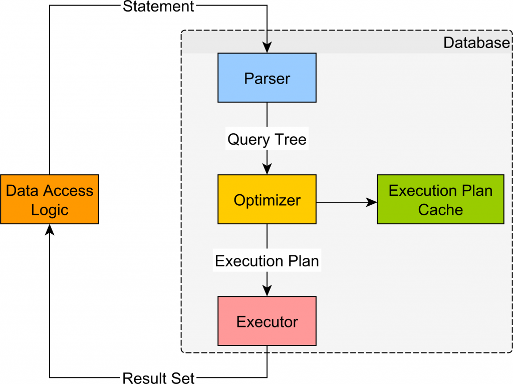
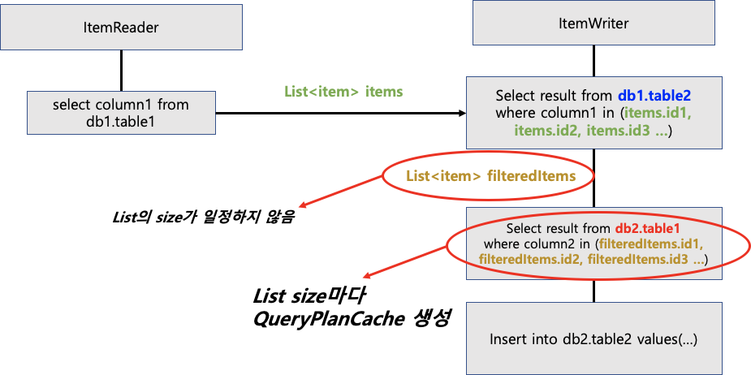
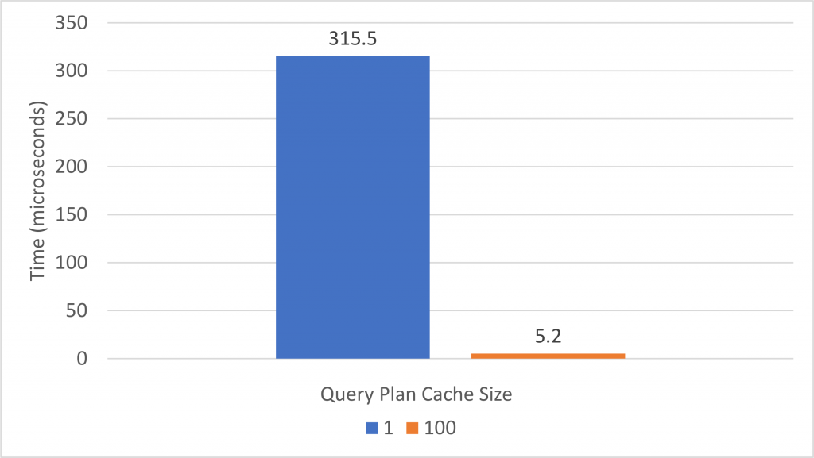
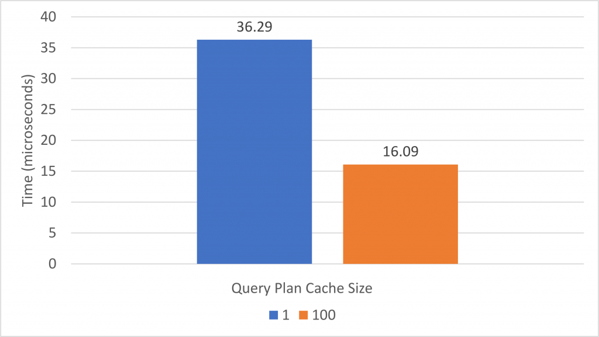

# Hibernate Query Plan Cache

Hibernate의 Query Plan Cache란 무엇일까

> 모든 JPQL query 또는 Criteria query 들은, 실제 수행되기 전 compile 되어야한다 (정확히는 AST [Abstract Syntax Tree, 추상 구문 트리]를 선탐색한다. 이를 통해 SQL Statement 가 생성된다. 
> 
> 이러한 과정 (query compilation)은 꽤나 많은 자원 및 소요 시간을 요구하는데, Hibernate에서는 이를 위해 *Query Plan Cache* 를 제공한다.
> 
> - 즉, 빠른 수행을 위해 (컴파일 시간을 단축시키기 위해) 사용된다.
> 
> 모든 query 수행 전 Hibernate은 첫 번째로 plan cache를 탐색한다. 만약 존재하지 않는다면 새로운 plan 을 생성하고 이를 execution plan 에 저장하여 이후에도 사용할 수 있도록한다.

##### Abstract Syntax Tree in Hibernate

Hibernate 내부에서는 어떤식으로 추상 구문 트리를 검색하는지 알아보자.

- 못찾겠다 누군가는 알려줄 수 있을까



## Configuration

Query Plan cache 설정은 두 가지 Property로 조작할 수 있다.

1. *hibernate.query.plan_cache_max_size*
   
   - plan cache의 최대 query plan 수를 설정한다 default 는 2048

2. *hibernate.query.plan_parameter_metadata_max_size*
   
   - cache 에 저장할 parameter metadata 인스턴스 수를 지정한다 default는 128 개 

여기서 주의해야 할 설정은, 만약 애플리케이션이 설정 된 query plan cache size보다 많은 양의 query를 수행한다면, hibernate이 추가적으로 query compile하는 시간이 소요되면서 결과적으로 query 수행시간이 증가하게된다.

- 즉, 쿼리의 개수가 cache 허용 개수보다 많으면 성능상 issue 가 발생한다.

### Explanation

실제 서비스를 바탕으로 query plan cache가 어떤 역할을 할 수 있는지, 또 추가적인 설정으로 성능 향상을 시키는 방법을 생각해보자.

JPA를 통해 여러가지 parameter 의 select query를 날린다고 가정해보자.



<출처: [JPA Hibernate Plan Cache로 OOM 해결](https://velog.io/@recordsbeat/JPA-hibernate-Plan-Cache%EB%A1%9C-%EC%9D%B8%ED%95%9C-OutOfMemory-%ED%95%B4%EA%B2%B0)>

List<item> filteredItems로 검색을 할 때, size (즉, parameter의 개수)가 일정하지 않아, *select in* (?, ?, ?) 또는 (?, ? , ?, ?, ?) 등을 검색한다면,

**hibernate에서는 각 List 검색마다 QueryPlanCache를 생성한다.**

물론 이러한 query plan cache를 생성하는건 말했다 시피 모든 query 수행 시 마다 작동하긴 한다.

즉, 다음과 같이 작동한다 볼 수 있다.

```sql
select * from db.table1 in (1);
select * from db.table1 in (1, 2);
select * from db.table1 in (1, 2, 3);
select * from db.table1 in (1, 2, 3, 4);
select * from db.table1 in (1, 2, 3, 4, 5);
select * from db.table1 in (1, 2, 3, 4, 5, 6);
----------------------------------
select * from db.table1 in (?);
select * from db.table1 in (?, ?);
select * from db.table1 in (?, ?, ?);
select * from db.table1 in (?, ?, ?, ?);
select * from db.table1 in (?, ?, ?, ?, ?);
select * from db.table1 in (?, ?, ?, ?, ?, ?);
```

만약 6 개의 List<item> parameter size가 있다면, 6개의 **query cache가 메모리에 저장된다.**

100만개의 서로 다른 쿼리를 계속해서 날린다면? 기본 설정 2048을 가볍게 넘어버린다.

하지만 select in 뒤 parameter 개수가 고정이라면?

또는 hibernate 에서는 다음과 같은 설정을 제공한다. 

**'in_clause_parameter_padding'**

이는, 2의 제곱단위로 query를 만들어 주어서, 10000개의 서로다른 쿼리를 10000개가 아닌, 13개 정도로 줄여준다.

다음과 같이 설정한다.

- ```java
  in_clause_parameter_padding=true
  ```

다음과 같이 변경된다고 할 수 있다.

```sql
select * from db.table1 in (1, 1);
select * from db.table1 in (1, 2);
select * from db.table1 in (1, 2, 3, 3);
select * from db.table1 in (1, 2, 3, 4);
select * from db.table1 in (1, 2, 3, 4, 5, 5, 5, 5);
select * from db.table1 in (1, 2, 3, 4, 5, 6, 6, 6);
----------------------------------
select * from db.table1 in (?, ?);
select * from db.table1 in (?, ?, ?, ?);
select * from db.table1 in (?, ?, ?, ?, ?, ?, ?, ?);
```

기존 6개의 query plan cache가 3개로 50% 줄었다. 이는 더 많은 query 개수에 따라 차이가 커질 것.

Hibernate에서 select-in 절에 parameter 크기가 고정적이지 않다면, 사용에 유의하고 이러한 설정이 존재한다는 것을 잘 생각하면서 써야한다.

## Testing

Query Plan Cache의 존재 및 성능상 차이를 알아보자.

예시- [A beginner’s guide to the Hibernate JPQL and Native Query Plan Cache - Vlad Mihalcea](https://vladmihalcea.com/hibernate-query-plan-cache/)

Entity: Post & PostComment

- Post와 PostCommentsms 1:N 관계

```java
@Entity(name = "Post")
@Table(name = "post")
public class Post {

    @Id
    private Long id;

    private String title;

    @OneToMany(
        mappedBy = "post",
        cascade = CascadeType.ALL,
        orphanRemoval = true
    )
    private List<PostComment> comments = new ArrayList<>();

    public void addComment(PostComment comment) {
        comments.add(comment);
        comment.setPost(this);
    }

    //Getters and setters omitted for brevity
}

@Entity(name = "PostComment")
@Table(name = "post_comment")
public class PostComment {

    @Id
    private Long id;

    @ManyToOne(fetch = FetchType.LAZY)
    private Post post;

    private String review;

    //Getters and setters omitted for brevity
}
```

Native Query와 JPQL의 compile 시간을 계산해보자.

```java
protected Query getEntityQuery1(EntityManager entityManager) {
    return entityManager.createQuery("""
        select new
           com.vladmihalcea.book.hpjp.hibernate.fetching.PostCommentSummary(
               p.id, p.title, c.review
           )
        from PostComment c
        join c.post p
        """)
    .setFirstResult(10)
    .setMaxResults(20)
    .setHint(QueryHints.HINT_FETCH_SIZE, 20);
}

protected Query getEntityQuery2(EntityManager entityManager) {
    return entityManager.createQuery("""
        select c
        from PostComment c
        join fetch c.post p
        where p.title like :title
        """
    );
}

protected Query getNativeQuery1(EntityManager entityManager) {
    return entityManager.createNativeQuery("""
        select p.id, p.title, c.review *
        from post_comment c
        join post p on p.id = c.post_id
        """)
    .setFirstResult(10)
    .setMaxResults(20)
    .setHint(QueryHints.HINT_FETCH_SIZE, 20);
}

protected Query getNativeQuery2(EntityManager entityManager) {
    return entityManager.createNativeQuery("""
        select c.*, p.*
        from post_comment c
        join post p on p.id = c.post_id
        where p.title like :title
        """)
    .unwrap(NativeQuery.class)
    .addEntity(PostComment.class)
    .addEntity(Post.class);
}
```

다음과 같이 측정된다.

```java
protected void compileQueries(
        Function<EntityManager, Query> query1,
        Function<EntityManager, Query> query2) {

    LOGGER.info("Warming up");

    doInJPA(entityManager -> {
        for (int i = 0; i < 10000; i++) {
            query1.apply(entityManager);

            query2.apply(entityManager);
        }
    });

    LOGGER.info(
        "Compile queries for plan cache size {}",
        planCacheMaxSize
    );

    doInJPA(entityManager -> {
        for (int i = 0; i < 2500; i++) {
            long startNanos = System.nanoTime();

            query1.apply(entityManager);

            timer.update(
                System.nanoTime() - startNanos,
                TimeUnit.NANOSECONDS
            );

            startNanos = System.nanoTime();

            query2.apply(entityManager);

            timer.update(
                System.nanoTime() - startNanos,
                TimeUnit.NANOSECONDS
            );
        }
    });

    logReporter.report();
}
```

jUnit5를 통한 Test 메소드로 query comile을 수행시킨다.

```java
@Test
public void testEntityQueries() {
    compileQueries(
        this::getEntityQuery1,
        this::getEntityQuery2
    );
}

@Test
public void testNativeQueries() {
    compileQueries(
        this::getNativeQuery1,
        this::getNativeQuery2
    );
}

private final int planCacheMaxSize;

public PlanCacheSizePerformanceTest(
        int planCacheMaxSize) {
    this.planCacheMaxSize = planCacheMaxSize;
}

@Parameterized.Parameters
public static Collection<Integer[]> rdbmsDataSourceProvider() {
    List<Integer[]> planCacheMaxSizes = new ArrayList<>();

    planCacheMaxSizes.add(new Integer[] {1});
    planCacheMaxSizes.add(new Integer[] {100});

    return planCacheMaxSizes;
}

@Override
protected void additionalProperties(
        Properties properties) {
    properties.put(
        "hibernate.query.plan_cache_max_size",
        planCacheMaxSize
    );

    properties.put(
        "hibernate.query.plan_parameter_metadata_max_size",
        planCacheMaxSize
    );
```

plan cache의 size를 두 종류 (1개, 100개) 설정을 하였다.

plan cache size가 1개라면, 각 query 수행 마다 hibernate 에서는 내부적으로 plan cache를 재생산 할 것이다. 100개라면, 테스트 상에서는 저장된 cache를 이용한다.



JPQL에서는 다음과 같은 성능 차이를 보여주었다.

> 이러한 결과를 두고 보면 알 수 있다시피, query plan cache 의 max size 조정이 서비스에서 사용되는 양에 맞게 적절하게 설정해야 함을 보여준다. *(hibernate.query.plan_cache_max_size)*



Native Query 에서의 성능 차이 역시 2 배가 넘게 난다.

> JPQL 만큼은 아니지만, native query 역시 큰 차이를 보인다. 이것만 봐도 
> 
> parameter metadata max size 설정의 중요성을 알 수 있다. *(hibernate.query.plan_parameter_metadata_max_size)*


