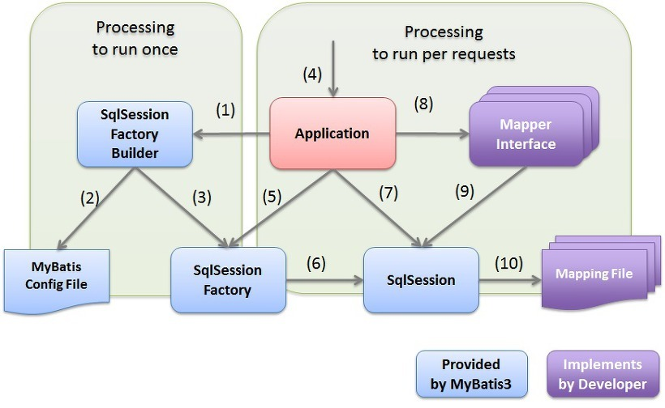
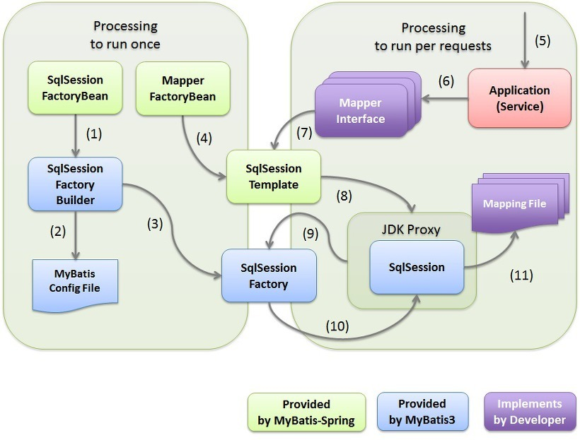

## MyBatis

> 객체 지향 언어, Java 에서 관계형 데이터베이스 프로그래밍을 보다 쉽게 할 수 있도록 도와주는 개발 프레임워크이다.
>
> JDBC를 통해 데이터베이스에 엑세스하는 작업을 **캡슐화**하고, 일반 SQL 쿼리, 저장 프로시져 및 고급 맵필을 지원하며 모든 JDBC 코드 및 매개 변수의 중복작업을 제거한다. 
>
> Mybatis에서는 프로그램에 있는 SQL쿼리들을 한 구성파일에 구성하여 프로그램 코드와 SQL을 분리할 수 있는 장점을 가지고 있다.
>
> 정리하자면, 
>
> - JDBC를 이용한 커넥션 코드 및 변수 등 중복 작업을 대체해준다.
> - SQL, 동적 쿼리, 저장 프로시저 그리고 고급 매핑을 지원하는 SQL Mapper이다.
> - SQL쿼리들을 따로 XML파일로 작성하여 프로그램 코드와 SQL문을 코드관리 용이하다.

### MyBatis 특징

- 복잡한 쿼리나 다이나믹한 쿼리에 강하다 - 반대로 비슷한 쿼리는 남발하게 되는 단점이 있다.
- 프로그램 코드와 SQL 쿼리의 분리로 코드의 간결성 및 유지보수성 향상
- resultType, resultClass등 Vo를 사용하지 않고 조회결과를 사용자 정의 DTO, MAP 등으로 맵핑하여 사용 할 수 있다.
- 빠른 개발이 가능하여 생산성이 향상된다.

- MyBatis-Spring 은 MyBatis에서 MyBatis3와 Spring 연동 라이브러리로 제공된다.
- `싱글톤 패턴으로 스프링 빈(bean)으로 등록하여 주입(DI)하여 쉽게 사용이 가능하다.`
- Mybatis Mapper Interface를 통해 DB에 접근
- 객체 프로퍼티로 파라미터와 결과를 객체(DTO, Map 등)로 자동 매핑을 지원하다.
- 스프링 연동 모듈을 제공해주기 때문에 스프링 설정이 간단하다.
- 트랜잭션을 관리해주기 쉽게 설정이 가능하다.

### MyBatis 구조

 

- MyBatis3의 Database Access 구조 표 이다.
  - 서비스 단에서, Repository (Mapper)를 통해 ORM Mapper MyBatis 3에 접근하고 이는 JDBC의 기본 API들을 이용하여 실제 database에 접근한다.

### 주요 구성 요소 

| 구성 요소 / 구성 파일                              | Description                                                  |
| -------------------------------------------------- | ------------------------------------------------------------ |
| MyBatis configuration file                         | - MyBatis3 작업 설정을 설명하는 XML 파일 - 데이터베이스 연결 대상, 매핑 파일 경로, 작성 설정등 세부 사항을 설명하는 파일. |
| org.apache.ibatis.session.SqlSessionFactoryBuilder | - MyBatis3 구성 파일을 읽고 생성하는 SqlSessionFactory 구성 요소 - 이 구성 요소는 스프링과 통합되어 사용할 때 애플리케이션 클래스에서 직접 처리하지 않는다. |
| org.apache.ibatis.session.SqlSessionFactory        | - SqlSession을 생성하는 구성 요소 - 이 구성 요소는 스프링과 통합되어 사용할 때 애플리케이션 클래스에서 직접 처리하지 않는다. |
| org.apache.ibatis.session.SqlSession               | - SQL 실행 및 트랜잭션 제어를 위한 API를 제공하는 구성 요소입니다. - MyBatis3를 사용하여 데이터베이스에 액세스할 때 **가장 중요한 역할**을 하는 구성 요소입니다. - 이 구성 요소를 스프링과 통합하여 사용할 경우 애플리케이션 클래스에서 직접 처리하지 않는다. |
| Mapper interface                                   | - typeafe에서 매핑 파일에 정의된 SQL을 호출하는 인터페이스입니다. - MyBatis3는 매퍼 인터페이스에 대한 구현 클래스를 자동으로 생성하므로 개발자는 인터페이스만 생성하면 됩니다. |
| Mapping file                                       | - SQL 및 O/R 매핑 설정을 설명하는 XML 파일입니다.            |

### MyBatis

#### (1) ~ (3): 애플리케이션 시작시 수행되는 Process

(1): 애플리케이션이 SqlSessionFactoryBuilder를 위해 SqlSessionFactory를 빌드하도록 요청

(2): SqlSessionFactoryBuilder는 SqlSessionFactory를 생성하기 위한 MyBatis 구성 파일을 읽는다.

(3): SqlSessionFactoryBuilder는 MyBatis 구성 파일의 정에 따라 SqlSessionFactory를 생성한다.

#### (4) ~ (10): 클라이언트의 요청에 따라 수행되는 Process

(4): 클라이언트가 애플리케이션에 어떠한 프로세스를 요청

(5): 애플리케이션은 SqlSessionFactoryBuilder 를 사용하여 빌드된 SqlSessionFactory에서 SqlSession을 가져온다.

(6): SqlSessionFactory는 SqlSession을 생성하고 이를 애플리케이션에 반환한다.

(7): 애플리케이션이 SqlSession에서 Mapper Interface의 구현 객체를 가져온다.

(8): 애플리케이션이 메퍼 인터페이스를 메서드를 호출

(9): Mapper Interface 구현 개체가 SqlSession 메서드를 호출하고 SQL 실행을 요청한다.

(10): SqlSession은 Mapping file에서 실행할 SQL을 가져와 SQL을 실행한다.

### MyBatis-Spring Component Structure

| 구성 요소 / 구성 파일                       | 설명                                                         |
| ------------------------------------------- | ------------------------------------------------------------ |
| org.mybatis.spring.SqlSessionFactoryBean    | - SqlSessionFactory를 작성하고 Spring DI 컨테이너에 개체를 저장하는 구성 요소. - 표준 MyBatis3에서 SqlSessionFactory는 MyBatis 구성 파일에 정의된 정보를 기반으로 합니다. 그러나 SqlSessionFactoryBean을 사용하면 MyBatis 구성 파일이 없어도 SqlSessionFactory를 빌드할 수 있습니다. |
| org.mybatis.spring.mapper.MapperFactoryBean | Singleton Mapper 개체를 만들고 Spring DI 컨테이너에 개체를 저장하는 구성 요소. MyBatis3 표준 메커니즘에 의해 생성된 매퍼 객체는 스레드가 안전하지 않습니다. 따라서 각 스레드에 대한 인스턴스를 할당해야 했습니다. MyBatis-Spring 구성 요소에 의해 생성된 매퍼 개체는 안전한 매퍼 개체를 생성할 수 있습니다. 따라서 서비스 등 싱글톤 구성요소에 DI를 적용할 수 있습니다. |
| org.mybatis.spring.SqlSessionTemplate       | SqlSession 인터페이스를 구현하는 Singleton 버전의 SqlSession 구성 요소. MyBatis3 표준 메커니즘에 의해 생성된 SqlSession 개체가 스레드에 안전하지 않습니다. 따라서 각 스레드에 대한 인스턴스를 할당해야 했습니다. MyBatis-Spring 구성 요소에서 생성된 SqlSession 개체는 안전한 스레드 SqlSession 개체를 생성할 수 있습니다. 따라서 서비스 등 싱글톤 구성요소에 DI를 적용할 수 있습니다. |

#### (1) ~ (4): 애플리케이션 시작시 수행되는 Process

| step | Description                                                  |
| ---- | ------------------------------------------------------------ |
| 1    | SqlSessionFactoryBean은 SqlSessionFactoryBuilder를 위해 SqlSessionFactory를 빌드하도록 요청합니다. |
| 2    | SessionFactoryBuilder는 SqlSessionFactory 생성을 위해 MyBatis 구성 파일을 읽습니다. |
| 3    | SqlSessionFactoryBuilder는 MyBatis 구성 파일의 정의에 따라 SqlSessionFactory를 생성합니다. 따라서 생성된 SqlSessionFactory는 Spring DI 컨테이너에 의해 저장됩니다. |
| 4    | MapperFactoryBean은 안전한 SqlSession(SqlSessionTemplate) 및 스레드 안전 매퍼 개체(Mapper 인터페이스의 프록시 객체)를 생성합니 다. 따라서 생성되는 매퍼 객체는 스프링 DI 컨테이너에 의해 저장되며 서비스 클래스 등에 DI가 적용됩니다. 매퍼 개체는 안전한 SqlSession(SqlSessionTemplate)을 사용하여 스레드 안전 구현을 제공합니다. |

#### (5) ~ (11): 클라이언트의 요청에 대해 수행되는 Process

| step | Description                                                  |
| ---- | ------------------------------------------------------------ |
| 5    | 클라이언트가 응용 프로그램에 대한 프로세스를 요청합니다.     |
| 6    | 애플리케이션(서비스)은 DI 컨테이너에서 주입한 매퍼 개체(매퍼 인터페이스를 구현하는 프록시 개체)의 방법을 호출합니다. |
| 7    | 매퍼 객체는 호출된 메소드에 해당하는 SqlSession (SqlSessionTemplate ) 메서드를 호출합니다. |
| 8    | SqlSession (SqlSessionTemplate )은 프록시 사용 및 안전한 SqlSession 메서드를 호출합니다. |
| 9    | 프록시 사용 및 스레드 안전 SqlSession은 트랜잭션에 할당된 MyBatis3 표준 SqlSession을 사용합니다.  트랜잭션에 할당된 SqlSession이 존재하지 않는 경우 SqlSessionFactory 메서드를 호출하여 표준 MyBatis3의 SqlSession을 가져옵니다. |
| 10   | SqlSessionFactory는 MyBatis3 표준 SqlSession을 반환합니다.  반환된 MyBatis3 표준 SqlSession이 트랜잭션에 할당되기 때문에 동일한 트랜잭션 내에 있는 경우 새 SqlSession을 생성하지 않고 동일한 SqlSession을 사용합니다.on 메서드를 호출하고 SQL 실행을 요청합니다. |
| 11   | MyBatis3 표준 SqlSession은 매핑 파일에서 실행할 SQL을 가져와 실행합니다. |

### References

- https://khj93.tistory.com/entry/MyBatis-MyBatis%EB%9E%80-%EA%B0%9C%EB%85%90-%EB%B0%8F-%ED%95%B5%EC%8B%AC-%EC%A0%95%EB%A6%AC
- https://linked2ev.github.io/mybatis/2019/09/08/MyBatis-1-MyBatis-%EA%B0%9C%EB%85%90-%EB%B0%8F-%EA%B5%AC%EC%A1%B0/