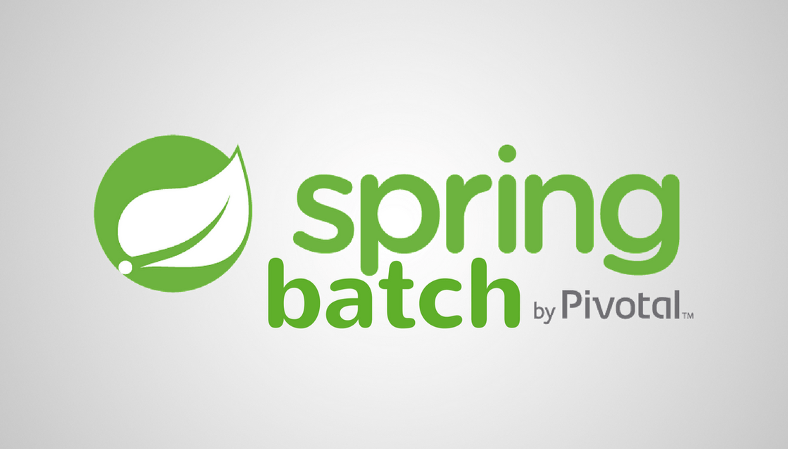
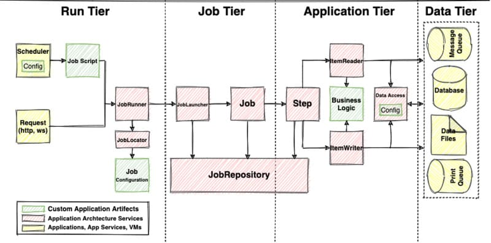
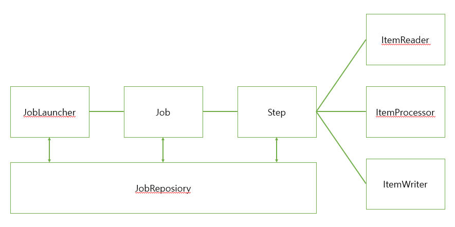
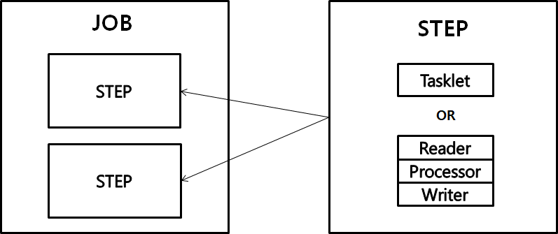
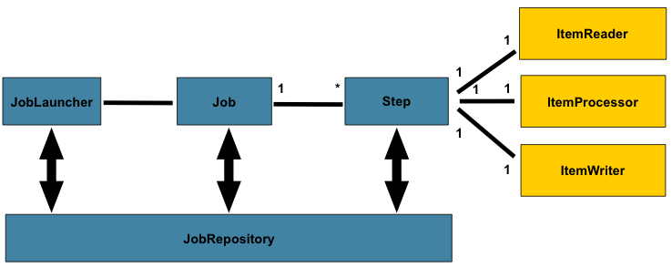
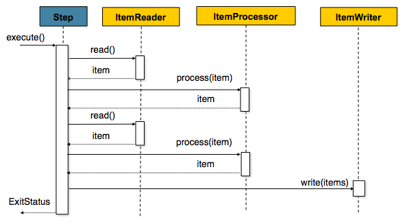

# Spring Batch




[TOC]


## Spring Batch란 무엇인가

배치 프로세싱 (Batch Processing)은 **일괄처리**라는 뜻을 가지고 있다. 일괄처리의 의미는 **일련의 작업을 정해진 로직**으로 수행하는 것이라고 할 수 있다.

Spring Batch는 로깅/추적, 트랜잭션 관리, 작업 처리 통계, 작업 재시작, 건너뛰기, 리소스 관리 등 대용량 레코드 처리에 필수적인 기능을 제공한다. 또한 최적화 및 파티셔닝 기술을 통해 대용량 및 고성능 배치 작업을 가능하게 하는 고급 기술 서비스 및 기능을 제공한다.


이러한 일괄처리가 언제 필요할까?

> 1. 대용량의 비즈니스 데이터를 복잡한 작업으로 처리해야하는 경우
> 2. 특정한 시점에 스케쥴러를 통해 자동화된 작업이 필요한 경우 (ex. 푸시알림, 월 별 리포트)
> 3. 대용량 데이터의 포맷을 변경, 유효성 검사 등의 작업을 트랜잭션 안에서 처리 후 기록해야하는 경우


만약 Spring Batch에서 배치가 실패하여 작업을 재시작한다면?

- 처음부터가 아닌 **실패한 지점부터** 실행을 하게 된다.
  - 예를 들어보자, 어마어마하게 처리해야 할 데이터가 있다. **5만번째에서 실패했다면, 5만 1번째부터 다시 실행**할 수 있다면 얼마나 좋을까? 이게 가능하다.
- 또한, 중복 실행을 막기 위해 **성공한 이력이 있는 Batch는** <u>동일한 Parameter로 실행 시 Exception이 발생된다</u>
  - 예를 들어, 오늘 아침 누군가가 집계 함수를 실행시켰는데, 다른 누군가가 또 실행시켜 집계 데이터가 2배로 뻥튀기 될 수도 있음.
    **같은 파라미터로 같은 함수를 실행할 경우** 이미 실행한 적이 있어 실패하는 기능을 지원한다면 ?  이게 가능.


### Spring Batch vs. Quartz \ Scheduler

우선, Spring Batch는 Scheduler가 아니다 !

Spring Batch에서는 <u>Batch Job</u>을 관리하지만 그 Job을 구동/실행 시키는 기능이 존재하지 않는다.

Spring 에서 Batch Job을 실행시키기 위해서는 Quartz, Scheduler, Jenkins 등, 전용 Scheduler 를 사용해야 한다.


### 왜 Spring Batch를 batch 처리에 쓸까 ?

- 대용량 데이터 처리에 최적화 되어 고성능을 발휘한다.
- 효과적인 로깅, 통계 처리, 트랜잭션 관리 등 재사용 가능한 필수 기능을 지원한다.
- 수동으로 처리하지 않도록 자동화되어 있다.
- 예외사항과 비정상 동작에 대한 방어 기능이 있다.
- 스프링 부트 배치의 반복되는 작업 프로세스를 이해하면 비즈니스 로직에 집중 할 수 있다.


### Spring Batch 사용 <u>주의사항</u>

- 가능하면 **단순화해서** 복잡한 구조/로직을 피해야 한다.
- 배치 처리시 System I/O 사용을 최소화 해야한다.
  - 잦은 I/O 로 인한 데이터베이스 커넥션과 네트워크 비용이 커지면 성능에 영향을 줄 수 있다.
  - 따라서, 가능하면 **한 번에 데이터를 조회해서 메모리에 저장하고 처리한 다음, 그 결과를 또 한 번에 DB에 저장하는것이 좋다.**
- 일반적으로 같은 서비스에 사용되는 웹, API, 배치, 기타 프로젝트들은 서로 영향을 준다. 따라서 배치 처리가 진행되는 동안 다른 프로젝트 요소에 영향을 주는 경우가 없는지 주의를 기울여야한다.
- 스프링 부트 배치는 스케쥴러를 제공하지 않는다. 
  **배치 처리 기능**만 제공하며 스케줄링 기능은 스프링에서 제공하는 쿼츠 프레임워크(Quartz Framework)를 이용해야 한다. 


## Spring Batch Architecture



- *노란색*: **스케쥴러 또는 DB와 같은 <u>외부 애플리케이션</u>을 나타낸다.** 스케쥴링과 Spring Batch는 별도로 고려해야 한다는 것을 잊지말자.
- *빨간색:* <u>애플리케이션 서비스</u> 를 나타낸다. 대부분은 Spring Batch에서 제공하지만, 원한다면 구조에 맞게 디자인 할 수 있다.
- *초록색:* 개발자가 구성해야 할 것들. 예를 들어, 일정한 주기대로 작업이 시작되도록 설정하거나, 작업을 실행하는 방법 등.


1. **Run Tier**: 어플리케이션의 **예약 및 시작**과 관련이 있는 계층. 배치 작업의 시간 기반 및 상호 의존적인 스케줄링을 제공할뿐만 아니라 병렬 처리 기능을 제공한다.
2. **Job Tier**: 배치 작업의 **<u>전체 실행을 담당</u>**합니다. 배치 단계를 순차적으로 실행하여 모든 단계가 올바른 상태에 있고 모든 적절한 정책이 시행 되도록한다.
3. **Application Tier**: 프로그램을 실행하는 데 필요한 구성 요소가 포함되어 있습니다. 이 계층에는 요구된 배치의 기능을 처리하고 Tasklet 실행에 대한 정책을 시행하는 특별한 Tasklet이 포함된다.
4. **Data Tier**: 데이터베이스, 파일 또는 대기열을 포함 할 수있는 물리적 데이터 소스와의 연결을 제공한다.


### Spring Batch Terminology

#### Job

Job은 배치처리 과정을 <u>하나의 단위로 만들어 놓은 객체</u>. 배치처리 과정에 있어 전체 계층의 최상단에 위치하고 있다.

##### Job 객체를 만들기

여러 빌더를 통하하여 처리하는 공장, JobBuilderFactory로 Job을 만들 수 있다.

예제)

```java
public class JobBuilderFactory {
    private JobRepository jobRepository;
 
    public JobBuilderFactory(JobRepository jobRepository) {
        this.jobRepository = jobRepository;
    }
 
    public JobBuilder get(String name) {
        JobBuilder builder = new JobBuilder(name).repository(jobRepository);
        return builder;
    }
}
```

- JobBuilderFactory에는 JobBuilder를 생성할 수 있는 get() 메서드를 포함한다.
- get() 메서드를 호출할 때 마다 새로운 빌더가 생성된다.


#### Job Instance

JobInstance는 Job 의 실행의 **단위.** Job 을 실행시키면 하나의 JobInstance가 생성된다.

예를들어 1월 1일 실행, 1월 2일 실행을 하게 되면 각각의 JobInstance가 생성되며 1월 1일 실행한 JobInstance가 실패하여 다시 실행을 시키더라도 이 JobInstance는 1월 1일에 대한 데이터만 처리하게 된다.


#### JobParameters

JobInstance (= Job의 실행 단위)를 구별할 때 JobParameter로 구분한다. 또한 JobInstance에 전달되는 매개변수 역할도 한다.

JobInstance는

- String
- Double
- Long
- Date

네 가지 형식만을 지원한다.

##### Spring Batch에서의 Job Parameters

Spring Batch의 경우, **동일 Job Parameter로 실행시** 어떻게 처리할지에 대한 옵션을 준다.

- 해당 파라미터로 최근 실패한 이력이 있다면 이어서 실행할 것인지
- 해당 파라미터로 최근 실패 혹은 성공한 이력이 있다면 실행하지 않을 것인지
- 해당 파라미터로 최근 실행한 이력이 있어도 무시하고 다시 실행할 것인지

동일 Job Parameter로 계속 실행이 되는 방법은 무엇일까?

1. Run Incrementer

   - 동일 파라미터인데 **다시 실행하고 싶을 때** 사용하라는 의미로 run incremeter가 제공된다.

     ```java
     public Job job() {
       return jobBuilderFactory.get(JOB_NAME)
         			.start(step())
         			.incremeter(new RunIncremeter())
         			.build();
     }
     ```

   - 이러면 Job Parameter외에 인자로 run.id 의 임의 parameter를 추가로 사용해 run.id값을 변경하면서 사용한다.

   - 즉, 매 수행마다 run.id가 변경되니 재실행 할 수 있게 되는 것.


#### JobExecution

Job Execution은 Job Instance에 대한 실행 시도에 대한 객체이다. 

예를들어, Job Instance A가 실패하여 재실행을 하여도 동일한 Job Instance를 실행시키지만, 이 두 번의 실행에 대한 Job Execution은 개별로 생긴다.

Job Instance의 다음과 같은 정보를 담고 있다.

- 실행에 대한 상태
- 시작시간 / 종료시간 / 생성시간


#### Step

Step은 Job 의 배치처리르 정의하고 순차적인 단계를 캡슐화 한다. Job은 **최소한 1개 이상의 Step을 가져야 하며,** Job의 실제 일괄 처리를 제어하는 모든 정보가 들어 있다.

> 즉, [Job 1 : N step] 이라 할 수 있다.


#### StepExecution

Step execution은 job execution과 동일하게 Step 에 실행 시도에 대한 객체를 나타낸다.

하지만, Job 이 여러개의 Step으로 구성되어 있다면 (1:N 관계) 이전 단계의 Step이 실패 되었을 때, 다음 단계가 실행되지 않음으로, 실패 이후 Step Execution은 생성되지 않는다.

Step Execution 또한 Job Execution과 동일하게 실제 시작이 될 때만 생성된다. 

StepExecution에는 JobExecution에 저장되는 정보 외에 **read 수, write 수, commit 수, skip 수** 등의 정보들도 저장이 된다.


#### ExecutionContext

Execution context란 Job에서 **데이터를 공유할 수 있는 데이터 저장소이다.**

Spring Batch에서 제공하는 execution context는 두 가지 종류가 있으나, 이 두 가지는 <u>지정되는 범위가 다르다.</u>

1. Job Execution Context
   - Commit 시점에 저장된다.
2. Step Execution Context
   - 실행 사이에 저장된다.

Execution Context를 통해 Step 간 Data 공유가 가능하며 Job 실패시 **Execution Context를 통한 마지막 실행 값을 재구성 할 수 있다.**


#### JobRepository

Job repository는 위에서 말한 모든 배치 처리 정보를 담고있는 **매커니즘이다.**

Job 이 실행되면 -> Job Repository에 **Job Execution & Step Execution**을 생성하며, job repository를 통해 exeuction 정보들을 저장하고 조회하며 사용한다.


#### JobLauncher

Job, Job parameters를 사용하여 Job을 실행하는 객체이다.


#### ItemReader

ItemReader는 **Step에서 Item을 읽어오는** Interface이다. 다양한 인터페이스가 존재하며, Item을 여러가지 방법으로 읽어올 수 있다.


#### ItemWriter

Item Writer는 처리 된 Data를 write 할 때 사용한다. Writer는 처리 결과물에 따라 

- Insert
- Update
- Send (queue 사용)

이 가능하다.

Write역시 reader와 마찬가지로 다양한 인터페이스가 존재한다. 

또한, 기본적으로 Item을 Chunk로 묶어서 처리한다.


#### ItemProcessor

Item Processor는 Reader에서 읽어온 Item을 데이터를 처리하는 역할을 하고 있다. Processor는 배치를 처리하는데 필수 요소는 아니며 Reader, Writer, Processor 처리를 분리하여 각각의 역할을 명확하게 구분하고 있다.


### Read & Processing & Write

1. 읽기(read) : 데이터 저장소(일반적으로 데이터베이스)에서 특정 데이터 레코드를 읽는다.
2. 처리(processing) : 원하는 방식으로 데이터를 가공/처리한다.
3. 쓰기(wirte) : 수정된 데이터를 다시 저장소(데이터베이스)에 저장한다.

읽기 -> 처리 -> 쓰기



앞서 말했다 시피, 

- Job과 Step은 1:N 관계

- Step과 ItemReader, ItemProcessor, ItemWriter는 1:1 관계이다.

즉, Job 하나에 여러 단계 (Step)을 갖고있다.


## Spring Batch Start



Spring Batch에서 Job은 여러가지 Step의 모음으로 구성되어 있으며, Job은 **순차적인 Step을 수행하며 Batch를 수행한다.**

Step은 두 가지

1. Tasklet 처리 방식
2. Chunk 지향 처리 방식

을 지원한다.


### 단일 Step 구성하기

```java
@EnableBatchProcesssing
public class ExampleJobConfig {
  public JobBuilderFactory jobBuilderFactory;
  public StepBuilderFactory stepBuilderFactory;
  
  public ExampleJobConfig (JobBuilderFactory jobBuilderFactory, StepBuilderFactory stepBuilderFactory) {
    this.jobBuilderFactory = jobBuilderFactory;
    this.stepBuilderFactory = stepBuilderFactory;
  }
  
  @Bean
  public Job exampleJob() {
    Job exampleJob = jobBuilderFactory.get("exampleJob")
      																.start(step())
      																.build();
    
    return exampleJob;
  }
  
  @Bean
  public Step step() {
    return stepBuilderFactory.get("step")
      											 .tasklet((contribution, chunkContext) -> {
                               return RepeatStatus.FINISHED;
                             })
      											 .build();
  }
}
```

- ```java
  @Configuration
  ```

  - Spring Batch의 모든 Job은 `@Configuration`으로 등록해서 사용합니다.

- ```
  jobBuilderFactory.get("exampleJob")
  ```

  - `exampleJob` 이란 이름의 Batch Job을 생성합니다.
  - job의 이름은 별도로 지정하지 않고, 이렇게 Builder를 통해 지정합니다.

- ```
  stepBuilderFactory.get("step")
  ```

  - `step` 이란 이름의 Batch Step을 생성합니다.
  - `jobBuilderFactory.get("step")`와 마찬가지로 Builder를 통해 이름을 지정합니다.

- ```
  .tasklet((contribution, chunkContext))
  ```

  - Step 안에서 수행될 기능들을 명시합니다.
  - *Tasklet*은 **Step안에서 단일로 수행될 커스텀한 기능**들을 선언할때 사용합니다.
  - 여기서는 Batch가 수행되면 `RepeatStatus.FINISH` 가 리턴되도록..


#### Job, Step, Tasklet/Reader&Processor&Writer

Batch Job을 생성하는 **exampleJob 코드를 보면 step을 품고 있음**을 알 수 있습니다.
Spring Batch에서 **Job은 하나의 배치 작업 단위**를 얘기한다.
Job 안에는 아래처럼 여러 Step이 존재하고, Step 안에 Tasklet 혹은 Reader & Processor & Writer 묶음이 존재한다.


Job안에 여러 Step이 있다는건 쉽게 이해되지만, Step이 품고 있는 단위가 애매하게 보이실 수 있다.

**Tasklet 하나와 Reader & Processor & Writer 한 묶음이 같은 레벨**입니다.
그래서 **Reader & Processor가 끝나고 Tasklet으로 마무리 짓는 등으로 만들순 없다**는걸 꼭 명심해야한다.

> Tasklet은 어찌보면 Spring MVC의 `@Component`, `@Bean`과 비슷한 역할이라고 보셔도 될 것 같습니다.
> 명확한 역할은 없지만, 개발자가 지정한 커스텀한 기능을 위한 단위로 보시면 됩니다.


### 다중 Step 구성하기

```java
@Configuration
@EnableBatchProcessing
public class ExampleJobConfig {
    @Autowired 
  	public JobBuilderFactory jobBuilderFactory;
    @Autowired 
  	public StepBuilderFactory stepBuilderFactory;

    @Bean
    public Job ExampleJob(){
        Job exampleJob = jobBuilderFactory.get("exampleJob")
                													.start(startStep())
                													.next(nextStep()) // 다중 ! next
          																.next(lastStep()) // 다중 ! next
													                .build();

        return exampleJob;
    }

    @Bean
    public Step startStep() {
        return stepBuilderFactory.get("startStep")
                .tasklet((contribution, chunkContext) -> {
                    log.info("Start Step!");
                    return RepeatStatus.FINISHED;
                })
                .build();
    }

    @Bean
    public Step nextStep(){
        return stepBuilderFactory.get("nextStep")
                .tasklet((contribution, chunkContext) -> {
                    log.info("Next Step!");
                    return RepeatStatus.FINISHED;
                })
                .build();
    }

    @Bean
    public Step lastStep(){
        return stepBuilderFactory.get("lastStep")
                .tasklet((contribution, chunkContext) -> {
                    log.info("Last Step!!");
                    return RepeatStatus.FINISHED;
                })
                .build();
    }
}
```

Job 구성 클래스 외부에 tasklet 클래스를 만들어서 참조하는 방식

1) Step에서 chunk() 대신 tasklet()을 사용하는 것이다.
2) tasklet은 외부 클래스를 만들고 tasklet 작업을 정의한다.
3) tasklet 작업을 정의한 외부 클래스에서는 기본적으로 Tasklet을 implements 받아서 구현을 해야한다. 그에 따라 execute 메서드를 구현해야 한다.
   - execute 메서드 인자 contribution/chunkContext
     - contribution - 현재 단계 실행을 업데이트하기 위해 다시 전달되는 변경 가능한 상태
     - chunkContext - 호출 간에는 공유되지만 재시작 간에는 공유되지 않는 속성


### Tasklet vs. Chunk

Tasklet로는 단순하게 처리할 수 있는 장점이 있으나, 대 용량을 감당하기엔 부하를 감당할 수 없다. 따라서 Chunk를 통해 쪼개서 넣을 필요가 있는데, Tasklet로도 쪼개서 넣을 수 있지만, 가독성에서 떨어지기 때문에 권장하지 않음.
현재 사용하고 있는 실무에서도 대용량은 Chunk를 적극 사용하고 있다.


Tasklet을 사용한 Task 기반 처리

- 배치 처리 과정이 비교적 쉬운 경우 쉽게 사용
- 대량 처리를 하는 경우 더 복잡
- 하나의 큰 덩어리를 여러 덩어리로 나누어 처리하기 부적합

Chunk를 사용한 chunk(덩어리) 기반 처리

- ItemReader, ItemProcessor, ItemWriter의 관계 이해 필요
- 대량 처리를 하는 경우 Tasklet 보다 비교적 쉽게 구현
- 예를 들면 10,000개의 데이터 중 1,000개씩 10개의 덩어리로 수행


### Chunk

Spring Batch에서 Chunk란 '**처리 되는 Commit Row 수**'를 의미한다.

Batch 처리에서 commit 되는 row 수라는건 chunk 단위로 Transaction을 수행한다. 그렇기에 <u>실패 시 chunk 단위 만큼 rollback이 된다.</u>


Chunk 지향 처리에는 다음과 같은 세 가지 시나리오로 실행된다.

1. 읽기 (Read) - DB에서 배치처리할 data를 읽어온다.
2. 처리 (Processing) - 읽어온 Data를 가공, 처리를 한다 (필수 사항은 아니다).
3. 쓰기 (Write) - 가공, 처리 된 데이터를 DB에 저장한다.




위와같다.

Chunk 지향 처리에서 배치가 수행되는 그림.



```java
List items = new Arraylist();
for(int i = 0; i < commitInterval; i++){
    Object item = itemReader.read()
    Object processedItem = itemProcessor.process(item);
    items.add(processedItem);
}
itemWriter.write(items);
```


#### Chunk 를 알아보기에 앞서..

Spring Batch에는 다양한 **ItemReader와 ItemWriter가** 존재한다. 대용량 배치 처리를 하게 되면 Item을 읽어 올 때 Paging 처리를 하는게 효과적이다.

Spring Batch Reader에서는 이러한 Paging 처리를 지원하고 있음. 또한 적절한 Paging처리와 Chunk Size(한번에 처리 될 트랜잭션)를 설정하여 더욱 효과적인 배치 처리를 할 수 있다.


#### Chunk Size

Paging Size와 Chunk Size에는 관계가 있다.

예를들어, <u>Page Size가 5, Chunk Size가 10일 경우</u>  **2 번의 read가 이루어진 후 1 번의 Transaction이 수행된다.**

이는 1 번의 Transaction을 위해 2 번 쿼리 수행이 발생하게 된다.

> **Setting a fairly large page size and using a commit interval that matches the page size should provide better performance.**
>
> **페이지 크기를 상당히 크게 설정하고 페이지 크기와 일치하는 커밋 간격을 사용하면 성능이 향상됩니다.**

- 즉, 한 번의 Read 쿼리 수행 시 1번의 Transaction을 위해 두 설정 값을 일치를 시키는게 가장 좋은 성능 향상 방법이며, <u>특별한 이유가 없는 한 Paging size와 chunk size를 동일하게 설정하는게 좋다.</u>


## References:

1. [Spring Batch란?](https://khj93.tistory.com/entry/Spring-Batch%EB%9E%80-%EC%9D%B4%ED%95%B4%ED%95%98%EA%B3%A0-%EC%82%AC%EC%9A%A9%ED%95%98%EA%B8%B0)
2. [Spring Batch 구조와 구성 요소](https://deeplify.dev/back-end/spring/batch-architecture-and-components)
3. [Spring Batch 가이드](https://jojoldu.tistory.com/325?category=902551)

