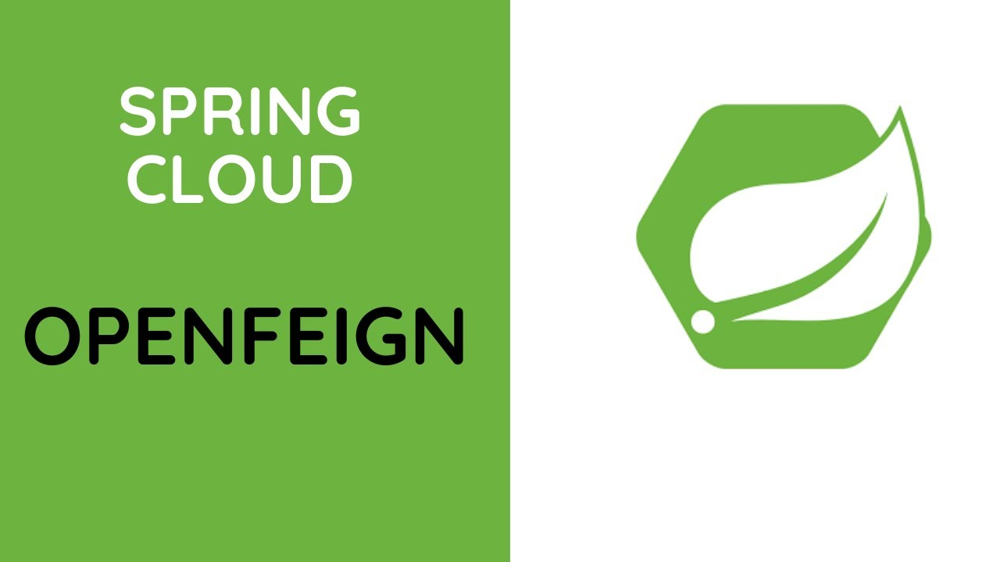
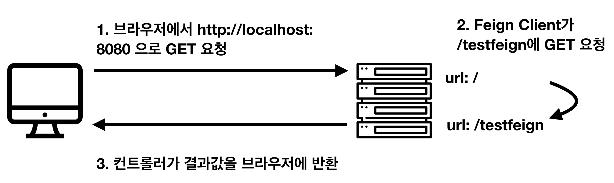

# Spring Cloud - OpenFeign





### Feign

OpenFeign은 Netflix에서 개발된 HTTP client binder이다. 특히, <u>선언적 방식의 Client</u> 인데, 이 선언적 방식이란
Interface와 Annotation (ex. Spring MVC RequestMapping 등...)을 활용해 *구현체를 자동으로 생성해준다* 는 것이다.


### Feign Client 란?

1. Web Service 클라이언트를 **보다 쉽게 작성할 수 있도록 도와준다.**
   - WebService Client ? 
     - RestTemplate (Blocking, Synchronous), WebClient (for Non-blocking, Asynchronous such as WebFlux) 등 이있다.
2. Interface를 작성하고 annotation을 붙히면 세부내용 없이도 사용할 수 있어서 **코드 복잡도가 매우 낮다.**
3. *Netflix*에서 만들고, **spring-cloud-starter-openfeign** 으로 dependency 를 추가할 수 있다.


### Start Using OpenFeign...

Application - main

```java
@EnableFeignClients
@SpringBootApplication
public class OpenFeignApplication {
  	public static void main(String[] args) {
      	SpringApplication.run(OpenFeignApplication.class, args);
    }
}
```

- @EnableFeignClients annotation을 붙힘으로써 OpenFeign을 사용함을 선언한다.
  - 해당 애너테이션을 붙히면, OpenFeignApplication (해당 annotation이 붙은 class) 하위 레벨의 class를 탐색하여 **@FeignClient**가 붙은 **interface**를 찾아 ApplicationContext에 등록한다. 
  - 만약 해당 annotation이 있는 하위폴더에 존재하지 않으면, basePackages or basePackageClasses 속성을 이용해 커스터마이징 해야한다.


```java
@FeignClient(name = "${feign.client.config.bank.name}", url = "${feign.client.config.bank.url}")
public interface BankClient {
    @GetMapping("/balance")
    Balance getBalance();
}
```

```yaml
feign:
	client:
		config:
			bank:
				name: LINEPLUS
				url: https://line.com:8080
```

매우 간단하게 client를 생성할 수 있다. 

- 물론 yml 파일등에서 값을 불러올 필요도 없다. 직접 문자열로 작성해도 된다.


##### 각종 Annotations

- @FeignClient
  - FeignClient라고 선언하는 어노테이션
  - name 속성 : feignClient의 서비스 이름으로 필수 속성, beanName과는 다르다 - spring-cloud 의 eureka 등에서 사용한다.
  - url : 해당 interface baseUrl 이다.
  - qualifier : beanName 이다.
  - configuration : 커스터마이징한 configuration을 넣기 위해 사용 - feign configuration class 지정
  - fallback : Hystrix fallback 메서드


### FeignClient Example

예시를 위해, 한 서버 내에서 feignClient를 이용해 자신의 서버에 http 요청을 보내는것으로 해보자. 즉 Controller 에 두 개의 server endpoint를 정의해보자.




1. ##### Dependency 추가

   ```java
   dependencyManagement {
       imports {
           mavenBom 'org.springframework.cloud:spring-cloud-dependencies:Greenwich.RELEASE'
       }
   }
   
   dependencies {
   //...
       // Feign Client
       compile 'org.springframework.cloud:spring-cloud-starter-openfeign'
   //...
   }
   ```

2. ##### Application.java

   ```java
   @EnableFeignClients // FeignClients를 사용할 것을 명시한다
   @SpringBootApplication
   public class FeignTestApplication {
   	public static void main(String[] args) {
   		SpringApplication.run(FeignTestApplication.class, args);
   	}
   }
   ```

3. ##### Client (interface) 작성

   ```java
   @FeignClient(name="feign", url="http://localhost:8080")
   public interface TestClient {
     
       @GetMapping("/testfeign")
       String testFeign();
     
   }
   ```

4. ##### Service 생성

   feignclient 를 사용하는 service를 만들어보자.

   ```java
   @Service
   public class TestService {
   	private final TestClient testClient; // FeignClient
   	
   	public TestService (TestClient testClient) {
   		this.testClient = testClient;
   	}
     
       public String testFeign() {
           return testClient.testFeign();
       }
   }
   ```

5. ##### Controller 

   ```java
   @RequiredArgsConstructor
   @RestController
   public class TestController {
       private final TestService testService;
     
       @GetMapping("/")
       public String main() {
           return testService.testFeign();
       }
   
       @GetMapping("/testfeign")
       public String testFeign() {
           return "Test FeignClient !";
       }
   }
   ```

   - http://localhost:8080 으로 접속했을 때, service에서 feignClient를 이용해 자신의 서버 /testfeign endpoint로 http request를 요청한다. 
   - return 값은 String


매우매우 간단한 예시... 다만 얼마나 FeignClient가 RestTemplate 보다 편리하게 사용할 수 있는지를 볼 수 있다.


### Feign Configuration

FeignClient에는 기본으로 제공하는 configuration이 존재한다. 그렇기에 별도의 configuration 없이도 위 예제와 같이 바로 사용이 가능하다.

기본 configuration은 *FeignClientsConfiguration.class* 이다.


##### FeignClientsConfiguration.class

*(package org.springframework.cloud.openfeign)*

```java
@Configuration(proxyBeanMethods = false)
public class FeignClientsConfiguration {

	@Autowired
	private ObjectFactory<HttpMessageConverters> messageConverters;

	@Autowired(required = false)
	private List<AnnotatedParameterProcessor> parameterProcessors = new ArrayList<>();

	@Autowired(required = false)
	private List<FeignFormatterRegistrar> feignFormatterRegistrars = new ArrayList<>();

	@Autowired(required = false)
	private Logger logger;

	@Autowired(required = false)
	private SpringDataWebProperties springDataWebProperties;

	@Bean
	@ConditionalOnMissingBean
	public Decoder feignDecoder() {
		return new OptionalDecoder(
				new ResponseEntityDecoder(new SpringDecoder(this.messageConverters)));
	}

	@Bean
	@ConditionalOnMissingBean
	@ConditionalOnMissingClass("org.springframework.data.domain.Pageable")
	public Encoder feignEncoder(ObjectProvider<AbstractFormWriter> formWriterProvider) {
		return springEncoder(formWriterProvider);
	}
  
  ...
  ...
  ...
```

1. **Decoder feignDecoder**

   ```java
   @Bean
   @ConditionalOnMissingBean
   public Decoder feignDecoder() {
     return new OptionalDecoder(new ResponseEntityDecoder(new SpringDecoder(this.messageConverters)));
   }
   ```

   - Feign으로 호출 하고 난 후 **http 응답에 대해서 어떻게 기본적으로 디코딩 처리를 진행할 지** 대해서 기본 설정을 제공해준다.

2. **Encoder feignEncoder**

   ```java
   @Bean
   @ConditionalOnMissingBean
   @ConditionalOnMissingClass("org.springframework.data.domain.Pageable")
   public Encoder feignEncoder(ObjectProvider<AbstractFormWriter> formWriterProvider) {
     return springEncoder(formWriterProvider);
   }
   ```

   - Decoder가 응답에 대해서 처리하는 거라면 **Encoder는 요청에 대해서 웹에 맞게 인코딩 처리를** 하는 부분. Feign에서는 위와 같이 기본적으로 SpringEncoder를 이용하여 Encoding을 한다.


#### 실무에서 사용하기 - Overrding Feign Defaults

실무에서 사용하고자할 때 설정을 변경해야한다. 그 중 설정 내부 구현을 한번 봐보자.

FeignClientFactoryBean.class 는 FactoryBean, InitializingBean, ApplicationContextAware 를 구현한다.

```java
class FeignClientFactoryBean
		implements FactoryBean<Object>, InitializingBean, ApplicationContextAware {
  
  ... 
    
protected Feign.Builder feign(FeignContext context) {
		FeignLoggerFactory loggerFactory = get(context, FeignLoggerFactory.class);
		Logger logger = loggerFactory.create(type);

		// @formatter:off
		Feign.Builder builder = get(context, Feign.Builder.class)
				// required values
				.logger(logger)
				.encoder(get(context, Encoder.class))
				.decoder(get(context, Decoder.class))
				.contract(get(context, Contract.class));
		// @formatter:on

		configureFeign(context, builder);

		return builder;
	}

	protected void configureFeign(FeignContext context, Feign.Builder builder) {
		FeignClientProperties properties = applicationContext
				.getBean(FeignClientProperties.class);

		FeignClientConfigurer feignClientConfigurer = getOptional(context,
				FeignClientConfigurer.class);
		setInheritParentContext(feignClientConfigurer.inheritParentConfiguration());

		if (properties != null && inheritParentContext) {
			if (properties.isDefaultToProperties()) {
				configureUsingConfiguration(context, builder);
				configureUsingProperties(
						properties.getConfig().get(properties.getDefaultConfig()),
						builder);
				configureUsingProperties(properties.getConfig().get(contextId), builder);
			}
			else {
				configureUsingProperties(
						properties.getConfig().get(properties.getDefaultConfig()),
						builder);
				configureUsingProperties(properties.getConfig().get(contextId), builder);
				configureUsingConfiguration(context, builder);
			}
		}
		else {
			configureUsingConfiguration(context, builder);
		}
	}
 
  ... 
    
  ...
}
```

이 중 Feign.Builder의 public static class인 Builder 를 봐보자.

```java
public static class Builder {

    private final List<RequestInterceptor> requestInterceptors =
        new ArrayList<RequestInterceptor>();
    private Logger.Level logLevel = Logger.Level.NONE;
    private Contract contract = new Contract.Default();
    private Client client = new Client.Default(null, null);
    private Retryer retryer = new Retryer.Default();
    private Logger logger = new NoOpLogger();
    private Encoder encoder = new Encoder.Default();
    private Decoder decoder = new Decoder.Default();
    private QueryMapEncoder queryMapEncoder = new FieldQueryMapEncoder();
    private ErrorDecoder errorDecoder = new ErrorDecoder.Default();
    private Options options = new Options();
    private InvocationHandlerFactory invocationHandlerFactory =
        new InvocationHandlerFactory.Default();
    private boolean decode404;
    private boolean closeAfterDecode = true;
    private ExceptionPropagationPolicy propagationPolicy = NONE;
    private boolean forceDecoding = false;
    private List<Capability> capabilities = new ArrayList<>();

		...
}
```

Feign의 **Default 설정**

```yaml
feign:
  client:
    config:
      default:
        connectTimeout: 5000
        readTimeout: 5000
        loggerLevel: full
        errorDecoder: com.example.SimpleErrorDecoder
        retryer: com.example.SimpleRetryer
        requestInterceptors:
          - com.example.FooRequestInterceptor
          - com.example.BarRequestInterceptor
        decode404: false
        encoder: com.example.SimpleEncoder
        decoder: com.example.SimpleDecoder
        contract: com.example.SimpleContract
```


##### Configuration

```java
@Configuration
public class FeignConfig {
    @Bean
    public DefaultRequestInterceptor defaultRequestInterceptor() {
        return new DefaultRequestInterceptor();
    }

    @Bean
    public DefaultErrorDecoder defaultErrorDecoder() {
        return new DefaultErrorDecoder();
    }
}
```


추가적인 custom 설정을 적용하려면 ? 

yaml 방식, Java 코드로 가능하다


Client

```java
@FeignClient(name = "stores", configuration = FooConfiguration.class)
public interface StoreClient {
    //..
}
```

```java
public class FooConfiguration {
    @Bean
    public Contract feignContract() {
        return new feign.Contract.Default();
    }

    @Bean
    public BasicAuthRequestInterceptor basicAuthRequestInterceptor() {
        return new BasicAuthRequestInterceptor("user", "password");
    }
}
```

- FooConfiguration에는 @Configuration을 달면안된다. 
  - Feign의 Default 설정에 들어가기 때문


### References

1. [[MSA] Spring Cloud Feign - 기본 사용 및 기본 설정편](https://sabarada.tistory.com/115)
2. [호식이 - Spring Cloud OpenFeign](https://blog.naver.com/gngh0101/221814614537) - hotire