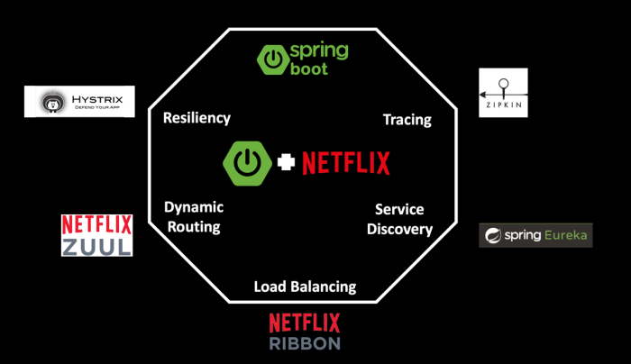
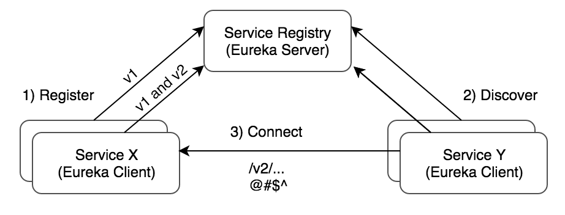
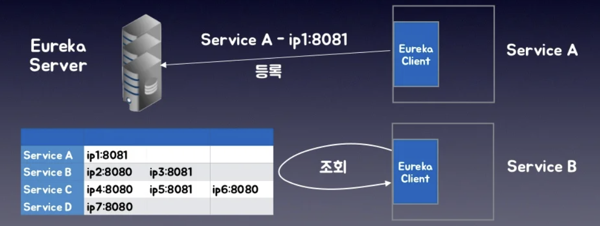
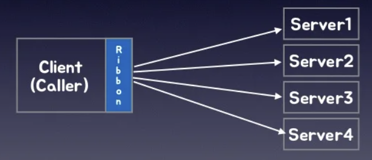

# Spring Cloud Netflix

Micro Service Architecture (MSA)가 매우 핫하게 발전된 아키텍쳐로서, 현재 실무에서 적용시키기 위해서는 이를 서포트하기위한 여러 기술들이 필요하다. **Netflix** 에서는 MSA를 구현하기 위한 여러 OSS (Open Source Software)를 발표하는데, 이 Spring-cloud-netflix 기술들에 대해 알아보자.

##### "Netflixed" 라는 용어가 존재한다.

이는 기존의 legacy architecture 혹은 code, 비즈니스 모델이 붕괴되었을 때 사용되는 표현이다. Netflix는 기존의 Legacy 시스템을 MSA로 전환하여 운영/개발 상의 효율성을 극대화 하였다.

> *2007년 심각한 데이터베이스 손상으로 3일간 서비스 장애를 겪은 넷플릭스는 신뢰성 높고 수평 확장이 가능한*
> *클라우드 시스템으로 이전할 필요성을 느꼈는데, 단순히 플랫폼 이전만으로는 기존의 문제점과 한계를 탈피할*
> *수 없다고 판단한 넷플릭스는 고가용성, 유연한 스케일링, 빠르고 쉬운 배포를 위해 MSA를 선택하였다고 한다.*
> *그리고 MSA 전환을 위한 기술들을 도입하여 무려 7년에 걸쳐 클라우드 환경으로 이전하였으며, 이 과정에서*
> *넷플릭스가 경험한 노하우와 문제해결 방법을 공유하기 위해 MSA 전환 기술을 오픈소스로 공개 하였다!!!*
> *이렇게 탄생한 넷플릭스 OSS는 MSA를 도입하려는 많은 사람에게 좋은 선택지가 되고 있다.*
>
> 출처: [MSA and Netflix OSS](https://bravenamme.github.io/2020/07/21/msa-netflix/)

### Eureka

*Service Discovery Server (서비스 디스커버리지 서버)*

MSA 구조에서 서비스를 **동적**으로 확장하고 축소되기도 한다. 이때마다 운영자가 일일이 인스턴스 정보를 수정하거나, 관리하는건 매우 귀찮고 쉽지 않은 일이다. 그렇기에 인스턴스 상태를 동적으로 관리하는 서버가 필요한데, 이를 *서비스 디스크버리 서버*로 칭하며 Netflix에서 Eureka라는 이름으로 공개하였다.

간단하게, **쪼개진 서비스들의 주소들의 집합체 또는 서비스 registry** 라고 이해하자.

예를 들어보자, 

100개의 서비스가 있다고 하자. 100개의 서비스는 서로간 통신을 하고 있다. 이럴 때 100개의 서비스를 관리하기 위해, 100개에 대한 고메인 또는 IP 정보와 포트 정보를 일일이 다 알고 관리해야 할까?

만약 신규 서비스가 추가되거나, 줄여야 하는 상황이면 다시 수동으로 작성과 관리를 해주어야 하며, 특정 서비스에 장애가 발생하면 그 서비스를 수동으로 제외시켜야 한다. 즉 엄청난 운영 리소스가 들어갈 것이다.

*Eureka*는 이러한 서비스들의 목록들을 자동으로 관리해 준다 !

서비스가 기동될 때 **Eureka 서버**에 자신의 정보 (IP 정보 등)을 Noti 하게되며, Eureka는 등록된 서버들에게 일정 시간동안 heartbeat를 보내며 서비스가 죽었는지 살아있는지를 확인하다. 

각 서비스들은 Eureka 서버에서 정상 작동 목록을 가져와서 사용하게 된다 !

##### Eureka Enabled 된 Spring Cloud Application

- Server 시작 시 Eureka 서버에 자동으로 자신의 상태를 등록한다 (UP)
- 주기적 Heartbeat로 Eureka Server에 자신이 살아 있음을 알린다
- Server 종료 시 Eureka 서버에 자신의 상태 변경(Down)을 알리거나, 혹은 목록에서 삭제한다
- Eureka 상에 등록된 이름은 `spring.application.name` 

### Ribbon

*Client Side Load Balancer*

`Ribbon` 은 Netflix가 만든 *Software Load Balancer*를 내장한 RPC (REST) Library 이다.

기존의 Monolithic Architecture를 지향한 시스템에서는 부하 분산을 위해 L4 스위치 같은 하드웨어 장비를 앞단에 두고 내부 서버로의 트래픽을 분산하였었다. 하지만 이렇게 중앙 집중화된 방식은 Load balancer에 문제가 발생하면 전체 서비스에 문제가 생기는 위험이 존재한다. 

또한, 동적으로. 서버가 추가/삭제 되는 환경에서 하드웨어 장비로 대응하는것도 한계가 있다.

그렇기에 Netflix는 ***Software로 구현한 Client Load banlancer인 Ribbon을 개발하였다.***

- 참고로 이때 Client의 의미는 PC/Mobile Device가 아닌, MSA에서 다른 서비스를 호출하는 Client service를 뜻한다.

Eureka와 연동하여 동적으로 리스트를 관리하면서 부하 분산이 가능하다.

사용 가능한 부하 분산 Algorithm으로는

- Round-Robin 
- Weigted Response Time (응답 시간에 가중치를 두고 선택하는 방식)
- Availabilty Filtering (3회 연속 호출 실패 시 30초 동안 목록에서 제외)
- Zone-aware round-robin
- Random load balancing

등이 존재한다.

*Spring Cloud에서는 Ribbon Client를 사용자가 직접 사용하지 않는다 !*

- Spring Cloud 내의 HTTP 통신이 필요한 요소에 내장되어 있다.
  - Zuul API Gateway
  - RestTemplate (@LoadBalanced annotation)
  - Spring Cloud Feign - 선언적 Http Client

### Zuul - API Gateway

Zuul은 Netflix가 개발한 spring-cloud-netflix에 특화된 API Gateway이다.

API-Gateway는 사용자의 요청을 적절한 서비스로 프록시/라우팅 하는 MSA의 컴포넌트이다.

##### [API Gateway란?](https://velog.io/@youngerjesus/API-Gateway%EC%9D%98-%EC%9D%B4%ED%95%B4)

> API Gateway는 모든 서버로의 요청을 단일지점을 거쳐서 처리하도록 한다. 이를 통해 공통된 로직 처리나 인증 및 인가 처리, 라우팅 처리등을 할 수 있다.
>
> 즉, API Gateway를 이용하면 통합적으로 endpoint와 REST API를 관리할수 있고, 모든 클라이언느는 각 서비스의 Endpoint 대신 API Gateway로 요청을 전달한다.

Zuul은 Netflix OSS에서 제공하는 **api gateway의 구현체라고 보면된다.**

Zuul은 최전방에서 클라이언트의 요청을 받아 적절한 서비스에 전달하고, 결과를 다시 클라이언트에 보내주는 엣지 서버 (edge server)이다.

사용자에게 Zuul만 노출하고 다른 마이크로서비스의 종단점(Edge)을 숨기는 이유는 무엇일까? 

- MSA 환경은 하나의 서비스에 여러 개의 서버가 존재할 수 있기 때문에 사용자에게 다수의 진입점(End Point)이 생겨난다.
- 진입점이라면 인증과 보안, False request 등을 처리하는데 일부 진입점에 변경이 생기면 전체가 영향을 받기 때문에 관리가 까다롭다.

그렇기에 Zuul을 활용해 도메인을 하나로 통합하고 단일 진입점으로 사용한다면 관리가 수월해진다.

### Hystrix

*Circuit Breaker*

MSA에서는 특정 서비스에 과부하가 걸리거나, 어떠한 문제로 정상 작동하지 않으면 **전체 시스템에 장애를 전파할** 수 있다.

그렇기에, 특정 서비스에 문제가 생기더라도 전체 시스템으로 장애가 확산하지 않도록 차단하는 기능을 ***Circuit Breaker (서킷 브레이커)*** 라고 하며, Netflix에서는 이를 ***Hystrix*** 라는 이름으로 개발하였다.

