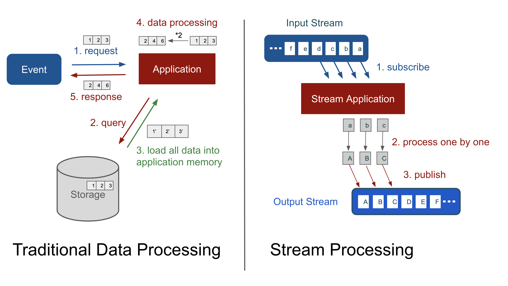

## WebFlux

#### 필요 사전 지식

1. Reactive Streams
2. Functional Programming 

> WebFlux란 기존의 MVC, Servlet 방식의 Blocking & Synchronized 방식이 아닌, Reactive, Non-Blocking 방식을 지원하기 위한 Web 스택이다.
>
> *적은 수의 쓰레드로 동시 처리를 가능하게 하면서 더 적은 하드웨어 리소스로 확장 가능한 Non-blocking web stack이 필요해서 만들어짐*
>
> Reactive 하다는 것은
>
> - Data를 Pull하는 개념이 아닌 Push하는 개념 ! 
>   - Publisher ---push---> Subscriber 
> - Subscriber가 수용할 수 있는 데이터 이상의 양이 들어올 수 있기에 이를 조졸하기 위한 "back-pressure"라는 개념을 도입.

#### Reactive Streams

> "Reactive", 변화에 반응하는 것을 중심에 두고 만든 프로그래밍 모델이다.
>
>  "Non-Blocking", 작업 완료를 기다리기보단 완료되거나 가용 데이터가 생기면 반응하는 것. 
>
> "Back-pressure", "Non-Blocking" 코드에서는 프로듀서 속도가 컨슈머 속도를 압도하지 않도록 이벤트 속도를 제어한다.리엑티브 스트림은 Back-pressure를 통한 비동기 컴포넌트 간의 상호장용을 정의한 스펙이다. 이러한 리액티브 스트림을 쓰는 **주 목적은 Subscirber가 publisher의 데이터 생산 속도를 제어**하는 것이다.

**Reactive Programming의 장,단점**

[Pros]

- 멀티 코어, 멀티 CPU 하드웨어에서 연산 자원 활용의 증가
- 직렬화 지점을 감소 시켜 성능을 향상 * 오해소지가 있음 수정하기
- 콜백 지옥에서 탈출
- 쓰레드 관리 용이
- backpressure. 과도한 사용과 무한한 자원 소비를 회피.

[Cons]

- 가파른 학습곡선

- - 다양한 오퍼레이션 제공
  - 멀티스레드와 함수형 프로그래밍에 대한 개념이해 필수

- 디버깅이 어려움

#### 스트리밍 처리

> 많은 양의 데이터를 처리하는 애플리케이션에 스트림 처리 방식을 적용하면, 크기가 작은 시스템 메모리로도 많은 양의 데이터를 처리할 수 있습니다. 입력 데이터에 대한 파이프 라인을 만들어 데이터가 들어오는 대로 물 흐르듯이 구독(subscribe)하고, 처리한 뒤, 발행(publish)까지 한 번에 연결하여 처리할 수 있습니다. 이렇게 하면 서버는 많은 양의 데이터도 탄력적으로 처리할 수 있습니다.

