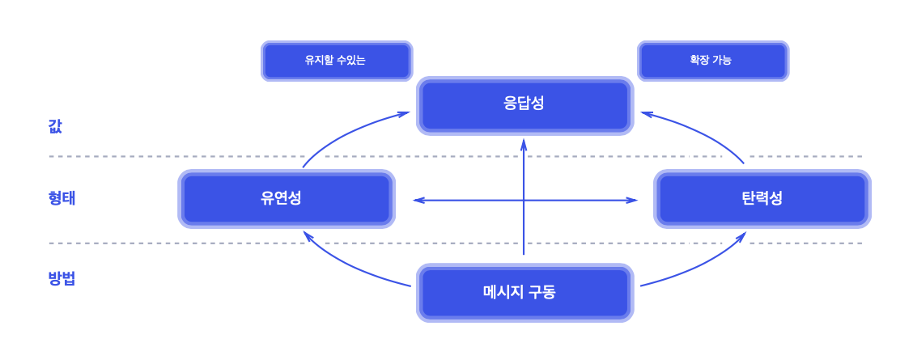
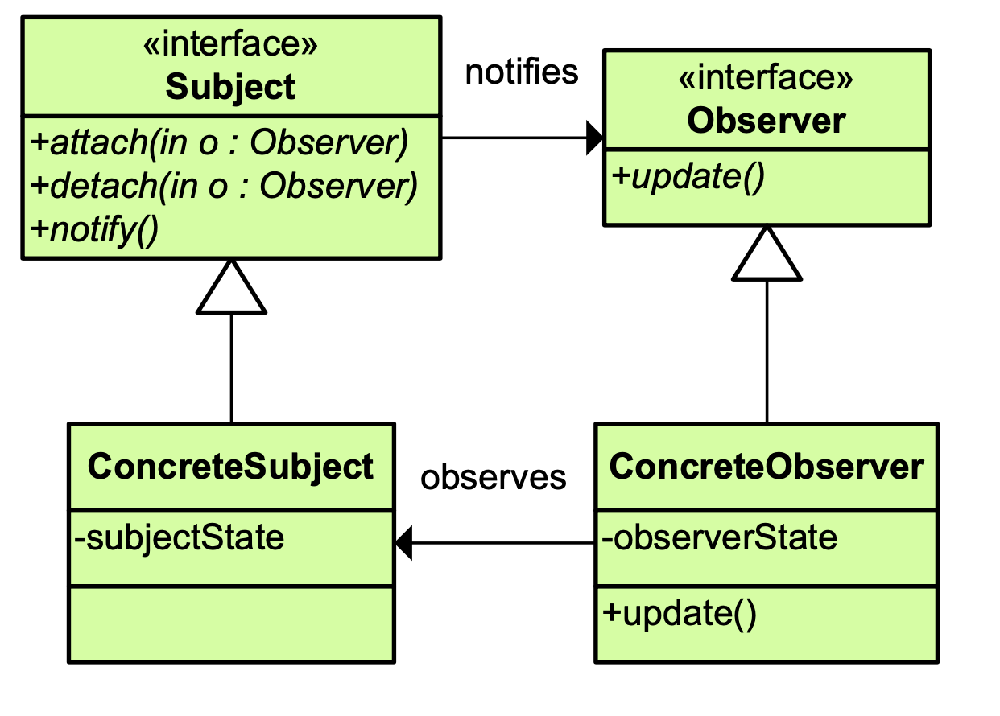
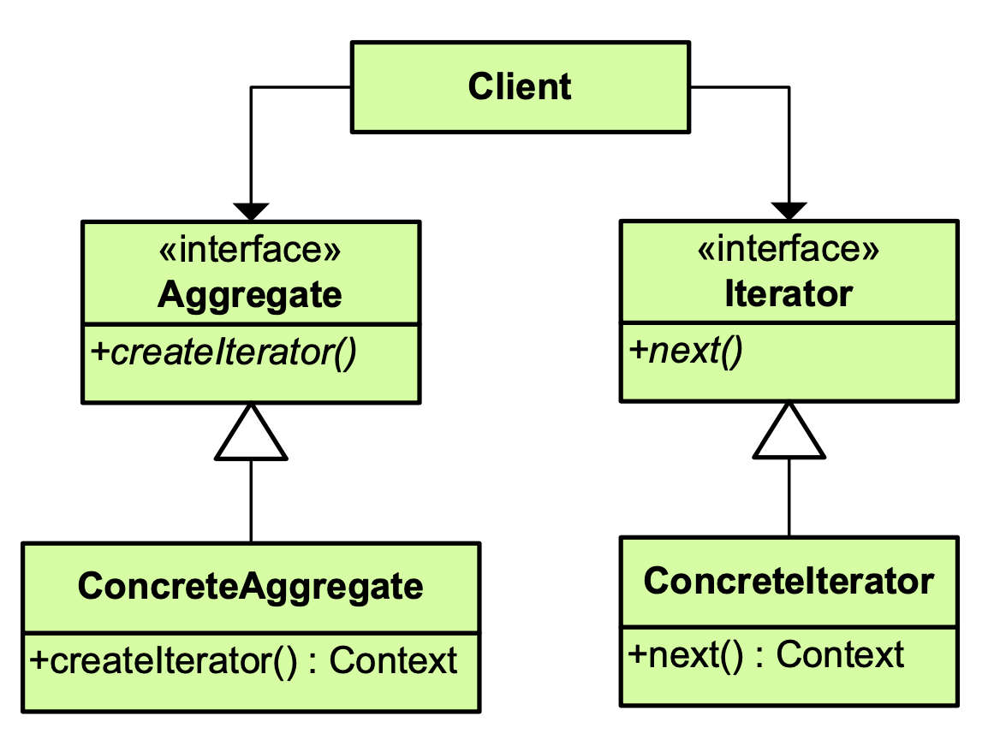
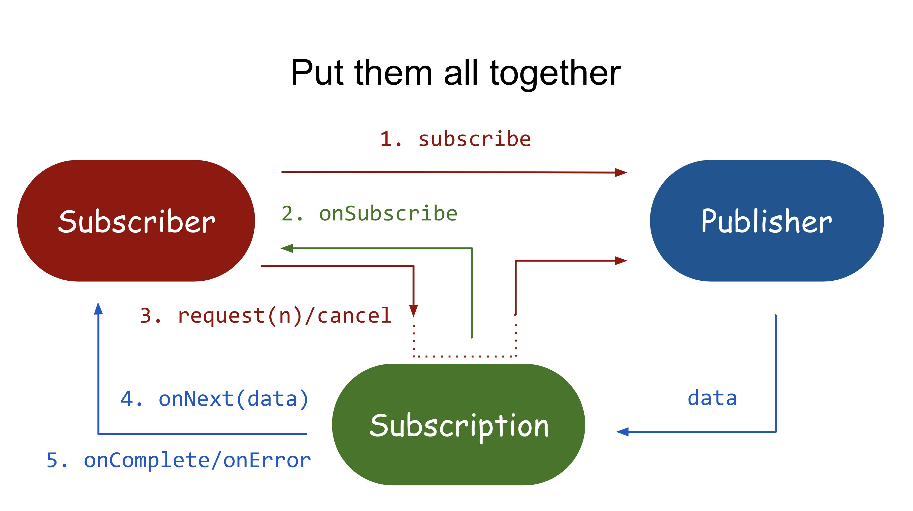
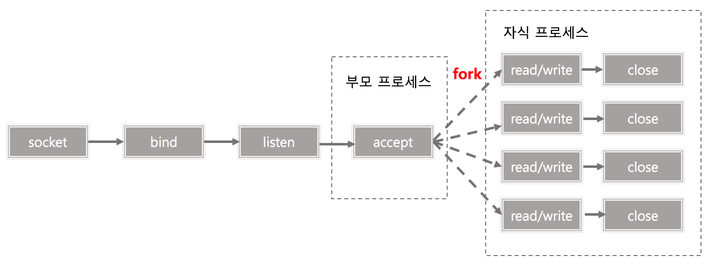
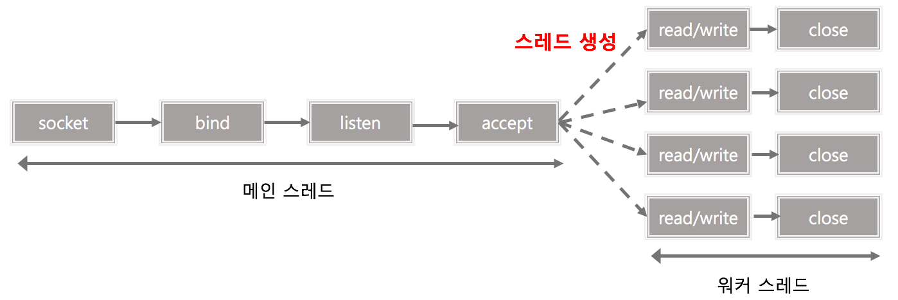
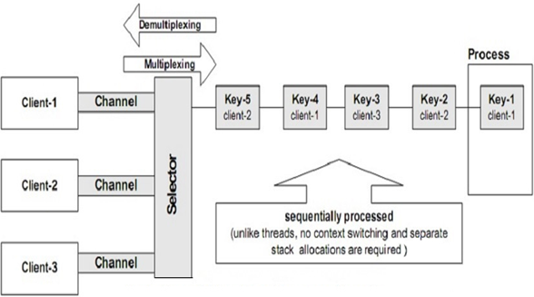

# Reactive

### Reactive System

> Reactive System의 설계 4-원칙

- 응답성 [Responsive]

- - 사용자에게 일관된 긍정적인 경험을 제공하기 위해 상황에 상관없이 모든 사용자에게 빠르게 응답

  - 응답성을 높히기 위해

  - - 탄력성 [Resilience] & 유연성 [Elasticity] 
    - 두 가지가 필요하다

- 탄력성 [Resilience] & 유연성 [Elasticity]

- - 다양한 작업 부하에서 응답성을 유지해야한다. 즉, 더 많은 사용자가 작업을 시작할 때 시스템 처리량이 자동으로 증가해야 하고 수요가 감소하면 자동으로 감소해야 한다.
  - 탄력성: 실패 상태에서 반응성
  - 유연성: 부하 상태에서 반응성

- 메시지 기반 통신 [Message Driven]

- - 문자를 예로 들자면, 

  - - 메시지 도착을 기다리고 이에 반응하며
    - 나머지 시간에는 유면 상태에 있지만,
    - 동시에 논블로킹 방식으로 메시지를 보낼 수 있다

### **Reactive Programming**

- Reactive Programming은 함수형 프로그래밍(선언적인 코드)을 사용하여 비동기 처리 파이프라인을 구현하는 새로운 패러다임.

  > 함수형 프로그래밍 [Functional Programming]: 함수, 즉 메소드 자체를 1급 객체로 사용하여 파라미터로 넘기거나 반환값으로 사용하는 방식으로 프로그래밍 하는 것.
  >
  > 1급 객체: 변수나 데이터 구조 안에 담을 수있는것, 파라미터로 전달 가능, 반환값으로 사용 가능, 할당 된 이름과 무관하게 고유하게 구별이 가능.

- 데이터가 Consumer에게 흘러가는 이벤트 기반 (event-based)의 모델이며, 이 모델을 통해 우리는 이벤트의 비동기 시퀀스 (Asynchronous Sequence)를 다룬다.

- 리액티브 프로그래밍은 비동기-논블로킹(Asynchronous and non-blocking)의 핵심 기둥으로써 기존 JDK에서 제한적인 범위의 비동기 처리를 지원했던 **Callback** **기반의 API들이나 Future의 대안**(alternative)이다.

**비동기 (Asynchronous) & 논블로킹 (Non-Blocking) 의 장점**

>  **리엑티브 시스템을 따르기 위한 설계 방식으로 Reactive Programming이 된것**
>
> - Reactive System: Message Driven
> - Reactive Programming: Event Driven, 비동기 데이터 스트림을 사용한 프로그래밍

**Reactive 란 무엇인가? **

> Reactive란 외부에 어떤 event가 발생하면 거기에 대응하는 방식으로 동작.

#### Reactive Programming의 기반 기술

예) 여러개의 데이터가 있는데 이를 하나 하나 사용하는 두 가지 방법 pull & push

**Observer Pattern [관찰자 패턴]**

- 옵저버 패턴이란, 일대 다의 관련성을 갖는 객체들 중 한 객체의 상태가 변하면 다른 모든 객체에 그 사항을 알리고 필요한 수정이 **자동**으로 이루어지도록 할 수 있게 하는 디자인 패던이다.
- 관찰자 패턴에서는 ConcreteSubject 의 상태에 변경이 일어났을 때 Subject 의 notify() 함수를 통해 Observer 의 상태를 변경합니다. 옵저버 패턴에서 Subject 는 Observer 의 상태를 고려하지 않고 이벤트를 보내기 때문에 [**push** **방식**] 이라고 한다. 
- Observable 을 이벤트 소스라 생각하면 된다, 즉 이벤트 [혹은 data] 를 만든다. 그 이벤트를 관찰자 Observer 에게 보내주는 것. Observer가 observabled에 등록하면, Observable은 새로운 event가 발생했을 때 notify 해주는 방식이다.

**Iterator 패턴 [반복자 패턴]**

- 반복자 패턴은 컬렉션 구현 방법을 노출시키지 않으면서 컬랙션 안에 들어있는 모든 엘리먼트에에 접근할 수 있는 방식을 구현한 패턴입니다.
- 옵저버 패턴과 달리 반복자 패턴은 next()를 통해 데이터를 리턴받아서 [**pull** **방식**] 이라고 합니다.

* Aggregate (집합체): Iterator 역할을 만드는 인터페이스를 결정
* ConcreteAggregate (구체적인 집합체) : Aggregate을 실제로 구현
* Iterator (반복자): 요소를 순서대로 검색하는 
* Concreate (Iterator) : 실제로 구현 

**정리**

- Iterable은 Pull (풀링) 방식이다. 즉 내가 그 다음꺼가 필요할때 땡겨서 가져오는 방식.
- Observable은 Push 개념이다. 즉 어떤 데이터, event를 갖고있는 Source 쪽에서 데이터를 밀어준다.

> 1. Observable이란 Source (Event Source)라 생각할 수 있다.
>
> 2. Source -> Event/Data -> Observer
>
> 3. 우리가 Source에다가 Observable을 만들고, Observer를 만들어서 Observable에게 Observer를 등록하는것
>
> 4. Observable은 그때부터 새로운 정보가 발생 할 때 마다 Observer에게 넘겨준다.

Observer Pattern이 Publisher가 Subscriber에게 Data를 Push하는 방식인데, Slow Subscriber인 경우 이를 감당할 수 없을 수 있다. 이를 해결하기 위해 Subscriber는 자신이 해결할 수 있는 양만큼을 알려준다 (request (number)) 그것이 **Back-pressure 이다.**

**기존 Observer Pattern의 문제점**

1. complete 한다는 개념이 없다. 어떻게 Complete을 시킬 것이냐? 마지막 데이터를 전송한 다음 그게 끝임을 어떻게 알릴 것이냐.
   - 즉 완료라는 개념이 없음. Notify 하는 개념밖에 없음
2. Error를 어떻게 처리할 것이냐?
   - Exception이 예외적인 상황에서 발생할 수 있는데 그런경우 예외처리가 Observer pattern에는 각자가 구현을 해야하고, 정확한 방법이 녹아져있지 않음.

이 두가지를 확장, 수정해서 만들어진게 Reactive Programming의 한 축.

### Reactive Streams

> 이러한 reactive 시스템을 만들기 위해 Reactive Streams라는 표준 API를 만들게 된다.
>
> "Reactive Streams"는 2013년 Netflix, Pivotal, Typesafe 의 개발자들이 발의해서 처음 만들어졌는데,"리액티브 프로그래밍"을 위한 명세(specification) 이다. 비즈니스 시스템 개발자는 "Reactive Streams" 에 정의 된 인터페이스를 구현하면 "리액티브 프로그래밍"을 구현할 수 있다.

- 기존의 데이터 처리방식 [e.g. Tomcat - Spring MVC]

- - 1 request == 1 thread
  - 하나의 요청에 하나의 스레드가 할당되는 방식. 스레드 풀을 넘어서는 요청이들어온다면?
  - 하나의 요청이 수행시간이 매우 길다면 해당 작업을 맡은 Thread는 Blocking 상태가 된다. 
  - 모든 스레드가 이 상태면 스레드 풀에 할당되어있는데 스레드 수 이상의 요청이 들어왔을 경우 해당 요청을 처리할 스레드가 없기때문에 요청을 처리하지 못하고 Timeout이 발생한다.
  - **즉, CPU와 Memory의 부족이 아닌, Thread의 부족현상에 의한 요청 처리 불가상태.**

- - 그렇다면 스레드 개수를 늘린다거나, Scale Out, Scale up은?

  - - 스레드 개수를 늘리면, 요청대비 충분한 수의 스레드를 보유하고 있음에도, 과도한 Context Switching이 발생하여 서버에 과부하가 생겨 처리률이 떨어질 수 있다.
    - Scale Up, Scale out은 하나의 해결책이 될 수 있지만, 근본적인 해결책이 아니기에 인프라의 자원을 낭비하는 격.

- Reactive Stream 에서의 데이터 처리방식 [e.g. Netty & Spring WebFlux]

- - Netty 기반의 웹플럭스에서는 많은 스레드를 만들지 않고, **cpu 코어 \* 2**개의 스레드만 사용해서 요청을 처리한다.
  - 앞단에서 요청을 받는 reactor-http-nio 스레드는 적은 수를 유지하면서, 연산을 뒤의 이벤트 루프에게 위임하고, 결과값만 받아서 처리한다.

결국 Reactive Streams 란

> 1. 논블로킹 (Non-Blocking)과 백프레셔 (Back-Pressure)를 갖춘 비동기 스트림 처리의 표준.
> 2. Reactive Stream = Observer Pattern + Iterator Pattern**
>
> - - ‘옵저버 패턴과 반복자 패턴의 결합’

[Project Reactor]

**Reactive Stream의 순서!** 

1. Subscriber가 [subscribe] 함수를 사용해 Publisher에게 구독을 요청
   - Publisher.subscribe(Subscriber) // Publisher의 subscribe 함수를 사용한다. 
2. Publisher는 onSubscribe 함수를 사용해 Subscriber에게 Subscription을 전달한다.  
   - Publisher가 Subscriber에게 주는 정보는 Protocol을 따라야 한다.
   -  onSubscribe onNext* (onError | onComplete)?
3. 이제 Subscription은 Subscriber와 Publisher간 통신의 매개체다. Subscriber는 Publisher에게 직접 데이터 요청을 하지 않는다. Subscription의 request 함수를 통해 Publisher에게 전달한다.
4. Publisher는 Subscription을 통해 Subscriber의 onNext에 데이터를 전달, 작업이 완료된다면 onComplete, 에러가 발생하면 onError 시그널을 전달한다.
5. Subscriber와 Publisher, Subscription이 서로 유기적으로 연결되어 통신을 주고받으면서 subscribe 부터 onComplete까지 연결되고, 이를 통해 Backpressure가 완성된다.

> Observable 패턴은 무한 데이터 스트림을 전송하기 적합하다. 하지만 끝이 언제인지 알리는 방법이 존재하지 않으며, consumer가 데이터를 소비하기 전에 producer가 이벤트를 생성하는 것을 원치 않습니다. 동기식에서는 이러한 생성된 데이터를 소비하는, 즉 pull 해올수 있는 Iterator pattern이 존재합니다.

**Publisher**

> subscribe(Subscriber subscriber) : Subscriber가 구독을 할 수 있게 한다. 

**Subscriber**

> onSubscribe(Subscription subscription) : 최초 구독시 수행, subscription의 request를 통해 데이터 수신량을 전송
>
> onNext(item): 구독자에게서 데이터를 push 받아옴
>
> onError(Throwable)
>
> onComplete

**Subscription**

> request(long n)
>
> cancel(): Subscriber가 메시지 구독을 종료할 때 호출되어 사용되는 메소드입니다.

**그렇다면 Reactive Streams는 어떻게 비동기적으로 동작할까? **

- 실제로 우리가 개발을 하며 Reactive Streams의 publisher나 Subscriber를 구현하지는 않는다. 가능은 하지만 따라야 하는 제약조건도 많고, 기존 Spring에서 제공하는 Publisher를 보통 사용하며, 구독은 spring에서 해 줍니다.
- 아무튼, 비동기 논 브로킹이기 때문에, Publisher와 Subscriber 내부 구조에서는 별도의 Scheduler 를 사용하여 내부적으로 별도의 스레드로 동작하게 하는데, subscribeOn 이나, publishOn 을 적절하게 사용하여 비동기적으로 동작하게 합니다.

### Reactor

> Reactor project는 Pivotal의 오픈소스 프로젝트로, JVM 위에서 동작하는 Non-Blocking Application을 구현하기 위한 Reactive 라이브러리 이다. RxJava 2와 함께 Reactive Streams의 구현체이기도 하고, Spring Framework 5 부터 리액티브 프로그래밍을 위해 지원되는 라이브러리 이다. 
>
> 대표적으로 Mono & Flux 가 존재한다. 이 둘 모두 Reactive Stream의 **Publisher** 인터페이스를 구현하고 있으며, Reactor에서 제공하는 연산자들의 조합을 통해 스트림을 표현할 수 있다.

* 초기 Reactor

  > 장점 : spring 과 완벽한 통합, netty 도 지원, 비동기 논블로킹 메세지 처리, 고성능
  >
  > 단점 : Back Pressure 기능 없음, 복잡한 오류처리

  * Reactor 2.0 부터 onOverflowBuffer(), onOverflowDrop() 등의 메소드로 Back - Pressure를 지원한다.

### Spring WebFlux

Spring Framework 5부터 새롭게 추가된 모듈. Reactive Style의 개발을 도와준다.

WebFlux가 생긴 이유는

> (1) 적은 양의 스레드와 최소한의 하드웨어 자원으로 동시성을 핸들링하기 위해 만들어졌다. 서블릿 3.1이 논블로킹을 지원하지만, 일부분이다. 이는 새로운 공통 API가 생긴 이유가 됐으며, netty와 같은 잘 만들어진 async, non-blocking 서버를 사용한다.
>
> (2) 함수형 프로그래밍 때문이다. Java5에서 Rest controllers나 unit test가 만들어지고, Java8에서는 함수형 API를 위한 Lambda 표현식이 추가됐다. 이는 논블로킹 어플리케이션 API의 토대가 됐다.

### Reactive WebSocket

* 우선 WebSokcet을 왜 ? 언제 ? 이용해야하나

  > 실시간성이 필요한경우 ! 
  >
  > Ajax, HTTP Streaming 조합이나 Long Polling으로도 기본적인 동적인 인터렉션이 가능하다. 몇 분에 한 번씩만 업데이터가 필요한 경우 Long Polling 등으로도 충분히 커버가 가능하다.
  >
  > 하지만 게임, 금융 앱등 훨씬 더 실시간에 가까워야 하는 경우 웹소켓을 사용해야한다. 
  >
  > **적은 지연으로, 자주, 큰 데이터를** 전송해야 할 때 웹소켓 사용이 효율적이다.
  >
  > **또한 양방향 통신을 지원한다.**

* Spring WebFlux는 기존에 사용하던 Web MVC의 WebSocket과 다른 완전한 논 블로킹 상황의 Reactive WebSocket을 지원한다. 기존 서블릿 기반의 웹소켓 모듈의 단점은 I/O 과정에서의 블로킹 동작이라 할 수 있다. 이전 웹 소켓 모듈에서 WebSocketHandler는 한 번에 하나의 메시지만 처리할 수 있고, 또 기존의 WebSocketSession의 sendMessage 라는 메소드는 동기식으로만 메시지를 보냈지만 이 웹플럭스에서 사용된 Reactive WebSocket은 완전한 논블로킹 I/O를 제공해줍니다.

* Reactive WebSocket의 구조

  

  *  WebHandler [DispatcherHandler]: interface WebHandler의 구현체이다. Spring MVC에서의 DispatcherServlet, Front Controller라고 할 수 있다. 
  * 그림에는 안나와있지만, 
    * HttpHandler --> [ExceptionHandling WebHandler] --> [Filter] --> WebHandler
    * 순서대로 처리한다 ! 
  * WebSocket HandlerMapping은 요청에 대해 [ws 주소]에 대해 어떤 Handler로 처리할지를 결정한다.
  * WebSocket HandlerAdapter는 HandlerMapping에 의해 선택된 WebSocketHandler를 호출해준다.
    * WebSocket HandlerAdapter는 WebSocketService에 처리를 위임한다. 그 안에 디폴트 구현체인 HandshakeWebSocketService는 웹소켓 요청에 대한 기본 검사 후 서버에 RequestUpgradeStrategy를 적용한다.
  * WebSocketHandler는 WebSocketSession을 받아 인바운드 메시지와 아웃바운드 메시지를 스트림을 통해 처리한다.
  * 또한 Handler로 부터 나온 결과를 HandlerAdapter가 받아 [.send()] **HandlerResultHandler** 가 WebHandler에게 전달한다.

### **Redis** [Remote Dictionary Server: 외부 key-value 서버]

- Redis의 우수성은 캐시 관리의 거의 모든 측면에서 분명합니다. 캐시는 메모리에서 오래된 데이터를 삭제하여 새로운 데이터를 저장할 공간을 만들기 위해 데이터 축출 (Data eviction)이라는 메커니즘을 사용합니다. Memcached의 데이터 제거 메커니즘은 최근에 사용 된 최소 알고리즘(LRU)을 사용하며 새 데이터와 크기가 비슷한 데이터를 임의로 제거합니다.

* 스프링 데이터 Redis는 현재 Lettuce 드라이버와 통합 되 있는데, 이 Lettuce Drive는 Redis의 유일한 리액티브 자바 커넥터 이다. 현재 Redis 버전 5 이상부터는 내부적으로도 Reactor project 로 구현되있습니다.

* Redis는 NoSQL의 <Key, Value> 형식의 저장을 사용하는 비 관계형 데이터베이스 이다. Memchached 와는 다르게  Collection을 지원하며 (memchaced는 String만 지원) , 데이터가 메모리와 디스크에 저장되서 데이터 복구가 가능하다.

* **샤딩 (Sharding)** 을 지원한다. 

  > 샤딩 (Sharding): 같은 테이블 스키마를 가진 데이터를 다수의 데이터베이스에 분산하여 저장하는 방법.

  * 예로들어 #1~#999, #1000~#1999 ID 형태로 데이터를 나누어서 데이터의 용량을 확장하고 각 서버에 있는 Redis의 부하를 나누어 줄일 수 있습니다. 

* Redis Server는 1개의 싱글 스레드로 수행된다. 서버 하나에 여러개의 서버를 띄우는게 가능 !

  * 싱글 스레드인 만큼, 한 번에 딱 하나의 명령을 실행할 수 있다. **처리시간이 긴 명령어를 중간에 넣으면 다음 명령어들이 대기해야하므로, 실행시간이 긴 O(N)의 명령어는 지양 해야한다.**

* Redis Cluster [Redis Replication]

  > Redis Cluster는 여러 노드가 Hash 기반의 slot을 나눠가지면서 클러스터를 구성하여 사용하는 방식. 
  >
  > Cluster를 구성하는 각 노드들을 **Master** 노드라 하고, 자신만의 slot range를 갖고있다. Master node가 죽게되면, 해당 노드의 slave중 하나가 master로 승격하여 역할을 수행하게 한다.

### **R2DBC & MySQL**

> Spring 에서 사용되는 JDBC Datasource는 항상 Blocking 방식으로 제공되어졌다. 
> 이는, 한 Query를 수행하고 그에 대한 결과를 받기까지는 항상 Blocking이 되어 해당 쓰레드가 대기하는 문제점이 존재한다.

R2DBC의 주요 API는 리액티브 스트림의 Publisher 타입을 리턴하는데 그 타입을 그대로 사용해서 다소 복잡해졌다.

Publisher#subscribe() 메서드에 전달할 Subscriber 구현 객체는 BaseSubscriber를 이용해서 생성했다. BaseSubscriber는 스프링 리액터가 제공하는 Subscriber 구현 클래스로 필요한 기능만 구현하기 위해 이 클래스를 사용했다.

[**https://gompangs.tistory.com/entry/Spring-R2DBC-MySQL**](https://gompangs.tistory.com/entry/Spring-R2DBC-MySQL)

Network, Thread를 공부한다면 : https://velog.io/@vov3616/자바-IO-NIO-네트워크-정리-2-스레드

### 다중 접속 서버 (다중 처리 서버)

* 멀티프로세스 기반: 다수의 프로세스를 생성하는 방식으로 서비스를 제공
* 멀티스레드 기반: 클라이언트 수 만큼 스레드를 생성하는 방식으로 서비스를 제공
* 멀티플렉싱 기반: 입출력 대상을 묶어서 관리하는 방식으로 서비스르 제공

**멀티 프로세스 기반**

1. 부모 프로세스는 <u>리스닝 소켓</u> 을 이용하여 accept 함수를 호출해 연결요청을 수락함
2. 연결 요청 수락시 얻게되는 소켓의 파일 디스크립터 (File Descriptor)를 자식 프로세스를 생성 (fork)하면서 넘겨준다
3. 자식 프로세스는 파일 디스크립터를 바탕으로 서비스를 제공한다.

**장점:**

* 프로그램 흐름이 단순하고 이해하기 편함
* 안정적인 동작이 가능. 프로세스는 서로 독립된 싱행 객체로 존재하며 독립된 메모리 공간을 갖고 서로 다른 프로세스끼리 영향을 미치지 않고 독립적으로 수행이 가능

**단점:**

* 프로세스 복사에 따른 성능 문제 발생
* 병렬 처리량 만큼의 프로세스 필요
* fork에 의해 자식 프로세스가 생성될 경우, 부모 프로세스의 자원이 복사됨. (코드, 소켓을 포함한 모든 열린 파일들(파일 디스크립터)) 부모 프로세스로부터 accept되어 생성된 하나의 소켓에 대해 부모 프로세스와 자식 프로세스 모두에서 한 소켓에 대한 파일 디스크립터가 존재. 따라서 두 파일 디스크립터를 모두 종료해야 해당 소켓을 제거할 수 있음.
* 서로 다른 독립적인 메모리 공간을 갖기 때문에 프로세스간 정보 교환이 어렵다

**멀티 스레스 기반**

1. 메인 스레드는 `리스닝 소켓`으로 accept 함수 호출을 통해서 연결요청을 수락합니다. 
2. 이때 얻게 되는 소켓의 파일 디스크립터(클라이언트와 연결된 연결 소켓)를 별도의 워커 스레드를 생성해 넘겨줍니다.
3. 워커 스레드는 전달받은 파일 디스크립터를 바탕으로 서비스를 제공합니다.

<u>새로운 클라이언트의 연결이 생성될 때 마다, 프로세스가 아닌 스레드를 생성해서 해당 클라이언트에 대해 서비스를 제공</u>

**장점**:

- 프로세스 복사에 따른 비용보다 스레드 생성에 대한 비용이 적다.
- 스레드간 서로 공유하는 메모리를 갖기 때문에, 스레드간 정보 교환이 쉽다.

**단점**:

- 하나의 프로세스 내의 다수의 스레드가 존재하기 때문에 하나의 스레드에서 문제가 생긴다면 프로세스에 영향을 미쳐 나머지 다수의 스레드에도 영향을 끼칠 수 있다.

각 클라이언트 요청마다 별도의 스레드를 생성함으로써 프로세스를 생성하던 방법보다 리소스의 비용을 줄일 수 있었고, 스레드들이 서로 공유하는 메모리를 가질 수 있는 환경이 되었습니다.

그러나 **I/O 멀티플렉싱(multiplexing)** 기법을 사용한다면,

 각 클라이언트 마다 별도의 **스레드를 생성하는 것이 아닌 하나의 스레드에서 다수의 클라이언트에 연결된 소켓(파일 디스크립터)을 괸리하고 소켓에 이벤트(read/write)가 발생할 경우에만 별도의 스레드를 만들어 해당 이벤트를 처리하도록 구현할 수 있습니다**.

### 멀티플랙싱 기반

입출력 다중화: 하나의 Process or Thread에서 입력과 출력을 모두 다룰 수 있는 기술. 

커널에는 하나의 스레드가 여러개의 소켓을 핸들링 할 수 있는 <u>select, poll, epoll</u> 과 같은 시스템 콜을 제공한다

한개의 프로세스, 혹은 스레드에서 한개의 클라이언트에 대한 입출력만 처리할 수 있었던 이유는 **입출력 함수가 Block** 되었기 때문에, 입출력 데이터가 준비될 때까지 무한정 블락되어 여러 클라이언트의 입출력을 처리할 수 없었기 때문이다.

**그러나 I/O 멀티플렉싱 기법을 사용하면 입출력 다중화에서도 입출력 함수는 여전히 봉쇄로 작동하지만, 입출력 함수를 호출하기전에 어떤 파일에서 입출력이 준비가 되었는지 확인할 수가 있습니다.**

<u>From Trash Notes</u>

- 소켓에 요청이 들어오면, 소켓에 스레드가 들어있는데 (요청만 기다리는), 다른 스레드에게 넘긴다. 이건 멀티플렉스

- 테이블에 

  WebFlux, Netty: CPU에 두 개의 스레드를 만들어 놓는다. 그것들이 file table에 있는 사용가능한 스레드들을 찾는다.

  이 두 스레드는 비싼 스레드 (점유 당하지 않는 스레드)

  Node.js가 Spring 보다 빠른 이유., Context switching 좀더 찾아보자

  멀티플렉서 공부, Java NIO (여기 안에 Selector 클래스, Chale? channel)

  selector.select 하면 채널이 하나 등록되는거, (스레드 file table)

  멀티플렉서 구현 예제 읽어보기

  

### Multiplex & NIO

<u>Multiplex</u>: 다중 입력을 하나의 출력으로 바꿔주는 것.

### MSA (Micro Service Architecture)

> 하나의 큰 애플리케이션을 여러개의 작은 애플리케이션으로 쪼개어 변경과 조합이 가능하도록 만든 아키텍쳐
>
> 애플리케이션의 **규모가 커지고 구조가 복잡**해질 때 고려해볼 수 있는 아키텍처가 있습니다. 마이크로서비스 아키텍처(Microservices architecture; MSA)는 하나의 큰 애플리케이션을 여러개의 작은 애플리케이션으로 쪼개어 변경과 조합이 가능하도록 만든 아키텍처입니다.

반대의 개념 Monolithic Architecture는, 소프트웨어의 모든 구성요소가 한 프로젝트에 통합되어있는 형태입니다.

소규모 프로젝트에는 Monolitic Architecture가 훨씬 합리적이다. 유지보수가 용이하기 때문.

기존 Monolithic Architecture의 한계

> - 서비스/프로젝트가 커지면 커질수록, 영향도 파악 및 전체 시스템 구조의 파악에 어려움이 있습니다. 
> - 빌드 시간 및 테스트시간, 그리고 배포시간이 기하급수적으로 늘어나게 됩니다. 
> - 서비스를 부분적으로 scale-out하기가 힘듭니다. 
> - 부분의 장애가 전체 서비스의 장애로 이어지는 경우가 발생하게됩니다.

**MSA 의 장점**

* 서비스별 개별 배포 가능 (배포시 전체 서비스의 중단이 없다)
  * 요구사항을 신속하게 반영하여 빠르게 배포할 수 있다.
* 확장 (Scale)이 용이
  * 특정 서비스에 대한 확장성이 용이하다.
* 장애가 전체 서비스로 확장 될 가능성이 적다.
* 새로운 기술 도입이 유연하다.

**MSA의 단점**

- 성능 - 서비스 간 호출 시 API를 사용하기 때문에, 통신 비용이나, Latency가 그만큼 늘어나게 됩니다.

- 테스트 / 트랜잭션 - 서비스가 분리되어 있기 때문에 테스트와 트랜잭션의 복잡도가 증가하고, 많은 자원을 필요로 합니다.

- 데이터 관리 - 데이터가 여러 서비스에 걸쳐 분산되기 때문에 한번에 조회하기 어렵고, 데이터의 정합성 또한 관리하기 어렵습니다.

**API Gateway**

* MSA는 각 서비스가 다른 서버에 분리 배포되어있기 때문에 서버 URL이 다를 수 있는데, 이때 API Gateway는 API서버 앞단에서 모든 API 서버들의 endpoint를 단일화하여 묶어주는 역할을 한다.

### Curiosity & Answer

**왜 RxJava가 아닌 Reactor를 선택하였나?** 

* Reactor는 Reactive 세대 분류 체계에서 4세대, RxJava는 2세대로 평가받는다.

* Reactor는 Spring을 만든 Pivotal에서 개발한 Java 프레임워크이기 때문에 온전한 Spring 체제에서 WebFlux와 함께 사용하기 좋은 것 같다.

* Reactor는 Java 8을 기준으로 선택된거에 비해, RxJava는 훨씬 이전버전인 자바 6 버전을 대상으로 개발되었습니다.

* 마지막으로 RxJava와는 다르게 Reactive Stream 상에서 직접 빌드되어서 브릿지가 필요없다는 장점이 있다. 여기서 브릿지는 Observer와 Observable, 즉 Publisher와 Subscriber를 연결하는 역할을 하는 것.
  * RxJava는  [Reactive Extensions, ReactiveX 라고도 함]의 자바 구현체. 동기식 비동기식 관계없이 명령형 언어를 이용에 데이터 스트림을 조작할 수 있는 도구
  
* Spring에서. Spring에서는 reactor 사용

  - Spring이 보는 Web개발. DB가 중요.

  - - 스레드 전환이 쉬워야한다 —> Reactor 표준 !!!
    - Mono, Flux , flatmap

**왜 리액티브 프로그래밍은 함수형 프로그래밍 인가?**

* 자바에서는 보통 명령형 프로그래밍을 사용하는데, 이 명령형 프로그래밍은 순차적으로 실행되며 I/O 연산등이 필요한경우 해당 스레드가 블로킹 됩니다. 물론 추가 스레드를 할당하여 독립적인 실행이 가능 하겠지만, **리액티브** **시스템** **(Reactive System)** 설계 원칙 4가지 중 하나인 메시지 기반 원칙에 모순됩니다. 그래서 나온 방식으로 Callback 기법이나 Future 클래스를 사용할 수 있습니다.
* 실제로 많은 부분 리액티브 프로그래밍을 정의할 때, 선언적 프로그래밍의 한 종류라고 한다.

  * 선언적 프로그래밍: 행위를 선언만 하는 프로그래밍, 대표적으로 함수형 프로그래밍이 있다.

**Reactive Streams는 왜 Stream 인가?**

* 일반적으로, 기존의 선언형 프로그래밍을 사용한다면 어떠한 로직을 사용하는 동안 해당 Thread는 블로킹 상태로 전환합니다. 문제를 해결하기 위해 추가적인 스레드를 할당하는건,  Reactive Streams가 추구하는 Reactive 한 방식의 처리 방식이 아닌데, 이를 해결 해주기 위해 Callback 기법과 Future 함수가 존재합니다. 

* 근데 이 두 방식 모두 한계점이 있는데, 우선 콜백은 대표적으로 콜백 지옥이 있습니다. 이 콜백지옥을 피하기 위해서는 멀티 스레딩에 깊은 이해도가 필요합니다. 

  > 콜백 지옥은 계속해서 콜백 메소드에 매변수로 계속 넘겨지면서 감당하기 힘들 수준으로 깊어지는 것.

*  Future 함수역시 문제점이 존재하는데, Future함수를 통해 값을 가져오는 get 메소드를 호출할 때 블로킹 되는 상황이 발생합니다.

* 그래서 Reactive Streams는 각 컴포넌트의 관계를 리액티브 시스템 설계 원칙을 적용하여 기본 요소를 조합하는데 스트림 방식으로 코드를 작성하는것이 적합합니다.

**리액티브 프로그래밍 = 리액티브 시스탬?**

- 아니다, 깊게 보자면 Reactive Programming은 Event-driven [이벤트 구동]의 형식이고, Reactive System은 Message-driven [메시지 기반 통신] 방식이다. 좀더 하나의 애플리케이션 관점이냐, 아니면 시스템 아키텍처의 관점이냐로 구분해야 할 것 같다. 리엑티브 프로그래밍을 한다고 리엑티브 시스템이 되는것은 아니다. 리액티브 시스템이려면 각 컴포넌트 (Component) 들이 메시지 브로커 등을 사용하여 Message 기반으로 통신해야한다.
- 구현 수준에서 Reactive Programming이 Reactive System의 하위 집합이라 할 수 있다. 

**Reactive Streams의 Processor**

* Publisher와 Subscriber를 혼합한 것.
* subscriber의 결과물을 다른 subscriber에게 전달하거나, 변형할 때 사용한다.

**Redis와 H2의 차이점**

* 두 데이터베이스 모두 인메모리를 지원하는 초경량 데이터베이스입니다. 가장 큰 차이점은 H2는 기존의 MySQL, PostreaSQL과 같은 RDBMS이지만, Redis는 Key & Value를 저장하는 NoSQL과 같은 형식이다.

**함수형 프로그래밍을 사용해본 느낌 **

* 개인적으로 함수형의 가장 보편적인 장점은 동시성에 대한 안전을 보장하는 것보단 선언적인 방식으로 코드를 조합(compose)할 수 있다는 점이라고 생각합니다.

**Reactive WebSocket과 기존의 WebSocket의 차이점 **

* 기존 서블릿 기반의 웹소켓 모듈의 단점은 I/O 과정에서의 블로킹 동작이라 할 수 있다. 이전 웹 소켓 모듈에서 WebSocketHandler는 한 번에 하나의 메시지만 처리할 수 있고, 또 기존의 WebSocketSession의 sendMessage 라는 메소드는 동기식으로만 메시지를 보냈지만 이 웹플럭스에서 사용된 Reactive WebSocket은 완전한 논블로킹 I/O를 제공해줍니다.

**애자일 방법론은 무엇인가**

* 끝없는 발전이지 않을까? H/W와는 다르게 S/W는 완성이 없다. 끊임없이 개발을 진행하고 새로운 컴포넌트를 붙히며 새로운 기능이 추가되며 이를 사용하는 사람들로 하여금 새로운 경험을 하게 해줄 수 있다.
* 시장이 원하는 기능을 빠르게 만드는 것. 
  * 서버 개발자로서 기획에 기반한 개발을 진행하지만 라인에서의 경험은 개발자간의 수많은 인터렉션을 통해 새로운 섯을 창조해 내고 있다.

> 애자일 (Agile) : 반복적 & 점차적으로 가치를 높이는 것 

**내가 Agile을 깨달은 것**

* 서버 개발자로서 기획에 기반한 개발을 진행할 것 이라고만 생각했지만, 라인에서의 경험은 개발자간의 수많은 인터렉션을 통해 새로운 것을 빠르게 창조해 내고 있다.
* 회의때 서로서로 현재 필요한 개발을 명시해주며 각자가 그 부분에 집중하여 빠르게 개발하는 모습을 보았다.

**Observer Pattern [옵저버 패턴] vs. Iterator Pattern [반복자 패턴]**

* 반복자 [Iterator] 패턴은: 내부 표현부를 노출하지 않고, 객체에 속한 원소들을 연속적으로 접근할 수 있는 패턴 ! wㅏ료구조에 상관없이 객체 접근 방식을 통일시키고자 할 때 사용 
* 관찰자 [Observer] 패턴은: 반복자 패턴은 컬렉션 구현 방법을 노출시키지 않으면서 컬랙션 안에 들어있는 모든 엘리먼트에에 접근할 수 있는 방식을 구현한 패턴입니다.

* Observer 패턴의 장점. Observable은 Iterable에 비해서 훨씬 더 다양한 아이템 소스를 구현할 수 있습니다. 

**Netty vs. Tomcat**

* WebFlux로 서버를 사용려면 non-blocking i/o api를 사용해야한다.
* Servlet 3.1, 이나 최근 톰켓부터는 nio를 지원하는데, Servlet API는 여전히 동기식, Blocking 방식 이다.
* Netty는 non-servlet runtime

다음은 리엑티브 프로그래밍 기반의 **Netty** **- Spring Webflux** 환경에서 부하테스트를 했을 때 

스레드들의 상태입니다. 보시다 시피 많은 스레드들을 만들지 않습니다. 

netty 기반 웹플럭스에서는 **cpu코어 \* 2**개의 스레드만 사용해서 요청을 처리합니다.

**왜 발표를 Reactive Streams로 하였나?**

* 실제로 개발에 사용한 Reactor에 대해서 발표를 할까에 대한 고민도 있었는데, 이 Reactor라는것을 사실 프레임워크가 제공하는 많은 메소드를 설명하는것이 아닌, 내부 동작을 설명하고자 한다면 결국 Reactive Streams 에 대한 설명이 된다.

**Reactive Test Case**

**Mono Stream 만드는 종류**

* Mono.create 

  >  가장 기본적인 Observable의 생성 연산자이다. 당연히 subscribe 되기 전 까지 실행되지 않는다.
  >
  >  Cold Publisher이기에 subscribe를 하지 않으면 데이터를 방출하지 않는다.
  
* Mono.just

  > Just(T)는 해당값을 즉시 방출한다.
  >
  > Hot Publisher이며, 처음 방출된 값을 cache해 놓고 다음 구독자에게 cache 된 값을 방출한다
  >
  > subscribe하지 않아도 데이터를 방출 (emit)한다

* Mono.defer

  > 데이터 방출을 구독 전까지 지연시킨다.
  >
  > Cold Publisher이며 구독하지 않으면 데이터를 방출시키지 않는다.
  >
  > 구독하는 순간에 행동을 결정하는 시퀀스를 생성하는 메소드. 
  >
  > 서로 다른 구독자에 대해 다른 데이터를 생성할 수 있다.

* Mono.fromCallable

  > 구독과 동시에 시퀀스를 생성하며, defer와 다르게 에러에 대한 핸들링도 해준다.
  >
  > fromSupplier는 result를 가질 수 있지만 fromCallable은 어떠한 값을 계산만 한다.
  >
  > Callable<T> 에서 Mono를 생성하고 실행 결과를 구독자에게 전달한다.

https://sightstudio.tistory.com/14

https://tries1.github.io/spring/2020/09/21/spring_async.html

> https://getoutsidedoor.com/2020/11/23/reactive-streams-에-대해서/
>
> https://luvstudy.tistory.com/97
>
> 
>
> [https://www.slideshare.net/jinhyuckkim7/reactive-programming-vs-reactive-systems](https://www.slideshare.net/jinhyuckkim7/reactive-programming-vs-reactive-systems)
>
> [https://atin.tistory.com/575](https://atin.tistory.com/575)
>
> 

https://getoutsidedoor.com/2020/11/23/reactive-streams-%EC%97%90-%EB%8C%80%ED%95%B4%EC%84%9C/

