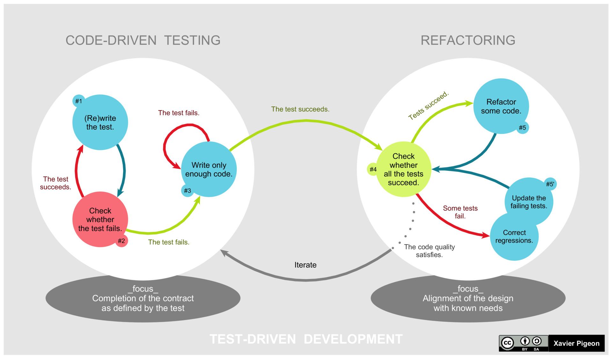

## TDD & Test Code

> TDD란 Test Driven Development 의 약자로, 테스트 주도 개발을 의미한다.
>
> 이는 개발을 할 때 테스트 케이스를 함께 개발하면서 개발 하는 것이다.
>
> 일반적으로, [설계 -> 구현 -> 테스트] 순환구조로 개발을 진행 하였는데, 이는 구현이 완료 되었을 때 해당 모듈이 제대로 설계되었는지를 테스트 하였었다.
>
> TDD 는 위 사진과 같은 과정으로 개발을 진행하는데,
>
> 1. 최소한의 기능을 먼저 구현한다.
>    - 함수의 Prototype 형태 등을 먼저 개발한다.
> 2. 테스트 케이스가 실행되도록 구현 후 실행한다.
>    - 이 경우, 당연히 테스트 케이스는 실패할 것이다. 기능이 구현되어있지 않으니까 !
> 3. 실제 기능을 구현한다
>    - 해당 기능이 테스트 케이스를 통과하는지를 확인한다.
>
> 결국 TDD 개발 방법론은 가장 중요한 기능 구현이 마지막이다.
>
> 기능 구현을 제일 마지막에 하여 테스트 케이스가 통과 되는 것을 확인하면 개발에 흥미를 유지 시킬 수 있기 때문입니다. 그 뒤에 필요하면 개발된 코드를 기반으로 리펙토링(Refactoring) 과정을 진행한다.

그렇다면 TDD 방법론의 장점이 무엇일까 ?

### TDD advantages

1. 코드를 기존보다 안정적으로 개발할 수 있다.
   - 각각의 기능에 맞는 테스트 케이스가 미리 존재하므로, 수정 및 리팩토릴 할 때 버그 또는 오류의 가능성을 낮춰준다.
2. 간편한 리팩토링
3. 코드의 전체적인 복잡도가 낮아진다.
4. 디버깅 시간이 줄어든다.

이러한 장점이 있지만, TDD 역시 단점이 존재하는데, 우선 개발 시간이 전반적으로 늘어난다.

### Spring TDD - JUnit

Spring Framework 기반의 프로젝트 역시 TDD가 적용될 수 있으며, 이 때 모듈 개발에서 필요한 Test code를 기본적으로 구현하도록 설정되어있다 [root -> test].

이러한 TDD 개발 방법론을 위한 open source testing framework 가 존재하는데 spring boot starter web 의 가장 유명한 test tool인 **JUnit5** 에 대해 공부해보자.

### JUnit5

- 자바 개발자가 가장 많이 사용하는 Testing Framework 이다.
- JUnit Platform에 의해서 Test를 실행해주고, TestEngine API의 구현체인 Jupiter를 활용하여 Test 소스를 작성할 수 있다.

#### reference

- [JUnit 5 Study](https://gmlwjd9405.github.io/2019/11/26/junit5-guide-basic.html)

